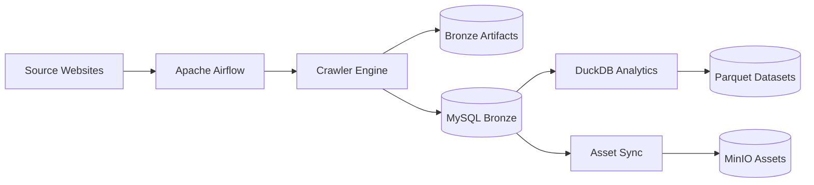
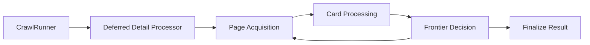
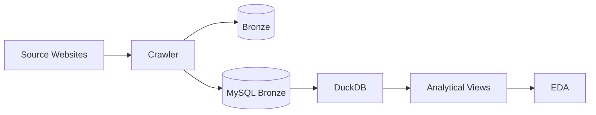

<div align="center">

# RoomBeacon

### Location-Aware Rental Discovery & Data Intelligence Platform

**Multi-source Web Crawling · Data Engineering · Data Quality · Analytics · Rental Intelligence**

[](https://www.python.org/)
[](https://airflow.apache.org/)
[](https://www.docker.com/)
[](https://www.mysql.com/)
[](https://duckdb.org/)
[](https://min.io/)
[](https://parquet.apache.org/)
[](LICENSE)

</div>

---

## Overview

**RoomBeacon** là nền tảng thu thập và phân tích dữ liệu phòng trọ / nhà cho thuê đa nguồn, được xây dựng như một **Data Ingestion & Rental Intelligence Platform** thay vì một crawler đơn lẻ.

Hệ thống giải quyết toàn bộ vòng đời dữ liệu:

```text
Website Sources
      ↓
Automated Crawling
      ↓
Historical Observations
      ↓
Data Quality / Normalization
      ↓
Analytical Datasets
      ↓
Rental Intelligence
      ↓
Search / Analytics / Downstream Applications
```

RoomBeacon tập trung vào ba bài toán kỹ thuật chính:

1. **Multi-source Data Acquisition**  
   Thu thập dữ liệu từ nhiều website có cấu trúc HTML, pagination, access policy và tốc độ thay đổi khác nhau.

2. **Historical Data Preservation**  
   Một listing không chỉ được lưu một lần. RoomBeacon giữ nhiều observation theo thời gian để phân tích vòng đời tin đăng, biến động giá và trạng thái nguồn.

3. **Data Intelligence**  
   Dữ liệu gần nguồn được chuyển dần thành dataset phù hợp cho EDA, Data Mining, feature engineering và các ứng dụng tìm kiếm theo vị trí.

---

# Engineering Highlights

RoomBeacon hiện đã phát triển vượt qua giai đoạn crawler thử nghiệm và vận hành như một pipeline dữ liệu có orchestration, persistence và recovery riêng.

- Multi-source crawler được điều phối tự động bằng **Apache Airflow**.
- **12 source adapters** có thể được cấu hình độc lập theo từng website.
- Dynamic Task Mapping giúp số lượng website tăng mà không làm DAG phình theo số source.
- Stable listing identity tách biệt với crawl observation identity.
- Lưu được **lịch sử nhiều phiên crawl của cùng một listing**.
- Progressive detail enrichment với persistent backlog.
- Source-aware detail budget, TTL, retry và exponential backoff.
- Full-address enrichment từ detail page.
- MySQL Bronze persistence với transaction và uniqueness constraints.
- DuckDB analytical views phục vụ historical và latest-state analysis.
- MinIO asset pipeline với deterministic object key và URL deduplication.
- Source health / cooldown giúp một website bị block không làm toàn pipeline thất bại.
- SSRF protection cho image downloader.
- Test isolation giữa production data và test data.
- **350+ automated regression tests** cùng DAG import validation.
- Docker Compose cung cấp runtime thống nhất cho orchestration, database và object storage.

---

# Business Problem

Thông tin phòng trọ tại Việt Nam đang bị phân tán trên nhiều nền tảng khác nhau.

Người thuê thường phải tự mở nhiều website, so sánh thủ công và đối mặt với các vấn đề:

- **Dữ liệu phân tán:** cùng một nhu cầu phải tìm trên nhiều website.
- **Listing trùng lặp:** cùng một phòng có thể được đăng lại nhiều lần.
- **Thông tin không đồng nhất:** giá, diện tích và địa chỉ được biểu diễn khác nhau.
- **Listing lỗi thời:** nhiều tin vẫn tồn tại mặc dù phòng đã được thuê.
- **Thiếu lịch sử:** khó biết giá đã thay đổi hay tin đã tồn tại bao lâu.
- **Khó so sánh thị trường:** người thuê thiếu dữ liệu tổng quan theo khu vực.
- **Thiếu dữ liệu địa lý chi tiết:** nhiều listing card chỉ cung cấp quận/thành phố trong khi detail page có địa chỉ cụ thể.

Ví dụ cùng một giá thuê có thể xuất hiện dưới nhiều dạng:

```text
4tr5
4.5 triệu
4.500.000đ/tháng
4 triệu 500
```

Diện tích:

```text
25m2
25 m²
25 mét vuông
```

Địa chỉ:

```text
Q. Bình Thạnh
Bình Thạnh, TP.HCM
814/5 Sư Vạn Hạnh, Phường ..., TP.HCM
```

RoomBeacon xây dựng pipeline để bảo toàn dữ liệu thô, chuẩn hóa có kiểm soát và tạo nền tảng dữ liệu cho các bước phân tích sau này.

---

# Target Users

### Người tìm phòng

Hỗ trợ các bài toán như:

- tìm phòng theo quận/phường;
- lọc theo ngân sách;
- lọc theo diện tích;
- so sánh giá thuê;
- tìm phòng gần vị trí học tập hoặc làm việc.

### Data Analysts / Data Scientists

Dataset có thể phục vụ:

- EDA;
- Data Quality Analysis;
- rental-price analysis;
- location analysis;
- listing lifetime;
- price history;
- anomaly detection;
- feature engineering;
- Data Mining.

### Downstream Applications

Dữ liệu RoomBeacon có thể trở thành nguồn cho:

- Backend API;
- Web Application;
- Mobile Application;
- Dashboard;
- Search Engine;
- Recommendation Engine.

---

# Current Runtime Snapshot

| Thành phần | Trạng thái hiện tại |
|---|---|
| Configured Source Adapters | **12** |
| Main Crawler DAG | **9 logical tasks** |
| Dynamic Mapped Stages | **4** |
| Main Crawl Schedule | **Every 15 minutes** |
| MySQL Bronze Schema | **12 canonical tables** |
| Historical Observations | **Implemented** |
| Deferred Detail Enrichment | **Implemented** |
| Full-address Enrichment | **Implemented** |
| DuckDB Analytical Views | **Implemented** |
| Latest-state Analytical Dataset | **Implemented** |
| MinIO Asset Pipeline | **Implemented / Operational validation ongoing** |
| Automated Regression Tests | **350+** |
| Airflow DAG Import Validation | **Enabled** |
| Cleaned Semantic Silver | **Planned / Partial** |
| Gold Dataset | **Not implemented yet** |

> Runtime availability của từng website có thể thay đổi theo robots policy, source health, Cloudflare/access challenge hoặc cấu trúc website.

---

# System Architecture

<p align="center">
  
</p>

Ở mức tổng thể:



### Các Plane chính

**Airflow Control Plane**

Phụ trách:

- scheduling;
- source planning;
- Dynamic Task Mapping;
- retries;
- task lifecycle;
- operational visibility.

Airflow không chứa crawler business logic.

---

**Crawler Execution Plane**

Phụ trách:

- discovery;
- listing acquisition;
- detail acquisition;
- parsing;
- source-specific extraction;
- historical frontier;
- deferred detail enrichment.

---

**Data Persistence Plane**

Bao gồm:

- Bronze artifacts;
- MySQL Bronze;
- checkpoint;
- discovery state;
- deferred backlog;
- crawl manifests.

---

**Analytics Plane**

DuckDB đọc Bronze data để:

- flatten observations;
- tạo latest-state views;
- kiểm tra data quality;
- hỗ trợ EDA;
- chuẩn bị dataset phân tích.

---

**Asset Plane**

Image metadata được lưu trong relational data.

Binary image được tải riêng:

```text
post_images
     ↓
Asset Reconciler
     ↓
Secure Downloader
     ↓
MinIO
```

---

# Airflow Orchestration

Main crawler DAG được cố tình giữ **linear và dễ quan sát**.

```text
01_config_load_sources
        ↓
02_config_plan_crawls
        ↓
03_crawl_check_eligibility[]
        ↓
04_crawl_execute_source[]
        ↓
05_storage_save_bronze[]
        ↓
06_state_update_checkpoint[]
        ↓
07_analytics_refresh_duckdb
        ↓
08_assets_sync_minio
        ↓
09_report_run_summary
```

### Ý nghĩa

| Task | Vai trò |
|---|---|
| `01_config_load_sources` | Load source/target configuration |
| `02_config_plan_crawls` | Lập kế hoạch crawl |
| `03_crawl_check_eligibility[]` | Kiểm tra schedule, source health, capability |
| `04_crawl_execute_source[]` | **Thực thi crawl website** |
| `05_storage_save_bronze[]` | Persist Bronze vào MySQL |
| `06_state_update_checkpoint[]` | Cập nhật checkpoint/frontier/state |
| `07_analytics_refresh_duckdb` | Refresh analytical views |
| `08_assets_sync_minio` | Đồng bộ image assets vào MinIO |
| `09_report_run_summary` | Tổng hợp kết quả run |

Các task `03 → 06` sử dụng **Dynamic Task Mapping**.

Dù hệ thống có 5, 12 hay nhiều source hơn, DAG graph vẫn giữ cấu trúc này.

---

# Multi-Source Crawler

RoomBeacon sử dụng **Source Adapter Pattern**.

Mỗi website có adapter riêng chịu trách nhiệm hiểu:

- listing URL;
- pagination;
- detail URL;
- fetch strategy;
- listing parser;
- detail parser;
- source capabilities.

Ví dụ source keys đang được quản lý:

```text
nhatot
nhatrovn
phongtro123
batdongsan
muaban
chothuenha
tromoi
guland
chothuephongtro
mogi
cafeland
phongtrotoanquoc
```

Không phải mọi source đều luôn fetch thành công.

Một source có thể ở:

```text
ACTIVE
COOLDOWN
ROBOTS_DENIED
ACCESS_CHALLENGE
NOT_ELIGIBLE
FETCH_ERROR
```

Việc một source bị block không làm toàn DAG thất bại.

---

# Crawler Internal Flow

Một crawl execution được điều phối bởi `CrawlRunner`.



Các trách nhiệm đã được tách thành các processor riêng:

### `CrawlSessionState`

Giữ mutable state của một crawl execution.

---

### `DeferredDetailProcessor`

Xử lý detail backlog được để lại từ những run trước.

---

### `PageAcquisitionProcessor`

Chịu trách nhiệm lấy một listing page thông qua pipeline acquisition hiện có.

---

### `CardProcessingProcessor`

Xử lý:

- stable listing identity;
- same-run deduplication;
- new / known listing;
- change fingerprint;
- detail TTL;
- immediate detail;
- deferred detail;
- detail budget.

---

### `FrontierDecisionProcessor`

Quyết định:

- tiếp tục page tiếp theo;
- historical frontier advance;
- known-region completion;
- source end;
- access stop;
- maximum-page completion.

---

# Progressive Detail Enrichment

Một trong những vấn đề quan trọng của crawler là:

> Listing discovery nhanh hơn khả năng crawl từng detail page.

Ví dụ:

```text
1.000 listings discovered
        ↓
detail budget = 40/run
        ↓
40 detail requests
        ↓
960 listings còn lại
```

RoomBeacon không bỏ các listing này.

Chúng được đưa vào **durable deferred backlog**:

```text
Discovery
   ↓
Detail budget exhausted
   ↓
Persistent backlog
   ↓
Next eligible run
   ↓
Detail enrichment
```

Scheduler ưu tiên:

1. listing chưa từng được detail;
2. retry đã hết backoff;
3. listing mới;
4. content changed;
5. TTL expired.

Listing đã detail thành công và còn TTL-valid không chiếm budget không cần thiết.

Điều này cho phép coverage tăng dần qua nhiều execution thay vì tải hàng nghìn detail pages trong một lần.

---

# Full Address Enrichment

Listing card của nhiều website chỉ cung cấp:

```text
Bình Thạnh, Hồ Chí Minh
```

Trong khi detail page có thể chứa:

```text
814/5 Đường ...,
Phường ...,
Quận ...,
Thành phố Hồ Chí Minh
```

RoomBeacon phân biệt rõ:

```text
location_raw
= coarse listing-card location

address_raw
= detailed source address
```

Flow:

```text
Listing Card
     ↓
Coarse Location
     ↓
Detail Page
     ↓
Full Address
     ↓
Merge
     ↓
Bronze Observation
     ↓
post_addresses.full_address_text
```

Detail address có precedence cao hơn coarse location khi detail extraction thành công.

Raw value vẫn được bảo toàn để phục vụ audit và Data Quality Analysis.

---

# Historical Observation Model

RoomBeacon không coi một listing là một row bất biến.

Một listing có:

```text
Stable Listing Identity
        ↓
Observation Run A
Observation Run B
Observation Run C
...
```

Stable identity:

```text
(platform_id, platform_post_id)
```

Observation identity:

```text
(rental_post_id, crawl_run_id)
```

Nhờ đó hệ thống có thể phân tích:

- listing lifetime;
- price change;
- content change;
- source activity;
- availability evolution.

---

# MySQL Bronze Data Model

Canonical Bronze schema gồm 12 bảng:

```text
platforms
rental_posts
rental_post_versions
post_prices
post_addresses
post_details
post_images
post_amenities
post_fees
post_contacts
post_attributes
post_status_history
```

### `rental_posts`

Đại diện cho **stable listing identity**.

---

### `rental_post_versions`

Đại diện cho **observation của listing tại một crawl run cụ thể**.

---

### Child tables

Các bảng:

```text
post_prices
post_addresses
post_details
post_images
...
```

lưu từng nhóm attribute riêng, tránh tạo một bảng rental listing khổng lồ chứa hàng chục field nullable.

---

# Data Integrity

Pipeline duy trì các invariant quan trọng:

```text
orphan rental_post_versions = 0

posts without versions = 0

same-run duplicate observations = 0
```

Database cũng bảo vệ identity bằng uniqueness constraints.

Persistence được thực hiện theo transaction.

Nếu lỗi:

```text
BEGIN
   ↓
persist listing
   ↓
persist version
   ↓
persist child tables
   ↓
COMMIT
```

Nếu persistence thất bại:

```text
ROLLBACK
```

Deadlock/transient failures được xử lý bằng bounded retry.

---

# Bronze Artifacts

Ngoài MySQL, crawler còn tạo source-near artifacts.

Ví dụ:

```text
data/
└── bronze/
    ├── phongtro123/
    ├── nhatrovn/
    ├── nhatot/
    └── ...
```

Bronze artifacts phục vụ:

- audit;
- reconciliation;
- replay;
- parser investigation;
- Data Quality Analysis.

Bronze không được xem là dữ liệu đã clean hoàn toàn.

---

# Bronze Reconciliation

RoomBeacon có reconciliation flow để xử lý trường hợp:

```text
Crawler tạo Bronze artifact
        ↓
Persistence bị gián đoạn
        ↓
Artifact vẫn còn
        ↓
Reconciler phát hiện
        ↓
Import lại vào MySQL
```

Điều này giúp ingestion có khả năng **self-healing** thay vì phụ thuộc vào một lần execution duy nhất.

---

# Asset Pipeline

Image binary không được lưu trong MySQL.

Flow:

```text
Crawler
   ↓
post_images
   ↓
08_assets_sync_minio
   ↓
Secure Download
   ↓
Validation
   ↓
MinIO
```

Canonical object key:

```text
<source>/<platform_post_id>/img_<position>_<url_hash>.<extension>
```

Ví dụ:

```text
phongtro123/<listing_id>/img_0_8fa3c912.jpg
```

### Tại sao không lưu theo `crawl_run_id`?

Nếu cùng listing được crawl 100 lần:

```text
run_001/image.jpg
run_002/image.jpg
run_003/image.jpg
...
```

sẽ tạo duplicate asset rất lớn.

Object path dựa vào listing identity và URL hash giúp việc lưu trữ:

- deterministic;
- idempotent;
- collision-safe;
- independent khỏi crawl run.

---

# Asset Security

Image downloader không tin tưởng URL từ website nguồn.

Pipeline có:

- HTTP/HTTPS validation;
- SSRF protection;
- DNS resolution validation;
- private-IP blocking;
- loopback blocking;
- link-local blocking;
- redirect-hop validation;
- TLS verification;
- streaming size limit;
- magic-byte validation;
- timeout;
- bounded retry.

Một image download thất bại không rollback rental observation đã persist thành công.

---

# Data Architecture

RoomBeacon phân biệt rõ **physical format**, **processing engine** và **logical data layer**.

### Physical formats

```text
JSON
Parquet
Object files
```

### Processing engines

```text
DuckDB
Pandas
MySQL
```

### Logical layers

```text
Bronze
Silver
Gold
```

---

# Current Data Flow

Data flow đang thực sự vận hành:



---

# Target Data Science Flow

```text
Bronze / Raw
      ↓
Initial Data Quality EDA
      ↓
Cleaning Rules
      ↓
Silver
      ↓
Clean Analytical EDA
      ↓
Feature Engineering
      ↓
Gold
      ↓
ML / Analytics / Application
```

Điều quan trọng:

> **Initial EDA được thực hiện trên dữ liệu còn bẩn để khám phá chính xác vấn đề cần cleaning.**

Không bắt đầu bằng một dataset đã clean sẵn rồi mới tìm lỗi.

---

# DuckDB Analytics

DuckDB đóng vai trò **analytical engine**, không phải một Medallion layer.

Một số analytical views:

```text
v_observations
v_latest_posts
v_price_history
v_content_changes
v_source_activity
v_listing_lifetime
v_location_summary
v_data_quality
v_acquisition_efficiency
```

### `v_observations`

Một row cho mỗi crawl observation.

Phù hợp:

- historical analysis;
- source activity;
- data quality;
- parser regression analysis.

---

### `v_latest_posts`

Một row cho trạng thái mới nhất của mỗi listing.

Phù hợp:

- current market snapshot;
- price distribution;
- area distribution;
- location analysis.

`v_latest_posts` **không đồng nghĩa với cleaned Silver**.

---

# EDA Strategy

RoomBeacon tách EDA thành hai giai đoạn.

### Phase A — Initial / Data Quality EDA

Dùng Bronze/raw data để khám phá:

- missing values;
- malformed values;
- parser contamination;
- source inconsistencies;
- extreme outliers;
- acquisition bias;
- address coverage;
- detail coverage.

---

### Phase B — Clean Analytical EDA

Sau khi cleaning rules đã được định nghĩa và Silver được materialize:

- rental price distribution;
- price/m²;
- district comparison;
- location hotspots;
- listing characteristics;
- market trends.

---

# Future Data Mining

Silver có thể trở thành đầu vào cho:

### Price Analysis

```text
median rent by district
price / m²
price distribution
```

### Outlier Detection

Phát hiện listing:

- giá thấp bất thường;
- giá cao bất thường;
- diện tích bất thường;
- nội dung đáng nghi.

### Location Intelligence

Kết hợp:

```text
location
+
price
+
area
+
distance
```

để đánh giá khu vực phù hợp với ngân sách.

### Feature Mining

Trích xuất feature từ description:

```text
ban công
gác lửng
máy lạnh
máy giặt
giờ giấc tự do
không chung chủ
bãi xe
thang máy
```

---

# Engineering Challenges Solved

## 1. Stable Identity Across Crawl Runs

Một listing có thể xuất hiện qua hàng chục run.

Nếu mỗi lần crawl tạo một listing mới:

```text
Run 1 → Listing A
Run 2 → Listing A'
Run 3 → Listing A''
```

history sẽ bị phá vỡ.

RoomBeacon tách stable identity khỏi observation để giữ được lineage.

---

## 2. Deferred Detail Coverage

Không thể crawl detail của hàng nghìn listing đồng thời.

RoomBeacon dùng:

```text
bounded budget
+
durable backlog
+
TTL
+
retry/backoff
```

để enrichment tiến triển qua nhiều run.

---

## 3. Same-run Deduplication

Một listing có thể xuất hiện nhiều lần trong discovery.

Pipeline ngăn:

```text
same rental_post_id
+
same crawl_run_id
```

tạo duplicate observation.

---

## 4. Source Failure Isolation

Nếu một website trả:

```text
HTTP 403
Cloudflare challenge
rate limit
```

hệ thống không crash toàn bộ DAG.

Thay vào đó:

```text
classify
→ source health
→ cooldown
→ retry later
```

Các source khác tiếp tục chạy.

---

## 5. Parser Data Corruption Guard

Crawler không chỉ xử lý network errors.

Malformed source values cũng có thể gây corruption.

Ví dụ một source từng tạo area:

```text
120202748m
```

Pipeline có validation guard để:

```text
preserve raw
+
reject unsafe normalized value
+
avoid persistence failure
```

---

## 6. Test / Production Isolation

Test environment không được phép ghi vào production state.

RoomBeacon có fail-closed safeguards cho:

- test data directory;
- database naming;
- crawler state;
- discovery state;
- manifests.

---

# Reliability & Safety

Một số invariants được duy trì:

- robots policy được tôn trọng;
- source health/cooldown;
- bounded retry;
- detail request budget;
- persistent checkpoint;
- durable deferred backlog;
- MySQL transactional persistence;
- duplicate observation protection;
- reconciliation;
- asset idempotency;
- SSRF protection;
- TLS verification;
- test/production isolation;
- no automatic destructive reset;
- operational backup before destructive maintenance.

---

# Technology Decisions

## Why Apache Airflow?

Crawler cần:

- scheduling;
- retries;
- dependency management;
- source mapping;
- operational observability.

Airflow được dùng làm **Control Plane** thay vì nhúng scheduling trực tiếp vào crawler.

---

## Why MySQL?

MySQL phù hợp với:

- relational listing identity;
- transaction;
- constraints;
- observation relationships;
- durable Bronze persistence.

MySQL không được dùng để lưu binary image.

---

## Why DuckDB?

DuckDB phù hợp với:

- ad-hoc analytical queries;
- flattening;
- historical analysis;
- Parquet interoperability;
- EDA.

DuckDB chạy embedded, không cần analytical database server riêng.

---

## Why MinIO?

Binary assets có lifecycle khác relational data.

MinIO cung cấp:

- object storage;
- deterministic object paths;
- S3-compatible interface;
- independent asset lifecycle.

---

## Why Parquet?

Parquet phù hợp với analytical dataset vì:

- columnar storage;
- compression;
- predicate pushdown;
- interoperability với DuckDB/Pandas/PyArrow.

---

# Architecture Principles

### Clean Architecture

Dependency được hướng về application/domain thay vì infrastructure.

---

### Ports & Adapters

Website, HTTP client, browser, database và object storage được xem như adapters.

---

### Source Adapter Pattern

Một website mới được tích hợp bằng source-specific adapter thay vì sửa crawler core.

---

### Separation of Concerns

```text
Airflow
= orchestration

Crawler
= acquisition

MySQL
= relational Bronze persistence

DuckDB
= analytics

MinIO
= binary object storage

Parquet
= analytical file format
```

---

### Incremental Refactoring

RoomBeacon không sử dụng big-bang rewrite.

Các hotspot lớn như DAG orchestration và `CrawlRunner` được tách dần bằng processor/use-case boundary trong khi giữ regression tests.

Repository-wide Clean Architecture vẫn được tiếp tục cải thiện ở một số composition boundaries.

---

# Project Structure

```text
roombeacon/
│
├── airflow/
│   └── dags/                      Airflow orchestration
│
├── crawler/
│   └── src/roombeacon_crawler/   Core crawler/application/source adapters
│
├── analytics/                    DuckDB analytical logic
│
├── notebooks/                    Data Quality / EDA notebooks
│
├── data/
│   ├── bronze/                   Crawl artifacts
│   ├── analytics/                DuckDB database
│   ├── silver/                   Analytical materializations
│   ├── state/                    Persistent crawler state
│   ├── discovery/                Discovery/frontier state
│   ├── manifests/                Crawl manifests
│   └── backups/                  Operational backups
│
├── docs/                         Engineering documentation
│
├── scripts/                      Operational tools
│
├── tests/                        Unit / integration / regression tests
│
├── docker-compose.yml
├── pyproject.toml
└── README.md
```

Chi tiết:

- [Documentation Index](docs/README.md)
- [Current Architecture](docs/architecture/CURRENT_ARCHITECTURE.md)
- [Crawl & Storage Flow](docs/architecture/CRAWL_AND_STORAGE_FLOW.md)

---

# Testing Strategy

RoomBeacon sử dụng nhiều lớp test:

```text
Unit Tests
     ↓
Parser Tests
     ↓
Application Integration Tests
     ↓
Persistence Tests
     ↓
Architecture Boundary Tests
     ↓
DAG Import Validation
     ↓
Runtime Smoke Tests
```

Các regression suite hiện có **350+ tests**.

Một số behavior quan trọng được test:

- stable identity;
- same-run duplicate prevention;
- deferred-detail progression;
- retry/backoff;
- parser extraction;
- full-address merge;
- MySQL persistence;
- asset deduplication;
- SSRF rejection;
- reset safety;
- test isolation;
- DAG structure.

---

# Docker & Deployment

Runtime local được tổ chức bằng Docker Compose.

Các service chính bao gồm:

```text
Airflow Scheduler / API
MySQL
MinIO
Crawler Runtime
```

DuckDB chạy dưới dạng embedded analytical engine.

Persistent data được bind/mount ra host để container lifecycle không đồng nghĩa với data lifecycle.

Không sử dụng:

```text
docker compose down -v
```

cho normal operation vì stateful volumes/data phải được bảo toàn.

---

# Current Project Status

| Area | Status |
|---|---|
| System Architecture | **IMPLEMENTED** |
| Multi-source Crawler Core | **IMPLEMENTED** |
| Source Adapter Architecture | **IMPLEMENTED** |
| 12 Configured Source Adapters | **IMPLEMENTED** |
| Airflow Orchestration | **IMPLEMENTED** |
| Dynamic Task Mapping | **IMPLEMENTED** |
| Historical Bronze Persistence | **IMPLEMENTED** |
| MySQL Bronze Schema | **IMPLEMENTED** |
| Stable Listing Identity | **IMPLEMENTED** |
| Deferred Detail Enrichment | **IMPLEMENTED** |
| Retry / Backoff / TTL | **IMPLEMENTED** |
| Full-address Enrichment | **IMPLEMENTED** |
| Source Health / Cooldown | **IMPLEMENTED** |
| Bronze Reconciliation | **IMPLEMENTED** |
| DuckDB Analytical Views | **IMPLEMENTED** |
| Latest-state Dataset | **IMPLEMENTED** |
| MinIO Asset Pipeline | **IMPLEMENTED / VALIDATING RUNTIME POLICY** |
| Test Isolation | **VERIFIED** |
| Security Hardening | **VERIFIED** |
| Initial Data Quality EDA | **IN PROGRESS** |
| Semantic Silver Cleaning | **PLANNED** |
| Feature Engineering | **PLANNED** |
| Gold Dataset | **NOT IMPLEMENTED** |
| Serving API | **FUTURE** |
| Web / Mobile Product | **FUTURE** |

---

# Roadmap

## Phase 1 — Data Acquisition Platform

- [x] Multi-source crawler architecture
- [x] Source Adapter Pattern
- [x] Apache Airflow orchestration
- [x] Dynamic Task Mapping
- [x] Historical frontier
- [x] Source health / cooldown
- [x] Retry and backoff
- [x] Durable deferred-detail backlog
- [x] Full-address enrichment
- [x] Stable listing identity

---

## Phase 2 — Data Persistence & Assets

- [x] MySQL Bronze schema
- [x] Historical observation persistence
- [x] Transaction / rollback protection
- [x] Bronze artifact storage
- [x] Bronze reconciliation
- [x] Asset reconciliation architecture
- [x] Deterministic MinIO object keys
- [x] Image URL deduplication
- [x] Asset SSRF protection
- [ ] Complete operational MinIO permission validation
- [ ] Asset backlog optimization / GC

---

## Phase 3 — Data Quality & Analytics

- [x] DuckDB analytics integration
- [x] Historical observation views
- [x] Latest-state analytical view
- [x] Data quality views
- [ ] Raw EDA Dataset
- [ ] Initial Data Quality EDA
- [ ] Define cleaning rules
- [ ] Semantic Silver materialization
- [ ] Clean Analytical EDA

---

## Phase 4 — Data Mining

- [ ] Rental-price analysis
- [ ] Price-per-square-meter features
- [ ] Outlier detection
- [ ] Location hotspot analysis
- [ ] Listing lifetime analysis
- [ ] Amenity / text feature extraction
- [ ] Gold dataset

---

## Phase 5 — Product Layer

- [ ] Serving API
- [ ] Search by location
- [ ] Search by budget
- [ ] Location + budget optimization
- [ ] Map-based rental discovery
- [ ] Web/mobile interface
- [ ] Recommendation features

---

# Future Product Vision

RoomBeacon hướng tới trải nghiệm:

```text
User:
"Tìm phòng dưới 5 triệu,
diện tích từ 20m²,
gần nơi làm việc,
ưu tiên khu vực có giá thuê hợp lý."

                    ↓

Rental Intelligence Engine

                    ↓

Candidate Areas
+
Available Listings
+
Price Context
+
Distance
+
Amenities
```

Thay vì chỉ trả về một danh sách tin đăng, mục tiêu dài hạn là giúp người dùng hiểu:

> **Nên thuê ở đâu, với mức giá nào và tại sao.**

---

# Documentation

Technical documentation được tổ chức theo từng domain:

- [Documentation Index](docs/README.md)
- [Current Architecture](docs/architecture/CURRENT_ARCHITECTURE.md)
- [Crawl & Storage Flow](docs/architecture/CRAWL_AND_STORAGE_FLOW.md)
- [Asset Pipeline](docs/architecture/ASSET_PIPELINE.md)
- [Airflow Orchestration](docs/airflow/01-airflow-crawler-orchestration.md)
- [Crawler Documentation](docs/crawler/)
- [Data Documentation](docs/data/)
- [Infrastructure](docs/infrastructure/)
- [Security](docs/security/)
- [Testing](docs/testing/)
- [Architecture Audits](docs/audit/)
- [Incident Logs](docs/log/)
- [Refactoring History](docs/refactor/)

README là entry point.

Các chi tiết implementation, incident, runbook và architecture decision được giữ trong `docs/`.

---

# Key Learning Outcomes

RoomBeacon được xây dựng không chỉ để tạo dataset mà còn để thực hành các bài toán engineering thực tế:

- designing multi-source ingestion systems;
- orchestration with Airflow;
- crawling under heterogeneous source constraints;
- historical data modeling;
- idempotent persistence;
- progressive enrichment;
- failure recovery;
- data-quality engineering;
- object-storage security;
- analytical modeling with DuckDB;
- Clean Architecture boundaries;
- production/test isolation;
- observability and incident-driven engineering.

---

# License

RoomBeacon được phát hành theo giấy phép [MIT](LICENSE).

---

<div align="center">

**RoomBeacon**

*From fragmented rental listings to structured rental intelligence.*

</div>
