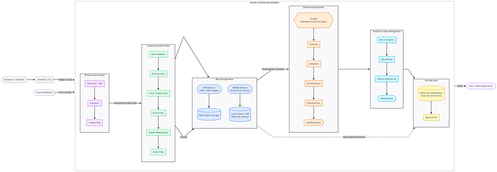
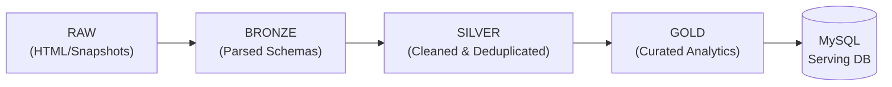

<div align="center">

# RoomBeacon

### Location-Aware Rental Discovery & Data Intelligence Platform

<p align="center">
  
  &nbsp;&nbsp;
  
  &nbsp;&nbsp;
  
  &nbsp;&nbsp;
  
  &nbsp;&nbsp;
  
  &nbsp;&nbsp;
  
  &nbsp;&nbsp;
  
  &nbsp;&nbsp;
  
  &nbsp;&nbsp;
  
</p>

[](https://www.python.org/)
[](https://airflow.apache.org/)
[](https://www.docker.com/)
[](https://duckdb.org/)
[](https://min.io/)
[](https://www.mysql.com/)
[](docs/source-structure.md)
[](LICENSE)

</div>

---

## Overview

RoomBeacon là nền tảng toàn diện về thu thập, chuẩn hóa, phân tích và khai phá dữ liệu phòng trọ / nhà thuê từ nhiều nguồn thông tin phân tán. Hệ thống hỗ trợ người dùng tìm kiếm nơi ở tối ưu dựa trên sự kết hợp giữa khu vực, ngân sách, khoảng cách, diện tích và đặc điểm tiện ích, trên nền tảng dữ liệu đã được làm sạch và phân tích chuyên sâu.

RoomBeacon kết hợp bốn trụ cột kỹ thuật chính:
1. **Web Crawling Engine:** Thu thập dữ liệu đa nguồn độc lập theo kiến trúc Clean Architecture & Hexagonal Architecture.
2. **Data Engineering Pipeline:** Chuẩn hóa dữ liệu qua mô hình phân tầng Medallion (RAW -> BRONZE -> SILVER -> GOLD).
3. **Data Analytics & Mining:** Phân tích mặt bằng giá, phát hiện bất thường và trích xuất đặc trưng bài đăng.
4. **Serving Layer:** Cung cấp dữ liệu có cấu trúc phục vụ API và ứng dụng đầu cuối.

---

## Business Problem

Thị trường cho thuê phòng trọ và nhà ở hiện nay đối mặt với nhiều rào cản thông tin:
* **Dữ liệu phân tán & rời rạc:** Người tìm phòng phải tìm kiếm qua hàng chục website và mạng xã hội khác nhau.
* **Trùng lặp listing nghiêm trọng:** Cùng một phòng trọ thường được đăng tải lặp đi lặp lại bởi nhiều môi giới hoặc trên nhiều website với mức giá và thông tin chênh lệch.
* **Định dạng dữ liệu phi chuẩn:** Mức giá được viết ở nhiều kiểu (`"4tr5"`, `"4.500.000đ/tháng"`, `"4 triệu rưỡi"`), diện tích (`"25m2"`, `"25 m²"`), và địa chỉ không đồng nhất (`"Q.Bình Thạnh"`, `"Quận Bình Thạnh"`).
* **Khó khăn trong việc so sánh & đối chiếu:** Người thuê thiếu thông tin tổng thể về mặt bằng giá thị trường tại từng khu vực để đưa ra quyết định hợp lý.
* **Tin ảo & tin rác (Stale/Spam Listings):** Listing cũ hết hạn và tin giả mạo gây lãng phí thời gian và công sức.

### Chuỗi giải pháp của RoomBeacon

```text
Collect ──> Structure ──> Clean ──> Validate ──> Normalize ──> Deduplicate ──> Analyze ──> Serve
```

---

## Target Users

* **Người tìm phòng & sinh viên / người đi làm:**
  * Tìm kiếm phòng trọ chính xác theo **Khu vực + Ngân sách + Nhu cầu thực tế**.
  * Tối ưu hóa lựa chọn dựa trên khoảng cách di chuyển đến trường học hoặc nơi làm việc.
* **Nhà phân tích thị trường & Data Scientists:**
  * Tiếp cận kho dữ liệu bất động sản cho thuê đã được làm sạch và chuẩn hóa.
  * Phân tích biến động giá thuê, phát hiện điểm nóng (hotspots), mật độ listing và xu hướng thị trường theo chuỗi thời gian.
* **Hệ thống ứng dụng bên thứ ba (Downstream Applications):**
  * Tiêu thụ dữ liệu chất lượng cao từ serving database thông qua Backend API.

---

## Core Value Proposition

Khác biệt cốt lõi của RoomBeacon nằm ở **kiến trúc Data Pipeline phân tầng (Medallion Architecture)** thay vì cách tiếp cận thu thập dữ liệu thông thường:

```text
Target Websites
      │
      ▼
┌──────────────┐
│ Crawler Core │ ──(Clean Architecture, Decoupled from Storage)
└──────────────┘
      │
      ▼
┌──────────────┐
│  RAW Layer   │ ──(Raw HTML / JSON Snapshot / MinIO Object Storage)
└──────────────┘
      │
      ▼
┌──────────────┐
│ BRONZE Layer │ ──(Parsed & Common Schematized Data)
└──────────────┘
      │
      ▼
┌──────────────┐
│ SILVER Layer │ ──(Cleaned, Validated, Normalized & Deduplicated via DuckDB)
└──────────────┘
      │
      ▼
┌──────────────┐
│  GOLD Layer  │ ──(Curated & Feature-Engineered Dataset for Analytics/Serving)
└──────────────┘
      │
      ▼
Search / Analytics / Serving APIs
```

> **RoomBeacon không nạp trực tiếp dữ liệu thô từ crawler vào Application Database.** Toàn bộ dữ liệu phải đi qua các bước trích xuất, ánh xạ schema, làm sạch, khử trùng lặp và làm giàu dữ liệu trước khi sẵn sàng phục vụ.

---

## Core Use Cases

| Use Case | Mô tả | Trạng thái |
| :--- | :--- | :---: |
| **Search by Location** | Tìm phòng theo cấp Quận / Phường / Khu vực cụ thể. | In Development |
| **Search by Budget** | Lọc phòng theo khoảng ngân sách chính xác (ví dụ: `3.000.000 – 5.000.000 VNĐ/tháng`). | In Development |
| **Location + Budget Combined** | Truy vấn kết hợp: *"Tìm phòng trọ tại Bình Thạnh, diện tích >= 20 m², giá dưới 5 triệu/tháng"*. | In Development |
| **Location Intelligence** | Đề xuất khu vực thuê tối ưu theo vị trí làm việc/học tập và ngân sách dự kiến. | Planned |
| **Rental Market Analytics** | Báo cáo mặt bằng giá, biến động listing, nhận diện bất thường giá (outliers) và phân tích mật độ. | Planned |

---

## Example Scenario

```text
Yêu cầu người dùng:
"Tôi cần tìm phòng tại Bình Thạnh, ngân sách 3.5 – 5 triệu/tháng, diện tích >= 20 m²"
```

```text
               Nhiều website nguồn (Batdongsan, Phongtro123, Chotot, ...)
                                          │
                                          ▼
                                   [ Crawler Engine ]
                   (Thu thập song song, trích xuất cấu trúc trường)
                                          │
                                          ▼
                               [ DuckDB Processing Engine ]
                    (Chuẩn hóa: "4tr5" -> 4.500.000, "Q.BT" -> Bình Thạnh;
                     Khử trùng lặp giữa các bài đăng cùng một phòng)
                                          │
                                          ▼
                                  [ Serving Dataset ]
                                          │
                                          ▼
             Kết quả chính xác, duy nhất, đúng giá, đúng khu vực cho người dùng
```

---

## System Architecture

RoomBeacon được tổ chức thành các layer độc lập từ quá trình điều phối crawler, thu thập dữ liệu, lưu trữ, xử lý dữ liệu cho đến serving application.

<p align="center">
  
</p>

The architecture follows the data flow:

**Source Websites → Airflow → Crawler → RAW / BRONZE → DuckDB → SILVER → Data Mining → GOLD → MySQL → Application**

* **Airflow Control Plane:** Scheduling, orchestration, task lifecycle và giám sát toàn bộ crawl cycle.
* **Crawler Execution Plane:** Thực thi thu thập đa nguồn độc lập (discovery, fetch/capture, extract, schema mapping và commit).
* **Raw Storage Plane:** Lưu trữ RAW objects (HTML, images, snapshots) trong MinIO và structured BRONZE datasets trên persistent storage.
* **Data Processing Plane:** Sử dụng DuckDB làm Embedded Analytical Engine để cleaning, validation, normalization và deduplication.
* **Analytics & Data Mining Plane:** Thực hiện EDA, trích xuất đặc trưng (feature engineering) và data mining để tạo GOLD dataset.
* **Serving Layer:** MySQL lưu trữ clean structured data và Backend API cung cấp dữ liệu cho Web/Mobile application.

> Chi tiết phân rã kiến trúc và cấu trúc thư mục được mô tả tại [docs/source-structure.md](docs/source-structure.md).

---

## Data Lifecycle

Hệ thống quản lý dữ liệu qua 4 tầng Medallion:



1. **RAW (Dữ liệu nguyên bản):**
   * Lưu trữ phản hồi thô: HTML source, JSON payload nguyên bản, hình ảnh snapshot từ website nguồn.
   * Lưu trữ dạng object trong MinIO và file thô tại `data/raw/`.
2. **BRONZE (Dữ liệu cấu trúc hóa ban đầu):**
   * Dữ liệu sau khi trích xuất và ánh xạ về **Common Crawler Schema**.
   * Định dạng: Parquet / JSON tại `data/bronze/`.
3. **SILVER (Dữ liệu làm sạch & chuẩn hóa):**
   * Được xử lý bởi DuckDB: loại bỏ giá trị null bất hợp lệ, chuẩn hóa kiểu dữ liệu, chuẩn hóa địa chỉ hành chính, chuyển đổi giá về VNĐ chuẩn, phát hiện và khử trùng lặp (deduplication).
   * Lưu tại `data/silver/`.
4. **GOLD (Dữ liệu tinh gọn phục vụ ứng dụng & phân tích):**
   * Dữ liệu đã tổng hợp, gắn nhãn phân tích, trích xuất đặc trưng (feature engineering) sẵn sàng nạp vào MySQL serving database và phục vụ mô hình phân tích.
   * Lưu tại `data/gold/`.

---

## Technology Stack

| Technology | Role | Description |
| :--- | :--- | :--- |
| **Python** | Crawler & Processing Runtime | Thu thập dữ liệu theo Clean Architecture, độc lập với runtime bên ngoài. |
| **Apache Airflow** | Scheduling & Orchestration | Lập lịch, điều phối task dependency, retry và giám sát chu kỳ crawl. |
| **Docker / Compose** | Runtime & Deployment | Đóng gói môi trường thực thi đồng nhất từ development tới production. |
| **MinIO** | Object Storage | Lưu trữ tệp nhị phân, hình ảnh phòng trọ và raw HTML snapshots. |
| **DuckDB** | Embedded Analytical Engine | Xử lý biến đổi, làm sạch, khử trùng lặp và phân tích dữ liệu lớn. |
| **MySQL** | Serving Relational Database | Lưu trữ dữ liệu cấu trúc tầng cuối, phục vụ truy vấn thời gian thực cho API. |
| **Apache Parquet** | Columnar Storage Format | Định dạng lưu trữ dạng cột tối ưu cho xử lý dữ liệu và phân tích. |

### Phân định vai trò công nghệ
* **Airflow** là tầng điều phối quy trình (Orchestration Layer), không chứa code nghiệp vụ crawler.
* **DuckDB** là analytical engine nhúng (embedded), không phải là một database server riêng biệt.
* **MinIO** đóng vai trò object storage cho dữ liệu phi cấu trúc, không phải application database.
* **MySQL** chỉ lưu trữ dữ liệu có cấu trúc phục vụ ứng dụng, chỉ tham chiếu link ảnh MinIO mà không lưu binary ảnh.

---

## Crawler Pipeline

Quy trình hoạt động của Crawler Engine được chuẩn hóa thành 5 giai đoạn thực thi:

```text
Source Adapter ──> [1. Discovery] ──> [2. Fetch] ──> [3. Extract] ──> [4. Schema Mapping] ──> [5. Commit]
```

1. **Source Adapter:** Bộ điều hợp riêng biệt cho từng website (triển khai Strategy Pattern), cô lập sự thay đổi của giao diện web.
2. **Discovery Box:** Quét và phát hiện danh sách các đường dẫn listing mới hoặc cần cập nhật.
3. **Fetch Box:** Gửi request thu thập nội dung trang (hỗ trợ HTTP Client hoặc Headless Browser).
4. **Extract Box:** Trích xuất các trường dữ liệu thô (tiêu đề, giá, diện tích, vị trí, tiện ích, ảnh).
5. **Schema Mapping Box:** Chuyển đổi dữ liệu đã extract về **Common Crawler Schema** chuẩn.
6. **Commit Box:** Ghi nhận kết quả vào Storage layer (`RAW` object và `BRONZE` dataset).

---

## Data Processing

Tầng xử lý dữ liệu sử dụng **DuckDB** để chuyển hóa dữ liệu từ `BRONZE` sang `SILVER`:

```text
BRONZE Dataset ──> [DuckDB Engine] ──(Clean -> Validate -> Normalize -> Deduplicate)──> SILVER Dataset
```

### Ví dụ chuẩn hóa dữ liệu (Normalization)
* **Giá thuê (Price):**
  * `"4tr5"` / `"4.5 triệu/tháng"` $\longrightarrow$ `4500000` (VNĐ)
  * `"Thỏa thuận"` $\longrightarrow$ `NULL` (kèm cờ `is_negotiable = true`)
* **Diện tích (Area):**
  * `"25 m2"` / `"25m²"` $\longrightarrow$ `25.0` ($m^2$)
* **Địa chỉ (Address):**
  * `"Q.Bình Thạnh, TP.HCM"` $\longrightarrow$ `{ "district": "Bình Thạnh", "city": "Hồ Chí Minh" }`
* **Khử trùng lặp (Deduplication):**
  * So khớp số điện thoại liên hệ, tọa độ vị trí tương đối và văn bản mô tả để gom cụm các listing trùng nhau.

---

## Analytics & Data Mining

Tầng phân tích hoạt động trên lớp dữ liệu `SILVER` để tạo ra các giá trị tri thức cho lớp `GOLD`:

* **Phân tích phân bố giá:** Tính toán mức giá trung bình, trung vị theo từng quận/phường.
* **Phát hiện điểm nóng (Hotspot Detection):** Nhận diện khu vực có mật độ phòng cao hoặc biến động giá lớn.
* **Phát hiện bất thường (Outlier Detection):** Lọc các tin đăng có mức giá quá thấp/quá cao so với mặt bằng chung của khu vực để cảnh báo tin ảo.
* **Khai phá đặc trưng phòng (Feature Mining):** Trích xuất tự động các tiện ích từ mô tả tự do (gác lửng, ban công, máy lạnh, giờ giấc tự do, không chung chủ).

---

## Storage Strategy

Hệ thống phân tách ranh giới lưu trữ theo đúng mục đích sử dụng:

* **MinIO (Object Storage):**
  * Lưu ảnh phòng trọ tải về.
  * Lưu trữ Raw HTML snapshots và JSON payloads kích thước lớn phục vụ audit hoặc re-parse.
* **Local Volume / File System (Parquet & JSON):**
  * Lưu trữ các tập tin dataset theo từng phân tầng `raw/`, `bronze/`, `silver/`, `gold/`.
  * Tối ưu cho việc xử lý hàng loạt bằng DuckDB.
* **MySQL (Serving Relational Database):**
  * Lưu trữ dữ liệu cấu trúc cuối cùng để phục vụ ứng dụng: `listings`, `locations`, `prices`, `amenities`.
  * **Không lưu binary ảnh vào MySQL:** MySQL chỉ lưu URL / Object Key tham chiếu đến MinIO.

---

## Project Structure

Thư mục `architecture/` là nơi lưu trữ các sơ đồ kiến trúc và visual assets chính thức của hệ thống (trong đó `overall-architecture.png` là sơ đồ tổng thể Level 1).

```text
roombeacon/
├── architecture/                      # Architecture diagrams & visual assets
│   └── overall-architecture.png       # Level 1 Overall System Architecture
│
├── crawler/                           # Core Crawler Engine (Clean Architecture)
│   ├── src/roombeacon_crawler/
│   │   ├── domain/                    # Entities, Value Objects, Contracts
│   │   ├── application/               # Use Cases & Ports (Inbound/Outbound)
│   │   ├── infrastructure/            # Storage, HTTP, DuckDB, Source Adapters
│   │   ├── pipeline/                  # Execution Boxes & Runners
│   │   ├── config/                    # Configuration management
│   │   ├── cli/                       # Command-line entrypoint
│   │   └── main.py                    # Application bootstrap
│   └── tests/                         # Unit & Integration Tests
│
├── airflow/                           # Apache Airflow Orchestration
│   ├── dags/                          # Crawling & Processing DAGs
│   └── plugins/                       # Airflow custom plugins
│
├── data/                              # Medallion Storage Directory
│   ├── raw/                           # Raw crawls / snapshots
│   ├── bronze/                        # Parsed common schema
│   ├── silver/                        # Cleaned & deduplicated
│   └── gold/                          # Aggregated & serving datasets
│
├── docker/                            # Service-specific Docker definitions
│   ├── airflow/
│   ├── crawler/
│   ├── minio/
│   └── mysql/
│
├── docs/                              # Project Technical Documentation
│   └── source-structure.md            # Detailed Architecture & Source Guide
│
├── scripts/                           # Dev, Docker & Database helper scripts
├── docker-compose.yml                 # Multi-container local orchestration
├── pyproject.toml                     # Python dependencies & build config
└── README.md                          # Project documentation
```

> **Xem giải thích chi tiết toàn bộ từng thư mục và file:** [docs/source-structure.md](docs/source-structure.md)

---

## Architecture Principles

* **Clean Architecture:** Hướng phụ thuộc từ ngoài vào trong: `Infrastructure ──> Application ──> Domain`. Domain là trung tâm độc lập.
* **Hexagonal Architecture (Ports & Adapters):** Tách biệt logic nghiệp vụ khỏi giao thức mạng, cơ sở dữ liệu và công cụ orchestration.
* **Strategy & Adapter Pattern:** Chuẩn hóa việc tích hợp các website nguồn mới mà không làm thay đổi luồng xử lý chung.
* **Technology Independence:** Crawler có khả năng chạy độc lập từ CLI hoặc Docker mà không phụ thuộc vào Airflow.
* **Separation of Concerns:** DuckDB phụ trách analytical batch processing, MySQL phụ trách online serving, MinIO phụ trách unstructured objects.

---

## Deployment

Hệ thống được thiết kế để triển khai đồng bộ thông qua **Docker Compose**:

* **Crawler Container:** Thực thi các tác vụ thu thập dữ liệu độc lập.
* **Airflow (Webserver + Scheduler):** Lập lịch định kỳ và kích hoạt các container crawler.
* **MinIO Server:** Object storage phục vụ lưu trữ file đa phương tiện và snapshot thô.
* **MySQL Server:** Cơ sở dữ liệu phục vụ ứng dụng.
* *(DuckDB chạy dưới dạng embedded library bên trong container crawler/processing mà không cần server riêng).*

---

## Project Status

| Thành phần | Trạng thái | Ghi chú |
| :--- | :---: | :--- |
| **Kiến trúc & Thiết kế tổng thể** | Completed | Clean Architecture + Hexagonal + Medallion Data Pipeline. |
| **Repository Scaffolding** | Completed | Toàn bộ cấu trúc thư mục, layer boundary và placeholder đã sẵn sàng. |
| **Tài liệu Kỹ thuật** | Completed | Tài liệu [docs/source-structure.md](docs/source-structure.md) và README hoàn chỉnh. |
| **Crawler Engine Core** | In Development | Xây dựng domain entities, use cases và pipeline boxes. |
| **Source Adapters** | In Development | Triển khai adapter cho các trang cho thuê phổ biến. |
| **DuckDB Data Processing Pipeline** | In Development | Xây dựng script làm sạch, chuẩn hóa và khử trùng lặp dữ liệu. |
| **Airflow Orchestration DAGs** | In Development | Thiết lập lịch trình crawl và pipeline dependencies. |
| **Data Mining & Analytics** | Planned | Mô hình phân tích mặt bằng giá và phát hiện bất thường. |
| **Serving API & Web/Mobile App** | Planned | Xây dựng FastAPI service và giao diện người dùng. |

---

## Roadmap

- [x] Thiết kế kiến trúc tổng thể (Clean Architecture & Medallion Pipeline)
- [x] Thiết lập cấu trúc mã nguồn dự án và phân rã thư mục
- [x] Viết tài liệu cấu trúc mã nguồn và README chính thức
- [ ] Cài đặt Domain Entities và Inbound/Outbound Ports cho Crawler
- [ ] Phát triển các Execution Boxes: Discovery, Fetch, Extract, Schema Mapping, Commit
- [ ] Triển khai Source Adapters đầu tiên (ví dụ: các trang phòng trọ phổ biến)
- [ ] Tích hợp MinIO Adapter và Local Storage Adapter
- [ ] Viết pipeline xử lý dữ liệu với DuckDB (Bronze $\rightarrow$ Silver)
- [ ] Xây dựng thuật toán phát hiện và khử trùng lặp phòng trọ
- [ ] Thiết lập Docker Compose hoàn chỉnh cho toàn bộ hệ thống
- [ ] Xây dựng DAGs trên Apache Airflow để tự động hóa chu kỳ crawl
- [ ] Khai phá dữ liệu và trích xuất đặc trưng (Silver $\rightarrow$ Gold)
- [ ] Thiết kế schema MySQL và xây dựng Data Loader từ Gold sang MySQL
- [ ] Phát triển Backend API (FastAPI) phục vụ tra cứu phòng trọ theo vị trí và giá
- [ ] Xây dựng giao diện tìm kiếm phòng trọ trực quan trên bản đồ

---

## Documentation & References

* [Cấu trúc chi tiết mã nguồn (Source Structure Guide)](docs/source-structure.md)
* [Tài liệu Kiến trúc Hệ thống](docs/architecture/)
* [Tài liệu Crawler Engine](docs/crawler/)
* [Tài liệu Vận hành Airflow](docs/airflow/)
* [Tài liệu Thiết kế Lưu trữ (MinIO & Local)](docs/storage/)
* [Tài liệu Data Pipeline](docs/data-pipeline/)
* [Tài liệu Cơ sở Dữ liệu](docs/database/)

---

## License

Dự án được phân phối dưới giấy phép mã nguồn mở. Xem thông tin chi tiết tại [LICENSE](LICENSE).
