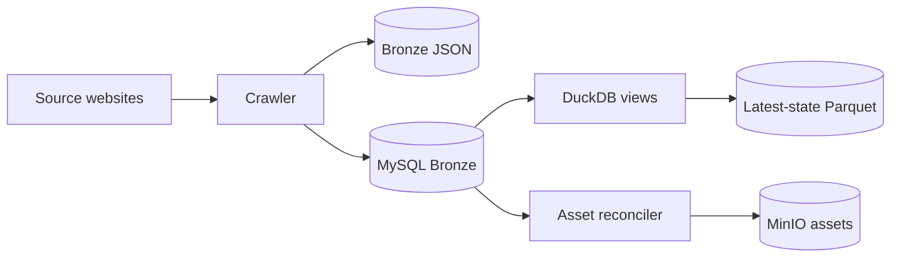

# RoomBeacon

> Mục đích: entry point cho người mới tìm hiểu, phát triển và vận hành RoomBeacon.
>
> Trạng thái: **CURRENT** — phản ánh source sau Phase 0–1.2E, ngày 2026-08-24.

RoomBeacon là pipeline thu thập và phân tích lịch sử tin cho thuê đa nguồn. Hệ thống giải quyết ba bài toán: thu thập có kiểm soát từ website, bảo toàn observation history, và cung cấp dữ liệu gần nguồn cho kiểm tra chất lượng cùng phân tích tiếp theo.

## Kiến trúc tổng quan



Airflow điều phối lịch và dependency graph; business workflow nằm trong application modules. Xem [Current Architecture](docs/architecture/CURRENT_ARCHITECTURE.md) để biết boundary chi tiết.

## Data flow

```text
Bronze history → Raw/latest-state dataset → Initial Data Quality EDA
→ cleaning rules → Silver → Clean Analytical EDA
→ feature engineering → Gold
```

Hiện tại Bronze, DuckDB views và latest-state Parquet đã được triển khai. Cleaned Silver và Gold chưa được triển khai. Xem [Data Lifecycle](docs/data/DATA_LIFECYCLE.md).

## Thành phần chính

| Component | Vai trò |
|---|---|
| `roombeacon_crawler` DAG | Plan, qualify, map crawl/persistence/checkpoint tasks |
| `CrawlRunner` | Điều phối một crawl run |
| Source adapters/parsers | Extraction riêng cho từng website |
| MySQL Bronze | Listing identity và observation history |
| Bronze reconciler | Nạp bù artifact chưa có trong MySQL |
| Asset reconciler | Tải ảnh an toàn và lưu vào MinIO |
| DuckDB | Analytical engine đọc MySQL Bronze |
| Latest-state materializer | Xuất một row/listing ra Parquet |

## Tech stack

Python, Apache Airflow, HTTPX, Playwright, MySQL, DuckDB, Pandas/PyArrow, MinIO/S3 API và Docker Compose.

## Repository structure

```text
airflow/dags/                    Airflow orchestration
crawler/src/roombeacon_crawler/ crawler, application, policies, adapters
analytics/                      DuckDB views và latest-state materializer
notebooks/                      Initial/Data Quality EDA
scripts/                        operational verification
tests/                          unit, contract và regression tests
docs/                           documentation index và tài liệu chuyên đề
```

## Quick start

1. Đọc [Docker Development](docs/infrastructure/docker-development.md).
2. Tạo cấu hình local từ `.env.example`; không commit `.env`.
3. Bootstrap runtime chỉ tại entrypoint thích hợp. Import library không tự load `.env`.
4. Khi chạy test, dùng explicit test configuration và database có hậu tố `_test`.
5. Không reset/xóa stateful volumes nếu chưa có backup.

Các lệnh vận hành cụ thể nằm trong tài liệu operations; README không thay thế runbook.

## Documentation map

- [Documentation Index](docs/README.md) — muốn tìm thông tin X thì đọc file nào.
- [Current Architecture](docs/architecture/CURRENT_ARCHITECTURE.md) — source of truth về runtime hiện tại.
- [Crawler](docs/crawler/01-crawler-overview.md) — acquisition, adapters và policies.
- [Data Lifecycle](docs/data/DATA_LIFECYCLE.md) — Bronze, EDA, Silver và Gold.
- [Security](docs/security/README.md) — invariants và remediation Phase 0/0.5.
- [Testing](docs/testing/TEST_DATA_ISOLATION.md) — test isolation và safety guard.
- [Audit](docs/audit/README.md), [Incident log](docs/log/README.md), [Phase 1 refactor](docs/refactor/PHASE_1_CLEAN_ARCHITECTURE.md) — lịch sử và evidence.

## Current project status

| Area | Status |
|---|---|
| Crawler, Bronze history, reconciliation | **IMPLEMENTED** |
| Asset pipeline / MinIO assets | **IMPLEMENTED** |
| DuckDB analytical views | **IMPLEMENTED** |
| Latest-state Parquet | **IMPLEMENTED** — chưa phải cleaned Silver |
| Initial Data Quality EDA | **PARTIAL** |
| Cleaning rules / semantic Silver | **PLANNED** |
| Gold / serving API / ClickHouse runtime | **FUTURE / NOT IMPLEMENTED** |
| Phase 0/0.5 security hardening | **VERIFIED** |
| Phase 1 CrawlRunner/DAG hotspots | **RESOLVED**; repository-wide layering còn partial |

RoomBeacon chưa production-ready; xem audit hiện hành để biết remaining risks.

## License

[MIT](LICENSE)
