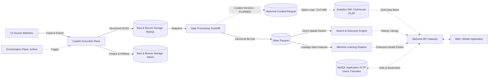
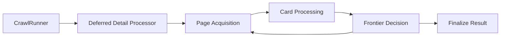
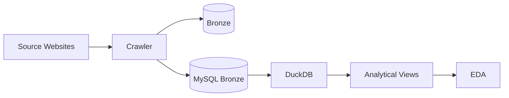

<div align="center">

# RoomBeacon

### Location-Aware Rental Discovery & Data Intelligence Platform

**Multi-source Web Crawling · Data Engineering · Data Quality · Analytics · Rental Intelligence**

[](https://www.python.org/)
[](https://airflow.apache.org/)
[](https://www.docker.com/)
[](https://www.mysql.com/)
[](https://duckdb.org/)
[](https://min.io/)
[](https://parquet.apache.org/)
[](LICENSE)

</div>

---

##  Overview

**RoomBeacon** là nền tảng thu thập và phân tích dữ liệu phòng trọ / nhà cho thuê đa nguồn tại Việt Nam. Được xây dựng như một **Data Ingestion & Rental Intelligence Platform**, dự án giải quyết bài toán phân tán thông tin trên thị trường bất động sản cho thuê, giúp người dùng dễ dàng tìm kiếm, so sánh và phân tích chuyên sâu về giá cả cũng như xu hướng thị trường.

Hệ thống quản lý toàn bộ vòng đời của dữ liệu:
`Thu thập đa nguồn ➔ Lưu trữ lịch sử ➔ Chuẩn hóa & Đảm bảo chất lượng ➔ Phân tích & Khai phá dữ liệu ➔ Ứng dụng thông minh`

---

##  Business Problem & Vision

Thông tin phòng trọ hiện tại bị phân tán trên nhiều website, dữ liệu trùng lặp, thiếu đồng nhất về giá, diện tích, vị trí và thường xuyên bị lỗi thời. 

**Tầm nhìn của RoomBeacon:** Thay vì chỉ trả về một danh sách tin đăng, hệ thống cung cấp **Rental Intelligence** để giúp người dùng và các nhà phân tích dữ liệu trả lời câu hỏi: *"Nên thuê ở đâu, mức giá nào là hợp lý và tại sao?"*

---

##  Key Features

- **Multi-source Orchestration:** Điều phối tự động bằng Apache Airflow, hỗ trợ 12 nguồn website khác nhau.
- **Historical Data Preservation:** Theo dõi vòng đời của một tin đăng qua nhiều lần crawl (giá thay đổi, nội dung cập nhật, biến động trạng thái).
- **Progressive Detail Enrichment:** Bóc tách và làm giàu dữ liệu dần dần (Full-address, Geocoding, tiện ích) với cơ chế quản lý backlog và budget thông minh.
- **Robust Persistence & Reconciliation:** Đảm bảo toàn vẹn dữ liệu (Data Integrity) thông qua MySQL transactional persistence và khả năng tự phục hồi (self-healing) với các Bronze artifacts.
- **Asset Pipeline:** Quản lý hình ảnh bằng MinIO với tính năng bảo mật tải ảnh (SSRF protection) và deduplication.
- **Analytics & Data Quality:** Tích hợp DuckDB để phân tích lịch sử, làm sạch dữ liệu (Semantic Silver) và chuẩn bị cho các mô hình Feature Engineering.

---

##  System Architecture

> 📄 **Bản vẽ kiến trúc chuẩn:** Xem sơ đồ thiết kế chi tiết tại [architecture/overall-architecture.pdf](architecture/overall-architecture.pdf) và phân tích kiến trúc mục tiêu tại [docs/00-overview/TARGET_ARCHITECTURE.md](docs/00-overview/TARGET_ARCHITECTURE.md).

Hệ thống được thiết kế theo kiến trúc phân tách các Mặt phẳng Chức năng (Planes) theo bản vẽ chuẩn hóa:

1. **Orchestration Plane (Airflow):** Lên lịch, điều phối tiến trình và giám sát hệ thống.
2. **Crawler Execution Plane (FROZEN):** Động cơ thu thập đa nguồn độc lập, bóc tách chuẩn hóa và commit dữ liệu thô.
3. **Raw and Bronze Storage Plane:** MySQL Bronze SCD2 (`roombeacon_bronze`) và MinIO Object Storage (`roombeacon-assets`).
4. **Data Processing and Silver Plane:** DuckDB In-Memory OLAP, chuẩn hóa địa chỉ, Canonical Silver Parquet 80 cột và Historical Curated Observations (PLANNED).
5. **Analytics and Data Warehouse Plane (ClickHouse OLAP — FUTURE):** Fact tables, Dimensions và Gold Data Marts (`agg_market_daily`).
6. **Machine Learning Plane:** Hợp đồng đặc trưng an toàn (F1–F5), Champion Model Artifact (LightGBM F4 RAW), Shadow Validation và Benchmark hiệu năng.
7. **Search and Discovery Plane:** Tìm kiếm phòng thuê không gian (Spatial / Haversine) đọc trực tiếp từ Canonical Silver Parquet, fallback 3 cấp.
8. **Application Serving Plane (FUTURE):** Backend API Gateway, Model Serving Runtime, MySQL Application OLTP (Users, Favorites) và Web/Mobile App.


```mermaid
flowchart LR
    S[12 Source Websites] -->|Crawl & Extract| CEP[Crawler Execution Plane]
    
    AF[Orchestration Plane: Airflow] -.->|Trigger| CEP
    
    CEP -->|Structured SCD2| MB[(Raw & Bronze Storage: MySQL)]
    CEP -->|Images & Artifacts| MO[(Raw & Bronze Storage: MinIO)]
    
    MB -->|Snapshot| DK[Data Processing: DuckDB]
    DK -->|Canonical 80 cols| SP[(Silver Parquet)]
    DK -.->|Curated Versions - PLANNED| CP[(Historical Curated Parquet)]
    
    SP -->|Direct Spatial Search| SRCH[Search & Discovery Engine]
    SP -->|Leakage-Safe Features| ML[Machine Learning Pipeline]
    CP -.->|Batch Load - FUTURE| CH[(Analytics DW: ClickHouse OLAP)]
    
    CH -.->|Gold Data Marts| API[Backend API Gateway]
    SRCH -.->|Nearby Listings| API
    ML -.->|Champion Model Predict| API
    MY_APP[(MySQL Application OLTP<br/>Users, Favorites)] <-.->|Auth & Bookmarks| API
    API <-.-> CLIENT[Web / Mobile Application]
```

### 🕸️ Crawler Internal Flow

Mô hình xử lý bên trong Crawler (`CrawlRunner`) được tổ chức thành các chuỗi processor linh hoạt:


```mermaid
flowchart LR
    A[CrawlRunner]
    B[Deferred Detail Processor]
    C[Page Acquisition]
    D[Card Processing]
    E[Frontier Decision]
    F[Finalize Result]

    A --> B
    B --> C
    C --> D
    D --> E
    E --> C
    E --> F
```

### 🔄 Data & Analytics Flow

Dữ liệu thô (Bronze) được chuyển dần thành các dạng dữ liệu sẵn sàng cho EDA, Data Mining và Feature Engineering:


```mermaid
flowchart LR
    S[Source Websites]
    C[Crawler]

    B[(Bronze)]
    M[(MySQL Bronze)]

    D[DuckDB]
    V[Analytical Views]

    E[EDA]

    S --> C
    C --> B
    C --> M
    M --> D
    D --> V
    V --> E
```
---

##  Technology Stack

- **Core & Crawler:** Python 3.11+, Clean Architecture, Source Adapter Pattern.
- **Orchestration:** Apache Airflow.
- **Database:** MySQL (Relational Bronze).
- **Data Analytics:** DuckDB, Pandas, Parquet.
- **Object Storage:** MinIO (S3-compatible).
- **Deployment:** Docker & Docker Compose.
- **Testing:** Pytest (hơn 630+ regression tests).

---

##  Project Structure

```text
roombeacon/
├── airflow/           # Airflow DAGs và cấu hình điều phối
├── crawler/           # Core crawler engine & Source adapters
├── analytics/         # Logic phân tích và materialization (DuckDB)
├── notebooks/         # Jupyter notebooks cho EDA và Data Quality
├── data/              # Dữ liệu local (Bronze, Silver, MySQL, MinIO, Logs...)
├── docs/              # Tài liệu kỹ thuật chuyên sâu (Architecture, Security, Testing,...)
├── tests/             # Regression, Integration, Unit tests
├── scripts/           # Các công cụ hỗ trợ vận hành (Bash/Python)
└── docker-compose.yml # Môi trường runtime local
```

---

##  Documentation

Hệ thống tài liệu kỹ thuật được tái cấu trúc toàn diện theo miền kiến trúc chuẩn tại **[`docs/`](docs/README.md)**:

- 📚 **[Documentation Index & Roadmap](docs/README.md)**: Thứ tự đọc đề xuất, ma trận trạng thái và nguyên tắc tài liệu.
- 🏛️ **[00-Overview](docs/00-overview/)**: [Tổng quan dự án](docs/00-overview/PROJECT_OVERVIEW.md), [Kiến trúc mục tiêu 6 Plane](docs/00-overview/TARGET_ARCHITECTURE.md), [Vòng đời dữ liệu](docs/00-overview/DATA_LAYERS_AND_LIFECYCLE.md), [Trạng thái triển khai](docs/00-overview/IMPLEMENTATION_STATUS.md), [Lộ trình di chuyển](docs/00-overview/GAP_AND_MIGRATION_PLAN.md).
- 🎮 **[01-Control-Plane](docs/01-control-plane/)**: [Kiến trúc Airflow 3](docs/01-control-plane/AIRFLOW_ARCHITECTURE.md) và [Danh mục 6 DAGs](docs/01-control-plane/DAG_CATALOG.md).
- 🕸️ **[02-Ingestion](docs/02-ingestion/)**: [Kiến trúc Crawler](docs/02-ingestion/CRAWLER_ARCHITECTURE.md), [12 Nguồn dữ liệu](docs/02-ingestion/SOURCE_ADAPTERS.md), [Chính sách truy cập & Robots](docs/02-ingestion/FETCH_ACCESS_AND_ROBOTS.md), [Hợp đồng bóc tách](docs/02-ingestion/EXTRACTION_CONTRACT.md).
- 💾 **[03-Storage](docs/03-storage/)**: [Tổng quan lưu trữ](docs/03-storage/STORAGE_OVERVIEW.md), [MySQL Bronze SCD2](docs/03-storage/BRONZE_MYSQL.md), [MinIO S3](docs/03-storage/OBJECT_STORAGE_MINIO.md), [Asset Pipeline](docs/03-storage/ASSET_PIPELINE.md).
- ⚙️ **[04-Processing](docs/04-processing/)**: [Kiến trúc xử lý DuckDB](docs/04-processing/PROCESSING_ARCHITECTURE.md), [Chuẩn hóa địa chỉ](docs/04-processing/ADDRESS_AND_ADMIN_NORMALIZATION.md), [Làm giàu tọa độ](docs/04-processing/GEOCODING_ENRICHMENT.md), [Canonical Silver 80 cột](docs/04-processing/SILVER_CONTRACT.md).
- 🧠 **[05-Analytics-ML](docs/05-analytics-ml/)**: [Tầng phân tích Gold](docs/05-analytics-ml/ANALYTICS_AND_GOLD.md), [Benchmark định giá V3 LightGBM F4](docs/05-analytics-ml/PRICE_MODEL.md), [Phân giải thực thể trùng](docs/05-analytics-ml/ENTITY_RESOLUTION.md).
- 🚀 **[06-Serving](docs/06-serving/)**: [Kiến trúc Serving](docs/06-serving/SERVING_ARCHITECTURE.md), [MySQL Serving SPATIAL INDEX & REST API](docs/06-serving/SERVING_SCHEMA_AND_API.md).
- 🛠️ **[07-Engineering](docs/07-engineering/)**: [Quy tắc phụ thuộc](docs/07-engineering/DEPENDENCY_RULES.md), [Bảo mật SSRF](docs/07-engineering/SECURITY.md), [Kiểm thử Pytest](docs/07-engineering/TESTING.md), [Docker Local](docs/07-engineering/DOCKER_DEVELOPMENT.md), [Cấu hình môi trường](docs/07-engineering/CONFIGURATION.md).
- 📜 **[Architecture Decision Records (ADR)](docs/adr/)**: Toàn bộ 6 quyết định kiến trúc cốt lõi ([ADR-001](docs/adr/ADR-001.md) đến [ADR-006](docs/adr/ADR-006.md)).
- 📦 **[Archive](docs/archive/)**: 46 tài liệu lịch sử đã lưu trữ theo chủ đề ([audit](docs/archive/audit/), [incidents](docs/archive/incidents/), [legacy-design](docs/archive/legacy-design/), [plans](docs/archive/plans/), [refactor](docs/archive/refactor/)).

---

<div align="center">

*From fragmented rental listings to structured rental intelligence.*

</div>
