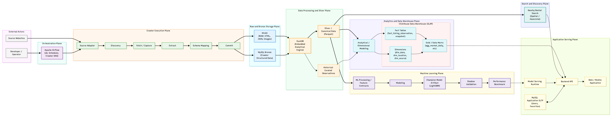
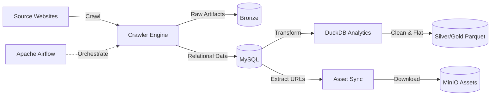
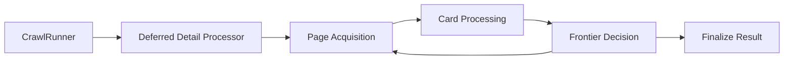
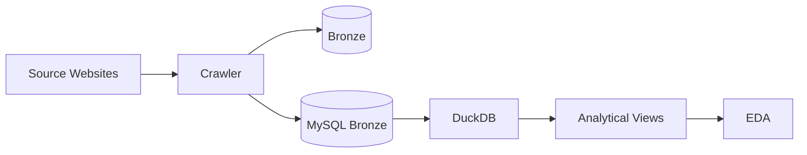

<div align="center">

# RoomBeacon

### Location-Aware Rental Discovery & Data Intelligence Platform

**Multi-source Web Crawling · Data Engineering · Data Quality · Analytics · Rental Intelligence**

[](https://www.python.org/)
[](https://airflow.apache.org/)
[](https://www.docker.com/)
[](https://www.mysql.com/)
[](https://duckdb.org/)
[](https://min.io/)
[](https://parquet.apache.org/)
[](LICENSE)

</div>

---

##  Overview

**RoomBeacon** là nền tảng thu thập và phân tích dữ liệu phòng trọ / nhà cho thuê đa nguồn tại Việt Nam. Được xây dựng như một **Data Ingestion & Rental Intelligence Platform**, dự án giải quyết bài toán phân tán thông tin trên thị trường bất động sản cho thuê, giúp người dùng dễ dàng tìm kiếm, so sánh và phân tích chuyên sâu về giá cả cũng như xu hướng thị trường.

Hệ thống quản lý toàn bộ vòng đời của dữ liệu:
`Thu thập đa nguồn ➔ Lưu trữ lịch sử ➔ Chuẩn hóa & Đảm bảo chất lượng ➔ Phân tích & Khai phá dữ liệu ➔ Ứng dụng thông minh`

---

##  Business Problem & Vision

Thông tin phòng trọ hiện tại bị phân tán trên nhiều website, dữ liệu trùng lặp, thiếu đồng nhất về giá, diện tích, vị trí và thường xuyên bị lỗi thời. 

**Tầm nhìn của RoomBeacon:** Thay vì chỉ trả về một danh sách tin đăng, hệ thống cung cấp **Rental Intelligence** để giúp người dùng và các nhà phân tích dữ liệu trả lời câu hỏi: *"Nên thuê ở đâu, mức giá nào là hợp lý và tại sao?"*

---

##  Key Features

- **Multi-source Orchestration:** Điều phối tự động bằng Apache Airflow, hỗ trợ 12 nguồn website khác nhau.
- **Historical Data Preservation:** Theo dõi vòng đời của một tin đăng qua nhiều lần crawl (giá thay đổi, nội dung cập nhật, biến động trạng thái).
- **Progressive Detail Enrichment:** Bóc tách và làm giàu dữ liệu dần dần (Full-address, Geocoding, tiện ích) với cơ chế quản lý backlog và budget thông minh.
- **Robust Persistence & Reconciliation:** Đảm bảo toàn vẹn dữ liệu (Data Integrity) thông qua MySQL transactional persistence và khả năng tự phục hồi (self-healing) với các Bronze artifacts.
- **Asset Pipeline:** Quản lý hình ảnh bằng MinIO với tính năng bảo mật tải ảnh (SSRF protection) và deduplication.
- **Analytics & Data Quality:** Tích hợp DuckDB để phân tích lịch sử, làm sạch dữ liệu (Semantic Silver) và chuẩn bị cho các mô hình Feature Engineering.

---

##  System Architecture

<p align="center">
  
</p>

Hệ thống được thiết kế theo kiến trúc **Clean Architecture** và chia làm các Plane (mặt phẳng) trách nhiệm rõ ràng:

1. **Control Plane (Airflow):** Lên lịch, lập kế hoạch crawl, retry và quản lý task.
2. **Execution Plane (Crawler):** Thu thập dữ liệu, phân tích HTML (parsing) và trích xuất.
3. **Persistence Plane (MySQL / Artifacts):** Lưu trữ gốc (Bronze) với độ tin cậy cao.
4. **Analytics Plane (DuckDB / Parquet):** Truy vấn phân tích, flatten dữ liệu và tạo tập dữ liệu sạch (Silver/Gold).
5. **Asset Plane (MinIO):** Quản lý độc lập vòng đời của các file đa phương tiện (hình ảnh).


```mermaid
flowchart LR
    S[Source Websites] -->|Crawl| C[Crawler Engine]
    
    A[Apache Airflow] -.->|Orchestrate| C
    
    C -->|Raw Artifacts| B[(Bronze)]
    C -->|Relational Data| M[(MySQL)]
    
    M -->|Transform| D[DuckDB Analytics]
    D -->|Clean & Flat| P[(Silver/Gold Parquet)]
    
    M -->|Extract URLs| AS[Asset Sync]
    AS -->|Download| O[(MinIO Assets)]
```

### 🕸️ Crawler Internal Flow

Mô hình xử lý bên trong Crawler (`CrawlRunner`) được tổ chức thành các chuỗi processor linh hoạt:


```mermaid
flowchart LR
    A[CrawlRunner]
    B[Deferred Detail Processor]
    C[Page Acquisition]
    D[Card Processing]
    E[Frontier Decision]
    F[Finalize Result]

    A --> B
    B --> C
    C --> D
    D --> E
    E --> C
    E --> F
```

### 🔄 Data & Analytics Flow

Dữ liệu thô (Bronze) được chuyển dần thành các dạng dữ liệu sẵn sàng cho EDA, Data Mining và Feature Engineering:


```mermaid
flowchart LR
    S[Source Websites]
    C[Crawler]

    B[(Bronze)]
    M[(MySQL Bronze)]

    D[DuckDB]
    V[Analytical Views]

    E[EDA]

    S --> C
    C --> B
    C --> M
    M --> D
    D --> V
    V --> E
```
---

##  Technology Stack

- **Core & Crawler:** Python 3.11+, Clean Architecture, Source Adapter Pattern.
- **Orchestration:** Apache Airflow.
- **Database:** MySQL (Relational Bronze).
- **Data Analytics:** DuckDB, Pandas, Parquet.
- **Object Storage:** MinIO (S3-compatible).
- **Deployment:** Docker & Docker Compose.
- **Testing:** Pytest (hơn 630+ regression tests).

---

##  Project Structure

```text
roombeacon/
├── airflow/           # Airflow DAGs và cấu hình điều phối
├── crawler/           # Core crawler engine & Source adapters
├── analytics/         # Logic phân tích và materialization (DuckDB)
├── notebooks/         # Jupyter notebooks cho EDA và Data Quality
├── data/              # Dữ liệu local (Bronze, Silver, MySQL, MinIO, Logs...)
├── docs/              # Tài liệu kỹ thuật chuyên sâu (Architecture, Security, Testing,...)
├── tests/             # Regression, Integration, Unit tests
├── scripts/           # Các công cụ hỗ trợ vận hành (Bash/Python)
└── docker-compose.yml # Môi trường runtime local
```

---

##  Documentation

Hệ thống tài liệu kỹ thuật chuyên sâu được phân loại rõ ràng trong thư mục **`docs/`**:

-  **[Documentation Index](docs/README.md)** (Trang chủ tài liệu)
-  **[Architecture](docs/architecture/)**: Kiến trúc tổng thể, luồng thu thập (Crawl & Storage Flow), luồng dữ liệu (Data Pipeline), quản lý file tĩnh (Asset Pipeline)
-  **[Crawler](docs/crawler/)**: Logic thu thập đa nguồn, chiến lược xử lý phân trang, bóc tách dữ liệu
-  **[Airflow](docs/airflow/)**: Thiết kế DAGs điều phối (Orchestration) và tự động hóa
-  **[Analytics](docs/analytics/) & [Data Models](docs/data/)**: Chuẩn bị dữ liệu (Silver materialization), Data Quality EDA
-  **[Security](docs/security/)**: Các biện pháp bảo mật (chống SSRF, an toàn tải file)
-  **[Testing](docs/testing/)**: Chiến lược kiểm thử, Regression test, Data Isolation
-  **[Audit](docs/audit/) & [Logs](docs/log/)**: Các đợt kiểm tra kiến trúc, biên bản sự cố (Incidents)
-  **[Infrastructure](docs/infrastructure/)**: Quản lý hạ tầng Docker, Database, Storage
-  **[Superpowers](docs/superpowers/)**: Thiết kế tính năng (Specs & Plans)

---

<div align="center">

*From fragmented rental listings to structured rental intelligence.*

</div>
