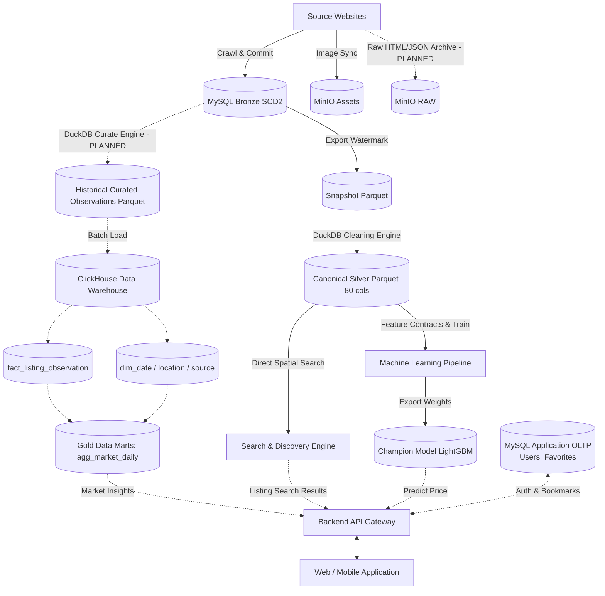

# Các Tầng Dữ Liệu & Vòng Đời (Data Layers & Lifecycle)

> **Plane:** Storage
> **Trạng thái tài liệu:** AUTHORITATIVE
> **Trạng thái thành phần:** hỗn hợp — xem bảng
> **Kiểm chứng lần cuối:** 2026-10-06, commit `80d2c1f`
> **Liên quan:** [TARGET_ARCHITECTURE.md](TARGET_ARCHITECTURE.md), [../03-storage/BRONZE_MYSQL.md](../03-storage/BRONZE_MYSQL.md), [../04-processing/SILVER_CONTRACT.md](../04-processing/SILVER_CONTRACT.md)

---

## 1. Nguyên Tắc Cốt Lõi (Core Principles)

RoomBeacon tổ chức dữ liệu theo kiến trúc phân tầng chuẩn hóa từ bản vẽ thiết kế:

$$\text{RAW / BRONZE} \longrightarrow \text{SILVER / CURATED} \longrightarrow \text{WAREHOUSE / GOLD} \longrightarrow \text{SERVING \& DISCOVERY}$$

> **Khẩu hiệu nghiệp vụ từng tầng:**
> - **BRONZE (Structured)** — *What did the source say?* (Bảo toàn nguyên vẹn lời nguồn nói, lưu vết lịch sử không sửa đổi).
> - **SILVER (Canonical)** — *What clean facts do we trust?* (Dữ liệu sạch, đã kiểm chứng, gắn cờ chất lượng, 80 cột chuẩn hóa).
> - **HISTORICAL CURATED OBSERVATIONS** — *How did listings evolve over time?* (Lịch sử phiên bản và số lần xuất hiện đã làm sạch, lưu Parquet).
> - **GOLD / DATA MARTS (ClickHouse)** — *What does analytical reporting need?* (Data Marts đa chiều trong Data Warehouse OLAP).
> - **SEARCH & DISCOVERY** — *How to find nearby rentals?* (Truy xuất không gian thời gian thực đọc trực tiếp từ Silver Parquet).
> - **APPLICATION SERVING** — *What does the user manage?* (Tài khoản người dùng, tin yêu thích trên MySQL Application OLTP).

---

## 2. Đặc Tả Chi Tiết Từng Tầng Dữ Liệu

| Tầng dữ liệu | Định dạng & Nơi lưu trữ vật lý | Cấp độ chi tiết (Grain) | Ngữ nghĩa nghiệp vụ (Semantics) | Trạng thái kỹ thuật |
|---|---|---|---|:---:|
| **0. RAW Layer** | - MinIO S3: `roombeacon-assets` (Images)<br>- MinIO S3: Raw HTML & JSON *(PLANNED)*<br>- Host JSON: `data/bronze/<source>/<date>/` | 1 lượt tải trang hoặc 1 tệp ảnh | Lưu toàn bộ payload thô, HTML gốc, JSON crawl và tệp hình ảnh để phục vụ audit, replay và hiển thị. | **MIXED**<br>- Images: **IMPLEMENTED**<br>- HTML/JSON MinIO: **PLANNED** |
| **1. BRONZE Layer** | - MySQL 8.4 `roombeacon_bronze`<br>- 11 bảng chuẩn hóa SCD2 trong `schema.py` | 1 phiên bản quan sát theo `(rental_post_id, crawl_run_id)` | Dữ liệu nguồn có cấu trúc quan hệ. Giữ nguyên giá trị thô `*_raw`. Lưu lịch sử thay đổi phiên bản SCD2. | **IMPLEMENTED** |
| **2. SNAPSHOT Layer** *(Cầu nối an toàn)* | - `data/bronze/snapshot/latest_posts.parquet`<br>- `data/bronze/snapshot/raw_evidence.parquet` | Chính xác **1 dòng cho mỗi `rental_post_id`** duy nhất | Rút gọn lịch sử SCD2 thành trạng thái mới nhất tại thời điểm cắt (Cutoff). Tạo rào chắn cách ly DuckDB khỏi MySQL Bronze. | **IMPLEMENTED** |
| **3. SILVER Layer** *(Canonical Data)* | - `data/silver/rental_listings.parquet`<br>- Siêu dữ liệu `rental_listings.metadata.json` | Chính xác **1 dòng cho mỗi `rental_post_id`** (80 cột) | Dữ liệu đã làm sạch xác định: bóc tách địa chỉ, chuẩn hóa hành chính theo Gazetteer, thẩm định giá/diện tích, cờ toạ độ tin cậy, phân loại chất lượng `row_quality_status`. Bảo toàn 100% số dòng. | **IMPLEMENTED** |
| **4. HISTORICAL CURATED OBSERVATIONS** | - Tệp Parquet phân vùng theo thời gian: `data/curated_observations/` *(PLANNED)* | 1 dòng cho mỗi quan sát / phiên bản / sighting đã làm sạch | Tầng lịch sử quan sát đã curate (SCD2 versions + sightings) do DuckDB xử lý và xuất bản. Là nguồn cấp dữ liệu lịch sử đầu vào cho `fact_listing_observation` trong Data Warehouse. | **PLANNED** |
| **5. GOLD / DATA MARTS** *(ClickHouse OLAP)* | - ClickHouse Data Warehouse (OLAP)<br>- Bảng Fact: `fact_listing_observation`<br>- Bảng Dim: `dim_date`, `dim_location`, `dim_source`<br>- Data Marts: `agg_market_daily`, etc. | Theo chiều phân tích (ngày, phường, quận, nguồn) | Tầng kho dữ liệu và Data Marts phân tích chuyên sâu: tổng hợp chỉ số thị trường (giá trung vị, biến động nguồn cung, tốc độ thanh khoản) phục vụ báo cáo quản trị và BI API. | **FUTURE** |
| **6. SEARCH & DISCOVERY** | - Truy xuất trực tiếp trên `rental_listings.parquet`<br>- Bounding Box + Haversine (Vectorized) | 1 tin đăng có toạ độ tin cậy hoặc cùng địa bàn hành chính | Tìm kiếm phòng thuê lân cận thời gian thực với cơ chế fallback 3 cấp (bán kính $\le$ 3km $\rightarrow$ cùng phường $\rightarrow$ cùng quận). Đã kiểm chứng trong Notebook 05. | **IMPLEMENTED** *(Prototype)* |
| **7. APPLICATION SERVING** | - MySQL 8.4 `roombeacon_app` (Application OLTP)<br>- Bảng `users`, `favorites`, `saved_searches` | 1 người dùng hoặc 1 lượt lưu tin | Lưu trữ dữ liệu nghiệp vụ của ứng dụng người dùng cuối. **Tuyệt đối KHÔNG lưu trữ listings hay bảng thống kê thị trường** (những dữ liệu này do Search & Discovery và ClickHouse phục vụ). | **FUTURE** |

---

## 3. Phân Biệt Công Cụ và Tầng Dữ Liệu (Tools vs. Layers)

| Khái niệm | Bản chất kỹ thuật trong RoomBeacon | Tuyệt đối KHÔNG đồng nghĩa với |
|---|---|---|
| **DuckDB** | Động cơ truy vấn SQL phân tích in-process (Embedded Analytical Query Engine). | Không phải là cơ sở dữ liệu lưu trữ vật lý của tầng Silver hay Data Warehouse. |
| **Parquet** | Định dạng tệp lưu trữ dữ liệu dạng cột (Columnar Storage Format). | Không phải là một tầng dữ liệu duy nhất. Parquet là định dạng vật lý của Snapshot, Canonical Silver và Historical Curated Observations. |
| **Gold** | Các Data Marts tổng hợp nghiệp vụ trong ClickHouse Data Warehouse (`agg_market_daily`, etc.). | **Không phải là tệp Parquet tĩnh dưới `data/gold/`**. |
| **MySQL Bronze** | Kho dữ liệu quan hệ lưu lịch sử cào SCD2 (`roombeacon_bronze`). | Không phục vụ API người dùng cuối. |
| **MySQL Serving** | Cơ sở dữ liệu Application OLTP lưu tài khoản và tin yêu thích (`users`, `favorites`). | **Không chứa dữ liệu tin đăng (`listings`) hay dữ liệu phân tích thị trường.** |
| **ClickHouse** | Hệ quản trị cơ sở dữ liệu phân tích dạng cột (OLAP Data Warehouse). | Không tham gia vào quá trình cào dữ liệu thời gian thực. |

---

## 4. Cây Phả Hệ và Nguyên Tắc Tái Xây Dựng (Data Lineage & Rebuild Rules)



### Quy tắc tái tạo từng tầng:

1. **Tái tạo Bronze:**
   - Bronze mang tính bất biến (Immutable Observations) và không thể tái tạo từ hư vô nếu không có bản sao lưu vật lý (`data/backups/`) hoặc chạy lại crawler.
2. **Tái tạo Snapshot Parquet:**
   - Hoàn toàn tái tạo được bất kỳ lúc nào từ MySQL Bronze:
     ```bash
     python -m analytics.bronze.snapshot
     ```
3. **Tái tạo Canonical Silver:**
   - Hoàn toàn tái tạo xác định 100% từ Snapshot Parquet qua notebook `02_roombeacon_silver.ipynb` hoặc DAG `roombeacon_silver_materializer`.
   - Bảo toàn nguyên vẹn 132,436 dòng, tuân thủ nghiêm ngặt 10 phép kiểm định của Pre-Silver Quality Gate.
4. **Tái tạo Historical Curated Observations (PLANNED):**
   - Tái tạo từ dữ liệu lịch sử MySQL Bronze thông qua DAG `roombeacon_curated_observations` (sử dụng DuckDB để thẩm định và gộp phiên bản/sightings thành Parquet).
5. **Tái tạo Gold Data Marts trong ClickHouse (FUTURE):**
   - Tái tạo bằng cách chạy batch ETL nạp từ Historical Curated Observations Parquet vào ClickHouse và thực thi các câu lệnh `CREATE MATERIALIZED VIEW / TABLE` cho Data Marts.
6. **Tái tạo Search & Discovery:**
   - Không cần database phụ trợ: công cụ tìm kiếm nạp trực tiếp file `data/silver/rental_listings.parquet` vào bộ nhớ và thực thi thuật toán vector hóa Haversine.
