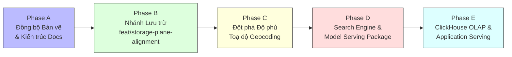

# Khoảng Cách Kiến Trúc & Lộ Trình Phát Triển (Gap & Migration Plan)

> **Plane:** Engineering
> **Trạng thái tài liệu:** AUTHORITATIVE
> **Trạng thái thành phần:** PLANNED
> **Kiểm chứng lần cuối:** 2026-10-06, commit `80d2c1f`
> **Liên quan:** [TARGET_ARCHITECTURE.md](TARGET_ARCHITECTURE.md), [IMPLEMENTATION_STATUS.md](IMPLEMENTATION_STATUS.md)

---

## 1. Phân Tích Khoảng Cách Kỹ Thuật (Gap Analysis)

| Mặt phẳng theo Bản vẽ | Hiện trạng mã nguồn (As-Is) | Kiến trúc mục tiêu (To-Be) | Khoảng cách kỹ thuật (Gap) & Hướng xử lý |
|---|---|---|---|
| **Orchestration Plane** | 6 DAGs Airflow vận hành ổn định. | Airflow điều phối toàn diện, Ingestion DAG đóng băng (**FROZEN**). | Đã đáp ứng yêu cầu vận hành hiện tại. |
| **Crawler Execution Plane (FROZEN)** | 12 adapters (9 hoạt động, 3 hạn chế/tắt); `CrawlRunner` hoàn chỉnh. | Giữ nguyên trạng thái đóng băng (**FROZEN**), bảo toàn logic cào. | Không can thiệp mã nguồn crawler ở giai đoạn này. |
| **Raw & Bronze Storage Plane** | - MySQL Bronze tăng nhanh (~13.0 GB); - MinIO Images ~3.5 GB; - JSON thô ~2.0 GB; - Code ghi `minio bypassed`. | - MySQL Bronze kiểm soát theo `content_hash` và `rental_post_sightings`; - MinIO lưu cả HTML & JSON thô; - Con trỏ thay thế `source_payload`. | - Đang triển khai giải pháp lưu trữ trên nhánh `feat/storage-plane-alignment` (PLANNED). - Tải Raw HTML lên MinIO cần sửa crawler (đang FROZEN) $\rightarrow$ **Gap mở**. |
| **Data Processing & Silver Plane** | - Snapshot Parquet $\rightarrow$ Canonical Silver Parquet 80 cột hoàn chỉnh; - Geocoding đạt 1.7%. | - Canonical Silver Parquet là nguồn chân lý duy nhất; - Xuất bản thêm **Historical Curated Observations** (Parquet). | - Cần xây dựng DAG `roombeacon_curated_observations` để sinh Parquet lịch sử quan sát (PLANNED). - Cần mở rộng Geocoding Worker để nâng độ phủ tọa độ. |
| **Analytics & Data Warehouse Plane** | Chưa có Data Warehouse; DuckDB chỉ chạy in-process. | **ClickHouse Data Warehouse (OLAP)** chứa Fact tables, Dimensions, Gold Data Marts (`agg_market_daily`). | Toàn bộ là **FUTURE**. Sẽ kích hoạt khi tầng Historical Curated Observations đủ lớn và phát sinh nhu cầu truy vấn OLAP đồng thời (xem [ADR-004](../adr/ADR-004.md)). |
| **Machine Learning Plane** | Notebook 03, 04, 06, 07 đã chạy hoàn chỉnh; Champion LightGBM F4 RAW đã khóa. | Đóng gói thành các job tự động hóa định kỳ theo dõi drift và suy luận. | Chuyển đổi mã nguồn từ Jupyter Notebook sang Python modules vận hành độc lập (PLANNED). |
| **Search & Discovery Plane** | Prototype tìm kiếm bán kính Haversine vector hóa trong Notebook 05. | Dịch vụ tìm kiếm phòng thuê lân cận đọc trực tiếp từ Silver Parquet. | Đóng gói logic tìm kiếm từ Notebook 05 thành service/module sẵn sàng cho Backend API (PLANNED). |
| **Application Serving Plane** | Chưa triển khai API và chưa có cơ sở dữ liệu ứng dụng. | - Backend API Gateway (FastAPI); - **MySQL Application OLTP (Users, Favorites) — không chứa listings**; - Web/Mobile Application. | Toàn bộ là **FUTURE**. Xem [ADR-002](../adr/ADR-002.md). |

---

## 2. Lộ Trình Triển Khai Theo Giai Đoạn (Phased Roadmap)

---

### Phase A: Đồng Bộ Bản Vẽ Kiến Trúc & Chuẩn Hóa Tài Liệu (HOÀN THÀNH)
- [x] Lấy bản vẽ `architecture/overall-architecture.pdf` làm chuẩn thiết kế tối cao.
- [x] Tái cấu trúc toàn bộ tài liệu theo 9 Planes của bản vẽ; viết lại ADR-002 (MySQL chỉ làm Application OLTP, không chứa listings), cập nhật ADR-004 (ClickHouse là FUTURE DW) và ADR-001 (bổ sung MinIO RAW, gap mở crawler, và các mục PLANNED trên nhánh storage alignment).
- [x] Chạy bộ kiểm thử tự động Phase 4 (0 broken links, 0 lỗi từ khóa cấm).

---

### Phase B: Triển Khai Nhánh Lưu Trữ `feat/storage-plane-alignment` (PLANNED — Đang Thực Hiện)
- [ ] **Bổ sung `rental_post_sightings`:** Tạo bảng ghi nhận sightings trong MySQL để loại bỏ việc nhân đôi version khi `content_hash` không đổi.
- [ ] **Cơ chế Version-on-Change:** Chỉ ghi version mới vào `rental_post_versions` khi có biến động nội dung thực tế.
- [ ] **Tách `source_payload`:** Lưu con trỏ URI trỏ tới JSON artifact thay vì chuỗi JSON lớn trong MySQL.
- [ ] **DAG `roombeacon_raw_archiver`:** Nén và đóng gói JSON artifacts lên MinIO RAW, dọn dẹp đĩa host.
- [ ] **DAG `roombeacon_curated_observations`:** DuckDB quét MySQL Bronze và xuất bản tệp Parquet **Historical Curated Observations** phân vùng theo thời gian.

---

### Phase C: Nâng Cấp Pipeline Làm Giàu Toạ Độ Geocoding (Ưu Tiên Tiếp Theo)
- [ ] **Mở rộng Geocoding Worker:** Nâng cấp [`GeocodeEnrichmentJob`](../../crawler/src/roombeacon_crawler/jobs/enrich_geocodes.py) hỗ trợ batch processing với nhà cung cấp bản đồ chính xác (Goong Maps / Mapbox / Nominatim).
- [ ] **Khai thác triệt để 118k địa chỉ:** Geocode hàng loạt trên tập 118,864 tin đăng đã có `full_address_text_clean` và lưu kết quả vào bảng cache `map_geocodes`.
- [ ] **Mục tiêu nghiệm thu:** Nâng tỷ lệ `has_trusted_coordinate = TRUE` trong tầng Silver từ 1.7% lên **$>80\%$**, mở đường cho tính năng tìm kiếm bán kính hoạt động hiệu quả.

---

### Phase D: Đóng Gói Search & Discovery và Model Serving Runtime (PLANNED)
- [ ] **Search & Discovery Engine:** Đóng gói module tìm kiếm không gian vector hóa Haversine từ Notebook 05 thành thư viện Python độc lập, đọc trực tiếp từ `data/silver/rental_listings.parquet`.
- [ ] **Model Serving Runtime:** Xây dựng service nạp artifact `champion_model.joblib` để cung cấp API dự đoán giá thuê phòng trọ.

---

### Phase E: Kích Hoạt ClickHouse Data Warehouse & Application Serving (FUTURE)
- [ ] **Kích hoạt ClickHouse Data Warehouse:** Triển khai container ClickHouse khi Historical Curated Observations đạt quy mô lớn, nạp dữ liệu batch từ Parquet và xây dựng Fact/Dims cùng Gold Data Marts (`agg_market_daily`).
- [ ] **Khởi tạo MySQL Application OLTP:** Tạo database `roombeacon_app` chứa bảng `users`, `favorites`.
- [ ] **Phát triển Backend API & Giao diện:** Xây dựng FastAPI gateway kết nối Search Engine, Model Serving, ClickHouse Data Marts và MySQL Application OLTP phục vụ Web/Mobile.
