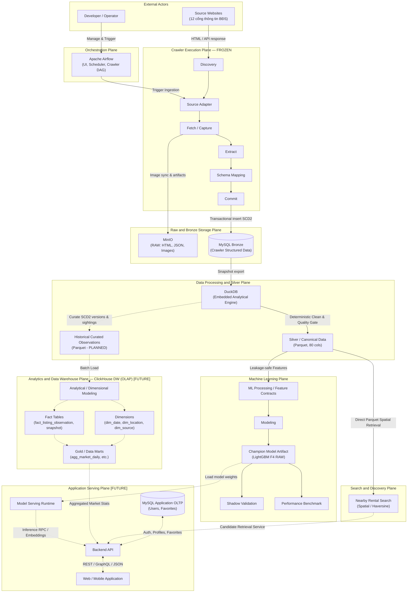

# Kiến Trúc Mục Tiêu Tổng Thể (Target Architecture Blueprint)

> **Plane:** Engineering
> **Trạng thái tài liệu:** AUTHORITATIVE
> **Trạng thái thành phần:** hỗn hợp — xem bảng
> **Kiểm chứng lần cuối:** 2026-10-06, commit `80d2c1f`
> **Liên quan:** [DATA_LAYERS_AND_LIFECYCLE.md](DATA_LAYERS_AND_LIFECYCLE.md), [GAP_AND_MIGRATION_PLAN.md](GAP_AND_MIGRATION_PLAN.md)

---

## 1. Căn Cứ Bản Vẽ Thiết Kế & Quy Ước Kiến Trúc

Kiến trúc mục tiêu của hệ thống RoomBeacon được quy định chính thức và chuẩn hóa theo bản vẽ thiết kế [**`overall-architecture.pdf`**](../../architecture/overall-architecture.pdf) (kèm hình ảnh xuất [**`overall-architecture.png`**](../../architecture/overall-architecture.png)). Bản vẽ này là **chuẩn thiết kế tối cao** và ưu tiên hơn mọi mô tả kiến trúc ban đầu.

### Quy ước Trực quan trong Bản vẽ

- **Khối và mũi tên nét liền (Solid lines):** Thành phần và luồng dữ liệu **đã hiện thực hóa (IMPLEMENTED)** trong mã nguồn và môi trường vận hành.
- **Khối và mũi tên nét đứt (Dashed lines):** Thành phần và luồng dữ liệu theo kế hoạch triển khai (**PLANNED**) hoặc định hướng mở rộng tương lai (**FUTURE**).

---

## 2. Sơ Đồ Kiến Trúc Tổng Thể (Target Architecture Diagram)

---

## 3. Bảng Đối Chiếu: Bản Vẽ ↔ Hiện Trạng Mã Nguồn & Trạng Thái

| Plane trong Bản vẽ | Thành phần trên Bản vẽ | Kiểu nét vẽ | Trạng thái kỹ thuật | Bằng chứng mã nguồn / Ghi chú |
|:---|:---|:---:|:---:|:---|
| **External Actors** | Source Websites | Nét liền | **IMPLEMENTED** | 12 website phòng trọ (`phongtro123`, `chothuephongtro`, `mogi`, `cafeland`, `nhatot`...). |
| | Developer / Operator | Nét liền | **IMPLEMENTED** | Vận hành viên quản trị qua Airflow UI và CLI scripts. |
| **Orchestration Plane** | Apache Airflow (UI, Scheduler, Crawler DAG) | Nét liền | **IMPLEMENTED** | Airflow 3.3.1 (4 Docker services); DAG `roombeacon_crawler` (9 tasks) + 5 DAGs phụ trợ. |
| **Crawler Execution Plane** | Source Adapter, Discovery, Fetch, Extract, Schema Mapping, Commit | Nét liền | **IMPLEMENTED & FROZEN** | `CrawlRunner`, `SourceRegistry`, 12 adapters. **Đóng băng toàn bộ**, không can thiệp logic. |
| **Raw and Bronze Storage** | MySQL Bronze (Crawler Structured Data) | Nét liền | **IMPLEMENTED** | `roombeacon_bronze` port 3307; 11 bảng chuẩn hóa SCD2 trong `schema.py`; đĩa host `data/mysql/` (~13GB). Xem [ADR-001](../adr/ADR-001.md). |
| | MinIO (RAW: HTML, JSON, Images) | Nét liền | **MIXED** | - **Images:** **IMPLEMENTED** (`roombeacon-assets` ~3.5GB). - **Raw HTML / JSON:** **PLANNED** (Code `persistence.py:61` ghi `minio bypassed`, JSON thô lưu tại `data/bronze/`). Cần sửa crawler khi unfreeze. |
| **Data Processing & Silver** | DuckDB (Embedded Analytical Engine) | Nét liền | **IMPLEMENTED** | `DuckDB` in-process engine nạp 13 required views (`views.py`). Xem [ADR-003](../adr/ADR-003.md). |
| | Silver / Canonical Data (Parquet) | Nét liền | **IMPLEMENTED** | `data/silver/rental_listings.parquet` (80 cột, 132,436 tin) do `notebooks.utils.silver_processing` và `SilverMaterializer` xuất bản. |
| | Historical Curated Observations | Nét đứt | **PLANNED** | Tầng lịch sử quan sát Parquet (SCD2 versions + sightings) do DuckDB sinh ra, làm nguồn cấp cho ClickHouse Data Warehouse. Đang chuẩn bị trên nhánh `feat/storage-plane-alignment`. |
| **Analytics & Data Warehouse** | ClickHouse Data Warehouse (OLAP): Analytical Modeling, Fact, Dims, Gold Data Marts | Nét đứt | **FUTURE** | Toàn bộ là **FUTURE**. ClickHouse làm OLAP Data Warehouse tách biệt; Gold là các Data Marts trong ClickHouse (`agg_market_daily`). Xem [ADR-004](../adr/ADR-004.md). |
| **Machine Learning Plane** | ML Processing, Modeling, Champion Model Artifact, Shadow, Benchmark | Nét liền | **IMPLEMENTED** *(Dạng notebook)* | Nghiên cứu hoàn chỉnh: Champion LightGBM F4 RAW khóa tại `data/modeling/`; Notebook 03 (Features), Notebook 04 (Benchmark V3), Notebook 06 (Shadow), Notebook 07 (Benchmark). |
| **Search and Discovery Plane** | Nearby Rental Search (Spatial / Haversine) | Nét liền | **IMPLEMENTED** *(Dạng prototype)* | Đọc trực tiếp từ Silver Parquet, tính khoảng cách Haversine vector hóa kết hợp fallback hành chính (Notebook 05). |
| **Application Serving Plane** | Model Serving, Backend API, MySQL Application OLTP, Web/Mobile App | Nét đứt | **FUTURE** | Toàn bộ là **FUTURE**. **MySQL ở tầng này CHỈ là Application OLTP (Users, Favorites)**, tuyệt đối không chứa listing. Xem [ADR-002](../adr/ADR-002.md). |

---

## 4. Bảng Phân Định Trách Nhiệm Từng Plane (Planes Responsibility Matrix)

| Mặt phẳng (Plane) | Trách nhiệm chính ("Làm") | Ranh giới nghiêm ngặt ("Không làm") |
|---|---|---|
| **External Actors** | Cung cấp dữ liệu web công khai; tương tác vận hành hệ thống. | Không can thiệp vào logic tính toán nội bộ. |
| **Orchestration Plane** | Lập lịch định kỳ, theo dõi trạng thái, kích hoạt tasks, quản lý tài nguyên Airflow. | Không chứa logic parse HTML nghiệp vụ; không xử lý tính toán dữ liệu lớn trong scheduler. |
| **Crawler Execution Plane (FROZEN)** | Bóc tách HTML/JSON đa nguồn, tuân thủ robots.txt, rate limiting, commit dữ liệu thô vào Bronze. | **Đóng băng**: Không sửa đổi mã nguồn crawler; không suy diễn toạ độ giả hay làm sạch ngữ nghĩa. |
| **Raw and Bronze Storage Plane** | Bảo toàn lịch sử quan sát thô bất biến SCD2 trong MySQL; lưu trữ nhị phân hình ảnh an toàn trên MinIO S3. | Không phục vụ ứng dụng người dùng cuối; không chạy truy vấn phân tích nặng trực tiếp trên MySQL Bronze. |
| **Data Processing & Silver Plane** | Chuyển đổi dữ liệu sạch xác định (Deterministic Cleaning), chuẩn hóa hành chính, xuất bản Silver Parquet 80 cột và Historical Curated Observations. | Không huấn luyện mô hình ML; không xóa bỏ bản ghi thô; không duy trì bảng vật lý nội bộ lâu dài trong DuckDB. |
| **Analytics & Data Warehouse Plane (FUTURE)** | Xây dựng mô hình dữ liệu đa chiều (Dimensional Modeling), lưu trữ Facts/Dims trong ClickHouse OLAP, phục vụ Gold Data Marts. | Không dùng Kafka/Debezium phức tạp; không can thiệp vào quá trình thu thập cào dữ liệu thời gian thực. |
| **Machine Learning Plane** | Thiết kế hợp đồng đặc trưng an toàn chống rò rỉ, huấn luyện & khóa Champion LightGBM, thẩm định shadow drift và benchmark hiệu năng. | Không huấn luyện lại mô hình trong runtime serving; không dùng nhãn tương lai; không chỉnh sửa file Silver Parquet. |
| **Search & Discovery Plane** | Tìm kiếm phòng thuê không gian dựa trên tọa độ tin cậy (Haversine) và fallback hành chính phường/quận đọc trực tiếp từ Silver Parquet. | Không suy diễn tọa độ giả từ tâm phường; không phụ thuộc vào cơ sở dữ liệu Serving trung gian. |
| **Application Serving Plane (FUTURE)** | Cung cấp REST/GraphQL API, quản lý tài khoản người dùng và tin yêu thích trên MySQL Application OLTP, phục vụ Web/Mobile. | **MySQL Serving KHÔNG lưu trữ listings hay bảng thống kê thị trường** (các dữ liệu này đọc từ Silver và ClickHouse Data Marts). |

---

## 5. Bảng Công Nghệ Lựa Chọn (Technology Stack)

| Hạng mục | Công nghệ | Vai trò trong Bản vẽ | Trạng thái |
|---|---|---|:---:|
| **Ngôn ngữ nền tảng** | Python `>= 3.11` | Crawler, Data Processing, ML Pipelines, Testing | **IMPLEMENTED** |
| **Điều phối Workflow** | Apache Airflow `3.3.1` | Orchestration Plane (Scheduler, Worker, DAGs) | **IMPLEMENTED** |
| **Lưu trữ Structured Bronze** | MySQL `8.4 LTS` | Raw & Bronze Storage Plane (`roombeacon_bronze` SCD2) | **IMPLEMENTED** |
| **Lưu trữ Object Storage** | MinIO (S3 API) | Raw & Bronze Storage Plane (Images: Implemented; HTML/JSON: Planned) | **MIXED** |
| **Xử lý Dữ liệu Nội bộ** | DuckDB `1.5.5` | Data Processing & Silver Plane (Embedded OLAP Engine) | **IMPLEMENTED** |
| **Định dạng Silver Canonical** | Apache Parquet | Silver Data Store (80 columns, Snappy compressed) | **IMPLEMENTED** |
| **Định dạng Curated History** | Apache Parquet | Historical Curated Observations Store | **PLANNED** |
| **Machine Learning Engine** | LightGBM, Scikit-Learn | Machine Learning Plane (Champion LightGBM F4 RAW) | **IMPLEMENTED** *(Notebook)* |
| **Tìm kiếm Không gian** | NumPy / Vectorized Haversine | Search & Discovery Plane (Đọc trực tiếp từ Silver) | **IMPLEMENTED** *(Notebook 05)* |
| **Data Warehouse Phân tích** | ClickHouse | Analytics & Data Warehouse Plane (OLAP, Facts, Dims, Gold Marts) | **FUTURE** |
| **Application OLTP** | MySQL `8.4 LTS` | Application Serving Plane (Users, Favorites) — Không chứa listings! | **FUTURE** |
| **Backend Serving Gateway** | FastAPI / Python Async | Application Serving Plane (REST API) | **FUTURE** |
| **Hạ tầng Ảo hóa** | Docker & Docker Compose | Runtime môi trường cục bộ và production deployment | **IMPLEMENTED** |
