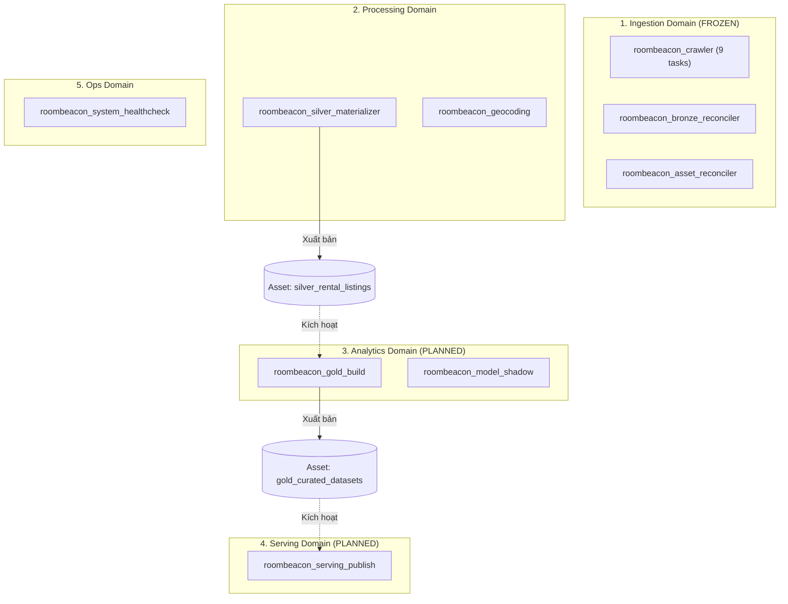

# Kiến Trúc Điều Phối Airflow (Airflow Architecture)

> **Plane:** Control
> **Trạng thái tài liệu:** AUTHORITATIVE
> **Trạng thái thành phần:** IMPLEMENTED
> **Kiểm chứng lần cuối:** 2026-10-06, commit `80d2c1f`
> **Liên quan:** [DAG_CATALOG.md](DAG_CATALOG.md), [../adr/ADR-005.md](../adr/ADR-005.md)

---

## 1. Môi Trường Vận Hành Airflow (Runtime Environment)

Hệ thống RoomBeacon sử dụng Apache Airflow 3 được container hóa qua Docker Compose với image tùy biến `roombeacon-airflow-custom:3.3.1`.

Cấu hình phân bổ dịch vụ trong [`docker-compose.yml:365-690`](../../docker-compose.yml#L365-L690):
- **`roombeacon-airflow-scheduler`:** Quản lý vòng đời task, lập lịch và giám sát thực thi.
- **`roombeacon-airflow-api-server`:** Cung cấp Web UI và API quản trị (cổng host `127.0.0.1:8080`).
- **`roombeacon-airflow-dag-processor`:** Phân tích cú pháp tệp DAG độc lập, cách ly tiến trình biên dịch DAG khỏi Scheduler.
- **`roombeacon-airflow-triggerer`:** Hỗ trợ các async / deferrable triggers.
- **Cơ sở dữ liệu Metadata:** Sử dụng MySQL 8.4 container riêng biệt (`roombeacon-mysql-airflow`, cổng host `3308`, cấu hình tại `.env.example:55-75`), tách biệt hoàn toàn với cơ sở dữ liệu cào dữ liệu `roombeacon-mysql-bronze`.

---

## 2. Mô Hình Phân Tách Domain DAGs và Airflow Assets

Để tránh mô hình "Mega-DAG" cồng kềnh, hệ thống phân chia các luồng điều phối thành 5 Domain:

### Quy định Đóng băng Ingestion DAG (`roombeacon_crawler` — FROZEN)
- DAG [`roombeacon_crawler`](../../airflow/dags/crawler/roombeacon_crawler.py#L174) hiện đang chạy ổn định với chuỗi 9 tasks hoàn chỉnh. Theo quyết định của Chủ dự án, **DAG này được gắn nhãn ĐÓNG BĂNG (FROZEN)** và không bị can thiệp logic.
- Hai task `07_analytics_refresh_duckdb` và `08_assets_sync_minio` được giữ nguyên vị trí trong DAG cào hiện tại.
- **Tùy chọn tương lai (FUTURE OPTION):** Việc bổ sung Airflow Asset outlets (như `Asset("bronze_mysql")`) cho DAG cào và tách riêng task đồng bộ ảnh/views chỉ là hướng mở rộng tương lai và cần được Chủ dự án duyệt riêng.

---

## 3. Quản Lý Tài Nguyên & Pools trong Airflow

Để ngăn chặn xung đột truy cập đồng thời vào các tài nguyên đơn luồng, Airflow thiết lập các Pools quản lý:

1. **`duckdb_analytics_pool` (Slots: 1):**
   - Được khởi tạo tự động trong `docker-compose.yml:702`.
   - Giới hạn duy nhất 1 worker truy cập vào tệp catalog hoặc bootstrap view DuckDB tại một thời điểm, ngăn chặn lỗi khóa file `Database lock error`.
2. **`default_pool` (Slots: 128):**
   - Phục vụ các tác vụ cào dữ liệu song song đa nguồn thông qua Dynamic Task Mapping (`04_crawl_execute_source`).
