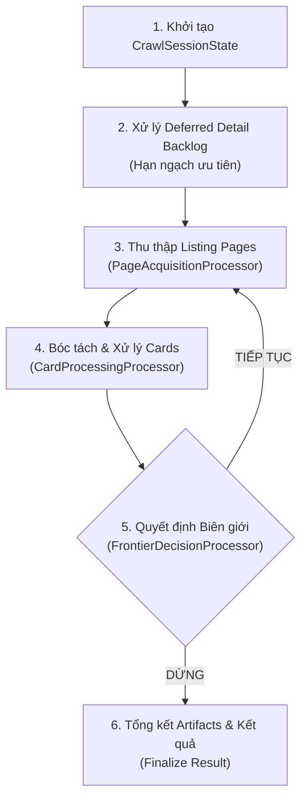

# Kiến Trúc Lõi Thu Thập Dữ Liệu (Crawler Architecture)

> **Plane:** Ingestion
> **Trạng thái tài liệu:** AUTHORITATIVE
> **Trạng thái thành phần:** IMPLEMENTED
> **Kiểm chứng lần cuối:** 2026-10-06, commit `80d2c1f`
> **Liên quan:** [SOURCE_ADAPTERS.md](SOURCE_ADAPTERS.md), [EXTRACTION_CONTRACT.md](EXTRACTION_CONTRACT.md)

---

## 1. Phong Cách Kiến Trúc & Ranh Giới (Architectural Boundary)

Crawler Engine của RoomBeacon được thiết kế theo mô hình **Clean Architecture** kết hợp **Hexagonal Ports & Adapters**:
- **Tính độc lập:** Mã nguồn crawler hoàn toàn không phụ thuộc vào Apache Airflow hay framework giao diện. Airflow chỉ đóng vai trò bộ lập lịch bên ngoài gọi vào application facade.
- **Không đảm nhận việc của downstream:** Crawler chịu trách nhiệm thu thập và bóc tách dữ liệu sát nguồn nhất có thể (Source-Near Raw/Bronze Extraction). Crawler **tuyệt đối không làm sạch ngữ nghĩa** (không imputation, không chuẩn hóa NLP địa chỉ, không suy đoán giá) — các công việc này thuộc về Processing Plane (Tầng Silver).
- **Ranh giới đóng băng (FROZEN):** Lõi Crawler và các pipeline bóc tách hiện đang vận hành ổn định trong sản xuất và được đóng băng, không thay đổi cấu trúc mã nguồn.

---

## 2. Vòng Đời Thực Thi của `CrawlRunner`

`CrawlRunner` ([`crawler/src/roombeacon_crawler/pipeline/crawl_runner.py:182`](../../crawler/src/roombeacon_crawler/pipeline/crawl_runner.py#L182)) đóng vai trò Façade điều phối toàn bộ vòng đời của một phiên cào:

---

## 3. Các Processors Chuyên Trách

Để tránh việc phình to mã nguồn vào một file duy nhất, các trách nhiệm được phân rã thành các bộ xử lý chuyên biệt trong thư mục [`crawler/src/roombeacon_crawler/application/crawl/`](../../crawler/src/roombeacon_crawler/application/crawl):

| Processor | Trách nhiệm chính ("Làm") | Ranh giới nghiêm ngặt ("Không làm") |
|---|---|---|
| **`CrawlSessionState`** | Quản lý trạng thái có thể biến đổi (mutable state) của đúng một phiên chạy: số trang đã cào, số cards, số details, danh sách URL đã duyệt, bộ đếm lỗi. | Không tạo HTTP client và không truy cập cơ sở dữ liệu. |
| **`DeferredDetailProcessor`** | Phân bổ ngân sách cào chi tiết công bằng giữa tin mới phát hiện và hàng đợi tin cũ tồn đọng (`deferred detail backlog`). Áp dụng TTL để không cào lại tin chi tiết chưa đổi. | Không thu thập trang danh mục (listing pages) và không quyết định biên giới cào. |
| **`PageAcquisitionProcessor`** | Xây dựng URL mục tiêu, gọi Fetcher (HTTP hoặc Browser), phân loại phản hồi (200 OK, chặn, rỗng) và gọi listing parser của adapter. | Không xử lý logic bóc tách card và không đưa ra quyết định dừng cào. |
| **`CardProcessingProcessor`** | Định danh tin (`platform_post_id`), kiểm tra trùng lặp trong phiên, tính toán hash, quyết định bóc tách chi tiết ngay hoặc đưa vào hàng đợi deferred backlog. | Không thực hiện request tải trang danh mục và không ghi checkpoint. |
| **`FrontierDecisionProcessor`** | Đánh giá điều kiện dừng (Frontier Decision): phát hiện tin đã biết liên tiếp (`stop_after_known_pages`), đạt giới hạn số trang (`max_pages`), hoặc hết tin danh mục. | Không thực thi I/O mạng. |
| **`CrawlExecutionOptions`** | Tổng hợp các cấu hình từ CrawlSeed, CrawlPlan, DAG params và CrawlerSettings thành các giới hạn bất biến cho phiên chạy. | Không xử lý runtime I/O. |

---

## 4. Cơ Chế Xử Lý Trang Chi Tiết Trì Hoãn (Deferred Detail Backlog)

Các trang web bất động sản thường áp dụng giới hạn tần suất truy vấn nghiêm ngặt trên trang chi tiết (Detail Pages). Nếu crawler tải toàn bộ trang chi tiết của hàng ngàn card trong một lượt cào danh mục, website nguồn sẽ kích hoạt cơ chế chặn IP (Cloudflare Challenge / 429 Too Many Requests).

### Chiến lược Backlog thông minh:
1. **Thu thập danh mục nhanh:** Khi cào trang danh sách, crawler chỉ bóc tách các trường có sẵn trên card và đẩy URL trang con vào hàng đợi bền vững `Deferred Detail Queue` trên đĩa host (`data/state/deferred_details/`).
2. **Hạn ngạch tiến triển (Progressive Quota):** Mỗi phiên cào được cấp một hạn ngạch cào chi tiết giới hạn (`max_details_per_run`, ví dụ 40 tin với NhaTroVN, 1500 tin với PhongTro123, 1000 tin với ChoThuePhongTro/Mogi).
3. **Cơ chế TTL (Time-To-Live):** Các tin đăng chi tiết đã cào thành công được gắn mốc thời gian. Nếu tin đăng trên card không thay đổi tiêu đề hoặc giá, trang chi tiết sẽ không bị tải lại cho đến khi hết hạn TTL.
