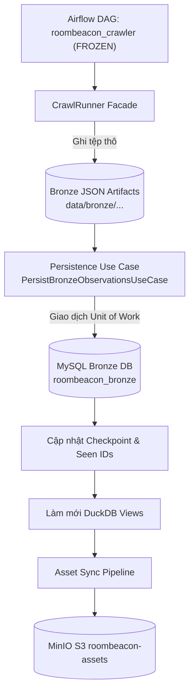

# Luồng Thực Thi Từ Cào Dữ Liệu Đến Lưu Trữ (Crawl to Storage Flow)

> **Plane:** Ingestion
> **Trạng thái tài liệu:** AUTHORITATIVE
> **Trạng thái thành phần:** IMPLEMENTED
> **Kiểm chứng lần cuối:** 2026-10-06, commit `80d2c1f`
> **Liên quan:** [CRAWLER_ARCHITECTURE.md](CRAWLER_ARCHITECTURE.md), [../03-storage/BRONZE_MYSQL.md](../03-storage/BRONZE_MYSQL.md)

---

## 1. Sơ Đồ Tổng Thể Luồng Thu Thập & Lưu Trữ

*(Lưu ý: Sơ đồ trên đã sửa lỗi trùng node ID trong tài liệu cũ, phân định rõ ràng giữa node Airflow và node Asset Sync).*

---

## 2. Chi Tiết Từng Giai Đoạn Thực Thi (Step-by-Step Execution Trace)

### Giai đoạn 1: Lập Kế Hoạch & Kiểm Tra Điều Kiện (Planning & Qualification)
1. Task `01_config_load_sources`: Quét `SourceRegistry`, lấy danh sách các seed đã đăng ký từ 12 adapters.
2. Task `02_config_plan_crawls`: So sánh thời điểm cào gần nhất trong checkpoint với chu kỳ `interval_minutes` của từng seed để chọn các nguồn đến hạn.
3. Task `03_crawl_check_eligibility`: Thực thi Dynamic Task Mapping song song cho từng plan:
   - Kiểm tra `robots.txt` qua `RobotsPolicy`.
   - Kiểm tra trạng thái sức khỏe circuit breaker qua `SourceHealthPolicy`.
   - Kiểm tra cú pháp và rào chắn an toàn SSRF qua `URLValidator`.

### Giai đoạn 2: Thu Thập & Sinh Tệp Thô (Execution & Artifact Creation)
4. Task `04_crawl_execute_source`:
   - Kích hoạt `CrawlRunner` cho từng nguồn được duyệt.
   - Xử lý hàng đợi `deferred detail backlog` tồn đọng theo hạn ngạch `max_details_per_run`.
   - Thu thập các trang danh mục `listing_page` (qua HTTPX hoặc Playwright).
   - Bóc tách thẻ bài đăng, trích xuất toạ độ nhúng nếu có.
   - Ghi toàn bộ kết quả phiên cào vào đĩa máy chủ:
     - `data/bronze/<source>/<YYYY-MM-DD>/run_<id>/listings.json`
     - `data/bronze/<source>/<YYYY-MM-DD>/run_<id>/metadata.json`

### Giai đoạn 3: Lưu Trữ Quan Hệ Bất Biến (Relational Persistence & Unit of Work)
5. Task `05_storage_save_bronze`:
   - Tách rời hoàn toàn khỏi tiến trình cào mạng: Đọc trực tiếp tệp `listings.json` từ đĩa host.
   - Mở một Transaction duy nhất (`BEGIN TRANSACTION`) trên MySQL Bronze qua `MySQLTransactionManager`.
   - Khởi tạo hoặc lấy ID sàn (`platforms`).
   - Upsert thực thể gốc ổn định vào `rental_posts` theo khóa duy nhất `(platform_id, platform_post_id)`.
   - Chèn bản ghi quan sát phiên vào `rental_post_versions` theo khóa duy nhất `(rental_post_id, crawl_run_id)`.
   - Chèn các bản ghi con: `post_prices`, `post_addresses`, `post_details`, `post_images`, `post_amenities`, `post_fees`, `post_contacts`, `post_attributes`.
   - Thực thi `COMMIT TRANSACTION`. Nếu có bất kỳ lỗi nào, toàn bộ transaction bị `ROLLBACK`, đảm bảo không bao giờ sinh ra dữ liệu mồ côi.

### Giai đoạn 4: Checkpoint & Hậu Xử Lý (Post-Crawl Pipeline)
6. Task `06_state_update_checkpoint`:
   - Ghi nhận mốc thời gian thành công vào `data/state/checkpoints/<source>/<target_id>.json`.
   - Cập nhật danh sách ID đã thấy (`seen_ids`) để phục vụ nhận diện bài đăng lặp lại ở phiên kế tiếp.
7. Task `07_analytics_refresh_duckdb`: Khởi tạo và làm mới 13 DuckDB Analytical Views.
8. Task `08_assets_sync_minio`: Kích hoạt một lượt tải ảnh công bằng (Fair Scheduling) từ bảng `post_images` vào MinIO.
9. Task `09_report_run_summary`: Tập hợp số liệu tổng kết toàn bộ phiên cào từ XCom và ghi log giám sát.
