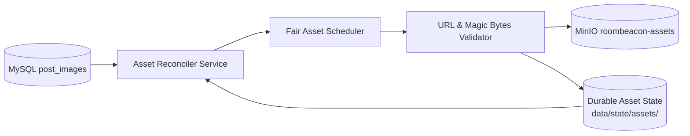

# Đường Ống Tài Nguyên Hình Ảnh (Asset Pipeline Architecture)

> **Plane:** Storage
> **Trạng thái tài liệu:** AUTHORITATIVE
> **Trạng thái thành phần:** IMPLEMENTED
> **Kiểm chứng lần cuối:** 2026-10-06, commit `80d2c1f`
> **Liên quan:** [OBJECT_STORAGE_MINIO.md](OBJECT_STORAGE_MINIO.md), [../07-engineering/SECURITY.md](../07-engineering/SECURITY.md)

---

## 1. Mục Tiêu & Cơ Chế Hoạt Động Tổng Thể

### Tại sao cần tách rời Asset Pipeline?
1. **Không nhồi nhét dữ liệu nhị phân vào Database hoặc Parquet:** MySQL chỉ lưu URL chuỗi và thứ tự ảnh; Parquet chỉ lưu URL. Dữ liệu nhị phân thuộc về MinIO.
2. **Không cào lại trang web (No Recrawl):** Bảng `post_images` trong MySQL Bronze đã lưu giữ đầy đủ danh sách URL. Asset Reconciler trực tiếp truy vấn danh sách này và tải bù mà không cần crawler quét lại trang chi tiết.
3. **Cách ly lỗi (Decoupled Failure Boundary):** Lỗi tải ảnh hoặc độ trễ mạng tải ảnh từ CDN bên ngoài không làm tắc nghẽn luồng cào dữ liệu chính.

---

## 2. Bảng Kiểm Kê & Hệ Thức Bất Biến (Backlog Accounting)

Để đảm bảo số liệu kiểm kê không bị sai lệch, Asset Pipeline định nghĩa 5 trạng thái vòng đời tách biệt:

- **`TOTAL_METADATA`**: Tổng số hàng bản ghi hình ảnh trong bảng `post_images` của nguồn đó.
- **`STORED`**: Đã tải và lưu trữ thành công trên MinIO (`status == SUCCESS`).
- **`ACTIONABLE_PENDING`**: Các URL dạng HTTP/HTTPS hợp lệ chưa được lưu trên MinIO và không nằm trong trạng thái lỗi vĩnh viễn (sẵn sàng để tải).
- **`RETRYABLE_FAILED`**: Các bản ghi gặp lỗi mạng/timeout tạm thời với số lần thử `attempt_count < max_retries`.
- **`TERMINAL`**: Các bản ghi không thể tải vĩnh viễn (Data URI base64 placeholder, đường dẫn tương đối `/images/...`, lỗi HTTP 404/410, Cloudflare Challenge, magic bytes không hợp lệ).

### Hệ thức bất biến kiểm kê (Accounting Invariant):
$$\text{Total Metadata} = \text{Stored} + \text{Actionable Pending} + \text{Retryable Failed} + \text{Terminal}$$

---

## 3. Điều Phối Đa Nguồn Công Bằng (Fair Multi-Source Scheduling)

### Vấn đề của cách tiếp cận cũ:
Trước đây, câu lệnh chọn ảnh sử dụng `ORDER BY id DESC LIMIT 1000`. Do một số nguồn có lượng ảnh chèn mới rất lớn với ID cao, toàn bộ hạn ngạch của mỗi batch bị nguồn đó chiếm trọn, khiến các nguồn khác bị **bỏ đói tài nguyên (starvation)**.

### Giải pháp FairAssetScheduler:
1. **Phân bổ hạn ngạch cơ sở:** Trong mỗi chu kỳ (ví dụ batch 50 ảnh), hệ thống xác định $N_{\text{active}}$ nguồn đang có ảnh cần tải. Hạn ngạch cơ sở cho mỗi nguồn: $Q = \lfloor B / N_{\text{active}} \rfloor$.
2. **Cơ chế tràn hạn ngạch động (Dynamic Spillover):** Nếu một nguồn không có đủ ảnh để lấp đầy hạn ngạch $Q$, các vị trí trống chưa sử dụng sẽ tự động tràn và chia đều cho các nguồn còn lại có nhu cầu cao hơn.
3. **Thứ tự xử lý nội bộ nguồn:** Trong từng nguồn cụ thể, các ảnh được truy vấn theo thứ tự **`ORDER BY id ASC`** (ảnh cũ nhất được xử lý trước), giúp giải phóng dần tồn đọng lịch sử và chống lão hóa bản ghi.

---

## 4. Chuỗi Kiểm Thực An Toàn Nghiêm Ngặt (Download & Validation)

Mọi tệp hình ảnh trước khi ghi vào MinIO bắt buộc phải vượt qua 5 tầng kiểm tra an toàn:
1. **Kiểm tra giao thức:** Chỉ chấp nhận `http://` hoặc `https://`.
2. **Chống SSRF:** Chặn IP nội bộ, loopback và cloud metadata qua `URLValidator`.
3. **Kiểm tra mã phản hồi HTTP:** Chỉ chấp nhận `200 OK`. Lỗi 400/403/404/410 $\rightarrow$ `TERMINAL`. Lỗi 429/5xx/timeout $\rightarrow$ `RETRYABLE`.
4. **Phát hiện HTML/JSON giả mạo:** Header chứa `text/html` hoặc `application/json` (Cloudflare Challenge) $\rightarrow$ `TERMINAL`.
5. **Kiểm tra Magic Bytes (Binary Fingerprint):** Nhận diện đúng chữ ký nhị phân ở đầu tệp của các định dạng ảnh hợp lệ:
   - `JPEG`: `FF D8 FF`
   - `PNG`: `89 50 4E 47 0D 0A 1A 0A`
   - `WebP`: `52 49 46 46 ... 57 45 42 50`
   - `GIF`: `47 49 46 38`
6. **Giới hạn dung lượng:** Từ chối tệp rỗng (0 bytes) hoặc vượt quá **15 MiB**.

---

## 5. Mô Hình Trạng Thái Bền Vững (Durable State Model)

Trạng thái xử lý của từng tài nguyên ảnh được lưu trữ trên đĩa máy chủ tại:
`data/state/assets/{source}/{asset_id}.json`

Nhờ đó, khi container Airflow bị khởi động lại, tiến trình đối soát có khả năng khôi phục tức thì mà không cần quét lại từ đầu, bỏ qua 100% các ảnh đã có trạng thái `SUCCESS` trên MinIO.
