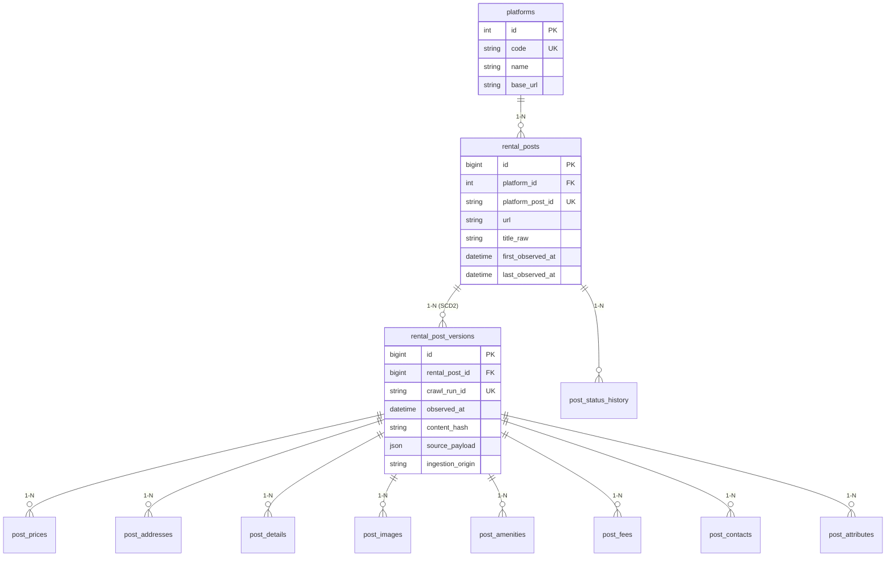

# Lưu Trữ Quan Hệ MySQL Bronze (Bronze MySQL Architecture)

> **Plane:** Storage
> **Trạng thái tài liệu:** AUTHORITATIVE
> **Trạng thái thành phần:** IMPLEMENTED
> **Kiểm chứng lần cuối:** 2026-10-06, commit `80d2c1f`
> **Liên quan:** [STORAGE_OVERVIEW.md](STORAGE_OVERVIEW.md), [../adr/ADR-001.md](../adr/ADR-001.md)

---

## 1. Lược Đồ Cơ Sở Dữ Liệu Thực Tế (Real Schema Design)

Lược đồ cơ sở dữ liệu MySQL Bronze được định nghĩa chuẩn hóa trong mã nguồn tại [`crawler/src/roombeacon_crawler/infrastructure/mysql/schema.py:9-183`](../../crawler/src/roombeacon_crawler/infrastructure/mysql/schema.py#L9-L183). 

*(Lưu ý: Các tên bảng cũ như `raw_observations`, `raw_prices`, `raw_locations`, `raw_amenities` trong tài liệu trước đây là hoàn toàn sai lệch và đã bị xóa bỏ)*.

### Chi tiết các bảng thực tế:
1. **`platforms`:** Danh mục các sàn bất động sản (`code`, `name`, `base_url`). Khóa duy nhất: `uk_platform_code (code)`.
2. **`rental_posts`:** Thực thể gốc đại diện cho bài đăng ổn định trên website nguồn. Khóa duy nhất: `uk_platform_post (platform_id, platform_post_id)`. Lưu mốc thời gian thấy lần đầu (`first_observed_at`) và lần gần nhất (`last_observed_at`).
3. **`rental_post_versions`:** Bảng lịch sử quan sát SCD Type 2. Khóa duy nhất: `uk_post_run (rental_post_id, crawl_run_id)`. Mỗi phiên cào ghi nhận một phiên bản trạng thái của bài đăng kèm mã băm `content_hash` và JSON `source_payload`.
4. **Các bảng thành phần con (Child Observation Tables)** liên kết theo khóa ngoại `rental_post_version_id`:
   - **`post_prices`:** `price_raw`, `price_amount`, `currency`, `period`.
   - **`post_addresses`:** `province_text`, `district_text`, `ward_text`, `street_text`, `house_number_text`, `full_address_text`, `latitude`, `longitude`.
   - **`post_details`:** `area_raw`, `area_value`, `description_raw`, `property_type_raw`, `furnishing_raw`, `deposit_raw`, `posted_at_raw`, `seller_name_raw`, `seller_phone_raw`, `attributes` (JSON).
   - **`post_images`:** `image_url`, `position`.
   - **`post_amenities`:** `amenity_name`.
   - **`post_fees`:** `fee_name`, `fee_raw`, `fee_amount`.
   - **`post_contacts`:** `contact_name`, `contact_phone`, `contact_type`.
   - **`post_attributes`:** `attribute_key`, `attribute_value`.
   - **`post_status_history`:** `status`, `changed_at`, `reason` (liên kết trực tiếp theo `rental_post_id`).

---

## 2. Ranh Giới Giao Dịch & Tính Idempotency (Unit of Work)

- **Nguyên tắc Unit of Work:** Toàn bộ quá trình ghi nhận một danh sách bài đăng từ `listings.json` vào MySQL được bọc trong một khối giao dịch duy nhất do `MySQLTransactionManager` điều phối.
- **Không tự ý commit:** Các repository đơn lẻ (`PlatformRepository`, `RentalPostRepository`, `ObservationRepository`, `PostChildrenRepository`) tuyệt đối không tự commit. Nếu xảy ra lỗi ở bất kỳ bảng con nào, toàn bộ transaction bị rollback, bảo đảm không tạo ra dữ liệu rác.
- **Tính Idempotent:** Khi một phiên cào bị chạy lại (retry):
  - `rental_posts` được upsert (cập nhật `last_observed_at`).
  - `rental_post_versions` bắt lỗi trùng `(rental_post_id, crawl_run_id)` (mã lỗi MySQL 1062) và trả về ID bản ghi hiện có mà không chèn trùng lặp.

---

## 3. Kế Hoạch Kiểm Soát Tăng Trưởng Dung Lượng (Theo ADR-001)

Dung lượng `data/mysql` hiện đạt **~13.0 GB** (theo báo cáo của chủ dự án ngày 2026-10-06).

### Nguyên nhân chính nghi vấn:
Mã nguồn [`observation_repository.py:63-74`](../../crawler/src/roombeacon_crawler/infrastructure/mysql/repositories/observation_repository.py#L63-L74) thực hiện chèn bản ghi version mới cho mỗi phiên cào bất kể `content_hash` có thay đổi hay không, kết hợp với tần suất cào một số nguồn đặt chu kỳ ngắn 5 phút (`interval_minutes = 5`).

### Các số đo định lượng cần bổ sung trước khi sửa đổi:
1. Số version trung bình trên mỗi bài đăng;
2. Số dòng bảng con trung bình trên mỗi version;
3. Kích thước trung bình của trường `source_payload` JSON;
4. Phân rã dung lượng `data/mysql` thành Data, Index, Binlog, Undo/Redo và DB test.

### Kế hoạch giải pháp đang triển khai trên nhánh `feat/storage-plane-alignment` (PLANNED):
1. **`rental_post_sightings` (PLANNED):** Thêm bảng ghi nhận số lần quan sát lặp lại không đổi nội dung, chỉ tăng counter hoặc cập nhật timestamp thay vì ghi đè version mới.
2. **Cơ chế Version-on-Change (PLANNED):** Chỉ chèn bản ghi mới vào `rental_post_versions` và bảng con khi `content_hash` thực sự thay đổi.
3. **Con trỏ thay cho `source_payload` (PLANNED):** Đưa chuỗi JSON lớn ra ngoài MySQL, chỉ lưu URI con trỏ tới JSON artifact trên đĩa host hoặc MinIO.
4. **DAG `roombeacon_raw_archiver` (PLANNED):** Nén và đóng gói JSON artifacts lên MinIO RAW có chính sách dọn dẹp đĩa host.
5. **DAG `roombeacon_curated_observations` (PLANNED):** Sử dụng DuckDB để quét MySQL Bronze và kết xuất tệp Parquet Historical Curated Observations, làm tiền đề để dọn dẹp (purge) version cũ khỏi MySQL và nạp vào ClickHouse Data Warehouse.
