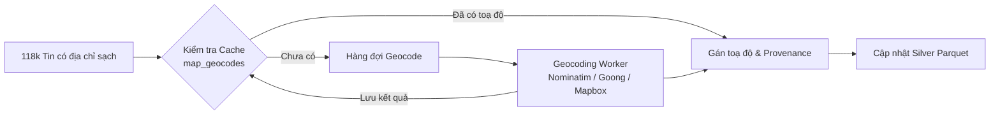

# Làm Giàu Toạ Độ Địa Lý (Geocoding Enrichment Pipeline)

> **Plane:** Processing
> **Trạng thái tài liệu:** AUTHORITATIVE
> **Trạng thái thành phần:** PARTIAL
> **Kiểm chứng lần cuối:** 2026-10-06, commit `80d2c1f`
> **Liên quan:** [ADDRESS_AND_ADMIN_NORMALIZATION.md](ADDRESS_AND_ADMIN_NORMALIZATION.md), [../adr/ADR-006.md](../adr/ADR-006.md)

---

## 1. Hiện Trạng Dữ Liệu Không Gian Trong Tầng Silver

Phân tích trên tập dữ liệu Canonical Silver Parquet ([`data/silver/rental_listings.parquet`](../../data/silver/rental_listings.parquet)) cho thấy sự mất cân đối nghiêm trọng:

- **Có chuỗi địa chỉ văn bản (`full_address_text`):** **118,864 tin** (89.7% tổng số tin).
- **Có toạ độ GPS đáng tin cậy (`has_trusted_coordinate = TRUE`):** **Chỉ 2,277 tin (~1.7%)**.
- **Nguyên nhân:** Các sàn bất động sản Việt Nam thường không cung cấp toạ độ chính xác trên HTML, hoặc chỉ nhúng bản đồ ghim ở trung tâm quận.

> **Hệ quả:** 98.3% tin đăng hiện tại không thể tham gia tìm kiếm trực tiếp theo bán kính Haversine mà phải sử dụng cơ chế dự phòng (Fallback) theo Phường hoặc Quận.

---

## 2. Cách Ly Toạ Độ Mẫu (Template Hotspots)

Một số sàn bất động sản sử dụng toạ độ mặc định cho toàn bộ tin đăng thuộc hệ thống. Nếu không lọc bỏ, hàng ngàn căn nhà ở các quận khác nhau sẽ bị gom về cùng một toạ độ duy nhất.

Cơ chế cách ly trong [`analytics/duckdb/sql/latest_posts.sql:64-84`](../../analytics/duckdb/sql/latest_posts.sql#L64-L84):
- **CafeLand:** Toạ độ mẫu `(10.876248, 106.660338)` tự động chuyển về `NULL`.
- **NhaTroVN:** Toạ độ mẫu `(10.6979911, 106.7168188)` tự động chuyển về `NULL`.

Ngoài ra, hàm [`audit_coordinate_trust`](../../notebooks/utils/location_analysis.py) tự động phát hiện các cặp toạ độ lặp lại nhiều lần nhưng gắn với các chuỗi địa chỉ chi tiết khác nhau và đánh dấu `coordinate_quality_status = UNTRUSTED`.

---

## 3. Kiến Trúc Geocoding Worker & Bảng Cache `map_geocodes`

Để giải quyết bài toán thiếu hụt toạ độ mà không vi phạm nguyên tắc an toàn, hệ thống thiết kế quy trình **Geocoding Enrichment**:

### Lược đồ bảng cache `map_geocodes` (MySQL Bronze):
Được định nghĩa trong [`crawler/src/roombeacon_crawler/infrastructure/mysql/repositories/geocode_repository.py:33`](../../crawler/src/roombeacon_crawler/infrastructure/mysql/repositories/geocode_repository.py#L33):
- `address_hash` (Khóa chính): Mã băm SHA-256 của chuỗi địa chỉ sạch.
- `address_text`: Chuỗi địa chỉ đầu vào.
- `provider`: Nhà cung cấp geocode (`nominatim`, `goong`, `google_maps_embed`).
- `latitude`, `longitude`: Toạ độ địa lý trả về.
- `precision_level`: Độ chính xác (`ROOFTOP`, `STREET`, `ADMINISTRATIVE`).
- `raw_response`: Toàn bộ JSON phản hồi từ API nhà cung cấp để kiểm toán.

### Minh bạch nguồn gốc toạ độ (Provenance Tracking):
Mọi toạ độ được làm giàu bắt buộc phải ghi nhận đầy đủ:
- `map_provider`: Tên dịch vụ cung cấp.
- `best_address_source`: Nguồn gốc chuỗi địa chỉ được dùng để geocode (`DETAIL_PAGE`, `LISTING_PAGE`, `INHERITED`).
- `coordinate_trust_reason`: Lý do tin cậy hoặc bị từ chối.

---

## 4. Mục Tiêu Nâng Cấp (Target Goal — PLANNED)

Nâng cấp DAG [`roombeacon_geocoding`](../../airflow/dags/enrichment/roombeacon_geocoding.py) từ mức thử nghiệm (10 records/run) lên chế độ xử lý theo đợt có kiểm soát hạn ngạch API, đặt mục tiêu:
$$\text{Tỷ lệ phủ toạ độ tin cậy } (\text{Coverage}): 1.7\% \longrightarrow > 80\%$$
tận dụng tối đa 118,864 chuỗi địa chỉ văn bản đã được bóc tách thành công.
