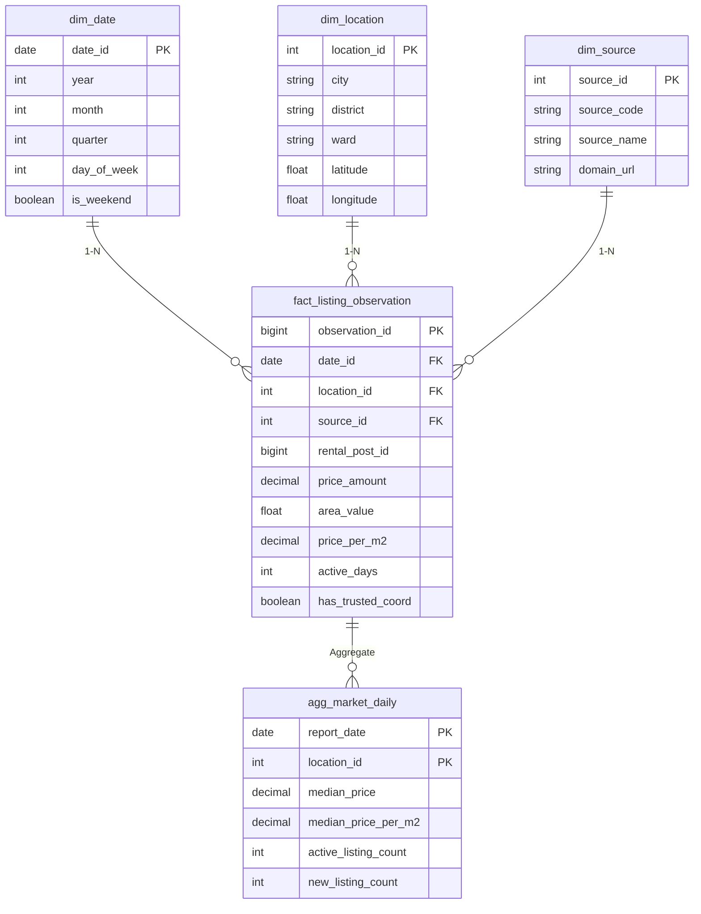

# Kho Dữ Liệu Phân Tích & Gold Data Marts (Analytics & Data Warehouse Plane)

> **Plane:** Analytics & ML
> **Trạng thái tài liệu:** AUTHORITATIVE
> **Trạng thái thành phần:** hỗn hợp — xem bảng
> **Kiểm chứng lần cuối:** 2026-10-06, commit `80d2c1f`
> **Liên quan:** [PRICE_MODEL.md](PRICE_MODEL.md), [ENTITY_RESOLUTION.md](ENTITY_RESOLUTION.md)

---

## 1. Vai Trò Kiến Trúc của Analytics & Data Warehouse Plane

Theo bản vẽ chuẩn hóa [**`overall-architecture.pdf`**](../../architecture/overall-architecture.pdf), toàn bộ **Analytics and Data Warehouse Plane** được thể hiện bằng đường nét đứt, mang trạng thái **FUTURE**:

- **Động cơ phân tích chủ đạo:** **ClickHouse Data Warehouse (OLAP)**.
- **Nguồn cấp dữ liệu:** Nhận dữ liệu nạp theo lô (Batch Load) từ các tệp Parquet **Historical Curated Observations** do DuckDB sinh ra tại *Data Processing and Silver Plane*.
- **Mục tiêu:** Cung cấp hạ tầng phân tích đa chiều tốc độ cao, hỗ trợ truy vấn đồng thời quy mô lớn phục vụ các bảng điều khiển thị trường (Market Analytics Dashboards) và Backend API mà không gây nghẽn máy chủ.

---

## 2. Định Nghĩa Tầng Gold Theo Chuẩn Kiến Trúc Mới

> [!IMPORTANT]
> **Khẳng định quy chuẩn:**  
> **Gold trong RoomBeacon KHÔNG PHẢI là các tệp Parquet tĩnh lưu dưới thư mục `data/gold/`.**  
> Theo bản vẽ kiến trúc, **Gold chính là các Data Marts được xây dựng bên trong ClickHouse Data Warehouse (OLAP)** (ví dụ: `agg_market_daily`, etc.).

---

## 3. Mô Hình Dữ Liệu Đa Chiều (Dimensional Modeling)

Analytics & Data Warehouse Plane tổ chức dữ liệu theo mô hình hình sao (Star Schema) tối ưu hóa cho truy vấn phân tích:

### Chi tiết các thực thể:
1. **Fact Tables:**
   - **`fact_listing_observation`:** Bảng sự kiện ghi nhận từng lần quan sát tin đăng với các thước đo định lượng: giá thuê (`price_amount`), diện tích (`area_value`), đơn giá trên mét vuông (`price_per_m2`), tuổi thọ tin (`active_days`).
   - **`fact_listing_snapshot`:** Lưu trữ ảnh chụp nhanh định kỳ theo tuần/tháng để phục vụ phân tích xu hướng dài hạn.
2. **Dimension Tables:**
   - **`dim_date`:** Chiều thời gian (ngày, tháng, quý, năm, cuối tuần).
   - **`dim_location`:** Chiều địa lý (Tỉnh/Thành phố, Quận/Huyện, Phường/Xã chuẩn hóa theo Gazetteer).
   - **`dim_source`:** Chiều nguồn dữ liệu (12 sàn thu thập).
3. **Gold / Data Marts (`agg_market_daily`, etc.):**
   - Các bảng tổng hợp sẵn (Aggregations / Materialized Views) trong ClickHouse.
   - Tính toán sẵn giá trung vị (median), phân vị 25% - 75%, mật độ nguồn cung phòng trọ theo từng phường/quận theo ngày.
   - Cung cấp dữ liệu tức thì cho Backend API khi người dùng tra cứu thông tin thị trường.

---

## 4. Điều Kiện Kích Hoạt Triển Khai (Xem Chi Tiết Tại ADR-004)

Tầng ClickHouse Data Warehouse sẽ được chuyển từ trạng thái **FUTURE** sang **PLANNED / IMPLEMENTED** khi:
1. Dữ liệu **Historical Curated Observations** (Parquet) tích lũy đủ lớn qua nhiều tháng cào.
2. Xuất hiện nhu cầu truy vấn phân tích đồng thời từ Backend API cho nhiều người dùng.
3. Cần cung cấp các biểu đồ xu hướng thị trường bất động sản cho thuê theo thời gian thực.
