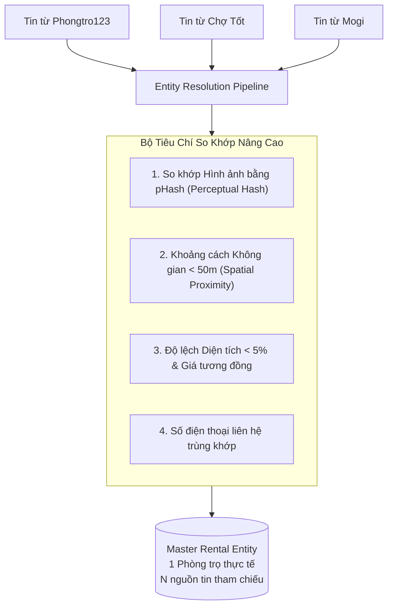

# Nhận Diện Trùng Lặp & Khử Trùng Đa Nguồn (Entity Resolution)

> **Plane:** Analytics & ML
> **Trạng thái tài liệu:** AUTHORITATIVE
> **Trạng thái thành phần:** PARTIAL
> **Kiểm chứng lần cuối:** 2026-10-06, commit `80d2c1f`
> **Liên quan:** [ANALYTICS_AND_GOLD.md](ANALYTICS_AND_GOLD.md), [PRICE_MODEL.md](PRICE_MODEL.md)

---

## 1. Hiện Trạng Nhận Diện Trùng Lặp Cục Bộ Trong Silver

Trong tầng Silver ([`notebooks/utils/silver_processing.py`](../../notebooks/utils/silver_processing.py)), hệ thống sử dụng thuật toán **Union-Find (Disjoint-Set Union)** để gom cụm các tin đăng nghi ngờ trùng lặp vào trường `duplicate_candidate_group`.

### Các quy tắc so khớp (Matching Rules):
1. **`EXACT_FINGERPRINT`:** Trùng khớp tuyệt đối chuỗi vân tay gồm: Tiêu đề sạch + Giá sạch + Diện tích sạch + Phường chuẩn hóa.
2. **`SAME_ADDRESS_PRICE_AREA`:** Trùng khớp địa chỉ chi tiết trích xuất kèm giá và diện tích tương đồng (độ lệch $<2\%$).
3. **`SAME_TITLE_PRICE_WARD`:** Trùng tiêu đề bài đăng kèm cùng phường và cùng mức giá (dành cho các môi giới sao chép nguyên văn bài đăng).
4. **`NO_MATCH`:** Tin đăng độc nhất, không phát hiện trùng lặp.

### Vai trò của `duplicate_candidate_group`:
- **Chống rò rỉ dữ liệu khi chia tập ML:** Bắt buộc toàn bộ các tin đăng thuộc cùng một nhóm trùng lặp phải nằm trọn vẹn trong một phân vùng (Train hoặc Validation hoặc Test), ngăn ngừa mô hình học thuộc lòng tin đăng.

---

## 2. Ranh Giới Hạn Chế Hiện Tại

Cơ chế Union-Find hiện tại mới dừng ở mức **nhận diện ứng viên trùng lặp (Duplicate Candidates)** dựa trên so khớp văn bản và số học:
- Chưa gộp các tin đăng trùng thành một thực thể duy nhất (Single Master Entity).
- Nếu môi giới thay đổi tiêu đề hoặc cố tình sửa giá chênh lệch vài trăm nghìn đồng giữa Chợ Tốt và PhongTro123, thuật toán dựa trên text hiện tại sẽ bỏ sót.

---

## 3. Lộ Trình Xây Dựng Master Entity Đa Nguồn (PLANNED)

Để tiến tới sản phẩm thương mại hoàn chỉnh, hệ thống quy hoạch pipeline **Cross-Source Entity Resolution**:

### Các bước nâng cấp:
1. **Perceptual Image Hashing (pHash):** Tận dụng các tệp ảnh đã tải về MinIO, tính toán mã băm thị giác pHash. Hai tin đăng dùng chung bộ ảnh chụp căn phòng sẽ có khoảng cách Hamming nhỏ, dễ dàng phát hiện dù nội dung chữ bị xáo trộn.
2. **Khoảng cách không gian vi mô:** Sử dụng toạ độ sau khi Geocoding làm giàu, kết hợp số nhà và tên đường.
3. **Master Listing Object:** Tạo bảng thực thể mẹ `master_listings` trong Serving DB. Người dùng khi xem phòng sẽ thấy: *"Phòng trọ này đang được đăng trên 3 sàn với các mức giá: 4.0 tr (PhongTro123), 4.2 tr (Chợ Tốt)..."*
