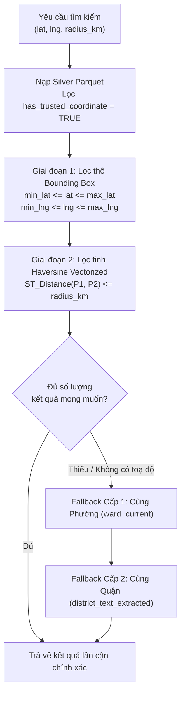

# Tìm Kiếm Phòng Thuê Lân Cận (Search & Discovery Plane)

> **Plane:** Analytics & ML
> **Trạng thái tài liệu:** AUTHORITATIVE
> **Trạng thái thành phần:** PARTIAL
> **Kiểm chứng lần cuối:** 2026-10-06, commit `80d2c1f`
> **Liên quan:** [PRICE_MODEL.md](PRICE_MODEL.md), [../06-serving/SERVING_ARCHITECTURE.md](../06-serving/SERVING_ARCHITECTURE.md)

---

## 1. Vai Trò của Search & Discovery Plane Trong Bản Vẽ Kiến Trúc

Theo bản vẽ chuẩn hóa [**`overall-architecture.pdf`**](../../architecture/overall-architecture.pdf), **Search and Discovery Plane** là mặt phẳng chức năng chuyên trách phục vụ bài toán tìm kiếm phòng trọ theo vị trí địa lý:

- **Khối chức năng:** **Nearby Rental Search (Spatial / Haversine)**.
- **Nguồn dữ liệu đầu vào:** Đọc trực tiếp từ **Silver / Canonical Data (Parquet)** (`data/silver/rental_listings.parquet`).
- **Nguyên tắc phi tập trung:** **Không phụ thuộc vào bất kỳ cơ sở dữ liệu Serving trung gian nào.** Toàn bộ quá trình quét và lọc không gian được thực thi siêu tốc trên bộ nhớ từ tệp Parquet chuẩn hóa.

---

## 2. Thuật Toán Tìm Kiếm Bán Kính Không Gian Hai Giai Đoạn

Được xây dựng và kiểm chứng thực nghiệm tại [`notebooks/05_roombeacon_nearby_rental_search.ipynb`](../../notebooks/05_roombeacon_nearby_rental_search.ipynb):

### Chi tiết các bước tính toán:

1. **Giai đoạn 1 — Lọc thô theo Hộp Giới Hạn (Bounding Box Filter):**
   - Giảm không gian tìm kiếm từ 132,436 tin xuống vài trăm ứng viên tiềm năng bằng các phép so sánh số học nhanh:
     $$\Delta \text{lat} = \frac{\text{radius\_km}}{111.32}$$
     $$\Delta \text{lng} = \frac{\text{radius\_km}}{111.32 \times \cos(\text{radians}(\text{lat}))}$$
   - Lọc các bản ghi thỏa mãn: $[\text{lat} - \Delta \text{lat}, \text{lat} + \Delta \text{lat}]$ và $[\text{lng} - \Delta \text{lng}, \text{lng} + \Delta \text{lng}]$.

2. **Giai đoạn 2 — Lọc tinh bằng Khoảng cách Mặt cầu (Vectorized Haversine):**
   - Áp dụng công thức Haversine với bán kính Trái Đất $R = 6371.0088\text{ km}$:
     $$a = \sin^2\left(\frac{\Delta \phi}{2}\right) + \cos(\phi_1)\cos(\phi_2)\sin^2\left(\frac{\Delta \lambda}{2}\right)$$
     $$d = 2R \cdot \arcsin(\sqrt{a})$$
   - Thực thi hoàn toàn bằng NumPy vectorization, đạt thời gian thực thi dưới **5–10 mili-giây** trên máy chủ thông thường.

---

## 3. Quy Tắc Dự Phòng Hành Chính Ba Cấp (Administrative Fallback)

Do tỷ lệ toạ độ tin cậy trong tập Silver hiện tại là 1.7% (2,277 tin), hệ thống bắt buộc áp dụng cơ chế fallback nghiêm ngặt để đảm bảo trải nghiệm người dùng:

1. **Cấp 1 — Tìm kiếm Bán kính Chính xác:** Áp dụng cho các tin có `has_trusted_coordinate = TRUE` nằm trong bán kính $r \le 3\text{ km}$.
2. **Cấp 2 — Dự phòng Cùng Phường:** Nếu khu vực tìm kiếm không có đủ tin có tọa độ, hệ thống tự động bổ sung các tin đăng cùng phường hành chính (`ward_current`) với điểm tìm kiếm.
3. **Cấp 3 — Dự phòng Cùng Quận:** Nếu cùng phường vẫn không đủ kết quả, mở rộng tìm kiếm sang các tin đăng cùng quận/huyện (`district_text_extracted`).

> [!CAUTION]
> **Tuân thủ tuyệt đối ADR-006:**  
> Hệ thống **nghiêm cấm tuyệt đối hành vi gán toạ độ giả mạo** từ tâm phường hoặc tâm quận cho các tin đăng thiếu toạ độ. Các tin fallback được đánh dấu nhãn phân loại rõ ràng để hiển thị minh bạch cho người dùng.

---

## 4. Kế Hoạch Đóng Gói Phục Vụ Backend API (PLANNED)

- [x] Thuật toán tìm kiếm bán kính và fallback đã hoàn thành và kiểm chứng tại Notebook 05.
- [ ] **PLANNED:** Đóng gói module `SpatialRentalFinder` thành service Python trong thư viện dùng chung (`services/search_service.py`), sẵn sàng kết nối vào Backend API (FastAPI) tại Application Serving Plane.
