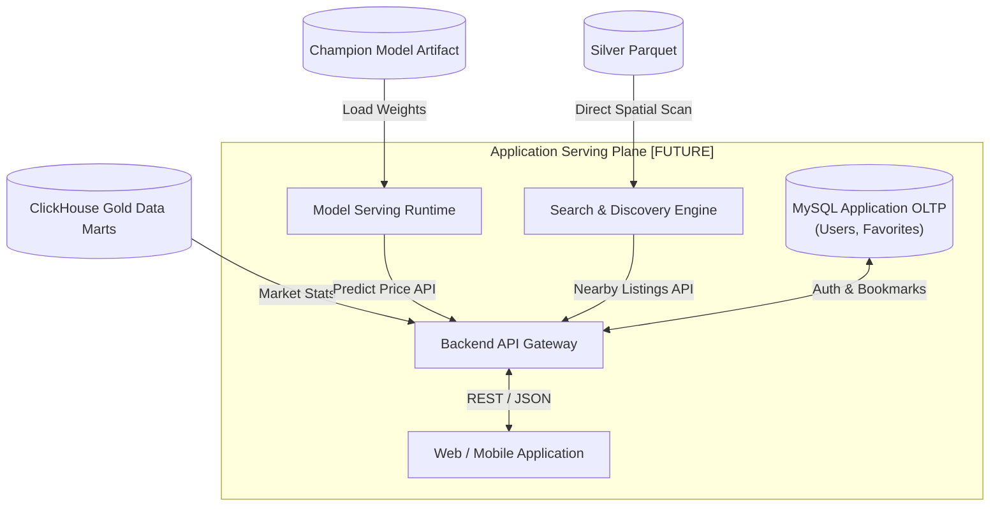

# Kiến Trúc Mặt Phẳng Ứng Dụng & Phục Vụ (Application Serving Architecture)

> **Plane:** Serving
> **Trạng thái tài liệu:** AUTHORITATIVE
> **Trạng thái thành phần:** PLANNED
> **Kiểm chứng lần cuối:** 2026-10-06, commit `80d2c1f`
> **Liên quan:** [SERVING_SCHEMA_AND_API.md](SERVING_SCHEMA_AND_API.md), [../adr/ADR-002.md](../adr/ADR-002.md)

---

## 1. Ranh Giới Mặt Phẳng Phục Vụ Ứng Dụng (Application Serving Boundary)

Theo bản vẽ chuẩn hóa [**`overall-architecture.pdf`**](../../architecture/overall-architecture.pdf), toàn bộ **Application Serving Plane** được quy định bằng nét đứt, mang trạng thái **FUTURE**:

---

## 2. Các Thành Phần Trọng Tâm Trong Application Serving Plane

### 1. Backend API Gateway (FastAPI)
- Đóng vai trò là cổng giao tiếp tập trung (Single Entrypoint) kết nối toàn bộ hệ thống tới ứng dụng người dùng.
- Phi trạng thái (Stateless), hỗ trợ mở rộng ngang (Horizontal Scaling) và xác thực người dùng JWT.
- Điều phối các luồng dữ liệu chuyên biệt:
  - Gọi **Search & Discovery Engine** để lấy danh sách phòng trọ lân cận theo tọa độ/địa bàn;
  - Gọi **ClickHouse Gold Data Marts** để lấy báo cáo thống kê và biến động giá thị trường;
  - Gọi **Model Serving Runtime** để cung cấp mức định giá dự báo tham khảo;
  - Tương tác với **MySQL Application OLTP** để xử lý đăng nhập, hồ sơ và lưu tin yêu thích.

### 2. MySQL Application OLTP (`roombeacon_app`)
- **Vai trò:** Cơ sở dữ liệu giao dịch ứng dụng truyền thống.
- **Dữ liệu lưu trữ:** Chỉ lưu thông tin tài khoản người dùng (`users`), phân quyền (`roles`), danh sách phòng trọ yêu thích (`favorites`), và tiêu chí tìm kiếm đã lưu (`saved_searches`).
- **Ranh giới nghiêm ngặt:** **Tuyệt đối KHÔNG lưu trữ bảng tin đăng (`listings`) hay dữ liệu phân tích thị trường.** Toàn bộ dữ liệu tin đăng và phân tích được cung cấp trực tiếp từ Silver Parquet và ClickHouse Data Marts (tuân thủ nghiêm ngặt [**ADR-002**](../adr/ADR-002.md)).

### 3. Model Serving Runtime
- Dịch vụ suy luận học máy siêu nhẹ, nạp trọng số từ artifact đã khóa (`champion_model.joblib`).
- Nhận diện các đặc trưng đầu vào (diện tích, phường/quận, sàn) và trả về khoảng giá ước tính mà không cần truy cập cơ sở dữ liệu.

### 4. Web / Mobile Application
- Ứng dụng web người dùng cuối (Next.js / React) và ứng dụng di động tìm kiếm phòng trọ thông minh.

---

## 3. Phương Án Lịch Sử Đã Cân Nhắc Nhưng Bác Bỏ (Theo ADR-002)

Trong giai đoạn thiết kế ban đầu, hệ thống từng cân nhắc giải pháp:
- Tạo database `roombeacon_serving` trên MySQL 8.4 chứa các bảng `listings`, `listing_locations` (với cột toạ độ `POINT SRID 4326 NOT NULL` kèm `SPATIAL INDEX`) để phục vụ tìm kiếm bán kính.

**Lý do bác bỏ phương án này:**
1. Gây dư thừa dữ liệu không cần thiết với Canonical Silver Parquet.
2. Thử nghiệm thực tế tại Notebook 05 chứng minh việc tìm kiếm không gian trực tiếp trên tệp Parquet bằng lọc Bounding Box và thuật toán vector hóa Haversine cho tốc độ dưới 10ms trên 132k tin, không cần RDBMS trung gian.
3. Chức năng thống kê thị trường đa chiều được chuyển giao hoàn toàn cho ClickHouse Data Warehouse (OLAP), giải phóng hoàn toàn MySQL khỏi tải phân tích.
