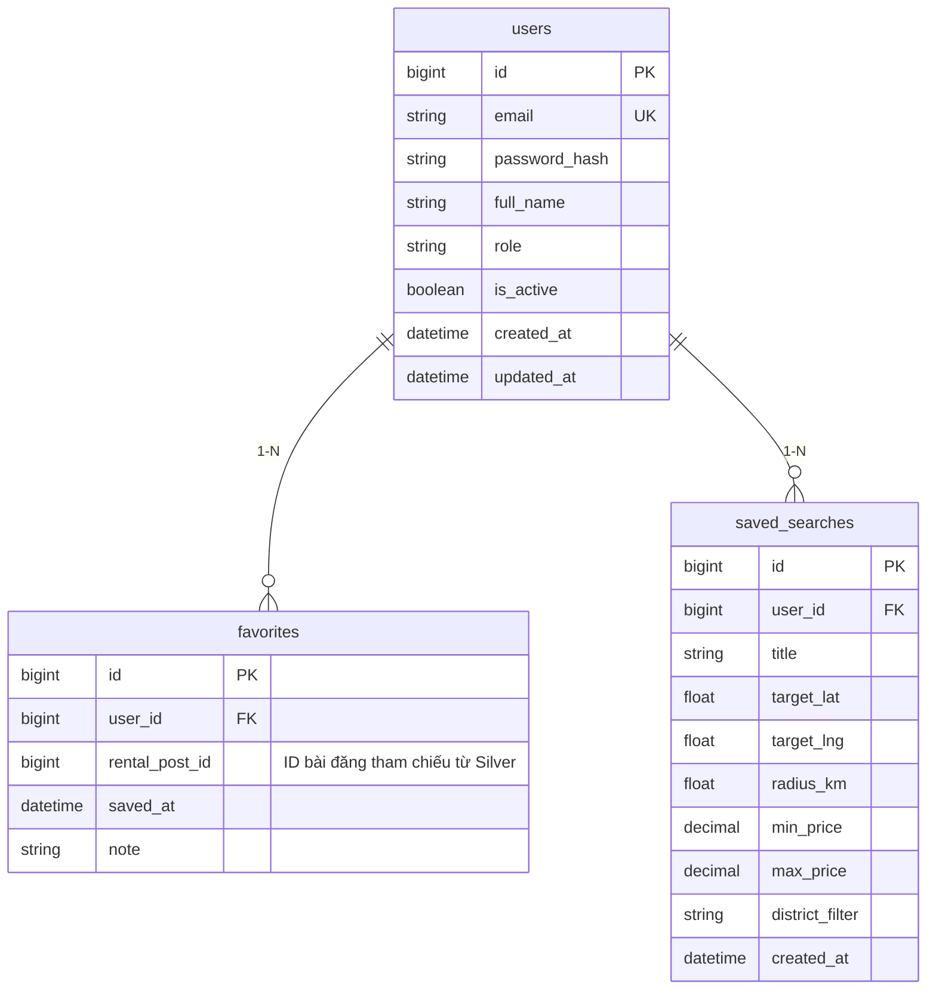
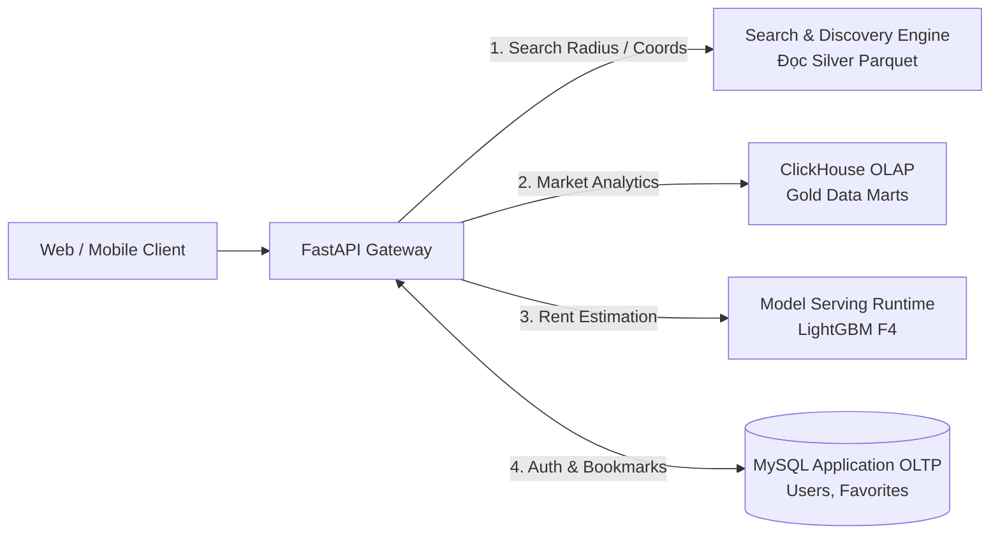

# Lược Đồ Ứng Dụng OLTP & Đặc Tả API (Application Schema & API Specification)

> **Plane:** Serving
> **Trạng thái tài liệu:** AUTHORITATIVE
> **Trạng thái thành phần:** PLANNED
> **Kiểm chứng lần cuối:** 2026-10-06, commit `80d2c1f`
> **Liên quan:** [SERVING_ARCHITECTURE.md](SERVING_ARCHITECTURE.md), [../adr/ADR-002.md](../adr/ADR-002.md)

---

## 1. Lược Đồ Cơ Sở Dữ Liệu MySQL Application OLTP (`roombeacon_app`)

Tuân thủ nghiêm ngặt **ADR-002**, cơ sở dữ liệu MySQL ở tầng Serving **CHỈ phục vụ giao dịch người dùng ứng dụng, tuyệt đối không chứa dữ liệu tin đăng (`listings`) hay dữ liệu phân tích**:



### Chi tiết các thực thể:
1. **`users`:** Quản lý thông tin tài khoản, mật khẩu băm (bcrypt/argon2), và quyền hạn sử dụng ứng dụng.
2. **`favorites`:** Danh sách phòng trọ được người dùng lưu lại. Trường `rental_post_id` tham chiếu mềm (Logical Reference) tới định danh tin đăng trong tệp Canonical Silver Parquet.
3. **`saved_searches`:** Lưu trữ các tiêu chí lọc phòng trọ của người dùng để hỗ trợ thông báo khi có tin đăng mới phù hợp.

---

## 2. Danh Mục REST API Endpoints Phục Vụ Ứng Dụng (FUTURE)

Backend API (FastAPI) đóng vai trò điều phối giữa các Plane chuyên biệt:



| Nhóm chức năng | Phương thức & Endpoint | Tầng dữ liệu xử lý nội bộ | Mô tả nghiệp vụ |
|---|---|---|---|
| **Tìm kiếm Không gian** | `GET /listings/nearby` | **Search & Discovery Plane** (đọc `rental_listings.parquet`) | Tìm kiếm phòng trọ theo bán kính: tham số `lat`, `lng`, `radius_km`. Lọc Bounding Box + Haversine vector hóa kết hợp fallback Phường/Quận. |
| **Tra cứu Chi tiết** | `GET /listings/{id}` | **Data Processing & Silver Plane** (đọc Silver Parquet) | Lấy chi tiết thông tin phòng trọ, danh sách ảnh MinIO và cờ chất lượng. |
| **Thị trường & Thống kê** | `GET /market/stats/daily` | **ClickHouse Data Warehouse** (Gold Data Marts) | Trả về chuỗi biến động giá trung vị và nguồn cung theo ngày từ `agg_market_daily`. |
| **Thị trường Hành chính** | `GET /market/wards/{ward_id}` | **ClickHouse Data Warehouse** (Gold Data Marts) | Thống kê giá trung vị, phân vị 25%-75% và giá trên $m^2$ của một phường cụ thể. |
| **Dự báo Định giá** | `GET /price-estimate` | **Model Serving Runtime** (Champion LightGBM) | Dự báo khoảng giá thuê hợp lý dựa trên diện tích, quận, phường và sàn cào. |
| **Tài khoản & Yêu thích** | `POST /auth/login`<br>`GET /favorites`<br>`POST /favorites` | **MySQL Application OLTP** (`roombeacon_app`) | Xử lý đăng nhập, quản lý hồ sơ và danh sách tin phòng trọ đã lưu của người dùng. |

---

## 3. Phương Án Lịch Sử Đã Cân Nhắc Nhưng Bác Bỏ (Spatial Index Trên MySQL)

> [!NOTE]
> **Tài liệu tham khảo lịch sử (Superseded by ADR-002):**  
> Trước đây từng có đề xuất tạo database `roombeacon_serving` trên MySQL 8.4 chứa bảng `listing_locations` với cột `coordinates POINT SRID 4326 NOT NULL` kèm `SPATIAL INDEX`.

### Thiết kế cũ từng cân nhắc:
```sql
-- PHƯƠNG ÁN ĐÃ BÁC BỎ - KHÔNG TRIỂN KHAI
CREATE TABLE listing_locations (
    listing_id BIGINT PRIMARY KEY,
    coordinates POINT NOT NULL SRID 4326,
    SPATIAL INDEX sp_idx_coords (coordinates)
) ENGINE=InnoDB;

-- Truy vấn 2 bước cũ từng thiết kế:
SELECT listing_id FROM listing_locations
WHERE MBRContains(ST_MakeEnvelope(
    POINT(min_lng, min_lat),
    POINT(max_lng, max_lat)
), coordinates)
AND ST_Distance_Sphere(coordinates, ST_SRID(POINT(target_lng, target_lat), 4326)) <= radius_meters;
```

### Lý do phương án này bị bãi bỏ:
1. **Trùng lặp dữ liệu:** Silver Parquet đã chứa toàn bộ thông tin địa bàn và tọa độ sạch. Việc nạp lại vào MySQL Serving tạo ra pipeline ETL dư thừa.
2. **Hiệu năng vượt trội của Vectorized Haversine:** Thực nghiệm tại Notebook 05 chứng minh tính toán trực tiếp trên Silver Parquet bằng NumPy chỉ mất 5–10ms cho toàn bộ 132k tin, nhanh hơn và nhẹ tải hơn so với việc gửi truy vấn qua kết nối mạng tới MySQL Spatial.
3. **Phân định rạch ròi theo bản vẽ:** MySQL chỉ làm đúng thế mạnh là cơ sở dữ liệu giao dịch người dùng (OLTP). Toàn bộ bài toán tìm kiếm thuộc về Search & Discovery Plane, và bài toán phân tích thuộc về ClickHouse OLAP.
