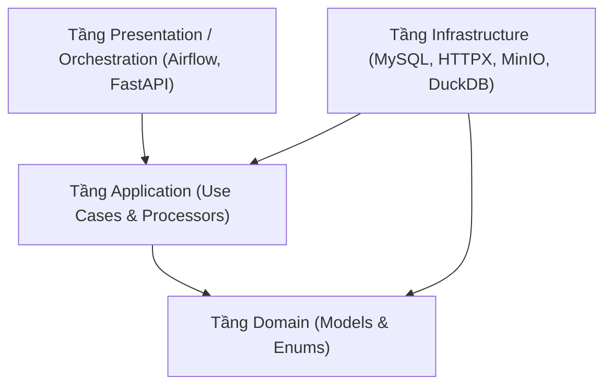

# Quy Tắc Phụ Thuộc Kiến Trúc (Dependency Rules)

> **Plane:** Engineering
> **Trạng thái tài liệu:** AUTHORITATIVE
> **Trạng thái thành phần:** IMPLEMENTED
> **Kiểm chứng lần cuối:** 2026-10-06, commit `80d2c1f`
> **Liên quan:** [SECURITY.md](SECURITY.md), [TESTING.md](TESTING.md)

---

## 1. Ngũ Đại Nguyên Tắc Phụ Thuộc

Mọi module trong RoomBeacon phải tuân thủ nghiêm ngặt mô hình **Clean Architecture**:

1. **Chiều phụ thuộc hướng vào trong:** Tầng Domain là trung tâm, độc lập tuyệt đối với Framework, Database, Network hay Third-party libraries.
2. **Tầng Domain không phụ thuộc tầng ngoài:** Tuyệt đối không import `sqlalchemy`, `httpx`, `airflow`, `playwright` vào trong thư mục `domain/` hay `models/`.
3. **Cơ chế Inversion of Control (Ports and Adapters):** Khi Application cần tương tác với cơ sở dữ liệu hoặc mạng, nó định nghĩa một Interface/Port trừu tượng (ví dụ `ObservationRepositoryPort`). Tầng Infrastructure thực thi Port này (`MySQLObservationRepository`).
4. **Không phụ thuộc chéo giữa các Adapters:** Mã nguồn của `sources/nhatot/` tuyệt đối không được import hay gọi hàm từ `sources/phongtro123/`.
5. **Cách ly ranh giới kiểm thử:** Unit tests cho Domain và Application phải chạy độc lập mà không cần khởi động MySQL hay MinIO (sử dụng in-memory mocks / fakes).
