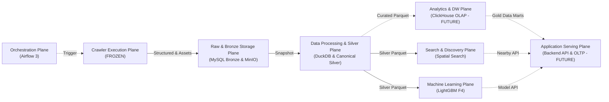

# RoomBeacon Documentation Index

> **Plane:** Engineering
> **Trạng thái tài liệu:** AUTHORITATIVE
> **Trạng thái thành phần:** hỗn hợp — xem bảng
> **Kiểm chứng lần cuối:** 2026-10-06, commit `80d2c1f`
> **Liên quan:** [00-overview/TARGET_ARCHITECTURE.md](00-overview/TARGET_ARCHITECTURE.md), [_migration/DOCS_MIGRATION_MAP.md](_migration/DOCS_MIGRATION_MAP.md)

---

## 1. Bắt đầu từ đâu? (5-Minute Onboarding)

Khi mới tiếp cận dự án, hãy đọc theo thứ tự sau:

1. [**Bản vẽ Kiến trúc Chuẩn (`overall-architecture.pdf`)**](../architecture/overall-architecture.pdf) (kèm ảnh xuất [**`overall-architecture.png`**](../architecture/overall-architecture.png)): Chuẩn thiết kế tối cao của hệ thống.
2. [**Tổng quan Dự án (Project Overview)**](00-overview/PROJECT_OVERVIEW.md): Hiểu bài toán nghiệp vụ, tầm nhìn Rental Intelligence và bản đồ thuật ngữ (Glossary).
3. [**Kiến trúc Mục tiêu (Target Architecture)**](00-overview/TARGET_ARCHITECTURE.md): Sơ đồ tổng thể các mặt phẳng (Planes), quy ước nét liền (IMPLEMENTED) và nét đứt (PLANNED/FUTURE).
4. [**Vòng đời Dữ liệu (Data Layers & Lifecycle)**](00-overview/DATA_LAYERS_AND_LIFECYCLE.md): Hiểu ranh giới RAW $\rightarrow$ Bronze $\rightarrow$ Silver $\rightarrow$ Curated Observations $\rightarrow$ ClickHouse Gold Data Marts $\rightarrow$ Serving.
5. [**Hiện trạng Triển khai (Implementation Status)**](00-overview/IMPLEMENTATION_STATUS.md): Ma trận đối chiếu chi tiết từng thành phần với mã nguồn thực tế và danh mục rủi ro mở.
6. [**Danh mục Quyết định Kiến trúc (ADR Index)**](adr/README.md): 6 quyết định kiến trúc cốt lõi định hình toàn bộ hệ thống.

---

## 2. Quy ước Trạng thái & Nhãn Kỹ thuật

Mọi tài liệu ngoài thư mục lưu trữ (`archive/`) đều tuân thủ nghiêm ngặt hệ thống nhãn trạng thái theo bản vẽ:

| Nhãn | Ý nghĩa kỹ thuật | Biểu diễn trên Bản vẽ | Ví dụ thành phần |
|---|---|:---:|---|
| **IMPLEMENTED** | Đã triển khai đầy đủ trong mã nguồn và kiểm chứng tại runtime. | Nét liền (Solid lines) | MySQL Bronze SCD2, MinIO Assets, DuckDB 13 Views, Silver Parquet 80 cột. |
| **FROZEN** | Đã triển khai hoàn chỉnh, chạy ổn định và **được đóng băng** (không can thiệp logic). | Nét liền | Crawler Engine (`CrawlRunner`) và Ingestion DAG (`roombeacon_crawler`). |
| **PARTIAL** | Đã có một phần mã nguồn/khung sườn nhưng chưa khép kín toàn bộ luồng tự động. | Nét liền / Đứt | Geocoding Enrichment (worker chạy nhưng tỷ lệ toạ độ tin cậy mới đạt 1.7%). |
| **PLANNED** | Đã có thiết kế chi tiết, đã duyệt kiến trúc, đang chờ lập trình. | Nét đứt (Dashed lines) | MinIO RAW HTML/JSON, Historical Curated Observations, nhánh `feat/storage-plane-alignment`. |
| **FUTURE** | Định hướng mở rộng tương lai, có điều kiện kích hoạt cụ thể. | Nét đứt (Dashed lines) | ClickHouse Data Warehouse (OLAP), Gold Data Marts, Application Serving Plane. |
| **DEPRECATED** | Thiết kế hoặc triển khai cũ đã bị hủy bỏ hoặc thay thế. | — | Persistent DuckDB table `silver.rental_listings`, spatial index trên MySQL serving. |

---

## 3. Bản đồ Tài liệu theo Các Mặt Phẳng Kiến Trúc (Planes)

### [00 — Tổng quan Kiến trúc (Overview)](00-overview/)
- [PROJECT_OVERVIEW.md](00-overview/PROJECT_OVERVIEW.md): Bài toán, phạm vi, 9 nguồn dữ liệu thực tế, glossary.
- [TARGET_ARCHITECTURE.md](00-overview/TARGET_ARCHITECTURE.md): Kiến trúc Level 1 xây dựng từ bản vẽ thiết kế `overall-architecture.pdf`.
- [DATA_LAYERS_AND_LIFECYCLE.md](00-overview/DATA_LAYERS_AND_LIFECYCLE.md): Semantics, grain, quy tắc rebuild giữa RAW/Bronze/Silver/Curated/Gold/Serving.
- [IMPLEMENTATION_STATUS.md](00-overview/IMPLEMENTATION_STATUS.md): Ma trận thành phần $\times$ trạng thái $\times$ bằng chứng mã nguồn.
- [GAP_AND_MIGRATION_PLAN.md](00-overview/GAP_AND_MIGRATION_PLAN.md): Khoảng cách giữa code hiện tại và kiến trúc mục tiêu, lộ trình triển khai.

### [01 — Mặt phẳng Điều phối (Orchestration Plane)](01-control-plane/)
- [AIRFLOW_ARCHITECTURE.md](01-control-plane/AIRFLOW_ARCHITECTURE.md): Môi trường Airflow 3.3.1, domain DAGs và cơ chế Airflow Assets.
- [DAG_CATALOG.md](01-control-plane/DAG_CATALOG.md): Danh mục 6 DAGs thực tế, lịch trình, tham số và dependency graph.

### [02 — Mặt phẳng Thu thập (Crawler Execution Plane — FROZEN)](02-ingestion/)
- [CRAWLER_ARCHITECTURE.md](02-ingestion/CRAWLER_ARCHITECTURE.md): CrawlRunner, processors, lifecycle run flow, frontier và backlog deferred details.
- [SOURCE_ADAPTERS.md](02-ingestion/SOURCE_ADAPTERS.md): Ma trận 12 nguồn website: transport, phân trang, detail budget và độ phủ.
- [FETCH_ACCESS_AND_ROBOTS.md](02-ingestion/FETCH_ACCESS_AND_ROBOTS.md): Chính sách robots.txt, retry backoff, source health và bảo vệ SSRF.
- [EXTRACTION_CONTRACT.md](02-ingestion/EXTRACTION_CONTRACT.md): Domain models, Enums, bóc tách card/detail, thông dịch ngày và BronzeMapper.
- [CRAWL_TO_STORAGE_FLOW.md](02-ingestion/CRAWL_TO_STORAGE_FLOW.md): Trace chi tiết từ Airflow trigger $\rightarrow$ crawler $\rightarrow$ Bronze artifacts $\rightarrow$ MySQL.

### [03 — Mặt phẳng Lưu trữ Thô & Bronze (Raw & Bronze Storage Plane)](03-storage/)
- [STORAGE_OVERVIEW.md](03-storage/STORAGE_OVERVIEW.md): Host storage làm source of truth, bind mount, cây thư mục `data/` và kế hoạch lưu trữ `feat/storage-plane-alignment`.
- [BRONZE_MYSQL.md](03-storage/BRONZE_MYSQL.md): Lược đồ quan hệ thực tế, SCD2 versioning, Unit of Work transaction, và kiểm soát tăng trưởng.
- [OBJECT_STORAGE_MINIO.md](03-storage/OBJECT_STORAGE_MINIO.md): Kiến trúc MinIO S3 (`roombeacon-assets`), phân loại bucket và chính sách truy cập.
- [ASSET_PIPELINE.md](03-storage/ASSET_PIPELINE.md): Điều phối công bằng đa nguồn (Fair Scheduling), xác thực Magic Bytes, giới hạn 15 MiB và mô hình trạng thái.

### [04 — Mặt phẳng Xử lý Dữ liệu & Silver (Data Processing & Silver Plane)](04-processing/)
- [PROCESSING_ARCHITECTURE.md](04-processing/PROCESSING_ARCHITECTURE.md): Snapshot Parquet $\rightarrow$ DuckDB in-memory OLAP $\rightarrow$ Silver canonical $\rightarrow$ Historical Curated Observations.
- [SILVER_CONTRACT.md](04-processing/SILVER_CONTRACT.md): Hợp đồng 80 cột Silver, 10 nhóm trường, invariants và kiểm định chất lượng (`row_quality_status`).
- [ADDRESS_AND_ADMIN_NORMALIZATION.md](04-processing/ADDRESS_AND_ADMIN_NORMALIZATION.md): Trích xuất địa chỉ phân cấp, đối chiếu Bản đồ Hành chính Việt Nam (Gazetteer) và chuẩn hóa phường/quận.
- [GEOCODING_ENRICHMENT.md](04-processing/GEOCODING_ENRICHMENT.md): Hiện trạng toạ độ (1.7%), cô lập toạ độ mẫu, kiến trúc geocoding worker và bảng cache `map_geocodes`.

### [05 — Phân tích, Kho Dữ liệu, Học máy & Tìm kiếm](05-analytics-ml/)
- [ANALYTICS_AND_GOLD.md](05-analytics-ml/ANALYTICS_AND_GOLD.md): **Analytics and Data Warehouse Plane (FUTURE)** — ClickHouse OLAP, Star Schema (Fact/Dims) và Gold Data Marts (`agg_market_daily`).
- [PRICE_MODEL.md](05-analytics-ml/PRICE_MODEL.md): **Machine Learning Plane** — Benchmark V3, champion LightGBM F4 RAW, shadow validation và benchmark hiệu năng.
- [SEARCH_AND_DISCOVERY.md](05-analytics-ml/SEARCH_AND_DISCOVERY.md): **Search and Discovery Plane** — Tìm kiếm phòng thuê lân cận (Spatial / Haversine) đọc trực tiếp từ Silver Parquet, fallback 3 cấp.
- [ENTITY_RESOLUTION.md](05-analytics-ml/ENTITY_RESOLUTION.md): Gom nhóm tin trùng lặp cục bộ (Union-Find) và lộ trình định danh thực thể gốc (Master Entity).

### [06 — Mặt phẳng Phục vụ Ứng dụng (Application Serving Plane — FUTURE)](06-serving/)
- [SERVING_ARCHITECTURE.md](06-serving/SERVING_ARCHITECTURE.md): Backend API, Model Serving Runtime, MySQL Application OLTP (Users, Favorites) và Web/Mobile App.
- [SERVING_SCHEMA_AND_API.md](06-serving/SERVING_SCHEMA_AND_API.md): Lược đồ MySQL Application OLTP (không chứa tin đăng), danh mục REST API endpoints, và ghi nhận phương án Spatial Index đã bị bác bỏ.

### [07 — Kỹ thuật & Vận hành (Cross-Cutting Engineering)](07-engineering/)
- [DEPENDENCY_RULES.md](07-engineering/DEPENDENCY_RULES.md): Ranh giới phân tầng Clean Architecture và hướng phụ thuộc.
- [SECURITY.md](07-engineering/SECURITY.md): Các rào chắn bảo mật (SSRF protection, validation mime/magic bytes, secrets).
- [TESTING.md](07-engineering/TESTING.md): Chiến lược kiểm thử, cách ly môi trường test và dữ liệu test.
- [DOCKER_DEVELOPMENT.md](07-engineering/DOCKER_DEVELOPMENT.md): Hướng dẫn thiết lập môi trường phát triển trên Docker Compose.
- [ADDRESS_RESET_OPERATIONS.md](07-engineering/ADDRESS_RESET_OPERATIONS.md): Quy trình vận hành và runbook đặt lại dữ liệu địa chỉ.
- [CONFIGURATION.md](07-engineering/CONFIGURATION.md): Danh mục biến môi trường runtime tổng hợp từ `.env.example` và mã nguồn.

### [Quyết định Kiến trúc (ADR)](adr/)
- [ADR-001](adr/ADR-001.md): Bronze Lịch sử lưu trong MySQL Bronze (SCD2), MinIO RAW và kế hoạch lưu trữ `feat/storage-plane-alignment`.
- [ADR-002](adr/ADR-002.md): MySQL ở tầng Serving chỉ đóng vai trò Application OLTP (Users, Favorites) — không chứa listings.
- [ADR-003](adr/ADR-003.md): DuckDB làm In-Memory Processing Engine và Parquet làm Persistent Canonical Silver.
- [ADR-004](adr/ADR-004.md): Tách biệt OLTP/OLAP bằng Snapshot Parquet; Hoãn CDC/Kafka; ClickHouse là Data Warehouse tương lai.
- [ADR-005](adr/ADR-005.md): Phân tách DAG Airflow theo Domain (Ingestion đóng băng).
- [ADR-006](adr/ADR-006.md): Nguyên tắc Toàn vẹn Toạ độ Không gian và Cách ly Toạ độ Mẫu.

### [Kho Lưu trữ Lịch sử (Archive)](archive/)
- [`archive/audit/`](archive/audit/): Các biên bản kiểm toán kiến trúc, bảo mật và tính khả lặp (giữ nguyên bằng chứng).
- [`archive/incidents/`](archive/incidents/): Nhật ký sự cố kỹ thuật và bài học kinh nghiệm (giữ nguyên bằng chứng).
- [`archive/plans/`](archive/plans/): Kế hoạch và quy chuẩn kỹ thuật cũ.
- [`archive/refactor/`](archive/refactor/): Báo cáo tái cấu trúc Clean Architecture Phase 1.
- [`archive/legacy-design/`](archive/legacy-design/): Tài liệu thiết kế sơ khai đã được nâng cấp hoặc thay thế.

---

## 4. Thứ tự Ưu tiên khi Xử lý Mâu thuẫn (Conflict Resolution Priority)

Khi phát hiện mâu thuẫn giữa các tài liệu hoặc giữa tài liệu và mã nguồn, thứ tự ưu tiên chân lý (Source of Truth) được quy định nghiêm ngặt như sau:

$$\text{Bản vẽ overall-architecture.pdf} \succ \text{Mã nguồn Python / SQL} \succ \text{Test Suite / Assertions} \succ \text{ADR (001–006)} \succ \text{Tài liệu docs/ mới}$$

Tuyệt đối không dùng các tài liệu trong `archive/` làm căn cứ kỹ thuật cho hành vi runtime hiện tại.
