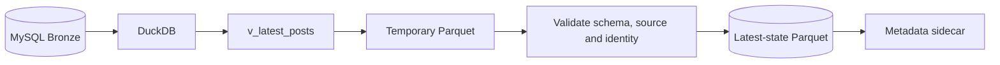

# RoomBeacon — Latest-State Parquet Publication

> Mục đích: mô tả pipeline hiện có mang tên `SilverMaterializer` và giới hạn semantics của output.
>
> Trạng thái: **CURRENT IMPLEMENTATION / PARTIAL DATA LIFECYCLE**. Tài liệu chuẩn về các tầng dữ liệu: [Data Lifecycle](../data/DATA_LIFECYCLE.md).

## Semantics hiện tại

`SilverMaterializer` xuất `v_latest_posts` thành `data/silver/rental_latest.parquet`. Tên class, DAG và đường dẫn là tên legacy; output hiện là **latest-state Parquet**, chưa phải cleaned Silver.

Pipeline hiện tại không có cleaning-rule registry, imputation, location standardization, business outlier policy hoặc versioned transformation rules. Parquet là định dạng vật lý, không tự tạo ra semantics Silver.

## Luồng publication

`v_latest_posts` chọn observation mới nhất cho mỗi `rental_post_id`. Materializer sau đó:

1. ghi temporary Parquet;
2. kiểm tra file đọc được, schema bắt buộc, source hợp lệ và one-row-per-listing;
3. thay thế snapshot đích bằng atomic rename;
4. ghi metadata sidecar;
5. giữ snapshot hợp lệ trước đó nếu validation thất bại.

## Invariants

- `rental_post_id` không null và không trùng trong snapshot;
- source phải thuộc registry được hỗ trợ;
- file đã publish phải đọc lại được;
- publication failure không làm hỏng snapshot hợp lệ trước đó.

Các invariant này đảm bảo tính toàn vẹn kỹ thuật của snapshot. Chúng không thay thế semantic cleaning.

## Hai loại EDA

- **Initial Data Quality EDA — PARTIAL:** đọc Bronze/latest-state để tìm missing values, malformed values, parser contamination và raw outliers; kết quả là cleaning rules có version.
- **Clean Analytical EDA — PLANNED:** chỉ đọc Silver sau khi các cleaning rules đó được triển khai.

## Ranh giới công cụ và tầng dữ liệu

- DuckDB là query engine.
- Pandas là công cụ DataFrame/EDA.
- Parquet là file format.
- Silver là logical cleaned layer.

Các khái niệm này không hoán đổi cho nhau.
