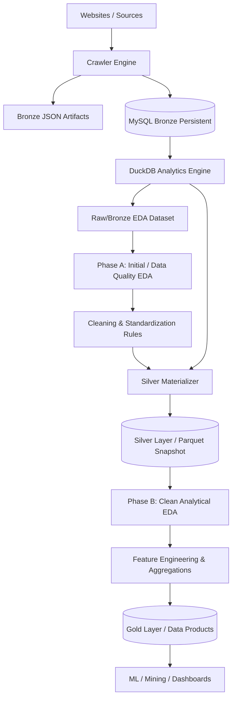

# KIẾN TRÚC ĐƯỜNG ỐNG DỮ LIỆU TẦNG SILVER (SILVER DATASET PIPELINE)

Tài liệu này mô tả chi tiết vị trí của tầng **Silver** trong vòng đời Khoa học Dữ liệu (Data Science Lifecycle), quy trình xuất bản snapshot nguyên tử (Atomic Materialization) và cơ chế đảm bảo tính toàn vẹn của tập dữ liệu **Silver Parquet (`rental_latest.parquet`)** trong hệ thống **RoomBeacon**.

---

## 1. Vị Trí của Tầng Silver trong Vòng Đời Dữ Liệu

Trong hệ thống RoomBeacon, tầng **Silver** không phải là điểm khởi đầu cho việc khám phá và phát hiện dữ liệu bẩn. Thay vào đó, tầng Silver được sinh ra **SAU KHI** đã hoàn thành giai đoạn **Khám phá Chất lượng Dữ liệu ban đầu (Initial / Data Quality EDA)** trên tầng Bronze/Raw và thiết lập đầy đủ các quy tắc làm sạch, chuẩn hóa:



---

## 2. Phân Định Rõ Ràng Các Khái Niệm và Tầng Dữ Liệu

| Khái Niệm / Tầng | Bản Chất / Vai Trò | Định Dạng / Công Cụ | Mục Đích Sử Dụng |
| :--- | :--- | :--- | :--- |
| **Bronze** | Tầng lưu trữ dữ liệu thô, gần nguồn (Source-near Ingestion) | MySQL (12 bảng) & JSON Files | Bảo toàn 100% giá trị gốc (`price_raw`, `area_raw`, `location_raw`), phục vụ audit, khôi phục thảm họa và Initial EDA. |
| **DuckDB** | Công cụ truy vấn và biến đổi phân tích (OLAP Engine) | In-memory / DuckDB Process | Không phải tầng dữ liệu; đóng vai trò phẳng hóa bảng quan hệ Bronze, thực hiện view phân tích, đọc Parquet, phục vụ SQL tương tác. |
| **Raw EDA Dataset** | Tập dữ liệu phẳng hóa từ Bronze bảo toàn cả trường thô và trường chuẩn hóa | Bảng / DataFrame bộ nhớ | Dùng cho **Phase A: Initial EDA** để phát hiện lỗi parser, missing values, định dạng bất thường và xây dựng quy tắc làm sạch. |
| **Silver** | Tầng dữ liệu logic đã được làm sạch, chuẩn hóa và ép kiểu cấu trúc (Cleaned, Standardized, Typed) | Snapshot phân tích chuẩn hóa | Được sinh ra SAU KHI áp dụng các quy tắc làm sạch từ Initial EDA; tối ưu hóa cho phân tích kinh tế thị trường (**Phase B: Clean EDA**). |
| **Parquet** | Định dạng tệp tin lưu trữ dạng cột vật lý (Physical Columnar File Format) | File `.parquet` (ZSTD/Snappy) | Định dạng tệp tối ưu để lưu trữ tầng Silver (dung lượng nhỏ, đọc nhanh, bảo toàn kiểu dữ liệu, không đồng nghĩa với khái niệm Silver). |
| **Gold** | Tầng sản phẩm dữ liệu cấp cao (Feature Store / Data Products / Aggregations) | Bảng đặc trưng / Báo cáo | Được sinh ra SAU Clean EDA và Feature Engineering; phục vụ mô hình học máy (ML), khai phá dữ liệu (Data Mining) và BI Dashboards. |

---

## 3. Hai Giai Đoạn Phân Tích Dữ Liệu Khám Phá (Two EDA Phases)

Hệ thống phân định rạch ròi 2 giai đoạn EDA phục vụ cho 2 mục tiêu khác nhau:

### Giai đoạn A: Initial / Data Quality EDA (Khám phá Chất lượng Dữ liệu Thô)
- **Nguồn dữ liệu**: Tập dữ liệu thô phẳng hóa từ Bronze (`Raw EDA Dataset`).
- **Mục tiêu**: Quan sát dữ liệu bẩn, đối chiếu giữa giá trị thô từ website (`price_raw`, `area_raw`, `location_raw`) và giá trị parser trích xuất để:
  - Phát hiện giá trị bị thiếu (Missing values).
  - Nhận diện các định dạng số/chuỗi không chuẩn (Malformed strings, đơn vị tỷ/triệu, m2/hecta).
  - Phát hiện lỗi parser (Parsing failures, regex sai).
  - Nhận diện các giá trị dị biệt thô (Raw outliers) và thiên lệch nguồn (Source bias).
  - **Kết quả đầu ra**: Định nghĩa bộ quy tắc làm sạch và chuẩn hóa (Cleaning & Standardization Rules).

### Giai đoạn B: Clean Analytical EDA (Phân tích Kinh tế Thị trường Cho Thuê)
- **Nguồn dữ liệu**: Tập dữ liệu tầng Silver (`rental_latest.parquet`).
- **Mục tiêu**: Phân tích quy luật kinh tế thị trường dựa trên dữ liệu đã chuẩn hóa:
  - Phân bố giá thuê phòng chuẩn (`price_vnd`).
  - Phân bố diện tích chuẩn (`area_m2`).
  - Đơn giá trên mét vuông theo quận/huyện (`price_per_m2`).
  - Tương quan giữa diện tích, vị trí và giá thuê.
  - **Kết quả đầu ra**: Đề xuất các đặc trưng cho tầng Gold (Feature Engineering).

---

## 4. Tại Sao Cần Tầng Silver và Định Dạng Parquet?

1. **Khả Năng Tái Lập Thí Nghiệm (Reproducibility)**:
   - Cơ sở dữ liệu Bronze MySQL liên tục nhận dữ liệu mới từ các chu kỳ crawler định kỳ.
   - Nếu notebook phân tích kết nối trực tiếp vào MySQL/DuckDB đang chạy, kết quả phân tích thống kê sẽ biến động liên tục theo thời gian, gây khó khăn cho việc kiểm chứng mô hình.
   - Tầng Silver tạo ra các **snapshot đóng băng tại thời điểm xác định**, giúp toàn bộ quy trình EDA và training mô hình có tính lặp lại 100%.

2. **Tách Rời Tải Xử Lý (Workload Decoupling)**:
   - Các tác vụ phân tích nặng trên Pandas/Jupyter không gây tải hoặc tranh chấp tài nguyên với MySQL Bronze và Airflow Ingestion.

3. **Ưu thế của Định Dạng Parquet**:
   - **Tổ chức theo cột (Columnar Format)**: Chỉ đọc các cột cần thiết, tiết kiệm I/O.
   - **Bảo toàn kiểu dữ liệu (Schema Preservation)**: Số nguyên, số thực, chuỗi ký tự và nhãn thời gian (`datetime`) được giữ nguyên vẹn.
   - **Nén dung lượng cao**: Giảm từ hàng chục MB dữ liệu bảng xuống còn ~900 KB.
   - **Không cần Credentials**: Đọc trực tiếp từ tệp tin mà không cần mật khẩu hay chuỗi kết nối cơ sở dữ liệu.

---

## 5. Quy Trình Xuất Bản Nguyên Tử (Atomic Materialization)

Để đảm bảo không bao giờ để lại một tệp Parquet bị lỗi hoặc ghi dở dang nếu xảy ra sự cố đột ngột, `SilverMaterializer` áp dụng cơ chế ghi nguyên tử 4 bước:

```
DuckDB v_latest_posts
        ↓
Ghi tạm thời: rental_latest.parquet.tmp
        ↓
Validation toàn diện (row_count > 0, unique listing, valid parquet)
        ↓
Atomic Rename: rental_latest.parquet.tmp ──► rental_latest.parquet
        ↓
Lưu metadata sidecar: rental_latest.metadata.json
```

- **Quy tắc bảo vệ snapshot**: Nếu quá trình validation thất bại, tệp `.tmp` bị hủy bỏ ngay lập tức và tệp `rental_latest.parquet` hợp lệ trước đó được giữ nguyên 100%.

---

## 6. Kiểm Toán Tính Toàn Vẹn Danh Tính (One-Row-Per-Listing Invariant)

Mọi bản snapshot Silver trước khi xuất bản bắt buộc phải thỏa mãn 3 điều kiện bất biến:

$$\text{Silver Row Count} = \text{Unique } rental\_post\_id \text{ Count}$$

$$\text{Duplicate } rental\_post\_id = 0$$

$$\text{Invalid Sources} = \emptyset \quad (\text{Chỉ chấp nhận các nguồn thực tế: } phongtro123, nhatrovn, nhatot, batdongsan)$$

---

## 7. Tệp Metadata Đồng Hành (Sidecar Metadata)

Mỗi snapshot Silver được ghi kèm tệp `rental_latest.metadata.json` chứa các thông tin truy vết:

```json
{
  "generated_at": "2026-08-23T12:21:40+07:00",
  "row_count": 9309,
  "unique_listing_count": 9309,
  "source_view": "v_latest_posts",
  "min_observed_at": "2026-08-19 15:01:33",
  "max_observed_at": "2026-08-23 05:16:35",
  "schema_version": "1.0.0",
  "materializer_version": "1.0.0",
  "columns": [
    "source_code",
    "rental_post_id",
    "source_listing_id",
    "title_raw",
    "url",
    "price_amount",
    "area_value",
    "location_raw",
    "latest_observed_at",
    "first_observed_at",
    "last_observed_at",
    "active_days"
  ],
  "source_distribution": {
    "phongtro123": 6972,
    "nhatrovn": 1166,
    "nhatot": 1142,
    "batdongsan": 29
  }
}
```

---

## 8. Tự Động Hóa Qua Airflow DAG

Pipeline được tự động hóa thông qua DAG `roombeacon_silver_materializer` với lịch chạy hàng ngày (`0 2 * * *`):
1. **`verify_analytics_connection`**: Kiểm tra kết nối DuckDB và tính khả dụng của view `v_latest_posts`.
2. **`materialize_silver`**: Thực thi `SilverMaterializer.materialize()`.
3. **`validate_silver_output`**: Kiểm tra khả năng đọc lại và tính toàn vẹn của file Parquet và Metadata.
4. **`summarize_silver_run`**: Báo cáo tổng kết snapshot.
