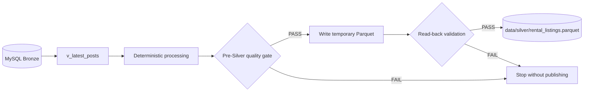

# RoomBeacon Canonical Silver Pipeline

> Status: **CURRENT IMPLEMENTATION**. See [Data Lifecycle](../data/DATA_LIFECYCLE.md) for layer boundaries.

## Canonical contract

- Canonical dataset: `data/silver/rental_listings.parquet`.
- Metadata: `data/silver/rental_listings.metadata.json`.
- Grain: one row per non-null, unique `rental_post_id`.

Silver preserves all Bronze rows and raw/source fields. Deterministic clean values, lineage indicators, anomaly flags, duplicate-candidate evidence, temporal checks, and documented quality statuses are appended. The pipeline does not delete statistical outliers or duplicate candidates and does not guess missing values.

## Publication order

```mermaid
flowchart LR
    B[(MySQL Bronze)] --> V[v_latest_posts]
    V --> P[Deterministic processing]
    P --> G{Pre-Silver quality gate}
    G -->|PASS| T[Write temporary Parquet]
    T --> Q{Read-back validation}
    Q -->|PASS| S[(data/silver/rental_listings.parquet)]
    G -->|FAIL| X[Stop without publishing]
    Q -->|FAIL| X
```

Notebook 02 visibly writes the validated `silver_df` to a temporary Parquet file, reads it back, validates its grain and schema, and atomically replaces the canonical file. DuckDB remains the analytical/query engine and is not required to persist a physical Silver table.

## Critical invariants

- Bronze and Silver row counts match.
- `rental_post_id` is non-null and unique.
- Source identity and raw/source fields are unchanged.
- No join multiplies rows and no transformation silently deletes rows.
- Price and area clean values follow their lineage and validation contracts.
- Ambiguous ward evidence never becomes current ward truth.
- Invalid coordinates are never marked usable.
- Outliers and duplicate candidates remain present and flagged.
- Every quality status belongs to its documented vocabulary.
- Parquet read-back has the expected row count, identity count, grain, and column order.

## Notebook ownership

1. `01_roombeacon_eda.ipynb` performs raw-data EDA only.
2. `02_roombeacon_silver.ipynb` constructs and publishes canonical Silver.
3. `03_roombeacon_processing.ipynb` reads only canonical Silver and prepares analytical/model-ready variables without fitting models.

Gold datasets, model fitting, recommendations, and market rankings are outside this pipeline.
