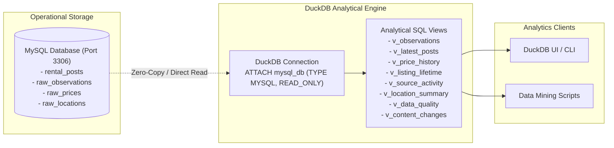

# RoomBeacon Analytics Architecture (DuckDB & In-Memory OLAP)

Tài liệu này đặc tả kiến trúc tầng phân tích dữ liệu (**Analytics Layer**) sử dụng **DuckDB** để khai phá các bản ghi quan sát bất động sản từ MySQL.

---

## 1. Cơ Chế Kết Nối & Tách Biệt Trách Nhiệm (Read-Only Attachment)

---

## 2. 8 Analytical Views Chuẩn Hóa

Hệ thống cung cấp 8 Views phân tích nghiệp vụ tại `analytics/duckdb/sql/`:

| Tên View | Mục đích Nghiệp vụ | Bảng Nguồn |
| :--- | :--- | :--- |
| **`v_observations`** | Tổng hợp toàn bộ bản ghi quan sát Bronze kèm thông tin nguồn. | `raw_observations`, `rental_posts`, `platforms` |
| **`v_latest_posts`** | Danh sách tin đăng mới nhất và số ngày duy trì hoạt động (`active_days`). | `rental_posts`, `platforms` |
| **`v_price_history`** | Lịch sử biến động giá theo từng bài đăng qua các phiên cào. | `raw_prices`, `rental_posts`, `platforms` |
| **`v_listing_lifetime`** | Thống kê tuổi thọ trung bình và tối đa của bài đăng theo sàn. | `rental_posts`, `platforms` |
| **`v_source_activity`** | Tần suất thu thập và số lượng bản ghi theo phiên (`run_id`) và ngày. | `raw_observations`, `platforms` |
| **`v_location_summary`** | Phân bố tin đăng và diện tích trung bình theo quận/huyện/khu vực. | `raw_locations`, `platforms` |
| **`v_data_quality`** | Bảng điểm chất lượng dữ liệu: Tỷ lệ đầy đủ của tiêu đề, giá, diện tích, mô tả. | `raw_observations`, `platforms` |
| **`v_content_changes`** | Phát hiện các bài đăng có sự thay đổi tiêu đề hoặc giá theo thời gian. | `raw_observations`, `rental_posts` |

---

## 3. Nguyên Tắc Vận Hành DuckDB (Operational Rules)

1. **Chỉ đọc (READ_ONLY)**: DuckDB chỉ đính kèm MySQL ở chế độ đọc, tuyệt đối không gửi lệnh `INSERT`, `UPDATE`, `DELETE` sang MySQL.
2. **Độc lập hoàn toàn với Crawler**: Crawler không gọi DuckDB trong quá trình thu thập. Tầng phân tích chỉ chạy sau khi dữ liệu đã được persist vào MySQL.
