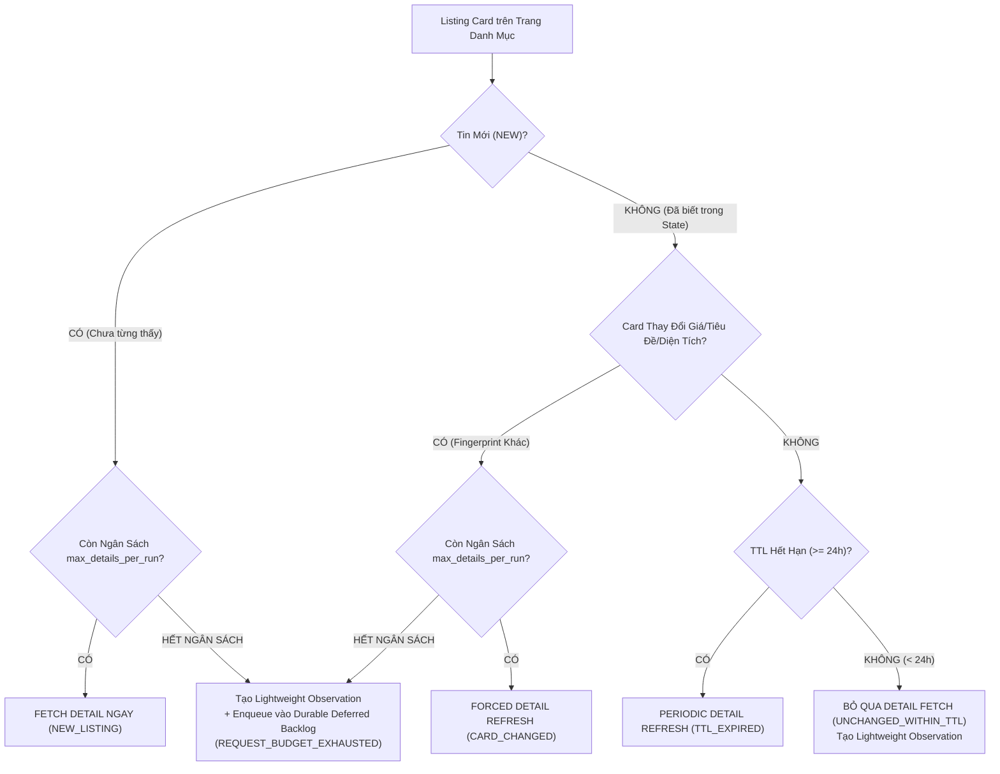

# CHIẾN LƯỢC THU THẬP VÀ HÀNG ĐỢI HOÃN CÀO CHI TIẾT (ACQUISITION STRATEGY & DEFERRED BACKLOG)

Tài liệu này quy định toàn diện kiến trúc thu thập dữ liệu bất động sản cho thuê của hệ thống **RoomBeacon**, phân biệt rõ giữa việc **ghi nhận quan sát thời gian (Temporal Observations)**, **làm mới chi tiết (Detail Refresh)**, và **hàng đợi hoãn cào chi tiết bền vững (Durable Deferred Detail Backlog)** nhằm bảo vệ tài nguyên mạng, ngăn ngừa rớt tin khi tiến trang lịch sử (Historical Frontier), và phân bổ ngân sách công bằng (Fair Budget Scheduling).

---

## 1. Nguyên Lý Đa Tầng (Multi-Tier Crawling)

Hệ thống crawler của RoomBeacon không đồng nhất mọi yêu cầu mạng cho tất cả các tin bài. Quá trình thu thập được phân tầng theo hai cấp độ:

1. **Lightweight Observation (Quan sát nhẹ)**:
   - Thu thập thông tin từ Listing Card trên trang danh mục (tiêu đề, giá, diện tích, vị trí, ngày đăng thô, URL chi tiết).
   - Ghi nhận ngay vào Bronze Dataset và bảng `rental_post_versions` để theo dõi sự tồn tại và vòng đời của tin bài (Lifetime Tracking) mà **không cần tạo thêm network request vào trang chi tiết**.
2. **Detail Refresh (Thu thập chi tiết chuyên sâu)**:
   - Gửi network request tải toàn bộ trang HTML chi tiết (`detail_url`) để bóc tách mô tả đầy đủ, danh sách ảnh, tiện ích, phí dịch vụ và thông tin liên hệ (`post_contacts`, `post_images`, `post_amenities`).

---

## 2. Chính Sách Làm Mới Chi Tiết & Cây Quyết Định (Detail Refresh Policy)

---

## 3. Hàng Đợi Hoãn Cào Chi Tiết Bền Vững (Durable Deferred Detail Backlog)

### 3.1. Vấn Đề Cốt Lõi
Khi quét lịch sử theo chế độ phân trang (Historical Frontier), nếu phát hiện 40 tin mới trên các trang 3..4 nhưng ngân sách an toàn `max_details_per_run` chỉ cho phép cào 20 trang chi tiết, thì 20 tin còn lại bị bỏ qua cào chi tiết. Khi chu kỳ tiếp theo tiến sang trang 5..6, những tin cũ ở trang 3..4 sẽ bị bỏ lỡ vĩnh viễn nếu không có cơ chế lưu vết hoãn.

### 3.2. Cấu Trúc Dữ Liệu Bền Vững (Host-backed State)
Hàng đợi được lưu trữ bền vững tại:
`/data/state/deferred/{source}__{target_id}.json`

Mỗi phần tử công việc (`DeferredDetailItem`) chứa dữ liệu vận hành tinh gọn:
- `source`: Tên nguồn (ví dụ: `nhatrovn`).
- `platform_post_id`: Mã tin bài nguồn (Identity đơn định, chống trùng lặp).
- `detail_url`: Đường dẫn trang chi tiết.
- `origin_run_id`: Phiên crawl phát hiện tin.
- `first_deferred_at`: Thời điểm đầu tiên bị hoãn.
- `last_attempt_at`: Thời điểm thử gần nhất.
- `attempt_count`: Số lần đã thử cào.
- `reason`: Lý do hoãn (`REQUEST_BUDGET_EXHAUSTED`).
- `status`: Trạng thái (`PENDING`, `COMPLETED`, `TERMINAL_FAILED`).
- `card_title`, `card_price`, `card_area`, `card_location`: Dữ liệu thẻ lưu vết.

### 3.3. Vòng Đời Thử Lại (Retry Lifecycle)
1. **Thành công (Deferred Success)**: Cào chi tiết thành công $\rightarrow$ Ghi nhận Bronze detail $\rightarrow$ Xóa khỏi hàng đợi `PENDING`, cập nhật `last_detailed_at` trong `seen_state`.
2. **Thất bại tạm thời (Transient Failure)**: Timeout hoặc lỗi mạng $\rightarrow$ Giữ nguyên trong hàng đợi, tăng `attempt_count += 1`, cập nhật `last_attempt_at`.
3. **Thất bại vĩnh viễn (Terminal Failure)**: Nhận mã lỗi 404/410 hoặc vượt quá `max_retries = 3` $\rightarrow$ Chuyển sang `TERMINAL_FAILED` để không retry vô tận.

---

## 4. Điều Phối Ngân Sách Công Bằng (Fair Budget Scheduling)

Để ngăn chặn hiện tượng một luồng công việc làm tê liệt (starve) luồng công việc còn lại, `DeferredBudgetScheduler` phân bổ ngân sách `max_details_per_run` theo nguyên tắc:

$$\text{Deferred Quota} = \min(\text{Pending Backlog}, \lceil \text{max\_details} \times \text{deferred\_share\_ratio} \rceil)$$

$$\text{Immediate Quota} = \text{max\_details} - \text{Deferred Quota}$$

- **Chống bỏ đói Backlog**: Dành sẵn hạn ngạch (mặc định 50%) để xử lý dứt điểm các tin cũ bị hoãn.
- **Chống bỏ đói Discovery mới**: Dành sẵn 50% cho các tin mới phát hiện trên các trang hiện tại.
- **Cơ chế Dynamic Spillover**: Nếu hàng đợi hoãn chỉ có ít tin (ví dụ 3 tin trong quota 10), 7 slot còn lại tự động nhượng lại cho luồng Discovery mới (Immediate Quota = 17).

---

## 5. Hệ Thống Chỉ Số Đo Lường & Định Luật Bảo Toàn Toán Học

### 5.1. Định luật bảo toàn:
$$\text{detail\_required} = \text{detail\_requested} + \text{detail\_skipped}$$

$$\text{detail\_requested} = \text{detail\_succeeded} + \text{detail\_failed}$$

$$\text{detail\_skipped} = \text{skipped\_known\_unchanged\_ttl} + \text{skipped\_no\_detail\_url} + \text{skipped\_request\_budget} + \text{skipped\_source\_policy} + \text{skipped\_other}$$

$$\text{Deferred Remaining} = \text{Deferred Backlog Before} - \text{Deferred Succeeded} - \text{Deferred Terminal} + \text{Deferred Added}$$

$$\text{Detail Coverage} = \frac{\text{Detailed Unique Listings}}{\text{Total Unique Listings Seen}} \times 100\%$$

$$\text{Lightweight-only Listings} = \text{Total Unique Listings Seen} - \text{Detailed Unique Listings}$$
