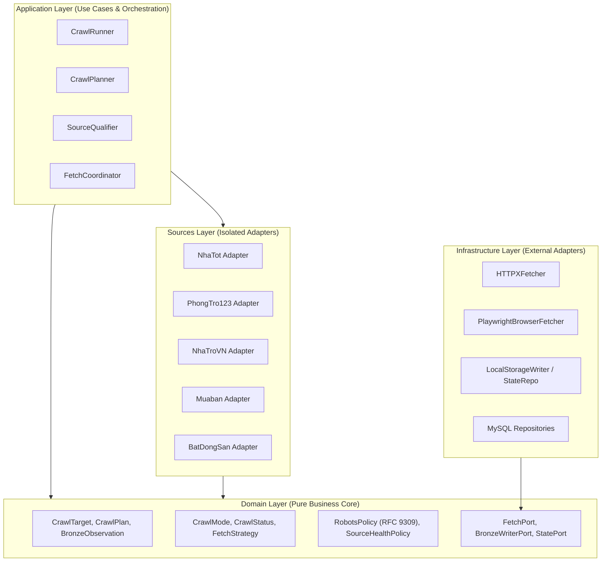

# RoomBeacon Crawler Architecture (Hexagonal Design)

Tài liệu này đặc tả chi tiết kiến trúc tầng Crawler của RoomBeacon theo mô hình **Hexagonal Architecture (Ports and Adapters)**.

---

## 1. Cấu Trúc Lớp của Crawler (Layered Onion Model)

---

## 2. Các Thành Phần Chính (Core Components)

### 2.1. Domain Layer (`domain/`)
- **Models**: Thuần túy là các cấu trúc dữ liệu (`dataclass`) không phụ thuộc Framework: `CrawlTarget`, `CrawlPlan`, `CrawlRunResult`, `ListingCardRaw`, `ListingDetailRaw`, `RentalBronzeRecord`, `BronzeObservation`, `SourceCapabilities`.
- **Enums**: Định danh trạng thái và chế độ: `CrawlMode`, `CrawlStatus`, `FetchStrategy`, `SourceAccessProfile`.
- **Policies**: Quy tắc nghiệp vụ cốt lõi:
  - `RobotsPolicy`: Thẩm định robots.txt theo RFC 9309.
  - `SourceHealthPolicy`: Thuật toán Exponential Backoff Cooldown.
- **Ports**: Giao diện trừu tượng (`ABC`):
  - `FetchPort`, `BrowserFetchPort`
  - `BronzeWriterPort`
  - `CheckpointRepositoryPort`, `SeenListingRepositoryPort`, `SourceHealthRepositoryPort`

### 2.2. Application Layer (`application/`)
- **`CrawlPlanner`**: Tính toán chế độ thu thập (`BOOTSTRAP_FULL`, `BOOTSTRAP_CONTINUE`, `INCREMENTAL`, `FORWARD_ONLY_INCREMENTAL`) dựa trên watermark, checkpoint và capabilities.
- **`SourceQualifier`**: Thẩm định URL trước khi thực thi (Chặn SSRF, kiểm tra robots.txt, kiểm tra health cooldown).
- **`FetchCoordinator`**: Điều phối chọn transport (`HTTP` vs `BROWSER`) và xử lý retry an toàn.
- **`CrawlRunner`**: Điều phối luồng cào dữ liệu, phân loại tin mới/cũ/trùng lặp, ngắt phiên có kiểm soát.

### 2.3. Source Adapters (`sources/`)
Mỗi website bất động sản là một module độc lập tự chứa:
- `adapter.py`: Khai báo `CAPABILITIES`, URL phân loại và liên kết parsers.
- `parsers/listing_parser.py`: Bóc tách thẻ tin danh mục thành `list[ListingCardRaw]`.
- `parsers/detail_parser.py`: Bóc tách trang chi tiết thành `ListingDetailRaw`.
- `discovery/pagination.py`: Xử lý phân trang hoặc vô hiệu hóa phân trang đối với nguồn forward-only.

---

## 3. Quy Tắc Không Nhánh Nguồn Trong Core (No Source-Branching Invariants)

Generic Core Engine (`CrawlRunner`, `CrawlPlanner`, `SourceQualifier`) tương tác với các nguồn **duy nhất qua `SourceCapabilities` và `BaseSourceAdapter`**:
- **Cấm**: `if source == "nhatot": ...`
- **Chuẩn**: `if not adapter.CAPABILITIES.supports_pagination: ...`
