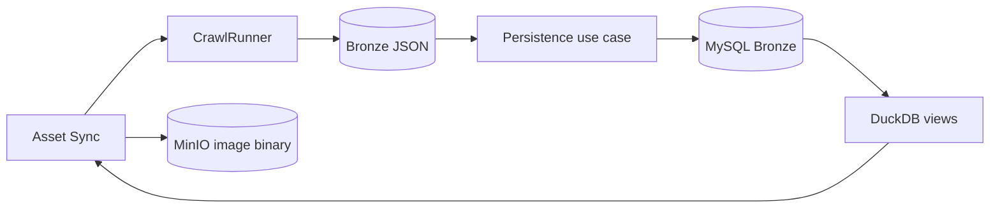
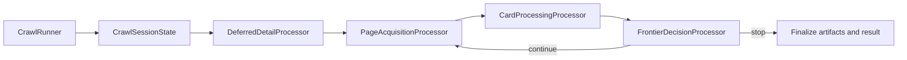
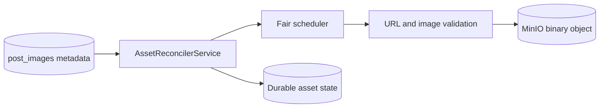

# RoomBeacon — Crawl & Storage Flow

> Mục đích: trace authoritative từ Airflow trigger đến crawl, Bronze artifacts, MySQL, state, assets và DuckDB.
>
> Trạng thái: **CURRENT**, đối chiếu trực tiếp với source ngày 2026-08-24. Khi tài liệu này và code khác nhau, code và tests là nguồn chuẩn.

## 1. Mục đích

Tài liệu trả lời dữ liệu đi qua đâu, component nào sở hữu từng bước và symbol nào thực thi bước đó. Nó mô tả implementation hiện có; không biến parser validation thành data cleaning và không mô tả schema-only capability như runtime behavior.

## 2. Big Picture



Crawler tạo artifact trước. Task persistence đọc lại artifact đó và ghi MySQL trong transaction riêng. Checkpoint thành công chỉ được advance sau persistence.

## 3. Airflow Crawl Flow

`roombeacon_crawler()` tạo task graph sau, với bốn task giữa được dynamic-map theo từng plan:

| Task | Mục đích | Input | Output | Dependency tiếp theo |
|---|---|---|---|---|
| `01_config_load_sources` | lấy scheduled seeds từ adapters đã đăng ký | không có | `list[dict]` seed | planning |
| `02_config_plan_crawls` | chọn target đến hạn và crawl mode từ checkpoint/params | seeds, DAG params | `list[dict]` plan | qualification |
| `03_crawl_check_eligibility` | health cooldown, URL safety, robots preflight | một plan | qualification payload | execution |
| `04_crawl_execute_source` | gọi `CrawlRunner`, trả result/artifact paths | qualification payload | crawl result payload | persistence |
| `05_storage_save_bronze` | load Bronze directory và persist observations | crawl result | persistence result | checkpoint |
| `06_state_update_checkpoint` | ghi target state, seen IDs và source health | persistence result chứa crawl result | checkpoint result | analytics |
| `07_analytics_refresh_duckdb` | bootstrap read-only attachment/views | toàn bộ checkpoint results | analytics status | asset sync |
| `08_assets_sync_minio` | reconcile một batch ảnh bounded/fair từ `post_images` | analytics completion | asset metrics | summary |
| `09_report_run_summary` | tổng hợp fleet, analytics và asset metrics | outputs của các stage | summary dict/log | kết thúc |

Các wrapper trong DAG gọi module `application.orchestration` và chỉ translate `CrawlerWorkflowError` thành `AirflowException`. Analytics, asset sync và report dùng `ALL_DONE`; persistence vẫn đứng trước checkpoint trong mapped chain. Asset sync không mapped và không crawl lại HTML.

Graph chỉ có chuỗi chín node tuyến tính. Task report lấy outputs hoàn tất của các
stage mapped qua runtime XCom pull thay vì khai báo thêm XComArg edges, nên UI
không vẽ các cạnh chéo từ CONFIG/CRAWL/STORAGE vào REPORT. Payload gửi đến
application reporting không đổi.

## 4. Crawler Internal Flow



- `CrawlRunner.execute_crawl()` là synchronous entry point; `run()` resolve options, adapter target type và run identity.
- `CrawlSessionState` giữ records, metadata, seen identities, counters, frontier và stop state của đúng một run; không tạo client.
- `DeferredDetailProcessor.execute()` chạy trước page loop và dành detail budget của
  source cho backlog eligible cũ trước. Item chưa từng được thử được ưu tiên theo
  `first_deferred_at`; retry thất bại chỉ quay lại sau exponential backoff.
- `PageAcquisitionProcessor.execute()` build page URL/`CrawlTarget`, gọi `ListingCrawlPipeline.execute()` và phân loại `READY`, robots, access, fetch error hoặc source end. Nó không xử lý card.
- `CardProcessingProcessor.execute()` resolve stable source identity, same-run dedup, known/new và content fingerprint; áp dụng detail TTL, fetch detail ngay hoặc enqueue khi hết budget; append một Bronze observation nhẹ/đầy đủ.
- `FrontierDecisionProcessor.after_acquisition()` và `after_cards()` quyết định source/access stop, forward complete, known-region stop, max records/pages, historical continuation và page increment.
- `_run_async()` còn orchestration: load seen metadata, gọi các processors theo thứ tự, aggregate `CrawlRunResult`, ghi Bronze dataset rồi manifest.

## 5. Source Adapter Flow

`SourceRegistry` auto-discovers adapter classes, index theo domain; `SourceResolver` tạo adapter cho URL. `FetchCoordinator` chọn transport qua `StrategySelector`, throttle, retry/backoff, fetch và classify response. Parser vẫn riêng từng source.

| Source | Adapter | Listing/detail parsers | Fetch và capability hiện tại |
|---|---|---|---|
| `phongtro123` | `Phongtro123SourceAdapter` | `Phongtro123ListingParser` / `Phongtro123DetailParser` | HTTP; pagination và detail supported |
| `nhatrovn` | `NhatroVNSourceAdapter` | `NhatroVNListingParser` / `NhatroVNDetailParser` | HTTP; pagination và detail supported |
| `nhatot` | `NhatotSourceAdapter` | `NhatotListingParser` / `NhatotDetailParser` | Browser; forward-only/no pagination; sitemap/seed discovery capability; detail supported |
| `batdongsan` | `BatDongSanSourceAdapter` | `BatDongSanListingParser` / `BatDongSanDetailParser` | HTTP, access-challenged; no pagination; sitemap capability; detail disabled by capability |
| `muaban` | `MuabanSourceAdapter` | `MuabanListingParser` / `MuabanDetailParser` | HTTP, access-challenged; no pagination; sitemap capability; detail disabled by capability |
| `chothuenha` | `ChothuenhaSourceAdapter` | source-specific listing/detail parsers | HTTP `?page=N`; robots-allowed pagination; active, bounded 5-page bootstrap |
| `tromoi` | `TromoiSourceAdapter` | source-specific listing/detail parsers | HTTP `?page=N`; robots-allowed pagination; active, bounded 5-page bootstrap |
| `guland` | `GulandSourceAdapter` | source-specific listing/detail parsers | HTTP; JS pagination not modeled; active but access-challenge policy may cool down |
| `chothuephongtro` | `ChothuephongtroSourceAdapter` | source-specific listing/detail parsers | HTTP `?page=N`; Batch 2 active, bounded 5-page bootstrap |
| `mogi` | `MogiSourceAdapter` | source-specific listing/detail parsers | HTTP `?cp=N`; Batch 2 active, bounded 5-page bootstrap |
| `cafeland` | `CafelandSourceAdapter` | source-specific listing/detail parsers | HTTP `/page-N/`; Batch 3 active, bounded 5-page bootstrap |
| `phongtrotoanquoc` | `PhongtrotoanquocSourceAdapter` | source-specific listing/detail parsers | Browser candidate; no valid text robots policy/server cards; disabled |

Có detail parser class không đồng nghĩa scheduler sẽ fetch detail: `CAPABILITIES.detail_fetch_supported` và resolved execution options quyết định behavior thực tế.

## 6. HTML → Observation

```text
HttpFetcher/BrowserFetcher
→ CapturedResponse.html
→ source listing_parser.parse()
→ ListingCardRaw
→ ListingValidator (structural validity)
→ optional source detail_parser.parse()
→ ListingDetailRaw + DetailValidator
→ BronzeMapper.map()
→ RentalBronzeRecord
→ JSON artifact
→ BronzeObservationLoader
→ BronzeObservation
```

Ranh giới semantics:

| Stage | Ý nghĩa |
|---|---|
| Extraction | parser lấy source-near strings, URLs, attributes từ HTML |
| Technical normalization | `MySQLBronzeMapper` parse giá/diện tích thành numeric với plausibility guard khi ghi child tables |
| Validation | listing/detail validators kiểm tra model tối thiểu; URL/response policies kiểm tra acquisition safety |
| EDA cleaning | **không nằm trong crawl/persistence flow**; versioned semantic cleaning và cleaned Silver chưa được triển khai |

Các trường `*_raw` được giữ lại. Numeric price/area là giá trị kỹ thuật hỗ trợ query, không phải chứng nhận dữ liệu đã sạch.

### Address enrichment

```text
Listing page → location_raw (có thể chỉ district/city)
Detail page  → address_raw (full source-near address nếu source cung cấp)
BronzeMapper → detail address thắng coarse card location
post_addresses.full_address_text
→ v_observations / v_latest_posts
```

PhongTro123 lấy address từ hàng có label `Địa chỉ:` với JSON-LD PostalAddress làm controlled fallback. NhaTroVN ưu tiên JSON-LD Residence và chỉ fallback trong main room card. NhaTot ưu tiên `Product.offers.availableAtOrFrom.address.streetAddress`, sau đó section có label chính xác `Địa chỉ bất động sản`; generic recommendation/footer address không được dùng. Parser không tìm global address-like text nên breadcrumb, recommendation, quảng cáo và modal không thể thay thế địa chỉ listing chính. Component street/ward/district/province chỉ được ghi khi source cung cấp hoặc parser có evidence chắc chắn; implementation hiện bảo toàn full raw string và không đoán component.

## 7. Bronze Filesystem Storage

`LocalStorageWriter` ghi dưới data root đã cấu hình:

```text
<data_dir>/
├── bronze/<source>/<YYYY-MM-DD>/<run_id>/
│   ├── listings.json
│   ├── details.json      # chỉ khi có detail thành công
│   └── metadata.json
└── manifests/<source>/<YYYY-MM-DD>/<run_id>.json
```

- `save_bronze_dataset()` chỉ tạo run directory khi `records` không rỗng.
- `listings.json` serialize `RentalBronzeRecord`; `details.json` giữ `ListingDetailRaw`; `metadata.json` giữ acquisition metadata.
- `save_manifest()` chạy cho cả run không tạo Bronze dataset, gồm status, frontier và artifact path.
- Runner ghi Bronze dataset trước manifest và đưa cả hai path vào `CrawlRunResult`.
- Các file này hiện được ghi trực tiếp bằng `open(..., "w")`; không có temp-file/atomic rename hay artifact-level idempotency trong writer. MySQL replay idempotency là lớp bảo vệ riêng.

## 8. MySQL Bronze Persistence

`persist_bronze_mysql()` chỉ chạy khi crawl success và có `bronze_path`. `BronzeObservationLoader.load_from_bronze_dir()` đọc `listings.json`, merge `details.json` theo listing ID, tạo content hash và `BronzeObservation`. `PersistBronzeObservationsUseCase.execute()` ghi theo thứ tự:

1. `platforms`: get-or-create source platform.
2. `rental_posts`: stable identity theo unique `(platform_id, platform_post_id)`; cập nhật URL/title/last observed.
3. `rental_post_versions`: một observation theo crawl run, unique `(rental_post_id, crawl_run_id)`.
4. Nếu version mới, `MySQLPostChildrenRepository.persist_children()` ghi `post_prices`, `post_addresses`, `post_details`, `post_images`, `post_amenities`, rồi `post_contacts`.

Repository chỉ ghi `observation.address_raw` vào `post_addresses`. `location_raw` từ listing card có thể chỉ là district/city nên chỉ được giữ trong Bronze artifact, không được coi là full address hay thay thế địa chỉ detail đã xác nhận.

`rental_posts` đại diện cùng một tin xuyên nhiều lần crawl. `rental_post_versions` bảo toàn mỗi lần quan sát, vì giá/nội dung/trạng thái có thể thay đổi theo thời gian. Retry cùng run không tạo version thứ hai.

Schema còn định nghĩa `post_fees`, `post_attributes` và `post_status_history`, nhưng persistence path hiện tại không insert các bảng này. Không coi chúng là output active.

## 9. Transaction & Idempotency

- `MySQLTransactionManager.begin()` mở một connection/transaction cho toàn batch và inject connection đó vào bốn repositories.
- Mọi observation và child insert thuộc cùng transaction; thành công gọi `commit()`, exception gọi `rollback()`.
- Deadlock được nhận diện từ error code/text và retry tối đa ba lần với exponential delay cộng jitter.
- Stable identity được bảo vệ bởi unique `(platform_id, platform_post_id)` và upsert.
- Observation retry được bảo vệ bằng lookup và unique `(rental_post_id, crawl_run_id)`; duplicate kỹ thuật không ghi lại children.
- SQL sử dụng bound parameters. Error boundary log class/context an toàn rồi raise `PersistenceError`/`CrawlerWorkflowError` không kèm raw SQL params.

## 10. Checkpoint / Historical State

Persistent crawler state khác Bronze business data:

| State | Location | Owner | Nội dung |
|---|---|---|---|
| target checkpoint | `<data_dir>/state/targets/<source>__<target>.json` | `LocalCrawlStateRepository` | schedule, last status, bootstrap completion/next page |
| seen/detail metadata | `<data_dir>/state/seen/<source>__<target>.json` | `LocalCrawlStateRepository` | seen IDs, card fingerprint, last detailed time |
| deferred details | `<data_dir>/state/deferred/<source>__<target>.json` | `LocalDeferredDetailRepository` | detail jobs, attempts và terminal state |
| source health | `<data_dir>/state/health/<source>__<target>.json` | `LocalSourceHealthRepository` | failure streak, cooldown, last outcome |
| asset state | `data/state/assets/<source>/<asset_id>.json` hoặc `/data/...` fallback | `LocalAssetStateRepository` | upload/retry status và object key |
| reconciler summary | `/data/state/bronze_reconciler.json` | `BronzeReconcilerService` | last reconciliation accounting |
| discovery artifacts/state | `/data/discovery/...` | `DiscoveryStorage` | candidate URLs và discovery frontier; là subsystem riêng |

Local crawl, deferred, health và discovery state dùng temp file + `os.replace()` khi save. `update_checkpoint()` chỉ advance success checkpoint sau persistence `SUCCESS`; controlled access/robots failure cập nhật state/health nhưng không giả lập thành công.

Detail backlog là durable giữa process/DAG runs. Mỗi source/target có queue riêng,
vì vậy backlog lớn của một source không tiêu budget của source khác. Một detail
success được remove khỏi queue và ghi `last_detailed_at` cùng trạng thái
`SUCCESS_WITH_ADDRESS` hoặc `SUCCESS_WITHOUT_ADDRESS`; page processing cùng run
phải giữ metadata này. Known listing unchanged và TTL-valid không chiếm budget.
Failure được ghi `FAILED`, tăng attempts và có `next_attempt_at`, nên một URL lỗi
không monopolize đầu queue. Giới hạn 20 là per source execution/run, không phải
giới hạn coverage trọn đời: các run sau tiếp tục drain những identity khác.

## 11. Bronze Reconciliation

Bronze reconciler là self-healing path:

```text
/data/bronze/<source>/<date>/<run_id>
→ BronzeRunDiscoveryService.discover_bronze_runs()
→ compare run record_count với MySQL counts theo crawl_run_id
→ chọn partial/fully missing runs
→ mapped BronzeReconcilerService.reconcile_single_run()
→ cùng BronzeObservationLoader + PersistBronzeObservationsUseCase
→ verify MySQL → refresh DuckDB → summary/checkpoint
```

Discovery bỏ run không có readable `listings.json`. Batch mặc định chọn tối đa 25 run. Replay an toàn nhờ observation idempotency; so sánh hiện dựa trên `run_id` counts nên đây là recovery cho artifact hợp lệ, không phải artifact repair.

## 12. Asset → MinIO Flow



Parser phát hiện image URL; `BronzeMapper` giữ `image_urls_raw`; MySQL children persistence tạo một `post_images` row cho mỗi URL. Asset DAG sau đó:

1. query HTTP(S) candidates từ `post_images` theo source;
2. loại asset success/terminal hoặc đã hết retry trong local state;
3. `FairAssetScheduler.allocate_fair_batch()` chia batch đa nguồn với spillover;
4. validate public HTTP URL và từng redirect để chặn outbound target không an toàn;
5. tải streaming với timeout, redirect limit và 15 MiB bound;
6. nhận diện image format từ bytes, không chỉ tin header;
7. tạo deterministic asset ID/object key bằng `AssetItem` và upload `put_object()`;
8. lưu success/retryable/terminal state.

MySQL giữ metadata/reference; MinIO giữ binary. Latest-state Parquet/Silver path không chứa image binary.

## 13. DuckDB Analytics Boundary

`bootstrap_analytics()` lấy DuckDB connection read-only tới MySQL và `DuckDBViewManager.create_views()` load chín SQL files:

`v_observations`, `v_latest_posts`, `v_price_history`, `v_content_changes`, `v_source_activity`, `v_listing_lifetime`, `v_location_summary`, `v_data_quality`, `v_acquisition_efficiency`.

- `v_observations`: một row cho mỗi `rental_post_versions`, join một representative price/address/detail child để tránh nhân dòng.
- `v_latest_posts`: `ROW_NUMBER()` theo `rental_post_id`, chọn observation mới nhất;
  giá bám observation hiện tại, còn address/area hợp lệ gần nhất được kế thừa có
  cờ provenance `full_address_inherited` và `area_inherited`; một row/listing.

DuckDB là query engine. `v_latest_posts` là latest-state view, không phải cleaned Silver.

## 14. Code Map

| Flow Step | Component | File | Symbol |
|---|---|---|---|
| DAG graph | Airflow DAG | `airflow/dags/crawler/roombeacon_crawler.py` | `roombeacon_crawler` |
| target load | planning workflow | `crawler/src/roombeacon_crawler/application/orchestration/planning.py` | `load_crawl_targets` |
| crawl planning | planning workflow | same file | `plan_crawls` |
| qualification | qualification workflow | `crawler/src/roombeacon_crawler/application/orchestration/qualification.py` | `qualify_target` |
| crawl execution boundary | execution workflow | `crawler/src/roombeacon_crawler/application/orchestration/execution.py` | `execute_crawl` |
| run orchestration | crawler façade | `crawler/src/roombeacon_crawler/pipeline/crawl_runner.py` | `CrawlRunner.run`, `_run_async` |
| session state | typed state | `crawler/src/roombeacon_crawler/application/crawl/session_state.py` | `CrawlSessionState` |
| deferred details | application processor | `crawler/src/roombeacon_crawler/application/crawl/deferred_details.py` | `DeferredDetailProcessor.execute` |
| page acquisition | application processor | `crawler/src/roombeacon_crawler/application/crawl/page_acquisition.py` | `PageAcquisitionProcessor.execute` |
| listing fetch/parse | acquisition pipeline | `crawler/src/roombeacon_crawler/pipeline/listing_crawl.py` | `ListingCrawlPipeline.execute` |
| card processing | application processor | `crawler/src/roombeacon_crawler/application/crawl/card_processing.py` | `CardProcessingProcessor.execute` |
| detail fetch/parse | acquisition pipeline | `crawler/src/roombeacon_crawler/pipeline/detail_crawl.py` | `DetailCrawlPipeline.execute` |
| frontier | decision processor | `crawler/src/roombeacon_crawler/application/crawl/frontier_decision.py` | `after_acquisition`, `after_cards` |
| source resolution | registry/resolver | `crawler/src/roombeacon_crawler/sources/registry.py` | `SourceRegistry`, `source_registry` |
| transport/retry | fetch service | `crawler/src/roombeacon_crawler/services/fetch_coordinator.py` | `FetchCoordinator.fetch` |
| card/detail mapping | Bronze mapper | `crawler/src/roombeacon_crawler/mappers/bronze_mapper.py` | `BronzeMapper.map` |
| filesystem publication | local adapter | `crawler/src/roombeacon_crawler/infrastructure/storage/local/local_storage_writer.py` | `save_bronze_dataset`, `save_manifest` |
| artifact loading | loader | `crawler/src/roombeacon_crawler/mappers/bronze_observation_loader.py` | `load_from_bronze_dir` |
| persistence workflow | application orchestration | `crawler/src/roombeacon_crawler/application/orchestration/persistence.py` | `persist_bronze_mysql` |
| transaction use case | application persistence | `crawler/src/roombeacon_crawler/application/persistence/persist_observations.py` | `PersistBronzeObservationsUseCase.execute` |
| stable listing identity | MySQL repository | `crawler/src/roombeacon_crawler/infrastructure/mysql/repositories/rental_post_repository.py` | `upsert_post` |
| observation version | MySQL repository | `crawler/src/roombeacon_crawler/infrastructure/mysql/repositories/observation_repository.py` | `insert_observation` |
| child rows | MySQL repository | `crawler/src/roombeacon_crawler/infrastructure/mysql/repositories/post_children_repository.py` | `persist_children` |
| transaction boundary | MySQL adapter | `crawler/src/roombeacon_crawler/infrastructure/mysql/transaction.py` | `MySQLTransactionManager` |
| checkpoint/health | application workflow | `crawler/src/roombeacon_crawler/application/orchestration/checkpoint.py` | `update_checkpoint` |
| Bronze discovery | reconciliation service | `crawler/src/roombeacon_crawler/application/reconciliation/discovery.py` | `discover_bronze_runs` |
| Bronze replay | reconciliation service | `crawler/src/roombeacon_crawler/application/reconciliation/reconciler.py` | `reconcile_single_run` |
| scheduled asset boundary | main Airflow DAG | `airflow/dags/crawler/roombeacon_crawler.py` | `08_assets_sync_minio` |
| manual asset recovery | manual-only Airflow DAG | `airflow/dags/assets/roombeacon_asset_reconciler.py` | `roombeacon_asset_reconciler` |
| asset orchestration | application workflow | `crawler/src/roombeacon_crawler/application/orchestration/assets.py` | `sync_assets_minio` |
| asset processing | application service | `crawler/src/roombeacon_crawler/application/assets/asset_reconciler.py` | `reconcile_batch`, `_process_single_asset` |
| asset identity/key | domain model | `crawler/src/roombeacon_crawler/models/asset_item.py` | `generate_asset_id`, `generate_object_key` |
| DuckDB refresh | analytics | `analytics/duckdb/bootstrap.py` | `bootstrap_analytics` |
| analytical views | analytics | `analytics/duckdb/views.py` | `DuckDBViewManager.create_views` |

## 15. Failure & Recovery

- Qualification failure tạo controlled skipped/deferred payload; không gọi crawler hoặc persistence.
- Fetch failures được classify và retry theo policy; frontier lưu bootstrap next page khi cần.
- Detail budget overflow enqueue durable backlog; terminal 404/410 được phân loại riêng.
- Crawl luôn cố ghi manifest; Bronze dataset chỉ có khi có observations.
- Persistence exception rollback toàn batch; deadlock được retry hữu hạn; checkpoint thành công không advance nếu persistence fail.
- Bronze reconciler replay artifact bị thiếu trong MySQL qua cùng idempotent use case.
- Asset failures có retryable/terminal state; success object không được tải lại.
- Analytics refresh failure được trả thành status và không rollback Bronze/MySQL đã commit.

## 16. Summary

RoomBeacon tách acquisition khỏi persistence bằng Bronze artifact boundary. Stable listing identity và observation history sống trong MySQL; operational frontier/health/backlog sống trong local state; image metadata ở MySQL nhưng binary ở MinIO; DuckDB chỉ đọc và dựng analytical views. Cleaned Silver/Gold không nằm trong flow hiện tại.
