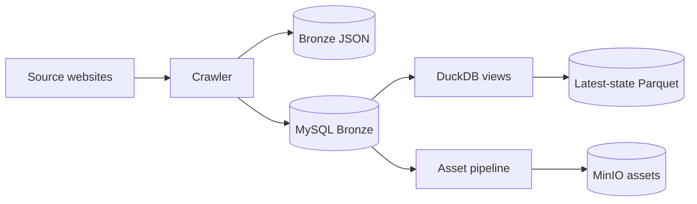
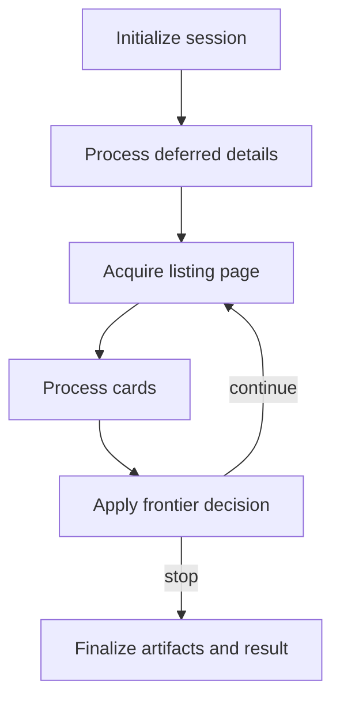
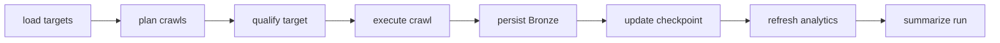
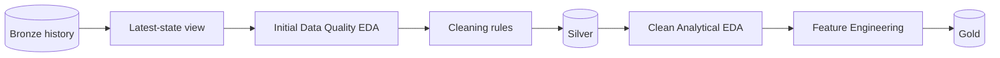
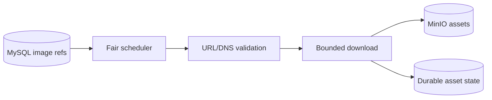

# RoomBeacon — Current Architecture

> Mục đích: source of truth trực quan cho kiến trúc đã được triển khai.
>
> Trạng thái: **CURRENT / IMPLEMENTED**, sau Phase 0–1.2E ngày 2026-08-24.

## 1. System overview

| Component | Vai trò | Input | Output | Không phụ trách |
|---|---|---|---|---|
| Airflow | Schedule, mapped tasks, dependency graph | target/config metadata | task payloads | parser rules, SQL business logic |
| Crawler | Acquisition và source-near extraction | source URL | Bronze records/metadata | Silver cleaning, serving |
| MySQL Bronze | Identity và observation history | Bronze observations | relational history | analytical serving |
| DuckDB | Read-only analytical engine | MySQL Bronze | SQL views | logical data-layer ownership |
| Latest-state materializer | Snapshot publication | `v_latest_posts` | Parquet + metadata | semantic cleaning |
| Asset pipeline | Safe image reconciliation | image references | MinIO objects/state | listing acquisition |

## 2. Crawler execution flow

### `CrawlRunner`

**Vai trò:** orchestration façade cho một crawl run.

**Flow:** initialize → deferred details → page acquisition → card processing → frontier decision → finalize.

**Không phụ trách:** Airflow scheduling, MySQL SQL implementation, source-specific selectors.

### Application crawl components

| Component | Responsibility | Không làm |
|---|---|---|
| `CrawlSessionState` | Typed mutable state của đúng một run | tạo client hoặc truy cập persistence |
| `DeferredDetailProcessor` | Fair backlog quota và deferred detail outcomes | page acquisition/frontier |
| `PageAcquisitionProcessor` | Build target, gọi listing pipeline, classify page | card/detail decisions |
| `CardProcessingProcessor` | identity, dedup, change/TTL, detail/defer, observation updates | page fetch/frontier/checkpoint |
| `FrontierDecisionProcessor` | historical, incremental, forward stop/continue transitions | acquisition/card processing |
| `CrawlExecutionOptions` | Resolve plan/override/capability thành limits immutable | runtime I/O |

`CrawlRunner` hiện 428 LOC và `_run_async` 124 LOC. Hai hotspot CrawlRunner/DAG đã resolved; repository-wide composition ownership vẫn partial vì một số application workflow còn compose concrete MySQL adapters.

## 3. Airflow orchestration

Crawler DAG chỉ giữ decorators, task mapping, schedule/params, dependency graph và translation từ safe application error sang Airflow failure. Persistence hoàn tất trước khi success checkpoint được advance.

Code path theo từng task, processor, repository và storage boundary được trace tại [Crawl & Storage Flow](CRAWL_AND_STORAGE_FLOW.md).

Năm DAG hiện có: crawler, Bronze reconciliation, asset reconciliation, latest-state materialization và system healthcheck.

## 4. Persistence model

- Listing identity: unique `(platform_id, platform_post_id)`.
- Observation idempotency: unique `(rental_post_id, crawl_run_id)`.
- Child observations: price, address, detail, image, amenity, fee, contact và attributes.
- Một transaction bao batch persistence; SQL dùng bind parameters.
- JSON Bronze/manifests nằm dưới configured host data directory.
- Local repositories giữ checkpoint, source health, deferred-detail và asset state.

## 5. Data lifecycle

| Stage | Status |
|---|---|
| Bronze JSON/MySQL history | **IMPLEMENTED** |
| `v_latest_posts` one-row/listing view | **IMPLEMENTED** |
| Latest-state Parquet | **IMPLEMENTED** |
| Initial Data Quality EDA | **PARTIAL** |
| Versioned cleaning rules | **PLANNED** |
| Cleaned semantic Silver | **NOT IMPLEMENTED** |
| Gold | **NOT IMPLEMENTED** |

Chi tiết semantics nằm tại [Data Lifecycle](../data/DATA_LIFECYCLE.md).

## 6. Asset pipeline

Pipeline kiểm tra outbound URL, redirect target và response size; lỗi được phân loại retryable/terminal. MinIO active path lưu binary image assets. Không có evidence active crawler Raw HTML uploader.

## 7. Công cụ và logical layers

| Khái niệm | Bản chất |
|---|---|
| DuckDB | Analytical/query engine |
| Pandas | DataFrame/EDA tool |
| Parquet | Physical columnar file format |
| Bronze/Silver/Gold | Logical data layers |

Không suy ra một file là Silver chỉ vì file đó có định dạng Parquet.

## 8. CURRENT, PARTIAL và FUTURE

**IMPLEMENTED:** crawler, Bronze history, reconciliation, MinIO asset path, DuckDB views, latest-state snapshot.

**PARTIAL:** Initial EDA và repository-wide Clean Architecture composition.

**PLANNED:** cleaning-rule contract, cleaned Silver, clean analytical EDA.

**FUTURE / NOT IMPLEMENTED:** Gold, serving API/UI, ClickHouse runtime, MySQL replica service, cross-source entity deduplication.
