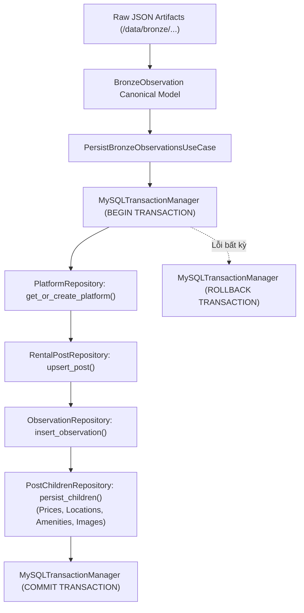

# RoomBeacon Data Persistence Architecture (Bronze to MySQL)

Tài liệu này đặc tả kiến trúc lưu trữ dữ liệu thô Bronze vào hệ quản trị cơ sở dữ liệu quan hệ **MySQL**, đảm bảo tính toàn vẹn giao dịch và mô hình dữ liệu quan sát bất biến.

---

## 1. Luồng Lưu Trữ Dữ Liệu Quan Sát (Persistence Flow)

---

## 2. Mô Hình Dữ Liệu MySQL (Database Schema Design)

1. **`platforms`**: Danh mục các sàn bất động sản (`nhatot`, `phongtro123`, `nhatrovn`, `batdongsan`, `muaban`).
2. **`rental_posts`**: Bảng thực thể bài đăng gốc, chứa định danh ổn định `(platform_id, source_listing_id)`, thời điểm quan sát đầu tiên (`first_observed_at`) và gần nhất (`last_observed_at`).
3. **`raw_observations`**: Bảng dữ liệu quan sát bất biến (Immutable Observations) được ghi nhận sau mỗi phiên cào dữ liệu (`run_id`, `observed_at`, `raw_payload`).
4. **Bảng dữ liệu thành phần (Child Tables)**:
   - `raw_prices`: Lịch sử giá theo từng quan sát.
   - `raw_locations`: Địa chỉ, khu vực, diện tích.
   - `raw_amenities`: Danh sách tiện ích trích xuất.
   - `raw_images`: Danh sách URL hình ảnh.

---

## 3. Quản Lý Ranh Giới Giao Dịch (Transaction Ownership & Unit of Work)

- **Không phân tán `commit`**: Các repository riêng lẻ (`PlatformRepository`, `RentalPostRepository`, `ObservationRepository`) tuyệt đối không tự ý commit transaction.
- **Ranh giới tập trung**: Toàn bộ chuỗi thao tác ghi của một batch `BronzeObservation` nằm trong một khối `BEGIN ... COMMIT` duy nhất do `PersistBronzeObservationsUseCase` điều phối qua `TransactionManagerPort`.
- **An toàn khi lỗi**: Nếu một trường dữ liệu con bị lỗi, toàn bộ transaction được rollback, ngăn chặn tình trạng dữ liệu rác hoặc dữ liệu mồ côi.
