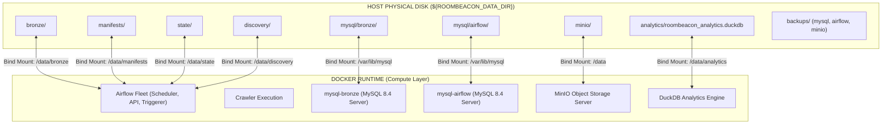

# Kiến Trúc Lưu Trữ Dữ Liệu Vật Lý RoomBeacon (Persistent Storage Architecture)

## 1. Nguyên Tắc Cốt Lõi: Docker Là Compute, Host Là Source of Truth

Hệ thống RoomBeacon tuân thủ nguyên lý phân tách triệt để giữa **Runtime/Compute (Môi trường thực thi)** và **Persistent Data (Dữ liệu bền vững vật lý)**:

- **SOURCE CODE**: Lưu trữ trong Git Repository.
- **DOCKER (COMPUTE / RUNTIME)**: Dùng để chạy Airflow, Crawler, MySQL Server, MinIO Server, DuckDB/Analytics và các tác vụ tính toán. Toàn bộ containers, images đều là disposable (có thể bị xóa, recreate, rebuild bất kỳ lúc nào mà không làm mất dữ liệu).
- **HOST PHYSICAL DISK (PERSISTENT STORAGE)**: Đĩa cứng vật lý của máy chủ host (`/mnt/Data/projects/roombeacon/data` hoặc `${ROOMBEACON_DATA_DIR}`) là nơi sở hữu duy nhất và lâu dài của toàn bộ dữ liệu.
- **BACKUP (DISASTER RECOVERY)**: Khu vực sao lưu độc lập định kỳ (`data/backups/`) để phòng chống rủi ro hỏng đĩa, lỗi phần cứng hoặc thao tác nhầm lẫn.



---

## 2. Cấu Trúc Thư Mục Vật Lý Trên Host

Toàn bộ dữ liệu được tổ chức tập trung dưới thư mục gốc `${ROOMBEACON_DATA_DIR}` (mặc định `./data`):

```text
data/
│
├── bronze/                      # Lưu trữ toàn bộ Bronze artifacts (listings.json, details.json)
│   ├── nhatot/
│   ├── phongtro123/
│   └── nhatrovn/
│
├── manifests/                   # Run Manifests ghi nhận siêu dữ liệu từng lần cào
├── state/                       # Checkpoint State, Health State, Seen Listing IDs
├── discovery/                   # Target discovery & runtime schedules
│
├── mysql/                       # Dữ liệu vật lý (Data Directory) của các MySQL Servers
│   ├── bronze/                  # /var/lib/mysql của container mysql-bronze (roombeacon_bronze)
│   └── airflow/                 # /var/lib/mysql của container mysql-airflow (airflow metadata)
│
├── minio/                       # Dữ liệu object storage vật lý của MinIO
│   ├── roombeacon-raw/
│   ├── roombeacon-assets/
│   ├── roombeacon-quarantine/
│   └── roombeacon-exports/
│
├── analytics/                   # Database DuckDB vật lý
│   └── roombeacon_analytics.duckdb
│
├── silver/                      # Sẵn sàng cho tầng xử lý Silver tiếp theo
├── gold/                        # Sẵn sàng cho tầng tổng hợp Gold tiếp theo
│
└── backups/                     # Thư mục sao lưu logic (Disaster Recovery)
    ├── mysql/                   # mysqldump (.sql.gz) của roombeacon_bronze
    ├── airflow/                 # mysqldump (.sql.gz) của airflow metadata
    └── minio/                   # Bản sao snapshot của MinIO objects
```

---

## 3. Chi Tiết Từng Thành Phần Lưu Trữ

### 3.1. Bronze Artifacts (`data/bronze`)
- **Mount**: `${ROOMBEACON_DATA_DIR}/bronze` $\leftrightarrow$ Container `/data/bronze`
- **Nội dung**: Tệp JSON bất biến ghi nhận mọi lượt quan sát tin đăng (`listings.json`, `details.json`).
- **Bền vững**: Khi Airflow scheduler hoặc crawler container bị recreate/rebuild, toàn bộ kho Bronze trên đĩa host vẫn nguyên vẹn 100%.

### 3.2. MySQL Bronze (`data/mysql/bronze`)
- **Mount**: `${ROOMBEACON_DATA_DIR}/mysql/bronze` $\leftrightarrow$ Container `/var/lib/mysql`
- **Nội dung**: Database `roombeacon_bronze` chứa 12 bảng chuẩn hóa (`platforms`, `rental_posts`, `rental_post_versions`, `post_prices`, `post_addresses`, `post_details`, `post_images`, `post_amenities`, `post_fees`, `post_contacts`, `post_attributes`, `post_status_history`).
- **Phân quyền UID/GID**: Container chạy với user `mysql` (UID 999, GID 999). Thư mục host được cấp quyền tương thích.

### 3.3. MySQL Airflow Metadata (`data/mysql/airflow`)
- **Mount**: `${ROOMBEACON_DATA_DIR}/mysql/airflow` $\leftrightarrow$ Container `/var/lib/mysql`
- **Nội dung**: Database `airflow` chứa toàn bộ lịch sử DAG runs, Task instances, XComs, variables.
- **Tách biệt**: Tách biệt hoàn toàn vật lý với MySQL Bronze, đảm bảo không có xung đột dữ liệu hay phân quyền.

### 3.4. MinIO Object Storage (`data/minio`)
- **Mount**: `${ROOMBEACON_DATA_DIR}/minio` $\leftrightarrow$ Container `/data`
- **Nội dung**: Các buckets `roombeacon-raw`, `roombeacon-assets`, `roombeacon-quarantine`, `roombeacon-exports`.

### 3.5. DuckDB Analytics (`data/analytics`)
- **Mount**: `${ROOMBEACON_DATA_DIR}/analytics` $\leftrightarrow$ Container `/data/analytics`
- **Nội dung**: Database file `roombeacon_analytics.duckdb` gắn kết (ATTACH) sang MySQL Bronze ở chế độ `READ_ONLY` để phục vụ truy vấn phân tích tức thời.

---

## 4. So Sánh: Docker Named Volume vs Host Bind Mount

| Đặc Điểm | Docker Named Volume (Cũ) | Host Bind Mount (Hiện Tại) |
| :--- | :--- | :--- |
| **Vị trí lưu trữ** | Ẩn sâu trong `/var/lib/docker/volumes/...` | Thư mục tường minh trên host (`./data/...`) |
| **Quyền sở hữu** | Phụ thuộc hoàn toàn vào Docker daemon | Host OS sở hữu trực tiếp |
| **Nguy cơ xóa nhầm** | Dễ mất nếu ai đó chạy `docker compose down -v` | **An toàn tuyệt đối** trước `docker compose down -v` |
| **Khả năng backup** | Phải spawn container phụ để backup | Dễ dàng backup trực tiếp bằng scripts / rsync / cron trên host |
| **Tính độc lập runtime** | Container xóa $\rightarrow$ volume mồ côi khó quản lý | Container xóa $\rightarrow$ thư mục host vẫn hiển hiện rõ ràng |

---

## 5. Chiến Lược Sao Lưu (Backup vs Persistence)

- **Persistence (Bind Mount)**: Bảo vệ hệ thống trước các sự cố vòng đời phần mềm (recreate container, rebuild image, restart docker, nâng cấp phiên bản phần mềm).
- **Backup (Logical Dump)**: Bảo vệ hệ thống trước sự cố vật lý (hỏng đĩa cứng, lỗi phần cứng, thao tác `rm -rf` nhầm, thảm họa trung tâm dữ liệu).
- **Công cụ backup tích hợp**:
  - Module Python: `roombeacon_crawler.infrastructure.tools.backup_mysql`
  - Đầu ra: File nén `data/backups/mysql/roombeacon_bronze_YYYYMMDD_HHMMSS.sql.gz`.
  - Cơ chế an toàn: Sử dụng `MYSQL_PWD` ngầm định, không in password ra log, đảm bảo tính toàn vẹn transaction (`--single-transaction`).
