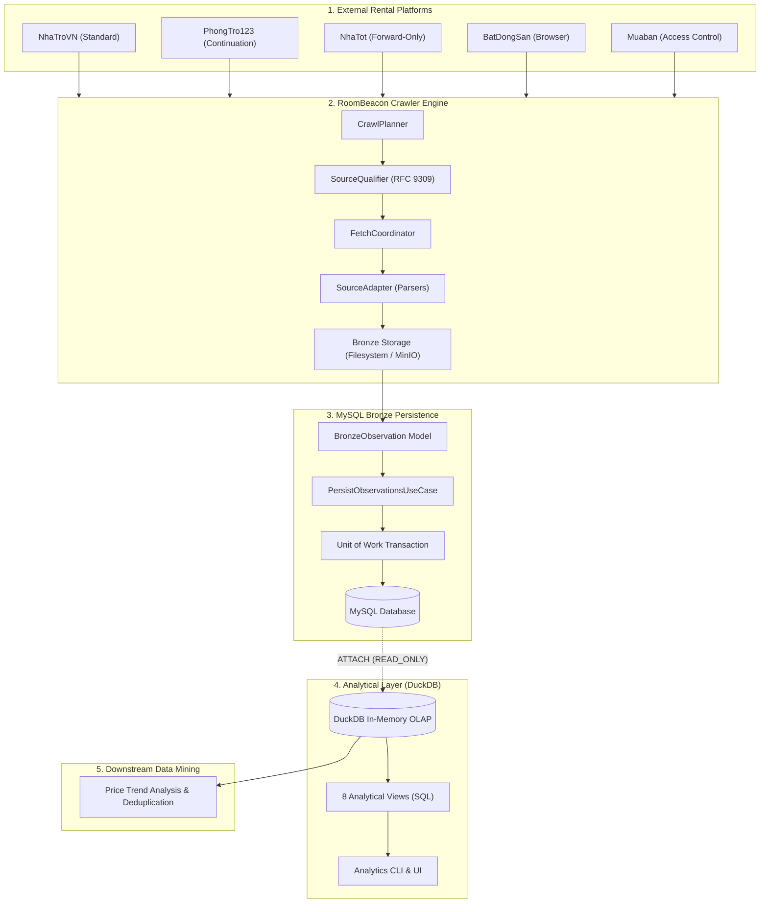

# RoomBeacon System Architecture

Tài liệu này đặc tả kiến trúc tổng thể toàn hệ thống (**System Architecture**) của nền tảng thu thập và khai phá dữ liệu bất động sản phòng trọ **RoomBeacon**.

---

## 1. Phong cách Kiến trúc (Architectural Style)

Hệ thống RoomBeacon được thiết kế theo phong cách:

$$\text{Modular Monolith} + \text{Clean / Hexagonal Architecture (Ports and Adapters)}$$

### Ngũ Đại Nguyên Tắc:
1. **Hướng phụ thuộc vào trong (Inward Dependency Direction)**: Tầng Domain tuyệt đối không phụ thuộc vào Framework, Cơ sở dữ liệu hay Thư viện mạng bên ngoài.
2. **Module hóa nghiêm ngặt (Strict Modularity)**: Mỗi chức năng thuộc về một module rõ ràng (`crawler`, `analytics`, `airflow`, `infra`).
3. **Cô lập đặc thù nguồn (Source Isolation)**: Logic bóc tách của từng website nằm gọn trong `sources/<source_name>/`, không xuất hiện phân nhánh `if source == ...` trong Core Engine.
4. **Hạ tầng có thể thay thế (Replaceable Infrastructure)**: Dễ dàng hoán đổi `HTTPX` sang `aiohttp`, `MySQL` sang `PostgreSQL`, `Local Storage` sang `MinIO` mà không phải sửa đổi tầng Domain/Application.
5. **Không over-engineering**: Không dùng microservices, Kafka, event bus hay dependency injection framework phức tạp khi chưa có yêu cầu thực tế.

---

## 2. Luồng Dữ Liệu Xuyên Suốt (End-to-End Data Pipeline)

---

## 3. Phân Định Trách Nhiệm Cấp Cao (Top-Level Responsibilities)

| Module / Directory | Trách nhiệm cốt lõi | Các thành phần KHÔNG ĐƯỢC CHỨA |
| :--- | :--- | :--- |
| **`crawler/`** | Lập kế hoạch, thẩm định, thu thập, bóc tách và lưu trữ dữ liệu thô Bronze. | Không chứa SQL, không chứa DuckDB logic, không chứa Airflow decorators. |
| **`analytics/`** | Khai phá, thống kê, phân tích dữ liệu bất biến từ MySQL thông qua DuckDB. | Không cào web, không ghi trực tiếp vào MySQL, không điều phối Airflow. |
| **`airflow/`** | Điều phối lịch trình (Scheduling), phân tán tác vụ (Dynamic Mapping), retry. | Không chứa logic bóc tách HTML, không chứa câu lệnh SQL insert/update. |
| **`infra/`** | Cấu hình Docker, docker-compose, mạng, tài nguyên phần cứng. | Không chứa mã nguồn ứng dụng. |
| **`docs/`** | Tài liệu kiến trúc, đặc tả RFC 9309, chiến lược truy cập nguồn. | Không chứa bí mật (.env) hay credential. |
| **`tests/`** | Kiểm thử đơn vị (Unit), tích hợp (Integration), hồi quy (Regression). | Không phụ thuộc mạng Internet bên ngoài. |
