# RoomBeacon — Overall System Architecture

> **Architecture Level:** Level 1 — Overall System Architecture  
> **Project:** RoomBeacon  
> **System Type:** Location-Aware Rental Discovery & Data Intelligence Platform  
> **Architecture Style:** Data Platform + Workflow Orchestration + Layered Data Pipeline

---

# 1. Giới thiệu

RoomBeacon là một nền tảng thu thập, xử lý, phân tích và phục vụ dữ liệu phòng trọ/bất động sản cho thuê.

Mục tiêu của hệ thống không chỉ là:

```text
Crawl website
→ lưu database
→ hiển thị lên web
```

RoomBeacon được thiết kế theo hướng **Data Platform**, trong đó dữ liệu phải đi qua nhiều tầng có trách nhiệm độc lập.

Luồng tổng thể:

```text
Source Websites
      ↓
Crawler
      ↓
RAW / BRONZE
      ↓
Data Processing
      ↓
SILVER
      ↓
Analytics / Data Mining
      ↓
GOLD
      ↓
Serving Database
      ↓
Backend API
      ↓
Web / Mobile Application
```

Phía trên Data Pipeline là:

```text
Apache Airflow
```

đóng vai trò **Workflow Orchestrator**.

Airflow không trực tiếp crawl, clean hoặc phân tích dữ liệu.

---

# 2. Mục tiêu kiến trúc

Kiến trúc RoomBeacon hướng tới các mục tiêu chính:

| Mục tiêu | Ý nghĩa |
|---|---|
| Tách crawler khỏi processing | Crawler chỉ Acquisition / Extract |
| Giữ dữ liệu nguồn | Có thể re-parse mà không crawl lại |
| Hỗ trợ nhiều website | Mỗi source có adapter riêng |
| Hỗ trợ Data Science | Bronze → Silver → Gold rõ ràng |
| Có khả năng truy vết | Biết record đến từ source/run nào |
| Có workflow orchestration | Airflow quản lý lịch chạy và dependency |
| Dễ mở rộng | Thêm source/job mà không phá core |
| Không over-engineering | Không thêm hạ tầng khi chưa có nhu cầu |

Nguyên tắc chung:

```text
Problem first
Technology later
```

---

# 3. Kiến trúc tổng thể

Sơ đồ dưới đây thể hiện **Architecture Level 1** của RoomBeacon.

Có hai loại flow:

```text
DATA FLOW
```

và:

```text
CONTROL / ORCHESTRATION FLOW
```

Data Flow được biểu diễn bằng mũi tên liền.

Control Flow của Airflow được biểu diễn bằng mũi tên nét đứt.

```mermaid
flowchart LR
    %% =====================================================
    %% DEFINING STYLES
    %% =====================================================

    classDef orch fill:#e6e6fa,stroke:#9370db,stroke-width:2px,color:#000
    classDef crawl fill:#d4edda,stroke:#28a745,stroke-width:2px,color:#000
    classDef store fill:#cce5ff,stroke:#007bff,stroke-width:2px,color:#000
    classDef proc fill:#ffe5b4,stroke:#fd7e14,stroke-width:2px,color:#000
    classDef analy fill:#e0ffff,stroke:#00ced1,stroke-width:2px,color:#000
    classDef serv fill:#fff3cd,stroke:#ffc107,stroke-width:2px,color:#000
    classDef ext fill:#f8f9fa,stroke:#6c757d,stroke-width:2px,color:#000


    %% =====================================================
    %% EXTERNAL COMPONENTS
    %% =====================================================

    Dev((Developer / Operator)):::ext
    CLI[Terminal / CLI]:::ext

    Source((Source Websites)):::ext
    App((Web / Mobile Application)):::ext

    Dev --> CLI


    %% =====================================================
    %% DOCKER COMPOSE ENVIRONMENT
    %% =====================================================

    subgraph Docker_Compose [Docker Compose Environment]
        direction TB


        %% =================================================
        %% TOP LAYER — WORKFLOW ORCHESTRATION
        %% =================================================

        subgraph Orchestration [Workflow Orchestration Plane: Apache Airflow]
            direction TB

            UI[Airflow UI / API]:::orch
            Sched[Scheduler]:::orch

            UI --> Sched


            subgraph DAG_Domains [DAG Domains]
                direction LR

                InDAG([Ingestion DAG]):::orch
                PrDAG([Processing DAG]):::orch
                AnDAG([Analytics DAG]):::orch
            end


            Sched --> InDAG
            Sched --> PrDAG
            Sched --> AnDAG
        end


        %% =================================================
        %% BOTTOM LAYER — DATA PIPELINE
        %% =================================================

        subgraph Pipeline [Data Pipeline]
            direction LR


            %% =============================================
            %% CRAWLER EXECUTION PLANE
            %% =============================================

            subgraph Crawler [Crawler Execution Plane]
                direction TB

                CA[Source Adapter]:::crawl
                CB[Discovery]:::crawl
                CC[Fetch / Capture]:::crawl
                CD[Extract]:::crawl
                CE[Schema Mapping]:::crawl
                CF[Commit]:::crawl

                CA --> CB
                CB --> CC
                CC --> CD
                CD --> CE
                CE --> CF
            end


            %% =============================================
            %% RAW & BRONZE STORAGE PLANE
            %% =============================================

            subgraph Storage [Raw & Bronze Storage Plane]
                direction TB

                RAW[
                    RAW Objects
                    <br/>- HTML
                    <br/>- JSON
                    <br/>- Images
                ]:::store

                MinIO[(MinIO Object Storage)]:::store

                BRONZE([
                    BRONZE Dataset
                    <br/>- Parsed
                    <br/>- Structured
                    <br/>- Raw Values
                    <br/>- Local Volume / SSD
                ]):::store

                RAW --> MinIO
            end


            %% =============================================
            %% DATA PROCESSING PLANE
            %% =============================================

            subgraph Processing [Data Processing Plane]
                direction TB

                DB_Duck[(
                    DuckDB
                    <br/>Embedded Analytical Engine
                )]:::proc

                PA[Validation]:::proc
                PB[Cleaning]:::proc
                PC[Normalization]:::proc
                PD[Deduplication]:::proc

                SILVER([SILVER Dataset]):::proc


                DB_Duck --> PA
                PA --> PB
                PB --> PC
                PC --> PD
                PD --> SILVER
            end


            %% =============================================
            %% ANALYTICS & DATA MINING PLANE
            %% =============================================

            subgraph Analytics [Analytics & Data Mining Plane]
                direction TB

                AA[EDA / Analytics]:::analy
                AB[Data Mining]:::analy
                AC[Feature Engineering]:::analy

                GOLD([GOLD Dataset]):::analy


                AA --> AB
                AB --> AC
                AC --> GOLD
            end


            %% =============================================
            %% SERVING LAYER
            %% =============================================

            subgraph Serving [Serving Layer]
                direction TB

                MySQL[(MySQL Serving Database)]:::serv
                API[Backend API]:::serv

                MySQL --> API
            end

        end


        %% Giữ Orchestration và Data Pipeline
        %% ở hai tầng khác nhau.
        Orchestration ~~~ Pipeline

    end


    %% =====================================================
    %% DATA FLOW
    %% =====================================================

    Source -- HTTP / HTTPS --> CA

    CF --> RAW
    CF --> BRONZE

    BRONZE -- Read Bronze Dataset --> DB_Duck

    SILVER --> AA

    GOLD --> MySQL

    API -- Serve --> App


    %% =====================================================
    %% CONTROL / ORCHESTRATION FLOW
    %% =====================================================

    CLI -. Trigger / Monitor .-> UI

    InDAG -.-> CA
    PrDAG -.-> DB_Duck
    AnDAG -.-> AA


    %% =====================================================
    %% MEDIA REFERENCE
    %% =====================================================

    MinIO -. Media Object Reference .-> MySQL
```



---

# 4. Cách đọc sơ đồ

Sơ đồ được chia thành hai khu vực lớn:

```text
Workflow Orchestration Plane
```

và:

```text
Data Pipeline
```

Airflow nằm phía trên.

Các workload xử lý dữ liệu nằm phía dưới.

Tư duy:

```text
Airflow
   ↓ control

Workload
   ↓ data processing

Dataset
```

---

# 5. Data Flow

Mũi tên:

```text
-->
```

thể hiện dữ liệu thật sự di chuyển.

Luồng chính:

```text
Source Websites
      ↓
Crawler
      ↓
RAW / BRONZE
      ↓
DuckDB
      ↓
SILVER
      ↓
EDA / Data Mining
      ↓
Feature Engineering
      ↓
GOLD
      ↓
MySQL
      ↓
Backend API
      ↓
Web / Mobile
```

Đây là **data lineage chính của RoomBeacon**.

---

# 6. Control / Orchestration Flow

Mũi tên:

```text
-.-> 
```

thể hiện điều phối.

Ví dụ:

```text
Ingestion DAG
-.-> Crawler
```

không có nghĩa Airflow gửi rental records xuống crawler.

Nó có nghĩa:

```text
Airflow yêu cầu crawler chạy.
```

Tương tự:

```text
Processing DAG
-.-> Data Processing Plane
```

và:

```text
Analytics DAG
-.-> Analytics & Data Mining Plane
```

---

# 7. Docker Compose Environment

Trong môi trường development, các runtime component được tổ chức trong:

```text
Docker Compose Environment
```

Docker Compose chịu trách nhiệm:

```text
Container lifecycle
Network
Port mapping
Environment variables
Volumes
Service dependency
```

Các component có thể gồm:

```text
Apache Airflow
MinIO
MySQL
Crawler Runtime
Processing Runtime
```

Docker Compose không chứa business logic.

Nó chỉ cung cấp runtime environment.

---

# 8. Tại sao cần Docker Compose?

Nếu developer phải tự chạy:

```text
MySQL
MinIO
Airflow
Crawler
Processing
```

bằng tay, mỗi máy có thể có config khác nhau.

Docker Compose giúp chuẩn hóa:

```text
Runtime
Networking
Storage mounting
Environment configuration
Service discovery
```

Mục tiêu:

```text
Clone repository
→ configure .env
→ docker compose up
```

là có môi trường tương đối đồng nhất.

---

# 9. Workflow Orchestration Plane

Workflow Orchestration Plane sử dụng:

```text
Apache Airflow
```

Airflow là component đứng phía trên toàn bộ Data Platform.

Airflow không thuộc riêng crawler.

Airflow có thể điều phối:

```text
Crawler
Processing
Analytics
Publish
```

---

# 10. Tại sao cần Apache Airflow?

Khi pipeline còn nhỏ, developer có thể chạy:

```bash
python crawler.py
python clean.py
python analytics.py
```

Nhưng khi workflow phát triển:

```text
crawl listing
↓
crawl detail
↓
commit raw
↓
build bronze
↓
clean
↓
build silver
↓
mine
↓
build gold
↓
publish
```

thì việc chạy thủ công trở nên khó quản lý.

Airflow giải quyết:

```text
Scheduling
Dependency
Retry
Monitoring
Logging
History
Workflow coordination
```

---

# 11. Airflow không chứa business logic

Một nguyên tắc quan trọng:

```text
Airflow DAG
≠
Business Logic
```

Không nên viết toàn bộ:

```python
crawl()
clean()
normalize()
model()
```

trực tiếp trong DAG.

Thay vào đó:

```text
Airflow DAG
     ↓
gọi workload
     ↓
CrawlerRunner
ProcessingPipeline
AnalyticsPipeline
```

Nhờ vậy các workload vẫn có thể chạy độc lập không cần Airflow.

---

# 12. Airflow UI / API

Airflow UI / API là điểm tương tác với orchestration plane.

Developer có thể:

```text
Trigger DAG
Monitor DAG
Inspect Task
View Logs
Retry Task
View Run History
```

Terminal / CLI có thể dùng để trigger hoặc quản lý workflow trong development.

---

# 13. Scheduler

Scheduler chịu trách nhiệm xác định:

```text
Task nào sẵn sàng chạy?
Task nào còn dependency?
Task nào cần retry?
DAG nào đến lịch?
```

Scheduler không thực hiện:

```text
crawl HTML
clean price
mine data
```

Nó chỉ điều phối.

---

# 14. DAG Domains

RoomBeacon chia orchestration thành ba domain chính:

```text
Ingestion DAG
Processing DAG
Analytics DAG
```

Thay vì tạo một DAG khổng lồ.

---

# 15. Ingestion DAG

Ingestion DAG chịu trách nhiệm điều phối Acquisition.

Concept:

```text
Discover Sources
      ↓
Crawl Listing
      ↓
Crawl Detail
      ↓
Capture RAW
      ↓
Build BRONZE
```

Nó chủ yếu điều phối:

```text
Crawler Execution Plane
Raw & Bronze Storage Plane
```

---

# 16. Tại sao Ingestion cần lifecycle riêng?

Crawler phụ thuộc vào nhiều yếu tố bên ngoài:

```text
Website availability
robots.txt
Network
Rate limit
Source structure
Pagination
Date range
Browser rendering
```

Processing không có các dependency này.

Do đó:

```text
Crawler lifecycle
≠
Processing lifecycle
```

---

# 17. Processing DAG

Processing DAG bắt đầu từ:

```text
BRONZE Dataset
```

Flow:

```text
BRONZE
↓
Validation
↓
Cleaning
↓
Normalization
↓
Deduplication
↓
SILVER
```

Processing không cần biết HTML website được fetch bằng cách nào.

---

# 18. Analytics DAG

Analytics DAG bắt đầu từ:

```text
SILVER Dataset
```

Flow:

```text
SILVER
↓
EDA
↓
Data Mining
↓
Feature Engineering
↓
GOLD
```

Có thể chạy lại Analytics mà không cần crawl website lại.

---

# 19. Crawler Execution Plane

Crawler Execution Plane chịu trách nhiệm đưa dữ liệu bên ngoài vào RoomBeacon.

Flow:

```text
Source Adapter
      ↓
Discovery
      ↓
Fetch / Capture
      ↓
Extract
      ↓
Schema Mapping
      ↓
Commit
```

Crawler không thực hiện Silver Cleaning.

---

# 20. Source Adapter

Mỗi website có cấu trúc khác nhau.

Ví dụ:

```text
Nhà Tốt
PhongTro123
BatDongSan
Source khác
```

Mỗi source có thể khác:

```text
HTML
Selectors
Pagination
Date representation
Detail URL
Metadata
Rendering mechanism
```

Source Adapter cô lập logic riêng của từng website.

---

# 21. Tại sao không hardcode nhiều source trong crawler core?

Không nên:

```python
if source == "nhatot":
    ...
elif source == "source_b":
    ...
elif source == "source_c":
    ...
```

vì crawler core sẽ nhanh chóng thành một file rất lớn.

Tốt hơn:

```text
sources/
├── nhatot/
├── source_b/
└── source_c/
```

Mỗi source có:

```text
Adapter
Selectors
Listing Parser
Detail Parser
Pagination
Date Interpreter
```

---

# 22. Discovery

Discovery trả lời:

```text
Crawler cần crawl URL nào tiếp theo?
```

Ví dụ:

```text
Listing page
↓
Listing Card
↓
Detail URL
```

Discovery cũng xử lý:

```text
Pagination
Date range
Next page
Detail target creation
```

Discovery khác Extract.

---

# 23. Fetch / Capture

Fetch / Capture chịu trách nhiệm:

```text
URL
↓
Request / Browser
↓
Response
↓
CapturedResponse
```

Architecture Level 1 không cần thể hiện chi tiết:

```text
HTTPX
Playwright
Chromium
```

Các thành phần này thuộc Level 2.

---

# 24. Tại sao phải Capture?

Không nên:

```text
Fetch
↓
Parse
↓
Discard HTML
```

Nếu Parser sai thì phải request lại website.

RoomBeacon hướng tới:

```text
Fetch
↓
Capture
├── RAW
└── Extract
```

Nhờ đó:

```text
RAW HTML
↓
Parser V2
```

có thể chạy mà không crawl lại.

---

# 25. Extract

Extract có trách nhiệm:

```text
HTML / JSON
↓
Raw Business Fields
```

Ví dụ:

```text
title_raw
price_raw
area_raw
location_raw
address_raw
posted_at_raw
description_raw
seller_name_raw
```

Extract không thực hiện business cleaning.

---

# 26. Parser không được Cleaning

Source trả:

```text
3,2 triệu/tháng
```

Parser giữ:

```text
price_raw = "3,2 triệu/tháng"
```

Parser không chuyển thành:

```text
price_vnd = 3200000
```

Source trả:

```text
30 m²
```

Parser giữ:

```text
area_raw = "30 m²"
```

không chuyển thành:

```text
area_m2 = 30.0
```

Normalization thuộc Data Processing Plane.

---

# 27. Parser được phép xử lý gì?

Parser được phép thực hiện sanitation kỹ thuật tối thiểu:

```python
text.strip()
```

hoặc:

```python
urljoin(base_url, href)
```

để biến relative URL thành absolute URL.

Parser không nên:

```text
normalize price
normalize address
convert area
fix spelling
impute missing
map district ID
```

---

# 28. Schema Mapping

Mỗi source có thể dùng naming khác nhau.

Ví dụ:

```text
Source A
gia
dien_tich
dia_chi
```

Source B:

```text
price
area
location
```

Schema Mapping đưa về schema chung:

```text
price_raw
area_raw
location_raw
```

Downstream không cần hiểu từng website.

---

# 29. Commit

Commit là boundary cuối của Crawler Execution Plane.

Flow:

```text
Crawler
↓
Commit
├── RAW
└── BRONZE
```

Commit không Cleaning.

Commit chỉ chuyển output tới storage.

---

# 30. Raw & Bronze Storage Plane

Storage Plane chứa hai loại dữ liệu khác nhau:

```text
RAW
```

và:

```text
BRONZE
```

Hai tầng này không được đánh đồng.

---

# 31. RAW Objects

RAW là dữ liệu gần source nhất.

Ví dụ:

```text
HTML
JSON Response
Images
Assets
Technical Metadata
```

RAW phục vụ:

```text
Audit
Debug
Re-processing
Parser recovery
Traceability
```

---

# 32. MinIO Object Storage

MinIO được sử dụng để lưu object.

Phù hợp với:

```text
HTML files
JSON snapshots
Images
Assets
Large objects
```

MinIO không thay thế MySQL.

---

# 33. Vì sao không lưu ảnh vào MySQL?

Nếu lưu binary trực tiếp vào relational database:

```text
DB size tăng nhanh
Backup nặng
Serving phức tạp hơn
Object lifecycle khó quản lý
```

RoomBeacon tách:

```text
MinIO
→ Object Storage

MySQL
→ Structured Metadata + Reference
```

---

# 34. Media Object Reference

Đường:

```text
MinIO
-. Media Object Reference .->
MySQL
```

không phải data-copy flow.

Ý nghĩa:

```text
MinIO
→ giữ image/object thật

MySQL
→ giữ object key / URL / metadata
```

Ví dụ:

```text
object_key
image_url
media_type
```

---

# 35. BRONZE Dataset

BRONZE là dữ liệu đã:

```text
Extract
Structured
Schema Mapped
```

nhưng chưa business-clean.

Ví dụ:

```json
{
  "price_raw": "3,2 triệu/tháng",
  "area_raw": "30 m²",
  "location_raw": "Quận Bình Thạnh"
}
```

---

# 36. Tại sao phải có BRONZE?

Nếu:

```text
HTML
↓
Clean ngay
↓
Database
```

ta mất checkpoint quan trọng.

Không còn biết:

```text
source ban đầu hiển thị gì?
parser lấy được gì?
cleaning đã thay đổi gì?
```

BRONZE tạo boundary giữa:

```text
Acquisition
```

và:

```text
Processing
```

---

# 37. Local Volume / SSD

Giai đoạn đầu, BRONZE có thể lưu:

```text
JSON
CSV
Parquet
```

trên local SSD hoặc Docker Volume.

Ví dụ:

```text
data/
└── bronze/
    └── nhatot/
        └── 2026-08-19/
            └── run_20260819_091500/
                ├── listings.json
                ├── metadata.json
                └── manifest.json
```

---

# 38. Tại sao chưa cần distributed storage?

Ở quy mô hiện tại chưa cần:

```text
HDFS
Spark Cluster
Distributed File System
```

MinIO + SSD đủ để:

```text
crawl
store
query
process
experiment
```

Khi quy mô tăng, storage adapter có thể thay đổi.

---

# 39. Data Processing Plane

Data Processing Plane biến:

```text
BRONZE
```

thành:

```text
SILVER
```

Flow:

```text
BRONZE
↓
DuckDB
↓
Validation
↓
Cleaning
↓
Normalization
↓
Deduplication
↓
SILVER
```

---

# 40. DuckDB

DuckDB đóng vai trò:

```text
Embedded Analytical Engine
```

Nó phù hợp cho:

```text
Analytical SQL
JSON query
Parquet query
Batch transformations
Local data processing
EDA support
```

DuckDB không phải serving database chính.

---

# 41. Tại sao dùng DuckDB thay vì MySQL để Processing?

MySQL được dành cho Serving Layer.

Nếu MySQL vừa:

```text
clean data
analytics
API serving
temporary processing
```

thì trách nhiệm sẽ bị trộn.

RoomBeacon tách:

```text
DuckDB
→ Analytical Processing

MySQL
→ Application Serving
```

---

# 42. Validation

Validation hỏi:

```text
Dữ liệu đầu vào có đủ điều kiện xử lý không?
```

Ví dụ:

```text
Missing field
Invalid URL
Schema mismatch
Unexpected structure
Corrupted values
```

Validation nên chạy trước Cleaning.

---

# 43. Cleaning

Cleaning xử lý dirty data.

Ví dụ:

```text
whitespace lỗi
chuỗi không hợp lệ
ký tự dư
giá trị malformed
```

Cleaning không thuộc crawler.

---

# 44. Normalization

Normalization đưa raw representation về chuẩn.

Ví dụ:

```text
price_raw
"3,2 triệu/tháng"
```

thành:

```text
price_vnd
3200000
```

Diện tích:

```text
area_raw
"30 m²"
```

thành:

```text
area_m2
30.0
```

Địa điểm:

```text
location_raw
"Quận Bình Thạnh"
```

có thể được chuẩn hóa thành:

```text
city
district
ward
```

---

# 45. Deduplication

Một listing có thể xuất hiện:

```text
nhiều crawl run
nhiều page
nhiều source
```

Deduplication ở Processing có thể sử dụng:

```text
listing_id
URL
business keys
content similarity
cross-source matching
```

Crawler chỉ nên loại duplicate rõ ràng trong cùng run.

---

# 46. SILVER Dataset

SILVER là dataset đã:

```text
Validated
Cleaned
Normalized
Deduplicated
```

SILVER phù hợp cho:

```text
EDA
Analytics
Data Mining
Feature Engineering
```

---

# 47. Analytics & Data Mining Plane

Analytics Plane bắt đầu từ SILVER.

Flow:

```text
SILVER
↓
EDA / Analytics
↓
Data Mining
↓
Feature Engineering
↓
GOLD
```

---

# 48. EDA / Analytics

EDA trả lời các câu hỏi như:

```text
Giá phòng phân bố thế nào?
Quận nào giá thấp?
Diện tích trung bình?
Nguồn cung khu vực nào tăng?
Giá biến động theo thời gian ra sao?
```

EDA giúp hiểu dataset trước khi xây thuật toán nâng cao.

---

# 49. Data Mining

Data Mining tìm pattern hoặc knowledge trong dữ liệu.

Ví dụ:

```text
Cheap-room hotspots
Rental clusters
Price anomalies
Supply hotspots
Area-price relationships
Temporal patterns
```

Data Mining không xử lý HTML.

Nó sử dụng SILVER.

---

# 50. Feature Engineering

Feature Engineering tạo ra các biến có giá trị cho application hoặc model.

Ví dụ:

```text
price_per_m2
listing_age_days
distance_to_center
district_supply
price_percentile
amenity_count
seller_activity
```

---

# 51. GOLD Dataset

GOLD là dữ liệu đã được thiết kế cho một use case cụ thể.

Ví dụ:

```text
rental_search_gold
district_statistics_gold
cheap_room_hotspot_gold
recommendation_features_gold
```

Gold không nhất thiết chứa toàn bộ Silver fields.

---

# 52. Serving Layer

Serving Layer đưa dữ liệu cuối cùng tới sản phẩm.

Flow:

```text
GOLD
↓
MySQL
↓
Backend API
↓
Web / Mobile
```

Serving Layer không thực hiện Cleaning.

---

# 53. MySQL Serving Database

MySQL giữ:

```text
Clean Structured Serving Data
```

Ví dụ:

```text
listing
normalized price
area
district
coordinates
media references
analytics outputs
```

---

# 54. Tại sao cần MySQL khi đã có DuckDB?

Vai trò khác nhau.

DuckDB:

```text
Analytical workload
Batch processing
Local query
Parquet/JSON analysis
```

MySQL:

```text
Serving workload
Index lookup
Filter
Pagination
Concurrent application queries
Relational data
```

---

# 55. Backend API

Backend API là boundary giữa Data Platform và Application.

Backend có thể cung cấp:

```text
Search rentals
Filter price
Filter district
Listing detail
Nearby search
Analytics results
Recommendations
```

Backend không query RAW HTML.

Backend chủ yếu đọc Serving Layer.

---

# 56. Web / Mobile Application

Web/Mobile là consumer cuối.

Application không cần biết:

```text
Crawler fetch bằng HTTP hay browser
Airflow có DAG nào
DuckDB clean thế nào
MinIO lưu RAW ở đâu
```

Application chỉ tương tác với:

```text
Backend API
```

---

# 57. Developer / Operator

Developer / Operator có thể sử dụng:

```text
Terminal / CLI
```

để:

```text
Run local jobs
Test crawler
Trigger Airflow
Inspect pipeline
Debug
```

Trong production workflow, Airflow UI/API là control point chính.

---

# 58. Source Websites

Source Websites nằm ngoài RoomBeacon runtime.

Ví dụ:

```text
Rental portals
Listing platforms
Public rental sources
```

Source chỉ giao tiếp với:

```text
Crawler Execution Plane
```

Không giao tiếp trực tiếp với:

```text
Processing
Analytics
MySQL
```

---

# 59. Data Lineage

Một listing có thể được truy vết theo:

```text
Website Listing
      ↓
Crawl Run
      ↓
RAW Snapshot
      ↓
BRONZE Record
      ↓
SILVER Record
      ↓
GOLD Record
      ↓
MySQL Serving Record
      ↓
Backend Response
```

Đây là một trong những mục tiêu quan trọng của kiến trúc.

---

# 60. Run ID

Mỗi crawler run có:

```text
run_id
```

Ví dụ:

```text
run_20260819_091500
```

Run ID giúp:

```text
Không overwrite dữ liệu
Audit
Debug
Compare runs
Temporal analysis
Recovery
```

---

# 61. Metadata

Crawler không chỉ thu thập business data.

Crawler còn thu thập technical metadata.

Ví dụ:

```text
run_id
source
request_url
final_url
target_type
http_status
content_type
server
cf_ray
html_size
fetch_strategy
started_at
finished_at
elapsed_ms
retry_count
robots_allowed
crawl_status
```

Metadata phục vụ:

```text
Crawler monitoring
Source health
Performance analysis
Failure analysis
Audit
```

---

# 62. Listing Card và Detail

Crawler production nên phân biệt:

```text
Listing Card
```

và:

```text
Listing Detail
```

Card phục vụ:

```text
Discovery
Basic fields
Detail URL
```

Detail cung cấp dữ liệu đầy đủ hơn:

```text
Full title
Price
Area
Address
Description
Posted date
Updated date
Seller
Images
Amenities
Property information
```

Flow:

```text
Listing Page
↓
ListingCardRaw[]
↓
Detail CrawlTarget[]
↓
Detail Page
↓
ListingDetailRaw
↓
Bronze Mapper
```

---

# 63. Bronze Mapper

Bronze Mapper kết hợp:

```text
ListingCardRaw
+
ListingDetailRaw
+
CrawlMetadata
```

thành:

```text
RentalBronzeRecord
```

Nếu detail cung cấp field chính xác hơn card, mapper có thể ưu tiên detail.

Nhưng vẫn giữ raw values.

---

# 64. Robots Policy

Crawler production phải kiểm tra:

```text
robots.txt
```

trước khi crawl source.

Flow:

```text
CrawlTarget
↓
RobotsPolicy
↓
Allowed?
├── Yes → Fetch
└── No  → Stop / Skip
```

Robots Policy thuộc Acquisition Control.

Không thuộc Parser.

---

# 65. Rate Limit và Retry

Crawler không nên spam website.

Rate Limit chịu trách nhiệm:

```text
Request delay
Concurrency
Source pacing
```

Retry chỉ áp dụng với lỗi có thể recover:

```text
Timeout
Connection Error
Server Error
```

Không retry liên tục:

```text
Access Denied
Robots Denied
Challenge
Not Found
```

---

# 66. Pagination

Listing website thường có nhiều trang.

Discovery phải hỗ trợ:

```text
Page 1
↓
Page 2
↓
Page 3
↓
...
```

Dừng khi:

```text
No next page
Max pages reached
Max records reached
Date cutoff reached
Source error
```

Parser không chịu trách nhiệm orchestration pagination.

---

# 67. Date Policy

RoomBeacon có thể cần phân tích dữ liệu lịch sử.

Các mode có thể gồm:

```text
LATEST
DATE_RANGE
FULL_HISTORY
```

LATEST:

```text
crawl recent listings
```

DATE_RANGE:

```text
crawl trong khoảng ngày
```

FULL_HISTORY:

```text
crawl sâu theo pagination
```

Date Policy thuộc Discovery / Crawl Control.

---

# 68. Raw Date và Interpreted Date

Source có thể hiển thị:

```text
Hôm nay
Hôm qua
2 giờ trước
3 ngày trước
12/08/2026
```

Crawler nên giữ:

```text
posted_at_raw
```

nguyên bản.

Date Interpreter có thể tạo datetime tạm để quyết định:

```text
Có tiếp tục pagination hay không?
```

Không được ghi đè raw value.

---

# 69. Storage Layout

Một cấu trúc dữ liệu có thể là:

```text
data/
├── raw/
├── bronze/
├── silver/
└── gold/
```

Mỗi layer tiếp tục chia theo:

```text
source
date
run_id
```

Ví dụ:

```text
data/
└── bronze/
    └── nhatot/
        └── 2026-08-19/
            └── run_20260819_091500/
                ├── listings.json
                ├── metadata.json
                └── manifest.json
```

---

# 70. RAW Storage Convention

RAW tương lai có thể lưu trên MinIO:

```text
raw/
└── <source>/
    ├── listing/
    │   └── YYYY-MM-DD/
    │       └── <run_id>/
    │           └── page-000001.html
    │
    └── detail/
        └── YYYY-MM-DD/
            └── <run_id>/
                └── <listing_id>.html
```

Assets:

```text
assets/
└── <source>/
    └── YYYY-MM-DD/
        └── <run_id>/
            └── <listing_id>/
```

---

# 71. Vì sao phải chia theo Run?

Không nên:

```text
listings.json
```

bị ghi đè mỗi lần crawler chạy.

Tốt hơn:

```text
run_001
run_002
run_003
```

Nhờ đó:

```text
Compare runs
Audit changes
Analyze historical data
Recover failed processing
```

---

# 72. Airflow và Data Assets

Về sau các dataset có thể được xem như logical assets:

```text
BRONZE
SILVER
GOLD
```

Concept:

```text
Ingestion DAG
↓
BRONZE updated
↓
Processing DAG
↓
SILVER updated
↓
Analytics DAG
↓
GOLD updated
```

Nhờ vậy các DAG có lifecycle riêng nhưng vẫn liên kết bằng dữ liệu.

---

# 73. Vì sao không dùng một DAG khổng lồ?

Nếu tạo:

```text
crawl
↓
clean
↓
mine
↓
publish
```

thành một DAG duy nhất, các lifecycle sẽ bị trộn.

Ví dụ Data Mining cần chạy lại:

```text
không cần crawl website lại
```

Processing cần chạy lại:

```text
không cần request source lại
```

Do đó tách domain DAG là hợp lý.

---

# 74. Vì sao Airflow không nằm trong crawler source?

Crawler production phải có thể chạy:

```bash
python -m roombeacon_crawler.main
```

không cần Airflow.

Airflow chỉ import/gọi:

```text
CrawlRunner
```

Điều này giữ:

```text
Crawler Core
```

độc lập với:

```text
Orchestration Framework
```

---

# 75. Demo và Production Crawler

RoomBeacon tách:

```text
demo/
```

và:

```text
production source
```

Demo dùng để thử:

```text
browser
fetch strategy
DOM selectors
parser ideas
source behavior
```

Production ưu tiên:

```text
Correctness
Separation of Responsibility
Maintainability
Traceability
Structured Logging
Configuration
```

Production không import Demo.

---

# 76. Production Crawler Structure

Production crawler có thể tổ chức:

```text
roombeacon_crawler/
├── enums/
├── models/
├── config/
├── fetchers/
├── policies/
├── services/
├── validators/
├── mappers/
├── sources/
└── pipeline/
```

Mỗi layer có trách nhiệm rõ.

---

# 77. Source-Specific Structure

Ví dụ:

```text
sources/
└── nhatot/
    ├── adapter.py
    ├── selectors/
    │   ├── listing_selectors.py
    │   └── detail_selectors.py
    ├── parsers/
    │   ├── listing_parser.py
    │   ├── detail_parser.py
    │   └── metadata_parser.py
    └── discovery/
        ├── pagination.py
        └── date_interpreter.py
```

Điều này giúp website thay đổi DOM mà không ảnh hưởng toàn bộ crawler.

---

# 78. Logging

Production không nên:

```python
print(...)
```

rải rác khắp source.

Nên sử dụng:

```python
logging
```

Log các sự kiện quan trọng:

```text
Run start
Page start
Page finish
Listing count
Detail success
Detail failure
Retry
Robots denied
Rate limit
Challenge
Commit
Run summary
```

Không log toàn bộ HTML.

---

# 79. Error Handling

Không nên:

```python
except Exception:
    pass
```

Một detail lỗi không nên nhất thiết làm toàn bộ crawl run chết.

Run summary nên biết:

```text
pages_success
pages_failed
pages_skipped
details_success
details_failed
records_created
```

---

# 80. Config

Các tham số runtime không nên hardcode.

Ví dụ:

```text
CRAWLER_USER_AGENT
PLAYWRIGHT_HEADLESS
REQUEST_TIMEOUT
REQUEST_DELAY_SECONDS
MAX_CONCURRENCY
MAX_RETRIES
START_PAGE
MAX_PAGES
MAX_RECORDS_PER_PAGE
MAX_TOTAL_RECORDS
CRAWL_DATE_MODE
DATE_FROM
DATE_TO
```

Config nên tập trung trong settings.

---

# 81. Environment Variables

Environment variables có thể được dùng để cấu hình runtime.

Nhưng cần phân biệt:

```text
Crawler Config
Airflow Config
Docker Config
Database Credentials
Object Storage Credentials
```

Không nên để một module đọc toàn bộ env của project.

---

# 82. Airflow Environment Variables

Airflow internal configuration thường có dạng:

```text
AIRFLOW__SECTION__KEY
```

Ví dụ:

```text
AIRFLOW__CORE__LOAD_EXAMPLES
```

Airflow tự resolve các config này.

Crawler không cần đọc trực tiếp chúng.

---

# 83. AIRFLOW_UID

`AIRFLOW_UID` phục vụ runtime/container permission.

Nó không phải ID do Apache Airflow cấp cho RoomBeacon.

Trên Linux có thể lấy bằng:

```bash
id -u
```

Ví dụ:

```text
1000
```

sau đó:

```env
AIRFLOW_UID=1000
```

---

# 84. Airflow Variables và Connections

Workflow runtime config có thể dùng:

```text
Airflow Variables
```

Kết nối external systems có thể dùng:

```text
Airflow Connections
```

Ví dụ:

```text
MySQL connection
S3/MinIO connection
External API connection
```

Crawler core vẫn không import Airflow trực tiếp.

---

# 85. Processing và Airflow

Airflow không chỉ dành cho crawler.

Airflow có thể điều phối:

```text
Crawler
Bronze → Silver
Analytics
Data Mining
Feature Engineering
Gold Publish
```

Vì vậy Airflow là orchestration của **toàn project**.

---

# 86. Monorepo Direction

RoomBeacon có thể phát triển theo hướng:

```text
roombeacon/
├── crawler/
├── processing/
├── analytics/
├── feature_engineering/
├── serving/
├── airflow/
├── data/
├── docs/
└── docker/
```

Mỗi workload độc lập.

Airflow đứng ngang hàng như orchestration component.

---

# 87. Tại sao không đặt Airflow trong crawler?

Không nên:

```text
crawler/
└── airflow/
```

nếu Airflow sau này điều phối cả Processing và Analytics.

Tốt hơn:

```text
airflow/
└── dags/
    ├── ingestion/
    ├── processing/
    └── analytics/
```

---

# 88. Technology Responsibilities

| Technology | Vai trò |
|---|---|
| Python | Crawler / Processing / Data Science |
| HTTPX | HTTP Fetch Strategy |
| Playwright | Browser automation/runtime |
| Chromium | Browser rendering |
| Apache Airflow | Workflow orchestration |
| MinIO | RAW Object & Media Storage |
| Local SSD / Volume | Structured dataset storage ban đầu |
| JSON | Development / interchange |
| CSV | Export / interoperability |
| Parquet | Analytical storage format |
| DuckDB | Embedded analytical processing |
| MySQL | Serving database |
| Backend API | Product access layer |
| Web / Mobile | User-facing application |

---

# 89. Những công nghệ chưa cần

RoomBeacon hiện chưa cần đưa vào:

```text
Kafka
RabbitMQ
Spark
Hadoop
Kubernetes
Redis
Prometheus
Grafana
```

Không phải vì chúng không tốt.

Chỉ vì hiện tại chưa có bottleneck yêu cầu chúng.

---

# 90. Separation of Responsibility

Nguyên tắc:

```text
Fetch
≠
Extract
```

```text
Extract
≠
Cleaning
```

```text
Cleaning
≠
Analytics
```

```text
Analytics
≠
Serving
```

```text
Object Storage
≠
Serving Database
```

```text
Workflow Orchestration
≠
Business Logic
```

---

# 91. Tổng pipeline

```text
                         APACHE AIRFLOW
                              |
             ---------------------------------
             |               |               |
             v               v               v
         Ingestion       Processing       Analytics
             |               |               |
             v               v               v


SOURCE WEBSITES
      |
      v
SOURCE ADAPTER
      |
      v
DISCOVERY
      |
      v
FETCH / CAPTURE
      |
      +---------------------> RAW OBJECTS
      |                          |
      |                          v
      |                        MINIO
      |
      v
EXTRACT
      |
      v
SCHEMA MAPPING
      |
      v
BRONZE
      |
      v
DUCKDB
      |
      v
VALIDATION
      |
      v
CLEANING
      |
      v
NORMALIZATION
      |
      v
DEDUPLICATION
      |
      v
SILVER
      |
      v
EDA / ANALYTICS
      |
      v
DATA MINING
      |
      v
FEATURE ENGINEERING
      |
      v
GOLD
      |
      v
MYSQL
      |
      v
BACKEND API
      |
      v
WEB / MOBILE APPLICATION
```

---

# 92. Architecture Boundaries

Có thể chia RoomBeacon thành bốn boundary lớn:

## Acquisition

```text
Source
↓
Crawler
↓
RAW / BRONZE
```

## Processing

```text
BRONZE
↓
DuckDB
↓
SILVER
```

## Analytics

```text
SILVER
↓
EDA
↓
Mining
↓
Features
↓
GOLD
```

## Serving

```text
GOLD
↓
MySQL
↓
API
↓
Application
```

Airflow đứng phía trên và điều phối các boundary này.

---

# 93. Tại sao kiến trúc này phù hợp với RoomBeacon?

RoomBeacon có thể bắt đầu với:

```text
1 source
Local SSD
MinIO
DuckDB
MySQL
```

nhưng kiến trúc vẫn cho phép mở rộng:

```text
More sources
More data
More analytics jobs
More serving use cases
```

mà không cần phá toàn bộ pipeline.

---

# 94. Architecture Level 1 không nên chứa gì?

Không đưa những chi tiết sau vào sơ đồ tổng thể:

```text
HTTPX
Playwright
Chromium headless/headed
robots.txt
Cloudflare Challenge
Retry algorithm
Rate limiter
Specific selectors
Listing parser internals
Detail parser internals
Pagination query
Date regex
MinIO bucket names
DuckDB SQL
MySQL table schema
```

Những thứ này thuộc Level 2 hoặc Level 3.

---

# 95. Các sơ đồ Level 2 tiếp theo

Sau Overall Architecture, nên vẽ riêng:

```text
01. Crawler Execution Plane — Level 2

02. Fetch / Capture Architecture — Level 2

03. Source Adapter Architecture — Level 2

04. Listing → Detail Crawl Flow — Level 2

05. RAW / Bronze Storage Architecture — Level 2

06. Airflow Workflow Architecture — Level 2

07. Bronze → Silver Processing — Level 2

08. Analytics & Data Mining — Level 2

09. Serving Architecture — Level 2
```

Không nhét tất cả vào Overall Architecture.

---

# 96. Crawler Level 2 dự kiến

Crawler Level 2 có thể triển khai:

```text
Crawl Target
      ↓
Robots Policy
      ↓
Source Adapter
      ↓
Strategy Selector
      ↓
Fetch
      ↓
Response Classifier
      ↓
Fetch Policy
      ↓
Capture
      ↓
Listing / Detail Parser
      ↓
Structural Validation
      ↓
Schema Mapping
      ↓
Commit
```

Đây là chi tiết bên trong:

```text
Crawler Execution Plane
```

của Architecture Level 1.

---

# 97. Airflow Level 2 dự kiến

Airflow Level 2 có thể mô tả:

```text
Airflow UI/API
      ↓
Scheduler
      ↓
DAG Domains
      ├── Ingestion DAG
      ├── Processing DAG
      └── Analytics DAG
```

Data Asset dependency:

```text
BRONZE
↓
Processing DAG

SILVER
↓
Analytics DAG
```

---

# 98. Storage Level 2 dự kiến

Storage Level 2 có thể mô tả:

```text
RAW
├── HTML
├── JSON
├── Images
└── Metadata
     ↓
   MinIO
```

và:

```text
BRONZE
├── JSON
├── Parquet
├── Metadata
└── Manifest
```

theo:

```text
source/date/run_id
```

---

# 99. Processing Level 2 dự kiến

Processing Level 2:

```text
Bronze Reader
      ↓
Schema Validation
      ↓
Cleaning
      ↓
Normalization
      ↓
Deduplication
      ↓
Quality Check
      ↓
Silver Writer
```

DuckDB là processing engine.

---

# 100. Analytics Level 2 dự kiến

Analytics Level 2:

```text
SILVER
↓
EDA
↓
Statistical Analysis
↓
Data Mining
↓
Feature Engineering
↓
GOLD
```

Sau này có thể mở rộng:

```text
Model Training
Model Evaluation
Recommendation
Ranking
Prediction
```

khi use case yêu cầu.

---

# 101. Kết luận

RoomBeacon không được xây như một crawler đơn lẻ.

Nó được thiết kế như một **Data Platform** với các bước:

```text
Acquire
↓
Preserve
↓
Structure
↓
Process
↓
Analyze
↓
Serve
```

Tương ứng:

```text
Crawler
↓
RAW
↓
BRONZE
↓
SILVER
↓
GOLD
↓
Serving
```

Apache Airflow đứng phía trên để điều phối workflow.

MinIO lưu object và media.

DuckDB xử lý analytical dataset.

MySQL phục vụ application.

Backend API là boundary giữa Data Platform và sản phẩm.

Web/Mobile là consumer cuối.

Nguyên tắc cốt lõi:

```text
Crawler
≠
Processing
≠
Analytics
≠
Serving
```

và:

```text
Airflow
≠
Business Logic
```

Nhờ separation này, RoomBeacon có thể bắt đầu ở quy mô nhỏ nhưng vẫn giữ được khả năng mở rộng về:

```text
Data Volume
Number of Sources
Data Science Workloads
Analytics
Serving Features
```

mà không phải viết lại toàn bộ kiến trúc.

---

# 102. Trạng thái kiến trúc hiện tại

Architecture Level 1 hiện tại đã xác định:

```text
Workflow Orchestration
        ↓
Data Acquisition
        ↓
RAW / Bronze Storage
        ↓
Data Processing
        ↓
Silver
        ↓
Analytics / Data Mining
        ↓
Gold
        ↓
Serving
```

Các bước phát triển tiếp theo nên tập trung vào **Level 2 Architecture**, không tiếp tục nhồi thêm chi tiết vào sơ đồ tổng thể.

Overall Architecture phải luôn giữ mục tiêu:

> Người mới nhìn vào sơ đồ có thể hiểu trong vài giây dữ liệu RoomBeacon đến từ đâu, đi qua đâu, được điều phối bởi cái gì và cuối cùng được phục vụ cho người dùng như thế nào.