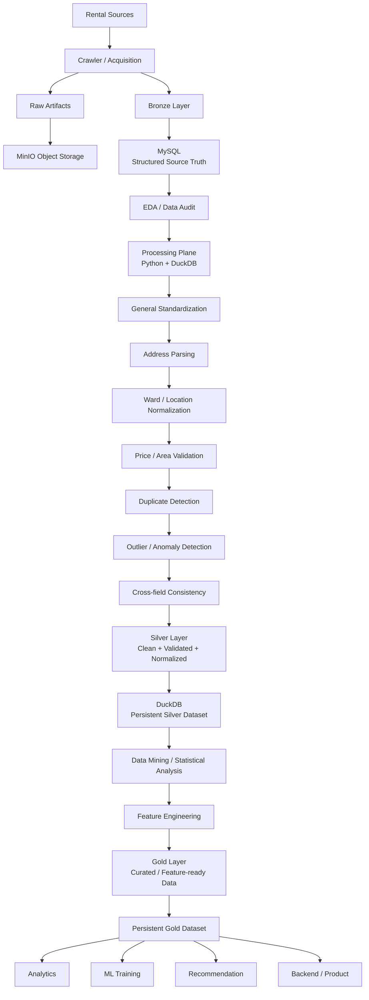

> **ARCHIVED** — superseded by [DATA_LAYERS_AND_LIFECYCLE.md](../../00-overview/DATA_LAYERS_AND_LIFECYCLE.md).

# RoomBeacon — Bronze, Silver, Gold Architecture

> [!info] Architecture Baseline
> **Scope:** Data lifecycle từ dữ liệu crawler đến **Analytics / Machine Learning / Product**  
> **Core principle:** ==Bronze giữ Source Truth, Silver giữ Clean Checkpoint, Gold giữ Business Value.==

---

# 01. Mục tiêu

RoomBeacon tổ chức dữ liệu theo ba tầng chính:

```text
BRONZE
   ↓
SILVER
   ↓
GOLD
```

Flow thực tế đầy đủ:

```text
RAW
 ↓
BRONZE
 ↓
EDA / DATA AUDIT
 ↓
PROCESSING / CLEANING / VALIDATION
 ↓
SILVER
 ↓
DATA MINING / ANALYSIS
 ↓
FEATURE ENGINEERING
 ↓
GOLD
 ↓
ANALYTICS / ML / PRODUCT
```

> [!tip] Cách nhớ
> **BRONZE** — *What did the source say?*  
> **SILVER** — *What clean facts do we trust?*  
> **GOLD** — *What does analytics / ML / product need?*

---

# 02. High-Level Architecture



---

# 03. Raw Layer

Raw Layer giữ dữ liệu gần nhất với dữ liệu gốc lấy từ nguồn.

Ví dụ:

```text
HTML
JSON
Images
Crawler payload
Source artifacts
```

Storage:

```text
MinIO
```

> [!warning] Raw Source Truth
> Không tự sửa dữ liệu nguồn, không tự điền missing, không suy đoán giá/diện tích/địa chỉ và không tạo tọa độ giả.

Raw Layer phục vụ:

- Debug
- Audit
- Reprocessing
- Source verification

---

# 04. Bronze Layer

Bronze là **Structured Source Truth** của RoomBeacon.

Storage hiện tại:

```text
MySQL
```

Ví dụ database:

```text
roombeacon_bronze
```

Bronze chứa dữ liệu crawler đã được đưa về cấu trúc database nhưng vẫn giữ semantics gần với source.

Ví dụ:

```text
rental_posts
rental_post_versions
post_prices
post_addresses
post_details
post_images
...
```

Một listing có thể có nhiều historical observations:

```text
Rental Listing A

├── Observation 01
├── Observation 02
├── Observation 03
└── Observation 04
```

Bronze phải có các đặc tính:

```text
PERSISTENT
+
AUDITABLE
+
SOURCE-PRESERVING
+
HISTORICAL
```

> [!important]
> ==Processing không được rewrite hoặc phá Source Truth trong Bronze.==

---

# 05. EDA / Data Audit

EDA **không phải Silver**.

EDA có nhiệm vụ:

```text
Understand Data
+
Detect Problems
+
Measure Data Quality
+
Study Distributions
+
Identify Missing Patterns
+
Define Cleaning Strategy
```

EDA có thể phát hiện:

- Missing values
- Invalid formats
- Emoji / icon noise
- Unicode inconsistencies
- Whitespace problems
- Punctuation artifacts
- Address parsing gaps
- Ward mapping gaps
- Price anomalies
- Area anomalies
- Duplicate candidates
- Location quality problems
- Cross-field inconsistencies

Ví dụ:

```text
Bronze
   ↓
EDA phát hiện:

"25/16/1, , Tăng Nhơn Phú"

   ↓
Task 08 xác định cleaning rule
   ↓
Processing xử lý
```

> [!note]
> EDA có nhiệm vụ **phát hiện và chứng minh vấn đề**.  
> Cleaning implementation phải nằm trong **Processing Layer**, không duplicate vào EDA.

---

# 06. Processing Plane

Processing Plane chịu trách nhiệm chuyển:

```text
Bronze
   ↓
Silver
```

Technology baseline:

```text
Python
+
DuckDB
```

## Python

Python chịu trách nhiệm cho các reusable processing modules:

```text
Text Standardization
Address Parsing
Administrative Mapping
Validation
Duplicate Detection
Outlier Detection
Cross-field Rules
Testing
```

## DuckDB

DuckDB đóng vai trò:

```text
Embedded Analytical Engine
```

Dùng cho:

```text
Large scans
SQL transformations
Joins
Aggregations
Temporary analytical state
Snapshot analysis
Silver materialization
Gold processing
```

> [!important]
> DuckDB trong RoomBeacon có **hai vai trò**:
> 1. **Processing Engine**
> 2. **Analytical Storage cho Silver/Gold**

---

# 07. Pre-Silver Processing Flow

Canonical flow:

```text
08 General Data Standardization
        ↓
09 Address Parsing
        ↓
10 Ward / Location Normalization
        ↓
11 Price / Area Validation
        ↓
12 Duplicate Detection
        ↓
13 Outlier / Anomaly Detection
        ↓
14 Cross-field Consistency
        ↓
Clean Analytical Dataset
        ↓
SILVER
```

Mục tiêu:

```text
Bronze Source Data
        ↓
Clean
        ↓
Validated
        ↓
Normalized
        ↓
Traceable
        ↓
Quality Controlled
        ↓
Silver
```

---

# 08. General Data Standardization

Task 08 chịu trách nhiệm làm sạch representation của text.

Pipeline:

```text
RAW TEXT
   ↓
Unicode NFC
   ↓
Invisible / Control Cleanup
   ↓
Decorative Emoji / Icon Cleanup
   ↓
Whitespace Normalization
   ↓
Safe Punctuation Cleanup
   ↓
Empty → NULL
   ↓
NORMALIZED TEXT
```

Ví dụ:

```text
📍 Phường 7, Quận 3
```

thành:

```text
Phường 7, Quận 3
```

Ví dụ:

```text
25/16/1, , Tăng Nhơn Phú
```

thành:

```text
25/16/1, Tăng Nhơn Phú
```

Không được phá semantic syntax:

```text
25/16/1
60-62
3.5 triệu
850.000 đồng
25 m²
100%
```

> [!important]
> ==Không bỏ dấu tiếng Việt. Không dùng cleaning rule kiểu xóa mọi ký tự không phải chữ/số.==

---

# 09. Address Parsing

Task 09 nhận normalized address từ Task 08.

Ví dụ:

```text
25/16/1, Tân Phú, Quận 7, TP. Hồ Chí Minh
```

có thể parse thành:

```text
street   = 25/16/1
ward     = Tân Phú
district = Quận 7
province = TP. Hồ Chí Minh
```

Các field có thể gồm:

```text
street_text_extracted
ward_text_extracted
district_text_extracted
province_text_extracted
parse_status
```

> [!note]
> Address Parser **không chịu trách nhiệm generic text cleaning**.

---

# 10. Ward / Administrative Normalization

Task 10 xử lý administrative representation.

Flow:

```text
ward_text_extracted
        ↓
ward_normalized
        ↓
ward_current
```

Nếu mapping ambiguous:

```text
ward_current = NULL
```

Không được đoán.

Các trạng thái có thể bao gồm:

```text
MAPPED
UNMAPPED
AMBIGUOUS
MISSING
NOT_VERIFIED
```

> [!warning]
> **Không đủ evidence → giữ NULL / flag → không guess.**

---

# 11. Price / Area Validation

Price và Area phải được validate độc lập.

## Price

```text
price_raw
    ↓
price_amount
    ↓
price_amount_clean
    ↓
price_validation_status
```

## Area

```text
area_raw
    ↓
area_value
    ↓
area_value_clean
    ↓
area_validation_status
```

Không được:

```text
Fabricate missing price
Fabricate missing area
Guess negotiable values
```

Ví dụ:

```text
price_raw = "Thỏa thuận"
```

không được tự động biến thành một numeric price.

---

# 12. Duplicate Detection

Duplicate Detection phải phân biệt:

```text
TECHNICAL DUPLICATE
```

và:

```text
BUSINESS / CONTENT DUPLICATE
```

Không tự động xóa records.

Task này chủ yếu tạo:

```text
duplicate_status
duplicate_group_id
duplicate_group_size
duplicate_scope
duplicate_match_reason
```

Flow:

```text
Detect
   ↓
Classify
   ↓
Flag
   ↓
Retain Evidence
```

Không phải:

```text
Detect
   ↓
Delete
```

> [!important]
> ==Task 12 là detection + classification, không phải destructive deduplication.==

---

# 13. Outlier / Anomaly Detection

Task này phát hiện các trường hợp bất thường:

```text
Price too low
Price too high
Area abnormal
Price / Area abnormal
Location anomaly
Unusual combinations
```

Outlier không đồng nghĩa với dữ liệu sai.

Flow:

```text
Detect
   ↓
Flag
   ↓
Review / downstream decision
```

> [!warning]
> Không auto-delete record chỉ vì nó là outlier.

---

# 14. Cross-field Consistency

Cross-field Consistency kiểm tra logic giữa các trường.

Ví dụ:

```text
Price × Area
Price × Location
Area × Location
Address × Ward
Ward × District
Coordinate × Address
```

Mục tiêu là phát hiện:

```text
Field A hợp lệ
+
Field B hợp lệ

nhưng

A + B kết hợp lại không hợp lý
```

---

# 15. Silver Layer

Silver là:

> [!success]
> **Clean + Validated + Normalized Analytical Dataset**

Silver không phải Raw Source Truth.

Silver là **clean checkpoint** sau toàn bộ Pre-Silver Processing.

Baseline:

```text
DuckDB
└── silver
    └── rental_listings
```

Grain dự kiến:

```text
1 row
=
1 rental_post_id
=
1 current clean analytical representation
```

---

# 16. Vì sao Silver nên được Persist?

Nếu Silver chỉ tồn tại tạm thời:

```text
Bronze
   ↓
Processing
   ↓
Silver TEMP
   ↓
Gold
```

thì khi cần rebuild Gold:

```text
Bronze
   ↓
Processing lại toàn bộ
   ↓
Gold mới
```

Ví dụ:

```text
Bronze
→ Processing 15 phút
→ Gold A

Bronze
→ Processing lại 15 phút
→ Gold B

Bronze
→ Processing lại 15 phút
→ Gold C
```

Nếu Silver được persist:

```text
Bronze
   ↓
Processing một lần
   ↓
Silver
```

sau đó:

```text
             ┌──→ Gold A
             │
Silver ──────┼──→ Gold B
             │
             └──→ Gold C
```

Không cần quay lại chạy toàn bộ cleaning từ Bronze.

> [!tip] Mental Model
> **Bronze** = đầu màn  
> **Processing** = quá trình xử lý  
> **Silver** = ==SAVE GAME / CHECKPOINT==  
> **Gold** = output cần sử dụng

---

# 17. Không cần Persist mọi Intermediate Step

Không cần tạo physical table cho từng bước:

```text
standardized_table
address_parsed_table
ward_mapped_table
price_validated_table
duplicate_table
outlier_table
```

Các intermediate state có thể chỉ tồn tại dưới dạng:

```text
Python DataFrame
DuckDB Relation
DuckDB TEMP TABLE
SQL CTE
```

Flow:

```text
Bronze
   ↓
Temporary Processing
   ↓
Temporary Processing
   ↓
Temporary Processing
   ↓
Final Clean State
   ↓
Materialize
   ↓
Silver
```

> [!important]
> ==Chỉ persist checkpoint cuối cùng, không persist mọi bước trung gian.==

---

# 18. Silver Data Contract

Silver nên giữ ba nhóm thông tin:

```text
SOURCE / RAW REFERENCE
+
CLEAN VALUE
+
QUALITY STATUS
```

Ví dụ:

```text
price_raw
price_amount
price_amount_clean
price_validation_status
```

Không nên chỉ giữ:

```text
price = 3500000
```

vì sẽ mất khả năng trace và audit.

---

# 19. Silver Example Schema

Canonical dataset dự kiến:

```text
silver.rental_listings
```

Ví dụ các field:

```text
rental_post_id
source_code
source_listing_id

title_raw
title_normalized

price_raw
price_amount
price_amount_clean
price_validation_status

area_raw
area_value
area_value_clean
area_validation_status

location_raw
full_address_text
best_address_text
best_address_text_normalized

street_text_extracted
ward_text_extracted
ward_normalized
ward_current
district_text_extracted
province_text_extracted

address_parse_status
ward_mapping_status

latitude
longitude
coordinate_quality_status

duplicate_status
duplicate_group_id
duplicate_group_size

outlier_status
cross_field_status

first_observed_at
last_observed_at

source_snapshot_at
processed_at
pipeline_version
```

> [!note]
> Schema thực tế phải dựa trên canonical fields có thật trong pipeline.  
> **Không invent dữ liệu không tồn tại.**

---

# 20. Silver không phải Feature Dataset

Silver giữ:

```text
CLEAN FACTS
```

Ví dụ:

```text
price_clean = 3,500,000

area_clean = 25

ward = Tân Phú

district = Quận 7
```

Silver chưa cần chứa:

```text
area_bucket
local_price_band
district_median_price
price_vs_market
ML encoding
training-specific transformations
```

Những thứ này thuộc downstream analytical layer.

> [!important]
> ==SILVER = FACTS==  
> ==GOLD = FEATURES + AGGREGATIONS + USE-CASE DATASETS==

---

# 21. Data Mining

Sau khi có Silver:

```text
Silver
   ↓
Data Mining
```

Data Mining dùng dữ liệu sạch để nghiên cứu:

```text
Distributions
Relationships
Correlations
Segments
Patterns
Market structure
Feature relevance
Target suitability
```

Ví dụ:

```text
Price × Area
Price × District
Price × Ward
Area × District
Area × Ward
Price × Area × Location
Source × Location
Source × Price
```

---

# 22. Feature Engineering

Feature Engineering nhận Silver và tạo các biến phục vụ use case.

Ví dụ:

```text
price_per_m2
area_bucket
local_median_price
district_median_price
ward_median_price
price_vs_local_market
distance-related features
listing lifetime features
property-related features
```

Flow:

```text
Silver
   ↓
Analysis
   ↓
Feature Selection
   ↓
Feature Engineering
   ↓
Gold
```

---

# 23. Target Selection

Ví dụ với bài toán:

```text
Rental Price Prediction
```

Target có thể là:

```text
price_amount_clean
```

Features có thể gồm:

```text
area_clean
district
ward
property_type
location features
room characteristics
amenities
...
```

Phải kiểm tra target leakage.

Ví dụ nếu:

```text
TARGET = price
```

thì:

```text
price_per_m2
```

không nên được sử dụng trực tiếp làm feature nếu nó được tính bằng:

```text
price_per_m2 = price / area
```

vì feature này đã chứa chính target.

> [!danger] Target Leakage
> Nếu một feature được tính trực tiếp từ target, không được dùng nó như predictor cho chính target đó.

---

# 24. Gold Layer

Gold là:

> [!success]
> **Curated / Feature-ready / ML-ready / Product-ready Dataset**

Silver trả lời:

```text
"Data sạch và đáng tin của listing là gì?"
```

Gold trả lời:

```text
"Data này được chuẩn bị để phục vụ use case nào?"
```

Gold được thiết kế theo nhu cầu cụ thể.

---

# 25. Một Silver có thể tạo nhiều Gold

Không cần chỉ có một Gold dataset.

```text
                         ┌──→ Gold Search Dataset
                         │
Silver Rental Listings ──┼──→ Gold Market Analytics
                         │
                         ├──→ Gold ML Dataset
                         │
                         └──→ Gold Recommendation Dataset
```

Ví dụ:

```text
gold.rental_listing_search
gold.rental_market_by_ward
gold.rental_market_by_district
gold.ml_rental_price_training_dataset
gold.recommendation_features
```

> [!tip]
> Một Silver sạch có thể phục vụ **nhiều use case Gold khác nhau** mà không cần clean lại Bronze.

---

# 26. Example — Bronze → Silver → Gold

## Bronze

```text
title_raw:
"🔥 PHÒNG TRỌ ĐẸP - Q7"

price_raw:
"3 triệu 500 nghìn/tháng"

area_raw:
"25m2"

location_raw:
"📍 P. Tân Phú, Q.7"
```

## Processing

```text
Unicode normalization
        ↓
Emoji cleanup
        ↓
Address parsing
        ↓
Administrative normalization
        ↓
Price validation
        ↓
Area validation
        ↓
Duplicate detection
        ↓
Outlier detection
        ↓
Cross-field validation
```

## Silver

```text
title_normalized:
"PHÒNG TRỌ ĐẸP - Q7"

price_amount_clean:
3500000

area_value_clean:
25

ward_current:
Tân Phú

district:
Quận 7

price_validation_status:
VALID

area_validation_status:
VALID

duplicate_status:
UNIQUE

outlier_status:
NORMAL
```

Silver trả lời:

```text
Listing này có những clean facts nào đáng tin?
```

## Feature Engineering

Từ Silver có thể derive:

```text
price_per_m2
area_bucket
ward_market_median
district_market_median
price_vs_local_market
local_price_band
...
```

## Gold

Ví dụ:

```text
price_per_m2:
140000

area_bucket:
20_30_M2

ward_market_median:
...

district_market_median:
...

price_vs_local_market:
...

local_price_band:
...
```

Gold trả lời:

```text
Listing này được chuẩn bị như thế nào
để Analytics / ML / Recommendation / Product sử dụng?
```

---

# 27. Storage Baseline

| Layer | Technology | Persistence | Responsibility |
|---|---|---|---|
| **Raw** | MinIO | Persistent | Raw artifacts / source evidence |
| **Bronze** | MySQL | Persistent | Structured source/history truth |
| Processing Intermediate | Python + DuckDB | Temporary | Cleaning / validation runtime |
| **Silver** | DuckDB | Persistent | Clean analytical checkpoint |
| **Gold** | DuckDB initially | Persistent | Curated analytical / ML / product data |
| Production OLAP later | ClickHouse | Persistent | Large-scale analytical serving |

---

# 28. DuckDB Responsibility

DuckDB có hai vai trò.

## 28.1 Processing Engine

```text
MySQL Bronze
     ↓
DuckDB read / query
     ↓
Python + DuckDB Processing
     ↓
Clean Analytical State
```

## 28.2 Analytical Storage

```text
roombeacon_analytics.duckdb
│
├── main
│   ├── v_latest_posts
│   ├── v_observations
│   └── ...
│
├── silver
│   └── rental_listings
│
└── gold
    ├── rental_listing_search
    ├── rental_market_by_ward
    ├── rental_market_by_district
    └── ml_rental_price_training_dataset
```

---

# 29. Persistence Principle

Không persist mọi intermediate state.

Chỉ persist các architectural boundary quan trọng:

```text
RAW
Persistent

        ↓

BRONZE
Persistent

        ↓

PROCESSING INTERMEDIATE
Transient

        ↓

SILVER
Persistent Checkpoint

        ↓

FEATURE ENGINEERING INTERMEDIATE
Transient

        ↓

GOLD
Persistent
```

---

# 30. Rebuild Logic

Nếu thay đổi logic Cleaning / Validation:

```text
Bronze
   ↓
Reprocess
   ↓
Silver V2
   ↓
Gold
```

Nếu chỉ thay Feature Engineering:

```text
Silver
   ↓
Feature Engineering V2
   ↓
Gold V2
```

Không cần quay về Bronze.

---

# 31. Khi nào cần Rebuild Silver?

Silver cần rebuild nếu thay đổi:

```text
Bronze data
Standardization logic
Address parsing logic
Ward mapping logic
Price validation logic
Area validation logic
Duplicate detection logic
Outlier logic
Cross-field consistency logic
```

Nếu chỉ thay:

```text
Feature Engineering
ML features
Target definition
Analytics aggregation
Recommendation features
```

thì chỉ cần:

```text
Silver
   ↓
Rebuild Gold
```

---

# 32. Silver và Gold Boundary

> [!important]
> ==SILVER = FACTS==  
> ==GOLD = FEATURES + AGGREGATIONS + USE-CASE DATASETS==

Ví dụ:

```text
price_amount_clean
```

thuộc Silver.

Trong khi:

```text
district_median_price
```

thuộc Gold.

---

# 33. Pipeline Boundary

Canonical flow:

```text
BRONZE
Source Truth
        │
        ▼
EDA
Understand / Detect Problems
        │
        ▼
PROCESSING
Clean + Validate + Normalize
        │
        ▼
SILVER
Clean Analytical Truth
        │
        ▼
DATA MINING
Understand Relationships
        │
        ▼
FEATURE ENGINEERING
Create Use-case Features
        │
        ▼
GOLD
Business / ML / Product Dataset
```

---

# 34. Important Rule

Không nên làm:

```text
Bronze
   ↓
Feature Engineering trực tiếp
   ↓
Gold
```

nếu bỏ qua quality pipeline.

Canonical path:

```text
Bronze
   ↓
EDA / Audit
   ↓
Processing
   ↓
Silver
   ↓
Data Mining
   ↓
Feature Engineering
   ↓
Gold
```

---

# 35. Current RoomBeacon Architecture Decision

RoomBeacon hiện chốt baseline:

```text
MinIO
RAW ARTIFACTS
        ↓
MySQL
BRONZE SOURCE TRUTH
        ↓
EDA / DATA AUDIT
        ↓
Python + DuckDB
PROCESSING
        ↓
DuckDB
SILVER CLEAN CHECKPOINT
        ↓
DATA MINING
        ↓
FEATURE ENGINEERING
        ↓
DuckDB
GOLD DATASETS
        ↓
ANALYTICS / ML / PRODUCT
```

Khi analytical workload production lớn hơn:

```text
Gold
   ↓
ClickHouse
   ↓
OLAP / Analytical Serving
```

có thể được bổ sung mà không phá:

```text
Bronze
→ Silver
→ Gold
```

contract.

---

# 36. Mental Model

## Bronze

```text
Dữ liệu chúng ta thu được.
```

## Silver

```text
Dữ liệu chúng ta đã làm sạch
và có đủ quality evidence để tin tưởng.
```

## Gold

```text
Dữ liệu đã được chuẩn bị
cho một mục đích sử dụng cụ thể.
```

Cách nhớ ngắn nhất:

> [!abstract]
> **Bronze = Source Truth**  
> **Silver = Clean Checkpoint**  
> **Gold = Business Value**

---

# 37. Final Architecture Principle

> [!success]
> **Bronze giữ lịch sử và evidence.**  
> **Silver giữ clean analytical checkpoint.**  
> **Gold giữ dữ liệu phục vụ Analytics, ML và Product.**

```text
BRONZE
   ↓
CLEAN / VALIDATE / NORMALIZE
   ↓
SILVER
   ↓
ANALYZE / FEATURE ENGINEER
   ↓
GOLD
   ↓
USE
```
