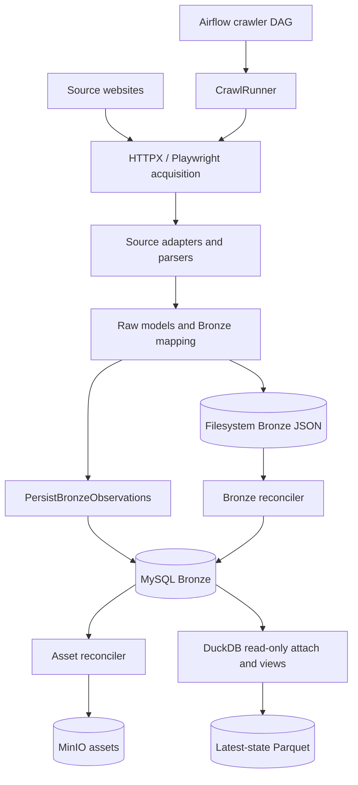
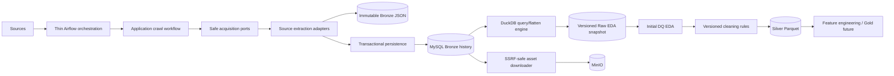

# RoomBeacon Full Project Audit

> **Remediation update — 2026-08-23:** Phase 0 đã xử lý PERSIST-001 (**FIXED / VERIFIED**), SEC-001 asset SSRF (**FIXED / VERIFIED với residual DNS TOCTOU được document**), SEC-002 DuckDB credential-bearing exception (**FIXED / VERIFIED**) và LOG-001 high-risk persistence/analytics boundaries (**PARTIAL**). Evidence lịch sử bên dưới được giữ nguyên. Xem [`docs/security/PHASE_0_SECURITY_HARDENING.md`](../security/PHASE_0_SECURITY_HARDENING.md).
>
> **Phase 1 update — 2026-08-24:** ARCH-001 và ARCH-002 đều **FIXED / VERIFIED** cho hai hotspot mục tiêu. Crawler DAG còn 184 LOC và chỉ giữ Airflow orchestration/error translation; `CrawlRunner` còn 428 LOC, `_run_async` còn 124 LOC với typed session/page/card/frontier boundaries. Phase 1 tổng thể vẫn **PARTIAL** vì hai application composition locations còn import concrete MySQL infrastructure. Xem [`docs/refactor/PHASE_1_CLEAN_ARCHITECTURE.md`](../refactor/PHASE_1_CLEAN_ARCHITECTURE.md).

Ngày audit: 2026-08-23  
Phương pháp: static source/config/test/docs review; không kết nối service, không execute notebook, không thay đổi application code/data/state.  
Scope: repository hiện tại, trừ `.env` và runtime database directories bị từ chối quyền đọc.

## 1. Executive Summary

| Area | Assessment |
|---|---|
| Architecture | NEEDS REFACTOR |
| Code quality | NEEDS REFACTOR |
| Security | HIGH RISK |
| Maintainability | ACCEPTABLE / concentrated hotspots |
| Documentation | UPDATED; legacy design docs remain explicitly non-authoritative |
| Production readiness | NOT READY |

Điểm tốt: domain ports không import infrastructure, SQL persistence dùng parameters, listing/observation identity có unique constraints, transaction boundary rõ, mapped tasks và single-writer DuckDB pool có chủ ý, local test-isolation guard tồn tại, parser fixtures/regression tests khá rộng.

Blocker chính: asset downloader nhận URL từ Bronze rồi request trực tiếp, không dùng `URLValidator`, không resolve/check DNS và tự follow redirect; đây là SSRF HIGH. Deadlock retry gọi tên `PersistResult` không tồn tại, biến deadlock có thể phục hồi thành failure. Crawler runner/DAG quá lớn, “Silver” chưa có cleaning semantics, DuckDB attach tạo DSN chứa credential trong SQL string và có nguy cơ leak qua exception, nhiều parser fallback quá rộng.

Không tìm thấy evidence của raw SQL injection từ untrusted input trong MySQL repositories. Dynamic DuckDB identifiers (`source_view`, view filenames, UI view name) cần allowlist/boundary hardening dù active callers hiện dùng constants.

## 2. Project Inventory

Static metrics: 293 Python files trong các roots audited; 14,928 non-comment source LOC; 5,993 test LOC; 35 test files; 5 DAG files. Có 5 source adapters và 4 concrete MySQL repository classes. Ba files lớn nhất: `crawl_runner.py` 1,045 LOC, crawler DAG 944 LOC, `asset_reconciler.py` 447 LOC. Function lớn nhất: `CrawlRunner._run_async` 774 lines.

```text
roombeacon/
├── airflow/dags/{crawler,reconciliation,assets,analytics,system}/
├── crawler/src/roombeacon_crawler/
│   ├── domain/{models,ports,errors}/
│   ├── application/{persistence,reconciliation,assets}/
│   ├── infrastructure/mysql/{repositories,mappers,schema,transaction}/
│   ├── pipeline/, services/, policies/, discovery/, fetchers/
│   ├── sources/{phongtro123,nhatrovn,nhatot,batdongsan,muaban}/
│   ├── repositories/ (local durable state)
│   └── config/env/
├── analytics/{duckdb,silver}/
├── tests/ (unit, contracts, parser fixtures, regression)
├── notebooks/01_rental_eda.ipynb
├── docs/
└── docker-compose.yml, crawler/airflow/processing Dockerfiles
```

Repository còn duplicate `analytics/**` dưới `crawler/src/analytics/**`, cùng demo tree và nhiều empty placeholder packages.

## 3. Current Implemented Architecture



Crawler flow gồm target planning, access qualification, robots/rate/retry/backoff, listing crawl, optional detail enrichment/deferred backlog, JSON commit, MySQL persistence, checkpoint và health update. MySQL là Bronze primary, không phải serving DB. Compose không có replica service. MinIO active asset flow dùng assets bucket; raw/quarantine/exports chỉ được bootstrap. DuckDB là analytical/query engine với persistent catalog fallback in-memory. Gold không tồn tại.

## 4. Documented vs Implemented Architecture

| Topic | Documented trước audit | Implemented | Verdict |
|---|---|---|---|
| MySQL | Serving DB sau Gold | Bronze operational/history primary | Contradictory; root docs rewritten |
| Raw | HTML/JSON vào MinIO | JSON Bronze local; no active raw-object uploader found | Outdated |
| Silver | cleaned, normalized, deduplicated | `SELECT * FROM v_latest_posts`, validation, Parquet | Name overstates semantics |
| Gold/API | Shown in end-to-end flow | No implementation | Future only |
| DuckDB | In-memory transform layer | persistent file when available, read-only MySQL attach, views; fallback memory | Incomplete |
| Airflow | Thin orchestration | DAG holds material mapping/persistence/checkpoint/reporting logic | Overstated boundary |
| MySQL replica | Architecture docs describe replica | compose defines only primary | Not implemented here |
| ClickHouse | Mentioned in docs/config | no runtime/service/data path | Future/unused config |

Canonical corrections are now in root README and `docs/architecture/CURRENT_ARCHITECTURE.md`.

## 5. Architecture Findings

### ARCH-001 — P1 — Orchestration boundary is thick

**Phase 1 status: FIXED / VERIFIED.** Task IDs, schedule, dynamic mapping, retry/trigger rules và checkpoint ordering được giữ nguyên; task bodies chuyển sang Airflow-free application orchestration modules.

File: `airflow/dags/crawler/roombeacon_crawler.py`; symbols `qualify_target`, `execute_crawl`, `persist_bronze_mysql`, `update_checkpoint`, `summarize_run`. Evidence: 944 LOC and multiple 147–218 line tasks; lines 480–549 construct repositories/use case, ensure schema, load artifacts and translate errors. Impact: difficult unit testing and Airflow upgrades; logic duplicated with core services. Recommendation: incremental application-level `RunCrawlTarget` workflow returning small DTOs; DAG only maps, schedules and applies trigger rules.

### ARCH-002 — P1 — CrawlRunner god object

**Phase 1 status: FIXED / VERIFIED.** Mode/limit resolution, typed session state, deferred detail, page acquisition, card processing và frontier decisions đã có boundary riêng. `CrawlRunner` còn 428 LOC và `_run_async` còn 124 LOC; full regression và boundary tests xác nhận historical/forward/deferred/security invariants được giữ.

File: `pipeline/crawl_runner.py`; `CrawlRunner._run_async` line 374. Evidence: 774-line function spanning planning state, acquisition loops, parsing, detail budget, deferred work, persistence artifacts and finalization. Impact: high regression surface and obscure partial-failure invariants. Recommendation: extract state machine steps behind explicit result types; preserve existing adapters/policies.

### ARCH-003 — P2 — Duplicate analytics package

Files: `analytics/**` and `crawler/src/analytics/**`. Evidence: parallel connection/views/SQL/materializer trees. Impact: import-path dependent behavior and drift already visible in connection line offsets. Recommendation: retain one installable analytics package and test import resolution before deleting duplicate.

### ARCH-004 — P2 — Mixed/empty Clean Architecture scaffolding

Files: `application/use_cases/**`, `pipeline/boxes/**`, `domain/entities/**`, `infrastructure/storage/minio/**`. Evidence: mostly empty `__init__.py` while active implementation lives in sibling `pipeline`, `application/assets`, `infrastructure/mysql`. Impact: source tree claims boundaries that do not carry behavior. Recommendation: remove only after import/reference inventory; do not add interfaces without a second need or meaningful test seam.

## 6. Crawler Findings

Acquisition is reasonably separated through fetchers, coordinator, robots, rate limit, retry and source profiles. Source-specific adapters are registered rather than a dominant `if source ==` chain. Historical discovery, forward-only mode, checkpoints, source health and deferred detail are explicit.

Risks: `CrawlRunner` centralizes too many decisions; local JSON state repositories use broad exception catches; some failures become fallback values, making completeness ambiguous. Browser lifecycle and detail backlog are future scaling risks rather than demonstrated current bottlenecks.

## 7. Parser / Extraction Findings

| Source | Rating | Evidence and risk |
|---|---|---|
| nhatrovn | SAFE/FRAGILE | Dedicated selectors and fixture coverage; detail parser uses labeled badges. Generic final link/title fallbacks remain. |
| nhatot | FRAGILE | Largest parser (372 LOC); text scanning and heuristic extraction; broad catches; strong dedicated tests mitigate risk. |
| phongtro123 | HIGH RISK | Broad class-contains fallbacks (`price`, `location`, generic images), regex fallback over whole card, prior contamination incident. |
| batdongsan | FRAGILE/HIGH RISK | Thin adapter, generic fallback to first anchor/h1/config value; limited source-specific fixtures. |
| muaban | HIGH RISK | Generic `title`, `price`, `content`, `location`, first anchor; no area extraction from listing. |

### PARSER-001 — P1

File: `sources/phongtro123/parsers/listing_parser.py`; symbol `parse`. Evidence: lines 164–194 accept generic class fragments and whole-card regex; lines 212–220 use first image. Impact: cross-field contamination when DOM changes, matching documented incident. Recommendation: fixture-backed semantic containers, per-field provenance and reject ambiguous fallback rather than shift values.

### PARSER-002 — P1

Files: batdongsan/muaban listing and detail parsers. Evidence: fallback to the first anchor, first h1 and generic class fragments. Impact: silent plausible-but-wrong records. Recommendation: capture real fixtures, selector contracts and missing-field metrics before increasing crawl volume.

### PARSER-003 — P2

Multiple parser loops catch `Exception`, log and continue/return `None`. Impact: partial extraction can look successful. Recommendation: typed parse errors plus per-field/record rejection counters; reserve broad catch for adapter boundary.

## 8. Normalization Findings

Extraction mostly preserves `*_raw`, which is correct. Technical numeric parsing occurs in `MySQLBronzeMapper` during child persistence while source parsers also perform light cleanup; Nhatot parser contains `_clean_location` and `_extract_price`, blurring extraction/normalization. Area/price defensive range validation is a good persistence safety net.

Recommendation: extraction returns source-near strings + provenance; one technical normalization module produces nullable typed values; schema validation guards bounds; business cleaning rules live after Initial EDA and are versioned for future Silver.

## 9. Persistence / MySQL Findings

Schema has 11 requested tables: platforms, posts, versions and eight child/history tables. Primary/foreign keys are explicit. Listing identity and observation identity are correctly separated. SQLAlchemy `text()` statements use bound parameters; no untrusted string interpolation was found in MySQL CRUD.

### PERSIST-001 — P0

File: `application/persistence/persist_observations.py`; `execute`, line 133. Evidence: deadlock branch assigns `PersistResult()`, which is undefined; actual dataclass is `BronzeImportResult`. Impact: recovery path raises `NameError` after rollback and defeats retry. Recommendation: targeted fix plus regression test forcing first-attempt deadlock and second-attempt success.

### PERSIST-002 — P1

File: same, lines 74–110. Evidence: one transaction spans an arbitrary observation sequence and many per-row child inserts. Impact: longer locks/deadlocks and expensive retries; N+1-like statement volume. Recommendation: bounded chunks with run-level accounting; use batch inserts where semantics permit.

### PERSIST-003 — P2

Repositories open their own connection when not injected but do not consistently own/close it. Active use case injects a transaction connection, so current path is safe; direct repository use risks leak/uncommitted behavior. Make connection ownership explicit.

Idempotency is at-least-once safe for same `(post, run)` via unique key. Concurrent check-then-insert can still race but unique constraint prevents duplicate; translate integrity conflict into duplicate result.

## 10. Airflow Findings

Five DAGs exist. Schedules: crawler every 15 minutes; Bronze reconciler at 5/20/35/50; asset reconciler at 15/45; Silver daily 02:00; healthcheck present. Crawler and Bronze reconcile use mapped tasks. `max_active_runs=1` limits same-DAG overlap; DuckDB refresh uses `duckdb_analytics_pool`.

### AIR-001 — P1

Bronze reconciler `refresh_duckdb_analytics` uses `ALL_DONE`, catches failure and returns status instead of failing; summary can report partial state after persistence failures. Recommendation: make data correctness gate explicit and distinguish operational success from analytics-refresh failure.

### AIR-002 — P1

Crawler DAG passes nested crawl results/artifact metadata through XCom and summary; at higher volumes this can grow. Recommendation: XCom carries only IDs/paths/counts, durable manifests carry details.

### AIR-003 — P2

Silver snapshot has no explicit Airflow pool in DAG; it opens the same DuckDB path used by refresh. `max_active_runs` is per-DAG only. Recommendation: place all persistent DuckDB writers/materializers in the same single-slot pool.

## 11. Docker Findings

Positives: stateful public ports bind to loopback, service networks are separated, healthchecks/restart policies exist, crawler source is read-only in Airflow. No privileged mode, Docker socket or host networking found.

### DOCKER-001 — MEDIUM / P1

`minio/mc:latest` is floating. Pin immutable/versioned image. Other images are parameterized; actual pin quality depends on `.env.example` values, not runtime `.env`.

### DOCKER-002 — MEDIUM / P1

Airflow runs `${AIRFLOW_UID}:0` and data/config/log bind mounts are writable. Group root is common for local Airflow but broadens impact. Define ownership and minimum write mounts; consider read-only root filesystem/capability drop where compatible.

### DOCKER-003 — P2

Legacy external named volumes remain declared while active services use host bind mounts. This is confusing, not destructive. Deprecate in docs then remove in a separate infrastructure change after backup verification.

Compose config is not a production deployment definition: credentials are environment-injected, TLS is absent on local endpoints, and secrets are not Docker secrets.

## 12. Configuration Findings

Typed dataclasses and `repr=False` password are good. However `config.get_env` eagerly constructs a singleton and loader calls `find_dotenv/load_dotenv` at import time. This couples any import to filesystem/environment resolution and makes tests/audits less predictable. ClickHouse/backend/security config is loaded even without runtime components. Recommendation: lazy dependency-injected settings; validate required values at composition root; remove unused config only after reference audit.

Unsafe defaults are mainly operational (`roombeacon_bronze`, service hostname, fixed ports), not hardcoded passwords. Host fallback probing in DuckDB (3307/3306) obscures Docker-vs-host configuration errors.

## 13. Security Findings

### SEC-001 — HIGH — SSRF in asset downloader

File: `application/assets/asset_reconciler.py`; `_process_single_asset`, lines 365–378. Evidence: scheme-only check then `requests.get` on database-controlled URL; no hostname/IP validation, DNS resolution guard, redirect revalidation or domain allowlist. `URLValidator` exists but is not called. Impact: requests can reach loopback, RFC1918/link-local/cloud metadata/internal Docker names, including via redirect/DNS rebinding. Recommendation: central outbound URL policy; resolve all A/AAAA addresses, block non-public ranges, allowlist source image hosts, disable/revalidate every redirect, protect against DNS rebinding.

### SEC-002 — HIGH — Credential-bearing DuckDB attach error exposure

File: `analytics/duckdb/connection.py`; lines 74–93. Evidence: password is embedded in ATTACH SQL; caught exception is logged. Depending on DuckDB error text, DSN/SQL may be echoed. Impact: database credential leakage to Airflow logs. Recommendation: use secret/parameter facility supported by pinned DuckDB, never log raw attach exception, sanitize DSN/credential patterns.

### SEC-003 — MEDIUM — Unbounded response buffering

Asset downloader sets `stream=True` but then uses `resp.content` before size enforcement (lines 432–447). Impact: memory exhaustion from a large response. Recommendation: reject oversized `Content-Length` and stream chunks with a hard cumulative cap.

### SEC-004 — MEDIUM — Path/object-key trust boundary

`AssetItem.generate_object_key` directly includes `source` and `platform_post_id`; local writer directly includes `source` and `run_id`. `Path.resolve()` is applied only to base, not containment of targets. MinIO keys are not filesystem paths but allow prefix injection; local files allow traversal/absolute replacement. Recommendation: strict slug/ID validation plus resolved-path containment and `O_NOFOLLOW`/atomic-create strategy where applicable.

### SEC-005 — LOW — HTTP hardening

Crawler fetchers have timeouts and default TLS verification; no `verify=False` found. Asset redirects use Requests default and proxy behavior inherits process environment. Define explicit redirect/proxy policy and response-size limits.

Hardcoded credential scan of source/docs/tests/notebook structure found no credential literal requiring disclosure. This was static and value-safe; `.env` was excluded.

## 14. Logging Findings

### LOG-001 — MEDIUM

Persistence builds `err_msg` from raw DB exception and Airflow re-logs/raises it; DuckDB attach exceptions may include credential-bearing SQL. Parser/network errors may include full URLs/query tokens. Seller phone/source payload are persisted but no intentional full payload logging was found. Recommendation: structured logging with event IDs, safe identifiers/counts, exception class, redaction filter for DSN/password/token/cookie/Authorization/phone; store detailed diagnostics in access-controlled artifacts.

## 15. MinIO / Asset Findings

Fair scheduler, deterministic asset ID/key, retry/terminal states, magic-byte validation and state save are good. Upload-success then state-save failure yields retry; deterministic key makes object overwrite/idempotent but can leave orphan/unaccounted success temporarily, which reconciliation can repair. Hash truncation collision is low probability but key also includes source/post/position.

Main issues are SEC-001 and SEC-003. Content-Type policy rejects HTML/JSON but accepts any other header before magic-byte validation; magic validation is authoritative. Retry count is bounded. Asset state stored locally creates single-host durability/locking limitations.

## 16. DuckDB Findings

Current role: analytical/query engine, MySQL read-only federation, view catalog and Parquet source—not a data layer. It may persist `roombeacon_analytics.duckdb`; on lock failure it silently falls back in-memory. Views are recreated per connection from SQL files.

### DUCK-001 — P1

Silent persistent-to-memory fallback changes durability/visibility semantics while workflow may report success. Fail closed for scheduled materialization or return explicit degraded status.

### DUCK-002 — P1

Connection helper is duplicated and contains hardcoded host/port candidates. Consolidate and require explicit runtime mode.

### DUCK-003 — P2

Dynamic SQL identifiers/settings are interpolated. Active values are internal, but `source_view` and UI view should be allowlisted and memory limit type-validated.

## 17. Data Science Pipeline Findings

Correct conceptual order should be Bronze → Raw EDA snapshot → Initial Data Quality EDA → versioned cleaning rules → Silver → clean analytical EDA → feature engineering → Gold. Current code has Bronze, DuckDB flattening/views, a notebook, and a latest-state Parquet exporter. It does not yet have a formal Raw EDA contract, cleaning rules, semantic Silver or Gold.

`PRE_EDA_DATA_READINESS.md` includes point-in-time row counts not reverified in this static audit; treat them as historical observations, not current guarantees.

## 18. Silver / Raw EDA / Gold Findings

### DATA-001 — P1

`SilverMaterializer.materialize` executes `SELECT * FROM v_latest_posts` and validates non-empty/schema/one-row/source only. No cleaning, standardization, data-quality flags or ruleset version is applied. Rename output to Raw EDA/latest snapshot now, or implement/version cleaning before claiming Silver.

### DATA-002 — P1

Parquet replacement is atomic, metadata write is not part of the same atomic publication. Crash after Parquet rename can leave stale/missing sidecar. Write both versioned artifacts, fsync, then atomically swap a manifest pointer.

Raw EDA design is appropriate if made reproducible with query hash, schema, source cutoff/watermark and data-quality summary. Gold: **NOT IMPLEMENTED**; do not create it before clean EDA and feature contracts.

## 19. Notebook Findings

`notebooks/01_rental_eda.ipynb` was inspected statically only and was already modified before audit; it was preserved. No cells were executed. Notebook must not be a production writer or emit env/DSN/credentials. Treat stored outputs and absolute row counts as potentially stale/sensitive; clear/sanitize outputs in a dedicated review without destroying analytical evidence. Notebook markdown should label data timestamp and layer semantics.

## 20. Testing Findings

Strengths: parser fixtures for nhatrovn, URL/robots/access tests, source contracts, crawl lifecycle, reconciliation, asset retries, Silver materializer, test isolation and area-overflow regression. `test_test_isolation_guard.py` and MySQL env guard address `fake_test_source` incident.

Gaps: no demonstrated regression for deadlock retry `NameError`; asset tests mock HTTP but do not prove private-IP/redirect/DNS SSRF blocking; batdongsan/muaban/phongtro123 need representative HTML fixtures and cross-field contamination assertions; no Airflow serialization/import test was executed; no atomic metadata crash test.

Tests were not run because importing application config auto-loads `.env`, prohibited by this audit. This is a verification limitation, not evidence tests fail.

## 21. Performance Findings

Current real issues: whole asset response buffered; per-observation and per-child insert loops; crawler/DAG transfer large nested dictionaries. Future scaling risks: large batch transaction, DuckDB/MySQL repeated joins, persistent DuckDB lock contention, browser lifecycle cost, growing JSON manifests/XCom. No evidence supports replacing MySQL/Airflow or introducing distributed systems now.

## 22. Reliability / Idempotency Findings

- Airflow retry after committed observation: unique `(post, run)` prevents duplicate child insertion because children persist only for new version.
- Crash before commit: transaction rollback is intended; deadlock retry bug currently breaks one recovery path.
- JSON written but DB failed: Bronze reconciler can repair.
- MinIO upload then local state failure: deterministic object key permits safe re-upload; state can temporarily disagree.
- Checkpoint follows successful mapped persist in crawler DAG; skipped/error paths need explicit invariants in tests.
- Silver temp write failure preserves previous Parquet, but post-rename metadata failure creates split publication.

## 23. Code Quality Findings

Large hotspots and mixed responsibility are the dominant problem. Error handling frequently catches broad `Exception`; several places intentionally degrade, but typed failure categories are inconsistent. Demo and placeholder trees increase cognitive load. SQL views externalized into files and domain ports are good. Avoid bulk format/rewrite.

Dead code candidates (not proven): demo subtree, ClickHouse config, empty pipeline boxes/use_cases, duplicate analytics. Confirm imports/runtime packaging before deletion.

## 24. Dependency Findings

`crawler/pyproject.toml` is the main Python dependency declaration. Docker images are parameterized except `minio/mc:latest`. Duplicate/unused candidates follow architecture dead-code candidates. No CVE claim is made because no vulnerability database was queried. Keep runtime/dev dependencies separate and lock transitive versions in a future dependency-only task.

## 25. Documentation Findings

Classification:

- **REWRITTEN:** root `README.md`.
- **CREATED/CANONICAL:** `docs/README.md`, `docs/architecture/CURRENT_ARCHITECTURE.md`, this audit.
- **MOSTLY ACCURATE:** `ANALYTICS_ARCHITECTURE.md`, `ASSET_PIPELINE.md`, `DEPENDENCY_RULES.md`, crawler robots/access/health/discovery/coverage docs, Airflow overview, Docker development, test isolation.
- **OUTDATED AS CURRENT-STATE / RETAINED AS DESIGN CONTEXT:** `overall-architecture.md`, `SYSTEM_ARCHITECTURE.md`, `source-structure.md`, persistence documents that call MySQL serving, crawler docs mentioning ClickHouse, Silver docs that imply cleaning is implemented.
- **POINT-IN-TIME:** `PRE_EDA_DATA_READINESS.md`.
- **PRESERVED:** `docs/log/**` incident history.

Legacy docs are indexed as non-authoritative to avoid rewriting historical/design intent across dozens of files. Outdated current-state authority remaining: 0; legacy files containing outdated design statements: 7+ and explicitly classified. Contradictory canonical docs remaining: 0.

## 26. Good Components — Do Not Rewrite

1. MySQL identity constraints and parameterized repositories: core invariants are clear and tested; fix targeted defects only.
2. `URLValidator`: useful generic scheme/literal-IP boundary; extend DNS/redirect handling and reuse it rather than replace it.
3. Source registry/adapter boundary: keeps most source conditionals outside generic flow.
4. Robots/rate/retry/source-health policies: meaningful behavior and tests; split large internals only when adding targeted tests.
5. Silver temp-file validation/rename mechanism: retain it, add atomic metadata publication and correct semantics.
6. Incident logs: historical engineering evidence; never rewrite to hide failures.

## 27. Technical Debt Map

| Priority | Debt |
|---|---|
| P0 | Deadlock retry undefined class |
| P0 security | None classified CRITICAL; SSRF is HIGH and Phase 0 |
| P1 | Asset outbound policy/stream cap; log redaction; CrawlRunner/DAG boundaries; Silver semantics/publication; DuckDB secret/degraded mode |
| P2 | Analytics duplication; parser typed errors; repository connection ownership; legacy volume/docs cleanup |
| P3 | Empty scaffolding and naming/style cleanup after import audit |

## 28. Recommended Architecture



Giữ monorepo, Airflow, MySQL, DuckDB, MinIO. Mục tiêu là boundary rõ và contract/versioning, không phải microservices hay database mới.

## 29. Security Hardening Plan

1. Block asset outbound SSRF with allowlists, public-IP resolution, redirect revalidation, DNS rebinding defense and bounded streaming.
2. Remove credential-bearing SQL/error logs; central redaction tests.
3. Validate all path/key segments and enforce containment/symlink policy.
4. Pin images/dependencies; non-root/minimum mount hardening.
5. Add security regression suite and operational incident runbook.

## 30. Refactor Roadmap

### PHASE 0 — Security / Correctness

Scope: SEC-001..004, PERSIST-001. Files: asset reconciler, URL validator, DuckDB connection, persistence use case, tests. Risk: downloader compatibility and retry semantics. Required tests: private IPv4/IPv6, DNS/redirect, oversized streaming, log redaction, deadlock retry. Result: safe outbound requests and recoverable DB retry.

### PHASE 1 — Architecture Boundaries

Scope: split CrawlRunner state machine and move DAG business logic into application workflows. Risk: checkpoint ordering. Tests: golden lifecycle/partial failure/idempotent retry. Result: thin DAG, independently testable workflow.

### PHASE 2 — Crawler / Parser

Scope: provenance-aware field extraction, remove ambiguous fallbacks, fixture coverage for all sources. Risk: short-term yield reduction. Tests: captured fixtures, missing selector/no field shift, pagination/detail/image/seller cases. Result: measurable parser precision.

### PHASE 3 — Persistence / Configuration

Scope: bounded transaction chunks, connection ownership, lazy typed config, eliminate host probing. Risk: transaction semantics. Tests: rollback boundaries, conflict races, config matrix, test isolation. Result: predictable persistence/configuration.

### PHASE 4 — Airflow / Infrastructure

Scope: compact XComs, shared DuckDB pool, failure gates, image pin/non-root/mount review. Risk: DAG migration. Tests: DAG import/serialization, mapped partial failures, concurrency. Result: reliable orchestration.

### PHASE 5 — Analytics / Data Science

Scope: name/version Raw EDA snapshot, record query/watermark/schema; derive cleaning rules; only then publish Silver; Gold remains future. Risk: analytical reproducibility. Tests: schema/data-quality contracts, atomic dataset+metadata publication. Result: correct layer semantics.

### PHASE 6 — Cleanup / Documentation

Scope: consolidate analytics, remove proven dead code/scaffolding, archive/label legacy design docs. Risk: import paths/links. Tests: package import, link and Mermaid validation. Result: smaller accurate repository.

## 31. Documentation Rewrite Summary

Root README rewritten. Canonical current architecture and documentation index created. Full audit created. Incident logs untouched. Legacy architecture docs retained as design/historical context to avoid falsifying intent; index removes their authority over current implementation.

## 32. Risk Before Continuing EDA

Initial read-only EDA may continue on a versioned snapshot, but do not label current Parquet as cleaned Silver or build Gold conclusions from it. Capture cutoff/query/schema, exclude test sources, quantify parser contamination, and resolve area/price anomalies. Production crawling/asset processing should not expand until Phase 0 issues are fixed.

## 33. Final Recommendation

Proceed incrementally. First isolate security/correctness fixes, then shrink orchestration/god-object boundaries, then improve parser evidence, and only afterward formalize Raw EDA → cleaning rules → Silver. No big-bang rewrite or new platform technology is justified.

### Security acceptance

| Check | Result |
|---|---|
| `.env` read | NO |
| `.env` content exposed | NO |
| Runtime environment dumped | NO |
| Credentials printed | NO |
| `.env` tracked by Git | NO |
| `.env` present in Git history | NO (path-only Git log check returned no commit) |
| Hardcoded credentials | NONE FOUND in static value-safe review |
| SQL injection | No active MySQL injection found; dynamic DuckDB identifiers require hardening |
| SSRF | HIGH finding SEC-001 |
| Path traversal | MEDIUM finding SEC-004 |
| Sensitive logging | MEDIUM/HIGH exposure path SEC-002 and LOG-001 |
| Docker hardening | NEEDS HARDENING |
| Notebook secret risk | No known secret found; stored outputs remain a review risk |

### Documentation acceptance

| Area | Result |
|---|---|
| Root README | REWRITTEN |
| Architecture docs | CANONICAL DOC CREATED; legacy docs classified |
| Crawler docs | AUDITED |
| Analytics/Data Science docs | AUDITED; semantics corrected canonically |
| Testing docs | ACCURATE / historical parts preserved |
| Security docs | CREATED IN AUDIT |
| Operations docs | AUDITED |
| Incident logs | PRESERVED |
| Mermaid diagrams | STATICALLY REVIEWED; render tool not run |
| Outdated current-state authority | 0 |
| Legacy outdated/design files | 7+ classified, not silently presented as current |

### Final quality gate

Application source modified: NO. Database/data/crawler/Airflow/Docker/Silver state modified: NO. Gold created: NO. Notebook code modified by audit: NO. Existing user notebook change preserved: YES. `.env` read: NO. Secrets printed: NO. Audit completed: YES. Incorrect canonical docs rewritten: YES. Recommended architecture and roadmap documented: YES.
