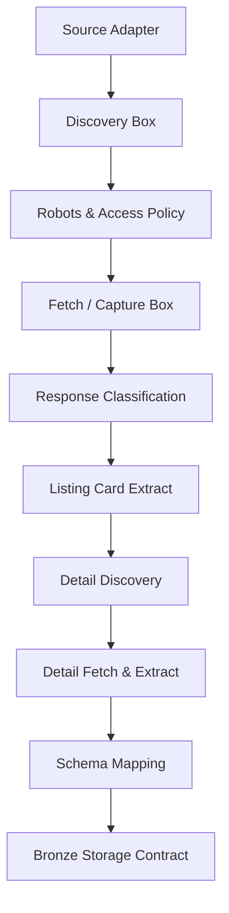

# 01 — RoomBeacon Crawler Overview

Tài liệu này tổng quan về kiến trúc, mục tiêu và ranh giới hoạt động của **RoomBeacon Production Crawler V1**.

---

## 1. Mục tiêu & Nguyên lý thiết kế

RoomBeacon Crawler được xây dựng theo kiến trúc **Clean Architecture** kết hợp mô hình **Hexagonal / Pipeline Flow**:

* **Tính độc lập:** Tách biệt hoàn toàn Business Logic (Extract, Schema Mapping) khỏi Infrastructure (HTTPX, Playwright, Storage).
* **Không làm việc của downstream layer:** Crawler chịu trách nhiệm thu thập và bóc tách dữ liệu thô (Raw / Bronze). **Không** thực hiện chuẩn hóa dữ liệu chuyên sâu (chuyển đổi kiểu dữ liệu, imputation, NLP address) - công việc này thuộc về Silver layer (DuckDB processing).
* **Orchestration độc lập:** Crawler chạy độc lập, sẵn sàng để Apache Airflow import và điều phối mà không phụ thuộc vào Airflow core trong source crawler.
* **Tuân thủ đạo đức cào web:** Áp dụng nghiêm ngặt RobotsPolicy, RateLimitPolicy, RetryPolicy và dừng an toàn khi gặp rào cản truy cập.

---

## 2. Luồng dữ liệu tổng thể



---

## 3. Cấu trúc thư mục Production

```text
crawler/src/roombeacon_crawler/
├── __init__.py
├── main.py
├── enums/          # Các Enum định nghĩa trạng thái, strategy, date mode
├── models/         # Domain Data Models (Target, Response, Metadata, Raw Records, Bronze)
├── config/         # Cấu hình toàn cục và cấu hình theo nguồn
├── fetchers/       # HTTP Fetcher (HTTPX) và Browser Fetcher (Playwright)
├── policies/       # RobotsPolicy, RateLimitPolicy, RetryPolicy, FetchPolicy, DateCutoffPolicy
├── services/       # ResponseClassifier, StrategySelector, MetadataCollector
├── validators/     # Kiểm tra tính toàn vẹn cấu trúc card và detail
├── mappers/        # BronzeMapper (hợp nhất Card + Detail + Metadata -> RentalBronzeRecord)
├── sources/        # Source Adapters, Selectors, Parsers riêng biệt (Nhà Tốt, ...)
└── pipeline/       # ListingCrawlPipeline, DetailCrawlPipeline, CrawlRunner
```

---

## 4. Tài liệu chi tiết liên quan
* [Automated Crawl Orchestration & Checkpoint State](AIRFLOW_CRAWL_ORCHESTRATION.md)
* [Multi-Source Architecture](02-multi-source-architecture.md)
* [Fetch and Access Policy](03-fetch-and-access-policy.md)
* [Storage Contract](08-storage-contract.md)
