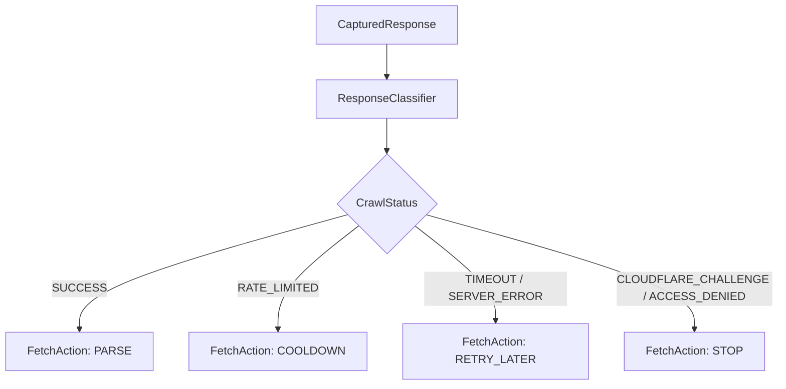

# 03 — Fetch and Access Policy

Tài liệu này mô tả cơ chế kiểm soát truy cập, tuân thủ `robots.txt`, điều tiết tốc độ (Rate Limit), cơ chế Retry và phân loại phản hồi mạng.

---

## 1. Robots.txt Compliance (`RobotsPolicy`)

* **Chuẩn thực thi:** Sử dụng thư viện chuẩn `urllib.robotparser.RobotFileParser`.
* **User-Agent:** Mặc định `RoomBeaconCrawler/0.1`.
* **Cơ chế Cache:** Parser tự động lưu cache các chỉ thị robots theo từng domain trong suốt thời gian của một `run_id` nhằm tránh lặp lại request tới `/robots.txt`.
* **Hành vi:** Nếu đường dẫn bị cấm bởi `robots.txt`, crawler lập tức gán `CrawlStatus.ROBOTS_DENIED` và dừng request mà không vi phạm quy tắc của máy chủ nguồn.

---

## 2. Rate Limiting (`RateLimitPolicy`)

* **Throttle:** Đảm bảo độ trễ tối thiểu giữa hai request liên tiếp (`delay_seconds`, mặc định 1.5s).
* **Concurrency:** Quản lý số lượng worker song song bằng `asyncio.Semaphore` (mặc định concurrency = 1 cho các nguồn nhạy cảm).

---

## 3. Retry Policy (`RetryPolicy`)

* **Trường hợp áp dụng:** Chỉ retry với các lỗi có khả năng phục hồi tạm thời:
  * `TIMEOUT`
  * `CONNECTION_ERROR`
  * `SERVER_ERROR` (HTTP 5xx)
* **Số lần thử:** Tối đa 3 lần (`max_retries = 3`).
* **Thuật toán Backoff:** Exponential backoff:
  $$\text{delay} = \min(\text{base\_delay} \times 2^{\text{attempt} - 1}, \text{max\_delay})$$
* **Không Retry:** Tuyệt đối không retry với `ACCESS_DENIED`, `CLOUDFLARE_CHALLENGE`, `NOT_FOUND`, `ROBOTS_DENIED`.

---

## 4. Response Classifier & Fetch Policy

