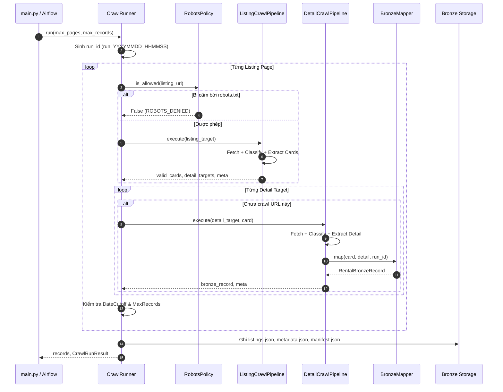

# 09 — Crawl Run Flow

Tài liệu này mô tả chi tiết luồng thực thi đầy đủ của một phiên crawl trong RoomBeacon Crawler.

---

## 1. Sequence Flow của CrawlRunner



---

## 2. Cách thức gọi từ Python Code / Apache Airflow

```python
from roombeacon_crawler.config.crawler_settings import CrawlerSettings
from roombeacon_crawler.pipeline.crawl_runner import CrawlRunner
from roombeacon_crawler.sources.nhatot.adapter import NhatotSourceAdapter

settings = CrawlerSettings(
    max_pages=2,
    max_total_records=50,
)
adapter = NhatotSourceAdapter()
runner = CrawlRunner(adapter=adapter, settings=settings)

# Chạy async trong Python hoặc Airflow PythonOperator:
records, result = await runner.run()
```
