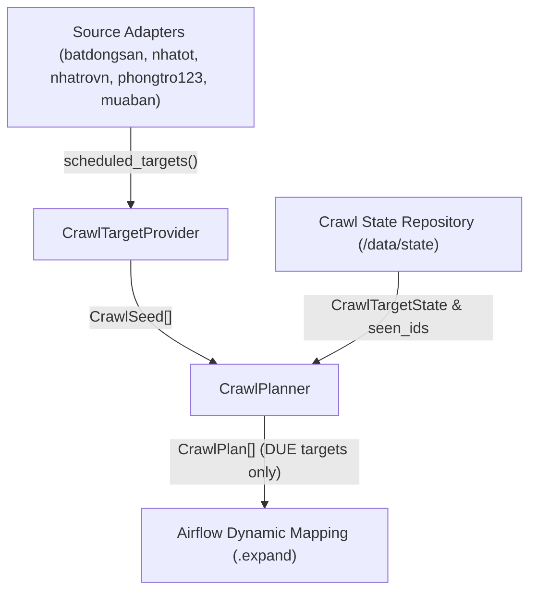
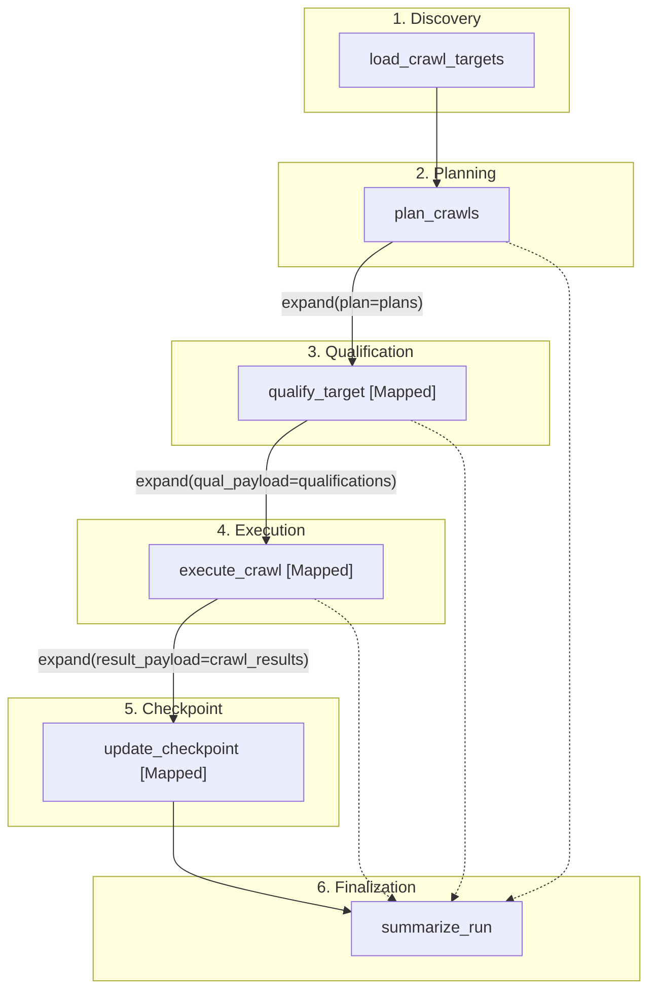
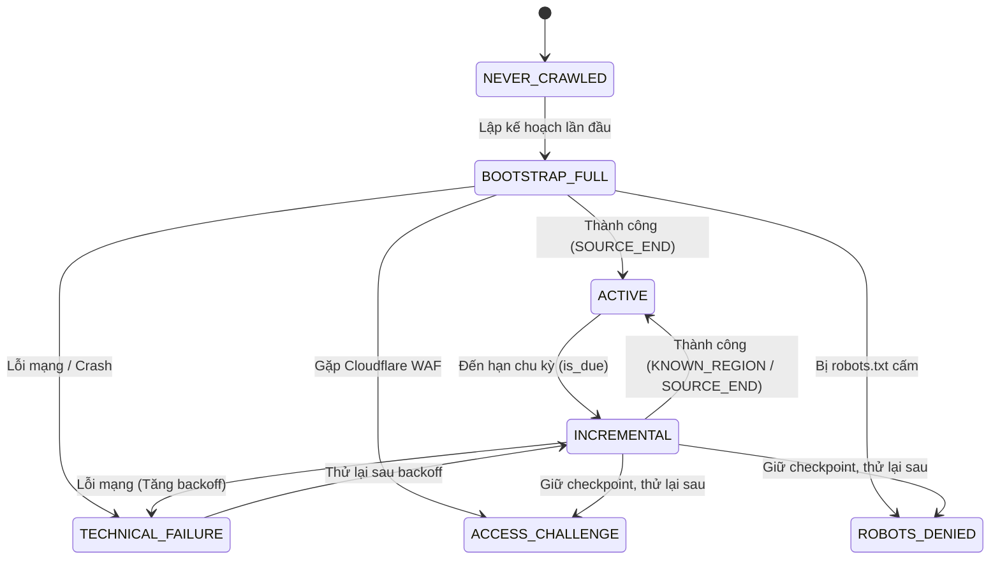
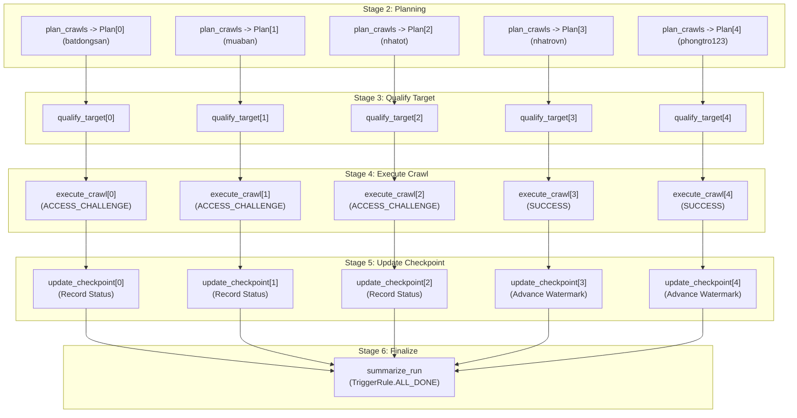

# RoomBeacon Automated Crawl Orchestration

Tài liệu thiết kế chi tiết kiến trúc điều phối thu thập dữ liệu tự động (Automated Crawl Orchestration) của hệ thống RoomBeacon.

---

## 1. Mục tiêu

Trong môi trường vận hành Production, hệ thống thu thập dữ liệu RoomBeacon hoạt động **hoàn toàn tự động (AUTO-driven)** và không phụ thuộc vào việc người vận hành phải nhập thủ công các tham số như `Target URL`, `Max Pages` hay `Max Records` cho từng DagRun.

Hệ thống tự động nhận biết:
1. Danh sách các website nguồn và target đang được kích hoạt thông qua cơ chế tự động khám phá plugin (`SourceRegistry` & `AdapterScheduledTargetProvider`).
2. Khi nào một target đến hạn chạy (`is_due`) dựa trên chu kỳ `interval_minutes` cấu hình tĩnh của từng adapter.
3. Target cần chạy ở chế độ **BOOTSTRAP_FULL** (nếu chưa từng hoàn thành crawl thành công) hay **INCREMENTAL** (nếu đã có checkpoint lưu vết trước đó).
4. Điểm dừng phân trang tự nhiên (`SOURCE_END` hoặc `KNOWN_REGION_REACHED`) thay vì cắt ngang bằng một con số hardcode giả định.
5. Cập nhật và lưu vết trạng thái an toàn (`Checkpoint State`) để phục vụ các phiên chạy kế tiếp.

---

## 2. Nguyên tắc kiến trúc

Kiến trúc phân định ranh giới trách nhiệm nghiêm ngặt giữa các thành phần:

* **Source Adapter (`BaseSourceAdapter`)**: Nắm giữ cấu hình tĩnh của website nguồn (tên miền, parser bóc tách, pagination, danh sách `scheduled_targets()`).
* **CrawlTargetProvider (`AdapterScheduledTargetProvider`)**: Khám phá và tập hợp toàn bộ danh sách `CrawlSeed` từ các Source Adapters đã đăng ký.
* **CrawlPlanner (`CrawlPlanner`)**: Lập kế hoạch thực thi, kiểm tra tính đến hạn (`is_due`), quyết định chế độ `BOOTSTRAP_FULL` vs `INCREMENTAL`, tính toán khung thời gian overlap và sinh danh sách `CrawlPlan`.
* **CrawlStateRepository (`LocalCrawlStateRepository`)**: Giao diện lưu vết trạng thái checkpoint (`CrawlTargetState`) và danh bạ định danh tin đăng đã thấy (`seen_listing_ids`).
* **Airflow Orchestrator (`roombeacon_crawler.py`)**: Điều phối luồng xử lý qua 6 giai đoạn rõ ràng trên Airflow Graph bằng TaskFlow Dynamic Task Mapping (`.expand()`).
* **Crawler Engine (`CrawlRunner`)**: Thực thi tải trang, tuân thủ robots.txt, rate limit, kiểm tra rào cản truy cập và chuyển HTML cho parser của nguồn.
* **Persistence Layer (`LocalStorageWriter`)**: Lưu trữ Run Manifest và Bronze Dataset (`listings.json`, `details.json`, `metadata.json`).

---

## 3. Cấu trúc Source Adapters

Cấu trúc module nguồn độc lập được bảo toàn trọn vẹn, không gom chung thành Universal Parser hay chuyển sang YAML profile:

```
crawler/src/roombeacon_crawler/sources/
├── batdongsan/
│   ├── discovery/          # Thuật toán phân trang & nhận diện ngày
│   ├── parsers/            # ListingParser & DetailParser cho BatDongSan
│   ├── selectors/          # CSS Selectors & XPath đặc thù
│   ├── adapter.py          # BatDongSanSourceAdapter
│   └── __init__.py
├── muaban/
│   └── ...
├── nhatot/
│   ├── discovery/
│   ├── parsers/
│   ├── selectors/
│   ├── adapter.py
│   └── __init__.py
├── nhatrovn/
│   └── ...
├── phongtro123/
│   └── ...
├── base.py                 # Hợp đồng trừu tượng BaseSourceAdapter
├── discovery.py            # Cơ chế Auto-Discovery quét plugin động
├── registry.py             # Danh bạ đăng ký SourceRegistry
└── resolver.py             # Bộ phân giải URL sang Adapter tương ứng
```

---

## 4. Input Flow

Luồng tiếp nhận và lập kế hoạch đầu vào:



---

## 5. Airflow Processing Flow

Toàn bộ 6 giai đoạn điều phối được hiển thị trực quan và minh bạch trên đồ thị Airflow:



---

## 6. Chế độ BOOTSTRAP_FULL

Khi một target được kích hoạt lần đầu tiên hoặc chưa từng ghi nhận phiên crawl thành công (`last_success_at is None`):
* Chế độ: `BOOTSTRAP_FULL`.
* Lý do: `FIRST_SUCCESSFUL_CRAWL_NOT_FOUND`.
* Hành vi: Crawler thu thập tuần tự từ Trang 1, Trang 2, Trang 3... cho tới khi website nguồn thông báo hết tin (`SOURCE_END`).
* Giới hạn an toàn khẩn cấp (`Safety Guards`): `bootstrap_safety_max_pages` (500) và `bootstrap_safety_max_records` (20,000) chỉ dùng để bảo vệ hệ thống không rơi vào vòng lặp vô tận.

---

## 7. Chế độ INCREMENTAL

Khi target đã có lịch sử crawl thành công trước đó:
* Chế độ: `INCREMENTAL`.
* Lý do: `INCREMENTAL_SCHEDULED_DUE`.
* Hành vi: Crawler thu thập từ trang tin mới nhất (Trang 1) trở đi.
* Định danh tin đăng (`Listing Identity`): Đối chiếu `(source, listing_id)` với danh bạ `seen_listing_ids` trong State Repository để phân loại tin `MỚI` hay `ĐÃ BIẾT`.
* Cửa sổ Overlap (`incremental_overlap_hours`): Cho phép quét gối đầu để không bỏ sót các tin cập nhật trễ hoặc tin được đẩy top.
* Quy tắc dừng vùng đã biết (`Known-Region Stop Rule`): Khi gặp liên tiếp `incremental_stop_after_known_pages` (mặc định: 2 trang) chỉ toàn tin đã biết mà không có tin mới nào xuất hiện, quá trình phân trang sẽ dừng ngay lập tức với lý do `KNOWN_REGION_REACHED`.

---

## 8. Listing Identity

Hệ thống sử dụng khóa định danh tin đăng ổn định:
$$\text{Identity} = (\text{source}, \text{listing\_id})$$

* **Tại sao không dùng Title / URL thuần túy?** Tiêu đề tin đăng thường xuyên bị trùng lặp hoặc chỉnh sửa nhẹ; URL có thể thay đổi query parameters hoặc slug SEO.
* **Tại sao không chỉ dựa vào Ngày đăng (`posted_at`)?** Các website rao vặt thường đẩy top (bump/boost), làm mới ngày đăng hoặc dùng định dạng ngày tương đối ("vừa xong", "hôm qua"). Do đó, ngày đăng chỉ là tín hiệu tối ưu thứ cấp, định danh tin đăng là căn cứ chính để xác định tin mới.

---

## 9. Checkpoint State Model

Cấu trúc mô hình `CrawlTargetState`:

| Thuộc tính | Kiểu dữ liệu | Ý nghĩa |
| :--- | :--- | :--- |
| `source` | `str` | Tên nguồn (vd: `nhatrovn`, `nhatot`) |
| `target_id` | `str` | Mã định danh target (vd: `hcm_phongtro`) |
| `last_started_at` | `str (ISO)` | Thời điểm bắt đầu phiên cào gần nhất |
| `last_finished_at` | `str (ISO)` | Thời điểm kết thúc phiên cào gần nhất |
| `last_success_at` | `str (ISO)` | Thời điểm thành công gần nhất (Watermark) |
| `last_full_crawl_at` | `str (ISO)` | Thời điểm hoàn thành full crawl gần nhất |
| `last_watermark_at` | `str (ISO)` | Mốc thời gian watermark dùng tính overlap |
| `last_status` | `str` | Trạng thái kết thúc gần nhất |
| `last_stop_reason` | `str` | Lý do dừng phiên crawl |
| `last_records_created`| `int` | Số lượng bản ghi Bronze tạo ra |
| `consecutive_failures`| `int` | Số lần thất bại kỹ thuật liên tiếp |
| `next_run_at` | `str (ISO)` | Thời điểm đến hạn kích hoạt phiên tiếp theo |

---

## 10. Runtime State Transitions

Sơ đồ chuyển đổi trạng thái của Crawl Target:



---

## 11. Scheduling & Tần suất cào

* **Một DAG duy nhất:** `roombeacon_crawler` với lịch Master chạy mỗi 15 phút (`*/15 * * * *`).
* **Chu kỳ riêng theo từng Target (`interval_minutes`):**
  * `nhatrovn`: 30 phút.
  * `phongtro123`: 45 phút.
  * `nhatot`: 60 phút.
  * `muaban`: 60 phút.
  * `batdongsan`: 120 phút.
* **`max_active_runs = 1`:** Đảm bảo không có 2 phiên DAG chạy đè lên nhau gây tranh chấp file checkpoint state.
* **Xử lý khi không có target nào đến hạn:** DAG kết thúc thành công sạch sẽ với tổng kết `Targets due: 0, Crawled: 0`.

---

## 12. Giao diện Airflow UI

Form kích hoạt DAG được thiết kế tối giản, loại bỏ hoàn toàn các trường dữ liệu cồng kềnh:
* `execution_mode`: Lựa chọn chế độ chạy (`AUTO` - Mặc định, `FORCE_FULL`, `FORCE_INCREMENTAL`, `DEBUG_SINGLE_TARGET`).
* `debug_target_url`: URL phục vụ kiểm tra lỗi (chỉ dùng khi chọn `DEBUG_SINGLE_TARGET`).
* `debug_max_pages` / `debug_max_records` / `debug_crawl_details`: Các tùy chọn ghi đè tạm thời khi debug.

---

## 13. Ma trận trách nhiệm (Responsibility Matrix)

| Thành phần | Trách nhiệm chính | Điều TUYỆT ĐỐI KHÔNG làm |
| :--- | :--- | :--- |
| **Source Adapter** | Cấu hình website, bóc tách DOM, phân trang | Không điều phối lịch, không quản lý state runtime |
| **CrawlPlanner** | Tính toán tính đến hạn, chọn Full vs Incremental | Không parse HTML, không hardcode nhánh `if source` |
| **CrawlStateRepository** | Lưu vết checkpoint và danh sách tin đã thấy | Không chứa logic cào hay chính sách truy cập |
| **Airflow DAG** | Điều phối các task, mở rộng TaskFlow mapping | Không parse dữ liệu, không hardcode URL sản xuất |
| **CrawlRunner** | Thực thi vòng lặp cào, bóc tách và hạch toán | Không quyết định lịch toàn cục |

---

## 14. Lưu trữ trạng thái tạm thời (Temporary Storage)

Hiện tại, trạng thái lưu vết được duy trì cục bộ tại volume chia sẻ `/data/state`:
```
/data/state/
├── targets/
│   ├── nhatrovn__hcm_phongtro.json
│   ├── nhatot__hcm_phongtro.json
│   └── ...
└── seen/
    ├── nhatrovn__hcm_phongtro.json
    ├── nhatot__hcm_phongtro.json
    └── ...
```
Tất cả các thao tác ghi file đều sử dụng cơ chế ghi nguyên tử (Atomic Write qua file `.tmp` và `os.replace`).

---

## 15. Kế hoạch di trú sang MySQL trong tương lai

Giao diện `CrawlStateRepository` đóng vai trò ranh giới trừu tượng. Khi hệ quản trị MySQL sẵn sàng, việc chuyển đổi chỉ yêu cầu bổ sung `MySQLCrawlStateRepository` mà không làm thay đổi bất kỳ dòng mã nào trong `CrawlPlanner`, `CrawlRunner` hay Airflow DAG:

```
LocalCrawlStateRepository (Hiện tại)
        ↓
MySQLCrawlStateRepository (Tương lai)
```

---

## 16. Ví dụ vòng đời cào dữ liệu thực tế (Lifecycle Example)

1. **Phiên 1 (Khởi tạo):** `nhatrovn` chưa có state $\rightarrow$ Planner chọn `BOOTSTRAP_FULL` $\rightarrow$ Cào từ trang 1 đến trang cuối $\rightarrow$ Tạo 500 records $\rightarrow$ Ghi nhận 500 `seen_ids` $\rightarrow$ Cập nhật checkpoint `last_full_crawl_at`, `next_run_at = now + 30m`.
2. **Phiên 2 (Sau 30 phút):** Planner nhận thấy `is_due = True` $\rightarrow$ Chọn `INCREMENTAL` $\rightarrow$ Quét Trang 1 thấy 5 tin mới và 15 tin cũ $\rightarrow$ Quét Trang 2 toàn tin cũ (streak = 1) $\rightarrow$ Quét Trang 3 toàn tin cũ (streak = 2) $\rightarrow$ Dừng với lý do `KNOWN_REGION_REACHED` $\rightarrow$ Cập nhật watermark mới và thêm 5 `seen_ids`.

---

## 17. Ngữ nghĩa xử lý sự cố (Failure Semantics)

* **`ROBOTS_DENIED`:** Ghi nhận trạng thái kiểm tra, **KHÔNG** cập nhật watermark thành công, lịch chạy tiếp tục thử lại ở chu kỳ bình thường.
* **`ACCESS_CHALLENGE`:** Ghi nhận rào cản truy cập, **KHÔNG** cập nhật watermark, không coi là lỗi sập hệ thống (failure_reason = None).
* **`TECHNICAL_FAILURE`:** Ghi nhận lỗi, tăng biến đếm `consecutive_failures`, áp dụng thuật toán lùi lịch lũy tiến (Bounded Backoff) trước khi thử lại.
* **`PERSISTENCE_FAILURE`:** Nếu ghi dữ liệu Bronze hoặc Manifest thất bại, checkpoint tuyệt đối không được ghi nhận thành công.

---

---

## 18. Runtime Outcome Semantics

Hệ thống phân định ranh giới rõ ràng giữa kết quả cào dữ liệu thành công, kết quả kiểm soát truy cập (policy / access challenge) và sự cố kỹ thuật thực tế:

| Trạng thái kết quả (Runtime Outcome) | Phân loại | Tác vụ Crawl | Tác vụ Checkpoint | Hành vi Watermark & Checkpoint |
| :--- | :--- | :--- | :--- | :--- |
| **`SUCCESS`** | Thành công | SUCCESS | SUCCESS | Cập nhật `last_success_at`, tiến độ `last_watermark_at`, lưu `seen_ids`, reset `consecutive_failures = 0`. |
| **`SOURCE_END`** | Thành công | SUCCESS | SUCCESS | Hết trang tự nhiên, cập nhật `last_success_at` và watermark đầy đủ. |
| **`KNOWN_REGION_REACHED`** | Thành công | SUCCESS | SUCCESS | Dừng hợp lệ do gặp 2 trang đã biết liên tiếp (Incremental), cập nhật watermark thành công. |
| **`ROBOTS_DENIED`** | Kiểm soát chính sách | SKIPPED/SUCCESS | SUCCESS | Ghi nhận trạng thái kiểm tra (`last_status`), **KHÔNG** nâng watermark thành công, lịch chạy giữ nguyên. |
| **`ACCESS_CHALLENGE`** | Rào cản truy cập | SUCCESS (Controlled) | SUCCESS | Ghi nhận `cloudflare_challenge` / `access_denied`, **KHÔNG** nâng watermark, không tăng backoff sự cố. |
| **`HTTP_FORBIDDEN`** | Lỗi phân quyền | SUCCESS (Controlled) | SUCCESS | Ghi nhận phản hồi HTTP 403 độc lập, không xem là sự cố sập crawler. |
| **`PARSER_ZERO_RECORDS`** | Cảnh báo nội dung | SUCCESS (Controlled) | SUCCESS | Ghi nhận 0 records, không tạo Bronze dataset rỗng, kiểm tra lại selector của adapter. |
| **`TECHNICAL_FAILURE`** | Sự cố kỹ thuật | FAILED / Error Payload | SUCCESS | Ghi nhận lỗi, tăng `consecutive_failures += 1`, áp dụng Bounded Exponential Backoff cho `next_run_at`. |
| **`PERSISTENCE_FAILURE`** | Lỗi lưu trữ | FAILED | FAILED/No-op | Lỗi ghi dữ liệu hoặc manifest, tuyệt đối **KHÔNG** cập nhật trạng thái checkpoint thành công. |

### Đồ thị xử lý Mapped Targets độc lập

Mỗi target được lập kế hoạch chạy hoàn toàn độc lập qua các map index, đảm bảo một nguồn gặp rào cản truy cập hoặc lỗi không ảnh hưởng tới tiến trình và checkpoint của các nguồn khác:



---

---

## 19. Phân nhánh chiến lược khám phá (Discovery Strategy Branch)

Hệ thống phân giải tự động 2 chiến lược khám phá URL đầu vào độc lập thông qua `DiscoveryStrategyResolver`:

* **`STANDARD` (Pagination Discovery):** Dành cho các nguồn chuẩn (`nhatrovn`, `phongtro123`), cào theo phân trang danh mục tuần tự và dừng thông minh khi gặp vùng tin đã biết (`known_region_streak`).
* **`ENHANCED_DISCOVERY` (Sitemap XML Discovery):** Dành cho các nguồn quy mô lớn (`nhatot`, `batdongsan`, `muaban`), khám phá toàn bộ URL ứng viên từ Sitemap Index / URL Sets chính thức được website công bố mà không phụ thuộc vào giới hạn phân trang sâu.

> [!NOTE]
> Chi tiết toàn diện về thiết kế 2 loại Adapter (`SourceAdapter` vs `DiscoveryAdapter`), cấu trúc lưu trữ `/data/discovery/`, và quy trình tích hợp nguồn lớn vui lòng xem tại: [SOURCE_DISCOVERY_STRATEGIES.md](file:///home/codeser/Data/projects/roombeacon/docs/crawler/SOURCE_DISCOVERY_STRATEGIES.md).

---

## 20. Lộ trình tích hợp luồng dữ liệu tương lai

```
Crawler (Bronze Files & Manifests)
   ↓
MySQL Bronze Catalog
   ↓
DuckDB Processing Engine (Data Cleaning & Normalization)
   ↓
Silver Storage
   ↓
MySQL Core (Operational) & ClickHouse (Analytics OLAP)
```
*(Các tầng xử lý Silver và OLAP Analytics sẽ được triển khai trong các phân đoạn kế tiếp).*


