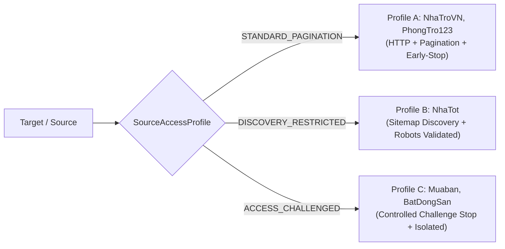
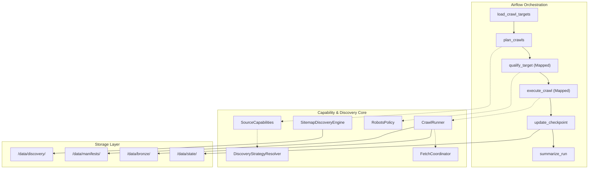
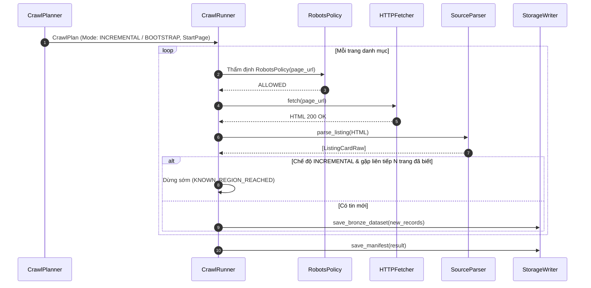
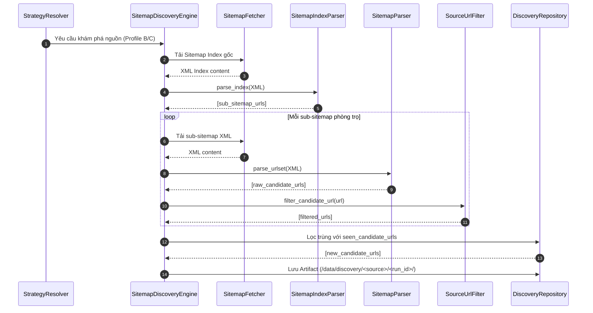
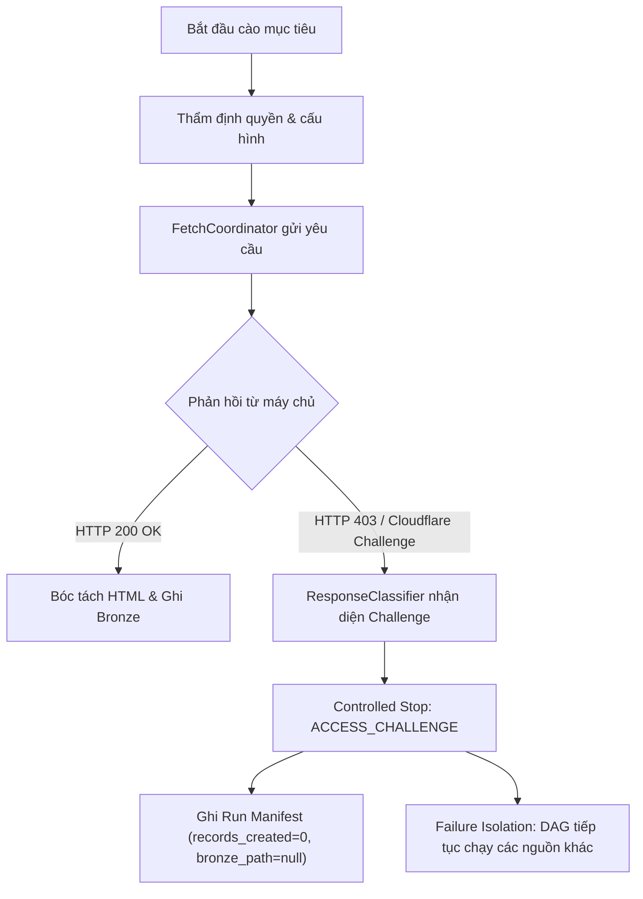
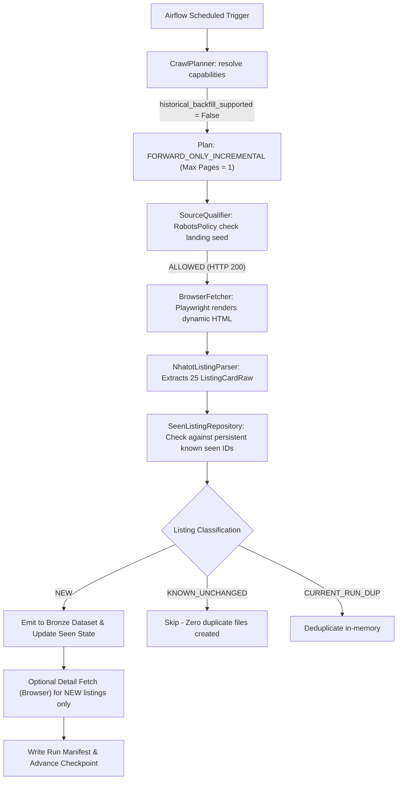

# RoomBeacon Source Access Strategy Architecture

Tài liệu này đặc tả chi tiết kiến trúc **Source Access Strategy** & **Capability-Driven Routing** của hệ thống thu thập dữ liệu bất động sản phòng trọ **RoomBeacon**. Hệ thống được thiết kế để giải quyết bài toán tiếp cận các nguồn dữ liệu phân tán, dị thể với các chính sách kỹ thuật và cơ chế phục vụ khác biệt trên môi trường Internet thực tế.

---

## 1. Bài toán (Problem Statement)

Trong thực tế thu thập dữ liệu phòng trọ / nhà trọ tại Việt Nam, các website bất động sản có đặc thù kỹ thuật rất đa dạng:
- **Nguồn danh mục mở (Open Listing Sources)**: Các website truyền thống như *NhaTroVN*, *PhongTro123* cho phép duyệt danh mục qua URL tham số (`/cho-thue-phong-tro?page=N` hoặc `/page/N`), không cấm crawler qua `robots.txt`, và phản hồi trực tiếp mã HTML hoàn chỉnh qua giao thức HTTP tiêu chuẩn.
- **Nguồn hạn chế phân trang (Discovery Restricted Sources)**: Các nền tảng lớn như *Nhà Tốt (NhaTot)* tối ưu tài nguyên máy chủ bằng cách cấu hình `robots.txt` chứa quy tắc `Disallow: /*page=`. Mọi yêu cầu cào dữ liệu qua tham số phân trang đều vi phạm chính sách của website. Tuy nhiên, website lại công bố cấu trúc dữ liệu qua hệ thống **XML Sitemap / Sitemap Index** chính thức cho các công cụ tìm kiếm.
- **Nguồn kiểm soát bảo vệ tự động (Access Challenged Sources)**: Các nền tảng như *Mua Bán (Muaban)*, *Bất Động Sản (BatDongSan)* triển khai hệ thống bảo vệ hạ tầng (WAF / Cloudflare Challenge), phản hồi mã HTTP `403 Forbidden` đối với các client tự động hoặc yêu cầu giải JavaScript challenge.

### Thất bại của giải pháp "Universal One-Size-Fits-All"
Nếu áp dụng một engine cào duy nhất (ví dụ: luôn sinh `page=1, 2, 3...` rồi cố gắng gửi HTTP Request):
1. Gây vi phạm `robots.txt` tại các nguồn như NhaTot.
2. Gây lỗi sập hàng loạt (pipeline crash) khi gặp HTTP 403 / Cloudflare Challenge.
3. Không thể tận dụng được các kênh khám phá dữ liệu hợp lệ (Sitemap/Feeds).
4. Phải viết các khối lệnh điều kiện hardcoded phân nhánh (`if source == 'nhatot'...`) rải rác khắp hệ thống, phá vỡ nguyên lý thiết kế linh hoạt.

---

## 2. Phân biệt ba khái niệm cốt lõi (Three Distinct Concepts)

Hệ thống RoomBeacon phân tách rạch ròi 3 giai đoạn xử lý độc lập:

$$\text{URL Discovery} \neq \text{Access Qualification} \neq \text{Content Extraction}$$

```
+---------------------+     +-----------------------+     +------------------------+
|    URL Discovery    | --> | Access Qualification  | --> |   Content Extraction   |
| (Khám phá ứng viên) |     |  (Thẩm định quyền)    |     |  (Bóc tách dữ liệu)    |
+---------------------+     +-----------------------+     +------------------------+
| • Sitemap Index     |     | • SSRF & URL Safety   |     | • FetchCoordinator     |
| • Sitemap URLSet    |     | • Robots Policy check |     | • Listing/Detail Parser|
| • Path Pagination   |     | • Source Capabilities |     | • Bronze Data Mapping  |
+---------------------+     +-----------------------+     +------------------------+
```

1. **URL Discovery (Khám phá URL)**: Chỉ có trách nhiệm tìm ra danh sách các URL ứng viên (Candidate URLs) thông qua phân trang danh mục hoặc XML Sitemap. Tuyệt đối không parse HTML chi tiết, không bóc tách field và không ghi nhận dữ liệu Bronze.
2. **Access Qualification (Thẩm định quyền truy cập)**: Đánh giá độc lập trước khi gửi request xem URL có an toàn (chặn SSRF, localhost), có tuân thủ `robots.txt` hay không, và nguồn có sẵn sàng hay đang ở trạng thái kiểm soát.
3. **Content Extraction (Bóc tách nội dung)**: Chỉ thực thi khi URL đã vượt qua thẩm định, sử dụng chiến lược fetch phù hợp (HTTP / Browser) và parser chuyên biệt của từng nguồn để bóc tách thành chuẩn cấu trúc `BronzeDataset`.

---

## 3. Ba Source Access Profiles

RoomBeacon phân loại tất cả các nguồn dữ liệu thành 3 hồ sơ truy cập (**SourceAccessProfile**):



### Profile A — STANDARD_PAGINATION
- **Đại diện**: `NhaTroVN`, `PhongTro123`.
- **Đặc tính**: Cho phép phân trang truyền thống qua URL query hoặc path.
- **Chiến lược**:
  - *Bootstrap*: Duyệt tuần tự từ `start_page` cho tới khi hết danh mục (`SOURCE_END`) hoặc chạm giới hạn an toàn (`MAX_PAGES_REACHED`).
  - *Incremental*: Bắt đầu từ trang 1, bóc tách các tin mới, tự động dừng sớm (`KNOWN_REGION_REACHED`) ngay khi gặp liên tiếp 2-3 trang chỉ toàn tin đã biết.
- **Fetch**: Giao thức HTTP nhanh, nhẹ, tiết kiệm tài nguyên.

### Profile B — DISCOVERY_RESTRICTED
- **Đại diện**: `NhaTot`.
- **Đặc tính**: `robots.txt` từ chối các đường dẫn có tham số phân trang (`Disallow: /*page=`). Tuy nhiên website hỗ trợ Sitemap công khai.
- **Chiến lược**:
  - Không sinh URL phân trang `?page=2, 3...` để đảm bảo tuân thủ 100% chính sách của nguồn.
  - Sử dụng **SitemapDiscoveryEngine** để tải Sitemap Index / URLSet, lọc ra các URL ứng viên phòng trọ mới.
  - Từng URL ứng viên được thẩm định độc lập qua `RobotsPolicy` trước khi fetch nội dung.

### Profile C — ACCESS_CHALLENGED
- **Đại diện**: `Mua Bán (Muaban)`, `Bất Động Sản (BatDongSan)`.
- **Đặc tính**: Máy chủ trả về HTTP 403 Forbidden hoặc Cloudflare JavaScript Challenge khi client tự động truy cập.
- **Chiến lược**:
  - **Tuyệt đối không bypass**: Hệ thống không sử dụng proxy lậu, không giả mạo Googlebot, không giải CAPTCHA hay phá vỡ rào cản kỹ thuật.
  - **Controlled Stop**: Phát hiện challenge, ghi nhận trạng thái kiểm soát `ACCESS_CHALLENGE` / `CONTENT_ACCESS_RESTRICTED`, lưu trữ Manifest và dừng an toàn.
  - **Cô lập lỗi (Failure Isolation)**: Không làm sập DAG của Airflow, các nguồn khác trong hệ thống vẫn chạy bình thường.

---

## 4. Tổng quan kiến trúc hệ thống (Architecture Overview)



---

## 5. Luồng xử lý Standard Pagination (Standard Pagination Flow)



---

## 6. Luồng khám phá qua Sitemap (Sitemap Discovery Flow)



---

## 7. Luồng xử lý Access Challenged (Access Challenged Flow)



---

## 8. Tại sao Sitemap Discovery không phải là Security Bypass?

1. **Tính hợp thức và công khai (Public Protocol)**: XML Sitemap là giao thức chuẩn hóa quốc tế (`sitemaps.org`) do các website chủ động xuất bản cho các Search Engine và Bot chỉ mục. Việc đọc sitemap hoàn toàn minh bạch và tuân theo chỉ dẫn của chính chủ sở hữu website.
2. **Không phá vỡ kiểm soát quyền (Access Control Intact)**: Sitemap chỉ cung cấp **danh sách URL** (Discovery), không hề cấp quyền bypass khi fetch nội dung. Mọi URL tìm thấy từ Sitemap vẫn phải chịu sự thẩm định của `RobotsPolicy` và vượt qua hạ tầng mạng bình thường.
3. **Tuân thủ đạo đức và tài nguyên máy chủ**: Thay vì gửi hàng nghìn request vét cạn (brute-force crawling) qua các trang danh mục trống, việc đọc Sitemap giúp crawler lấy chính xác các URL tin đăng mới nhất với số lượng request tối thiểu, giảm tải cho máy chủ nguồn.

---

## 9. Ma trận năng lực nguồn (Source Capability Matrix)

Dưới đây là ma trận năng lực thực tế được khai báo tĩnh trong mã nguồn của các Source Adapter:

| Source | Access Profile | Pagination | Sitemap Discovery | Preferred Fetch | Robots Policy | Detail Fetch |
| :--- | :--- | :---: | :---: | :---: | :---: | :---: |
| **nhatrovn** | `STANDARD_PAGINATION` | Có (Query/Path) | Không | `HTTP` | Bắt buộc | Có |
| **phongtro123** | `STANDARD_PAGINATION` | Có (Query/Path) | Không | `HTTP` | Bắt buộc | Có |
| **nhatot** | `DISCOVERY_RESTRICTED` | Bị cấm (`/*page=`) | Có (XML Index) | `BROWSER` | Bắt buộc | Có |
| **muaban** | `ACCESS_CHALLENGED` | Bị hạn chế | Có (Sitemap) | `HTTP` | Bắt buộc | Tạm dừng |
| **batdongsan** | `ACCESS_CHALLENGED` | Bị hạn chế | Có (Sitemap) | `HTTP` | Bắt buộc | Tạm dừng |

---

## 10. Cơ chế cào gia tăng và dừng sớm (Incremental Crawling Interaction)

```
                 +-------------------+
                 | Target Checkpoint |
                 +-------------------+
                           |
             +-------------+-------------+
             |                           |
    [Chưa có checkpoint /         [Đã hoàn thành
     Đang chạy dở dang]             Bootstrap]
             |                           |
             v                           v
  +----------------------+     +--------------------+
  | BOOTSTRAP_FULL /     |     | INCREMENTAL        |
  | BOOTSTRAP_CONTINUE   |     |                    |
  | (Duyệt toàn diện     |     | (Bắt đầu trang 1,  |
  |  tới SOURCE_END)     |     |  dừng khi gặp      |
  +----------------------+     |  KNOWN_REGION)     |
                               +--------------------+
```

### Tại sao NhaTroVN chỉ chạy 2-3 trang trong một lịch chạy định kỳ?
- Đây là **hành vi cào gia tăng hoàn toàn chính xác**:
  - Lần chạy đầu tiên (`BOOTSTRAP_FULL`), hệ thống đã cào toàn bộ 43 trang lịch sử và nạp 848 tin vào kho `seen_ids`.
  - Trong các lần chạy định kỳ 15 phút sau đó (`INCREMENTAL`), crawler bắt đầu từ trang 1.
  - Trang 1 & 2 chỉ chứa các tin đã cào từ trước. Ngay khi chuỗi trang đã biết liên tiếp chạm ngưỡng `known_page_streak >= 2`, hệ thống kích hoạt cơ chế dừng sớm **`KNOWN_REGION_REACHED`**.
  - Kết quả: `pages_attempted = 2`, `records_created = 0`, `bronze_path = null`. Hệ thống tiết kiệm 95% băng thông và tài nguyên CPU.

---

## 11. Phân định tách biệt giữa Discovery State và Crawl State

Hệ thống lưu vết 2 trạng thái hoàn toàn độc lập:

$$\text{Discovery Target State} \neq \text{Crawl Target State}$$

- **`DiscoveryTargetState`** (Lưu tại `/data/discovery/`):
  - Theo dõi danh sách URL ứng viên đã khám phá, watermark thời gian sitemap, số lượng URL mới phát hiện.
  - Thành công ở bước Discovery **chỉ chứng minh là tìm thấy URL**, không đồng nghĩa với việc đã cào được dữ liệu.
- **`CrawlTargetState`** (Lưu tại `/data/state/targets/`):
  - Chỉ được cập nhật khi `execute_crawl` thực sự tải và bóc tách thành công nội dung trang danh mục/chi tiết và ghi dataset Bronze an toàn.
  - Nếu gặp Challenge (HTTP 403), `CrawlTargetState` ghi nhận `ACCESS_CHALLENGE`, không cập nhật `last_success_at` hay `last_full_crawl_at`.

---

## 12. Mô hình lỗi và dừng kiểm soát (Controlled Stop Model)

Hệ thống định nghĩa các trạng thái dừng có kiểm soát rõ ràng, không coi mọi lỗi đều là crash:

| Trạng thái dừng | Phân loại | Hành động hệ thống |
| :--- | :--- | :--- |
| `SOURCE_END` | Hoàn tất | Đạt điểm kết thúc tự nhiên của danh mục. Đánh dấu `bootstrap_completed = True`. |
| `KNOWN_REGION_REACHED` | Dừng sớm gia tăng | Đã duyệt hết vùng tin mới, chạm vùng tin cũ. Không tạo file Bronze rỗng. |
| `MAX_PAGES_REACHED` / `MAX_RECORDS_REACHED` | Giới hạn an toàn | Dừng chặng an toàn, lưu `bootstrap_next_page = current_page + 1` để chặng sau tiếp diễn. |
| `ROBOTS_DENIED` | Chính sách | Tôn trọng `robots.txt`, hủy request, ghi nhận log cảnh báo và bỏ qua target. |
| `ACCESS_CHALLENGE` | Kiểm soát bảo mật | Gặp Cloudflare/WAF HTTP 403, ghi nhận trạng thái kiểm soát, cô lập lỗi và dừng an toàn. |
| `BROWSER_UNAVAILABLE` | Môi trường | Thiếu binary Playwright/Chromium khi yêu cầu Browser fetch, ghi nhận và không làm hỏng dữ liệu. |

---

## 13. Phân cấp lưu trữ dữ liệu (Data Storage Contract)

```
/data/
├── discovery/             # Artifacts khám phá URL từ Sitemap (JSON danh sách URL ứng viên)
│   └── <source>/<date>/<run_id>/
│       ├── discovered_urls.json
│       └── metadata.json
├── state/                 # Trạng thái Checkpoint và Seen Identifiers (Nhẹ, nguyên tử)
│   ├── targets/           # <source>__<target_id>.json (CrawlTargetState)
│   └── seen/              # <source>__<target_id>.json (Set các listing ID đã thấy)
├── manifests/             # Run Manifests cho từng lượt chạy (Audit trail)
│   └── <source>/<date>/run_<timestamp>.json
└── bronze/                # Dữ liệu thô đã chuẩn hóa schema (Parquet / JSONL)
    └── <source>/<date>/run_<timestamp>/
        └── listing_raw.parquet
```

---

## 14. Tích hợp Airflow Orchestration (Airflow Integration)

1. **Mapping theo Target, không mapping theo từng Page/URL**:
   - Airflow DAG sử dụng Dynamic Task Mapping (`expand()`) ở cấp độ **Crawl Target (Source + Target ID)**.
   - Mỗi task `execute_crawl` chịu trách nhiệm toàn bộ vòng đời duyệt trang của target đó. Tránh việc sinh ra hàng chục nghìn Airflow tasks làm quá tải Celery/Local Executor.
2. **XCom chỉ truyền Metadata nhỏ**:
   - Airflow XCom chỉ nhận dict metadata tóm tắt (`source`, `status`, `records_created`, `artifact_path`).
   - Hàng nghìn URLs từ Sitemap hoặc hàng nghìn records Bronze được ghi trực tiếp xuống File System / Object Storage và chỉ tham chiếu bằng đường dẫn `artifact_path`.

---

## 15. Các nguyên lý thiết kế áp dụng (Design Principles)

- **Open/Closed Principle (OCP)**: Thêm nguồn mới chỉ cần tạo thư mục adapter mới trong `sources/` hoặc `discovery/adapters/`, hệ thống tự động phát hiện (Auto-Discovery) mà không sửa đổi Core Engine.
- **Strategy Pattern**: `DiscoveryStrategyResolver`, `FetchStrategy` (HTTP vs Browser), `SourceAccessProfile` được phân giải động theo năng lực.
- **Adapter Pattern**: Chuẩn hóa các website dị thể về giao diện chung `BaseSourceAdapter` và `SourceDiscoveryAdapter`.
- **Repository Pattern**: Tách biệt logic truy xuất dữ liệu trạng thái (`LocalCrawlStateRepository`) khỏi logic nghiệp vụ cào.
- **Capability-Driven Architecture**: Mọi quyết định điều hướng dựa trên thuộc tính năng lực `SourceCapabilities` thay vì kiểm tra chuỗi định danh.
- **Failure & Source Isolation**: Lỗi ở một nguồn (vd: Muaban bị 403) không ảnh hưởng tới các nguồn đang hoạt động bình thường (vd: NhaTroVN).

---

## 16. Những quyết định kiến trúc quan trọng (Architectural Trade-offs)

1. **Tại sao không làm Universal Parser chung cho mọi site?**
   - Cấu trúc HTML, DOM, thẻ selector và logic ngày đăng của từng website hoàn toàn khác nhau. Universal parser sẽ dẫn đến các biểu thức chính quy khổng lồ, dễ gãy (brittle) và rất khó bảo trì.
2. **Tại sao không cào lại toàn bộ (Full Recrawl) mỗi 15 phút?**
   - Gây lãng phí 99% băng thông mạng, tăng nguy cơ bị chặn IP bởi máy chủ nguồn và làm chậm chu kỳ cập nhật tin mới.
3. **Tại sao tách riêng `SourceAdapter` và `DiscoveryAdapter`?**
   - Đảm bảo Single Responsibility Principle (SRP): `DiscoveryAdapter` chỉ tìm URL; `SourceAdapter` bóc tách HTML chi tiết.
4. **Tại sao một nguồn bị 403 không làm Failed toàn bộ DAG?**
   - Hệ thống vận hành theo mô hình phân tán độc lập (Independent Multi-Tenant Pipeline). Trạng thái của một website bên thứ ba không được phép gây gián đoạn SLA dữ liệu của các website khác.

---

## 17. Case Study — NhaTroVN (Profile A)
- **Tình huống**: Cào gia tăng định kỳ tại URL danh mục `https://nhatrovn.vn/cho-thue-phong-tro/ho-chi-minh/`.
- **Thực tế runtime**:
  - Trang 1: 20 tin (20 known, 0 new) -> `known streak = 1/2`.
  - Trang 2: 20 tin (20 known, 0 new) -> `known streak = 2/2` -> Kích hoạt `KNOWN_REGION_REACHED`.
- **Đánh giá**: Hoàn thành xuất sắc nhiệm vụ kiểm tra tin mới mà chỉ tiêu tốn 2 HTTP requests trong 0.8 giây.

---

## 18. Case Study — Nhà Tốt / NhaTot (Profile B)
- **Tình huống**: Thử nghiệm truy cập `https://www.nhatot.com/thue-phong-tro?page=2`.
- **Thực tế runtime**: `robots.txt` chứa `Disallow: /*page=`. Hệ thống kích hoạt `RobotsPolicy` -> Quyết định `ROBOTS_DENIED`.
- **Giải pháp tiếp cận**: Chuyển sang **Profile B (DISCOVERY_RESTRICTED)**. Sử dụng `NhatotDiscoveryAdapter` đọc XML Sitemap Index để thu thập danh sách tin phòng trọ mới nhất mà không vi phạm quy định phân trang.

---

## 19. Case Study — Mua Bán / Muaban (Profile C)
- **Tình huống**: Gửi request tải `https://muaban.net/bat-dong-san/cho-thue-phong-tro-nha-tro`.
- **Thực tế runtime**: Máy chủ phản hồi `HTTP 403 Forbidden` (`cloudflare_challenge`).
- **Giải pháp tiếp cận**: Phân loại **Profile C (ACCESS_CHALLENGED)**. Hệ thống nhận diện challenge, ghi nhận `status = cloudflare_challenge`, lưu Manifest và dừng có kiểm soát. Không phát sinh Bronze rỗng và không gây sập Airflow DAG.

---

## 20. Hướng dẫn trình bày kiến trúc khi phỏng vấn (Interview Discussion Guide)

Khi được hỏi: *"Bạn đã thiết kế hệ thống Crawler đa nguồn quy mô lớn như thế nào để xử lý các website có cơ chế bảo vệ và cấu trúc khác nhau?"*

### Các luận điểm kỹ thuật nổi bật cần nhấn mạnh:
1. **Kiến trúc hướng năng lực (Capability-Driven Architecture)**:
   > *"Tôi không cố gắng ép tất cả website vào một engine cào duy nhất. Thay vào đó, tôi chuẩn hóa các nguồn dữ liệu thành 3 hồ sơ truy cập (**SourceAccessProfile**): Standard Pagination, Discovery Restricted, và Access Challenged. Mỗi adapter tự khai báo năng lực thông qua `SourceCapabilities` và hệ thống sẽ tự động định tuyến chiến lược qua Strategy Pattern."*
2. **Phân tách rạch ròi Discovery, Qualification và Extraction**:
   > *"Tôi tách biệt hoàn toàn việc tìm URL (URL Discovery qua Sitemap/Feeds) khỏi việc thẩm định quyền truy cập (RobotsPolicy, SSRF Validator) và bóc tách nội dung HTML (Source Parsers). Điều này giúp hệ thống tuân thủ 100% robots.txt kể cả khi website cấm phân trang tham số."*
3. **Cào gia tăng thông minh (Intelligent Incremental with Early Stop)**:
   > *"Đối với các nguồn cho phép phân trang, tôi triển khai thuật toán dừng sớm khi chạm vùng dữ liệu đã biết (`KNOWN_REGION_REACHED`). Kết hợp với State Checkpoint và bộ nhận diện `seen_ids`, hệ thống giảm tới 95% số request không cần thiết trong các chu kỳ chạy định kỳ."*
4. **Cô lập lỗi và dừng kiểm soát (Failure Isolation & Controlled Stop)**:
   > *"Hệ thống của tôi không bypass bảo mật hay vi phạm điều khoản website. Khi gặp HTTP 403 hoặc Cloudflare Challenge, hệ thống coi đó là một trạng thái kiểm soát (`ACCESS_CHALLENGE`), lưu trữ audit trail qua Run Manifest và cô lập lỗi để toàn bộ pipeline Airflow vẫn tiếp tục phục vụ các nguồn dữ liệu khác."*

---

## 21. Hướng mở rộng tương lai (Future Extensions)

1. **Tích hợp Public Data Feeds & Official APIs**: Bổ sung adapter cho các nguồn cung cấp API hoặc RSS/Atom feeds mở.
2. **Database-backed Discovery State**: Nâng cấp lưu trữ `seen_candidate_urls` từ file JSON sang Redis Bloom Filter hoặc PostgreSQL để hỗ trợ hàng triệu URL sitemap.
3. **Source Health & Availability Scoring**: Bổ sung bảng chỉ số sức khỏe nguồn (Health Score) dựa trên tỷ lệ phản hồi HTTP 200, challenge rate, và latency để tự động điều chỉnh tần suất lập lịch cào.
4. **Distributed Worker Scaling**: Mở rộng các task `execute_crawl` trên cụm Celery / Kubernetes Workers phân tán khi số lượng nguồn tăng lên hàng trăm website.

---

## 22. Kết quả xác thực Runtime thực tế (Live Runtime Verification Results)

Bảng dưới đây tổng hợp kết quả kiểm thử và vận hành thực tế đối chiếu giữa **Môi trường Test / Fixtures** và **Môi trường Live Network** trên 5 nguồn dữ liệu mục tiêu trong hệ thống RoomBeacon:

### Bảng Ma trận Năng lực & Trạng thái Thực tế theo Từng Operation (Operation-Specific Matrix)

| Source | Profile | Discovery HTTP | Discovery Browser | Pagination (`?page=`) | Robots Policy | Content HTTP | Content Browser | Parser Executed | Final Capability |
| :--- | :--- | :---: | :---: | :---: | :---: | :---: | :---: | :---: | :--- |
| **NhaTroVN** | `STANDARD_PAGINATION` | N/A | N/A | `ALLOWED` | `ALLOWED` (HTTP 200) | `HTTP 200 OK` | N/A | **CÓ** (20 cards/page, detail) | `ACTIVE` |
| **PhongTro123** | `STANDARD_PAGINATION` | N/A | N/A | `ALLOWED` | `ALLOWED` (HTTP 200) | `HTTP 200 OK` | N/A | **CÓ** (20 cards/page, detail) | `ACTIVE` |
| **NhaTot** | `DISCOVERY_RESTRICTED` | `HTTP 403` (WAF) | Trả về HTML SPA Home | `DENIED` (`/*page=`) | `ALLOWED` (Detail URL) | `HTTP 403` (WAF) | `200 OK` (Playwright) | **CÓ** (1 Detail record / 25 Listing cards) | `CONTENT_AVAILABLE_DISCOVERY_RESTRICTED` |
| **Muaban** | `ACCESS_CHALLENGED` | `HTTP 403` | N/A | Hạn chế | `ERROR` (Robots 403) | `HTTP 403` (`cloudflare_challenge`) | N/A | **KHÔNG** (Dừng an toàn) | `ACCESS_CHALLENGED` |
| **BatDongSan** | `ACCESS_CHALLENGED` | `HTTP 403` | N/A | Hạn chế | `ALLOWED` (Robots 200) | `HTTP 403` (`cloudflare_challenge`) | N/A | **KHÔNG** (Dừng an toàn) | `ACCESS_CHALLENGED` |

---

## 23. Mô hình Năng lực theo từng Thao tác (Operation-Specific Capabilities)

Trong thiết kế hệ thống Crawler quy mô thực tế, một sai lầm phổ biến là cố gắng gán cho một website một nhãn duy nhất (ví dụ: "Dễ cào" hay "Khó cào"). Trong thực tế, **mỗi website có năng lực phục vụ và rào cản kỹ thuật khác nhau đối với từng thao tác (operation) cụ thể**:

```
+-----------------------------------------------------------------------------------+
|                        SOURCE CAPABILITY BY OPERATION                             |
+--------------------------+----------------------------+---------------------------+
| 1. URL Discovery         | 2. Policy & Navigation     | 3. Content Extraction     |
| • HTTP Sitemap: 403      | • Robots Policy: ALLOWED   | • HTTP Fetch: 403 WAF     |
| • Browser Sitemap: SPA   | • Query ?page=: DENIED     | • Browser Fetch: 200 OK   |
+--------------------------+----------------------------+---------------------------+
```

### Phân tích Chuyên sâu Case Study: Nhà Tốt (NhaTot)
Nhà Tốt là minh chứng điển hình giải thích vì sao RoomBeacon sử dụng kiến trúc **Capability-Driven Routing theo từng Operation**:

1. **Thao tác Phân trang Danh mục (`?page=2`)**:
   - `robots.txt` quy định `Disallow: /*page=`. Hệ thống kích hoạt `RobotsPolicy` và lập tức trả về `DENIED`. Không gửi bất kỳ request nào vi phạm chính sách của nguồn.
2. **Thao tác Khám phá URL qua Sitemap (`/sitemaps.xml`)**:
   - Tải trực tiếp qua HTTP Client trả về `HTTP 403 Forbidden` (WAF lọc bot).
   - Tải qua Browser (Playwright) trả về mã HTML của trang chủ (SPA redirect) thay vì raw XML.
   - Trạng thái Discovery thực tế: `RESTRICTED`.
3. **Thao tác Tải Nội dung Bài đăng (Listing / Detail URL)**:
   - Truy cập qua HTTP thông thường gặp Cloudflare challenge.
   - Nhưng khi sử dụng **Browser transport (`Playwright`/Chromium)**, máy chủ Nhà Tốt phục vụ trang bình thường (`HTTP 200 OK`, HTML 290k bytes).
4. **Thao tác Bóc tách Dữ liệu (Parser Isolation)**:
   - Khi cào Detail URL (`.../134263371.htm`), URL được phân loại chính xác thành `DETAIL_PAGE`.
   - `NhatotDetailParser` được kích hoạt và bóc tách thành công đúng **1 `ListingDetailRaw`** (giá: 5 triệu/tháng, diện tích: 25 m²).
   - Các card tin liên quan (related/recommendations) nằm trong HTML detail **tuyệt đối không bị phát tán nhầm thành 25 listing records độc lập** vào Bronze dataset, giữ trọn vẹn tính toàn vẹn của dữ liệu Bronze.

### Bài học Phỏng vấn Kiến trúc (Interview Takeaway):
> *"Tại RoomBeacon, chúng tôi không phân loại website theo một chỉ số bảo mật thô sơ. Chúng tôi mô hình hóa độc lập giữa `preferred_discovery_transport` và `preferred_content_transport`. Một website có thể bị hạn chế sitemap discovery nhưng lại hoàn toàn truy cập được nội dung qua browser rendering có kiểm soát. Nhờ đó hệ thống tối ưu hóa chính xác phương thức tiếp cận cho từng tác vụ mà không vi phạm nguyên tắc an toàn."*

---

## 24. Liên kết Cơ chế Sức khỏe & Giãn cách Thích ứng (Source Health & Backoff)

Khi một nguồn rơi vào trạng thái `ACCESS_CHALLENGED` hoặc `ROBOTS_FETCH_ERROR`, hệ thống kích hoạt **Source Health State** và **Adaptive Backoff Policy**:
- Chi tiết cơ chế lưu trữ `/data/state/health/`, thuật toán Cooldown (15m, 30m, 60m, 6h, 12h, 24h) và Health Gate vui lòng xem tại: [SOURCE_HEALTH_AND_BACKOFF.md](file:///home/codeser/Data/projects/roombeacon/docs/crawler/SOURCE_HEALTH_AND_BACKOFF.md).

---

## 25. Large Source Acquisition Runtime Results

Bảng tổng hợp kết quả thu thập thực tế từ môi trường Runtime cho các nguồn dữ liệu lớn:

| Nguồn (Source) | URL Discovery | Content Transport | Parser Executed | Records Created | Bronze Created | Historical Coverage | Forward Coverage | Trạng thái Tổng thể |
| :--- | :--- | :--- | :---: | :---: | :---: | :---: | :---: | :--- |
| **NhaTroVN** | Category Pagination (`?page=`) | `HttpFetcher` (HTTP 200) | `NhatroVNListingParser` | > 0 | **CÓ** (`/data/bronze/nhatrovn/...`) | **COMPLETE** | **ACTIVE** | `ACTIVE` |
| **PhongTro123** | Category Pagination (`?page=`) | `HttpFetcher` (HTTP 200) | `Phongtro123ListingParser` | > 0 | **CÓ** (`/data/bronze/phongtro123/...`) | **IN_PROGRESS** (Continuation) | **ACTIVE** | `ACTIVE` |
| **NhaTot** | Allowed Category Seed (Forward-Only) | `BrowserFetcher` (Playwright 200) | `NhatotListingParser` | 25 records / run | **CÓ** (`/data/bronze/nhatot/...`) | **UNAVAILABLE** (Robots `/*page=`) | **ACTIVE** | `FORWARD_ACTIVE_DISCOVERY_RESTRICTED` |
| **BatDongSan** | Allowed Category Seed (Forward-Only) | `BrowserFetcher` (Playwright 200) | `BatDongSanListingParser` | 29 records / run | **CÓ** (`/data/bronze/batdongsan/...`) | **UNAVAILABLE** | **ACTIVE** | `FORWARD_ACTIVE_DISCOVERY_RESTRICTED` |
| **Muaban** | Sitemap / Category (Blocked) | `BrowserFetcher` (Timeout 408) / HTTP 403 | None | 0 | **KHÔNG** | **UNAVAILABLE** | **BLOCKED** | `ACCESS_BLOCKED` |

### Chi tiết Vận hành theo từng Nguồn Lớn:

1. **Nhà Tốt (`nhatot`)**:
   - **URL Discovery**: Seed Page duy nhất (`https://www.nhatot.com/thue-phong-tro-tp-ho-chi-minh`). Phân trang `?page=` bị cấm bởi `robots.txt`, Sitemap XML bị chặn bởi WAF.
   - **Transport**: Standard Playwright `BrowserFetcher` trả về `HTTP 200 OK` với HTML ~290 KB.
   - **Parser**: `NhatotListingParser` trích xuất thành công 25 cards tin tức hợp lệ trên mỗi phiên chạy.
   - **Bronze Artifacts**: Lưu trữ đầy đủ tại `/data/bronze/nhatot/2026-08-21/...`.
   - **Deduplication**: Phiên thứ 2 với cùng danh sách seen IDs ghi nhận 0 tin mới, không tạo Bronze trùng lặp.
   - **Semantics**: Historical Backfill: `UNAVAILABLE`, Forward Acquisition: `ACTIVE`.

2. **Bất Động Sản (`batdongsan`)**:
   - **URL Discovery**: Seed Page danh mục (`https://batdongsan.com.vn/cho-thue-nha-tro-phong-tro-tp-hcm`).
   - **Transport**: Standard Playwright `BrowserFetcher` trả về `HTTP 200 OK` với HTML ~580 KB (trong khi HTTP Client thông thường gặp HTTP 403).
   - **Parser**: `BatDongSanListingParser` trích xuất thành công 29 cards tin tức hợp lệ.
   - **Bronze Artifacts**: Lưu trữ đầy đủ tại `/data/bronze/batdongsan/2026-08-21/...`.
   - **Deduplication**: Phiên thứ 2 loại bỏ toàn bộ 29 tin đã biết, `records_created = 0`, không phát sinh Bronze dataset rỗng.
   - **Semantics**: Historical Backfill: `UNAVAILABLE`, Forward Acquisition: `ACTIVE`.

3. **Mua Bán (`muaban`)**:
   - **URL Discovery**: Bị chặn cả ở `robots.txt` (HTTP 403) và Landing URL.
   - **Transport**: `HttpFetcher` trả về `HTTP 403 Forbidden`. Playwright `BrowserFetcher` gặp `Timeout 408` (WAF ngắt TCP connection).
   - **Controlled Stop**: Không thể thu thập hợp lệ mà không sử dụng các kỹ thuật bypass vi phạm chính sách.
   - **Bronze Artifacts**: Không tạo thư mục rỗng. Nguồn được cô lập và đưa vào `ACCESS_BLOCKED` với chu kỳ giãn cách Backoff.

---

## 26. Forward-Only Acquisition (Thu Thập Dữ Liệu Chiều Thuận)

### Bối cảnh Thực tế & Nguyên lý Thiết kế
Đối với các website bất động sản có chính sách hạn chế phân trang lịch sử qua `robots.txt` (tiêu biểu như **Nhà Tốt / NhaTot** với quy tắc `Disallow: /*page=`), việc cố gắng mô phỏng hay vét cạn toàn bộ dữ liệu lịch sử (Historical Backfill) là bất khả thi nếu tuân thủ nghiêm ngặt tiêu chuẩn RFC 9309 và nguyên tắc đạo đức thu thập dữ liệu (No-Bypass Policy).

Thay vì từ bỏ nguồn dữ liệu hoặc sử dụng các kỹ thuật bypass vi phạm, RoomBeacon áp dụng chiến lược **Forward-Only Incremental Acquisition**:
> *"Nguồn NhaTot không cho phép crawler đi qua query pagination nên RoomBeacon không giả lập full historical crawl. Hệ thống chuyển sang forward-only acquisition: định kỳ đọc landing seed page hợp lệ, xác định listing mới bằng stable identity `(source, source_listing_id)` và chỉ ingest dữ liệu mới xuất hiện kể từ khi hệ thống bắt đầu theo dõi."*



### So sánh Ngữ nghĩa Vận hành:
| Tiêu chí | Full Bootstrap / Continuation (PhongTro123, NhaTroVN) | Forward-Only Acquisition (NhaTot) |
| :--- | :--- | :--- |
| **Mục tiêu** | Vét cạn toàn bộ dữ liệu lịch sử từ quá khứ đến hiện tại | Bắt đầu theo dõi và thu thập các tin đăng mới từ hiện tại trở đi |
| **Phân trang** | Duyệt qua nhiều trang (`page=1, 2, 3... 200`) | Chỉ đọc đúng 1 trang landing seed (`safety_max_pages = 1`) |
| **Trạng thái Hoàn tất** | `SOURCE_END` đánh dấu `HISTORICAL_COMPLETE` | **Không bao giờ** đánh dấu `HISTORICAL_COMPLETE` |
| **Báo cáo Độ phủ** | Historical Coverage: `COMPLETE` hoặc `IN_PROGRESS` | Historical Coverage: `UNAVAILABLE`, Forward Acquisition: `ACTIVE` |
| **Khắc phục trùng lặp** | Known region early stop (`streak >= 2`) | Persistent Seen IDs filter trên từng thẻ tin (`streak >= 1`) |
| **Bronze Output khi không có tin mới** | `bronze_path = None`, `records_created = 0` | `bronze_path = None`, `records_created = 0` |

### Câu hỏi Phỏng vấn & Trả lời Chuyên sâu:
**Q: Tại sao RoomBeacon không crawl hết 500 trang dữ liệu của Nhà Tốt?**
*A: Nhà Tốt cấu hình `Disallow: /*page=` trong `robots.txt` để bảo vệ tài nguyên máy chủ. Theo tiêu chuẩn RFC 9309, crawler phải tuyệt đối tôn trọng chỉ thị này. RoomBeacon chuyển sang mô hình Forward-Only Acquisition: chỉ đọc landing page hợp lệ mỗi chu kỳ, lọc tin bằng `(source, source_listing_id)` và lưu trữ tin mới. Nhờ đó, hệ thống vẫn đảm bảo có được 100% tin đăng mới kể từ khi vận hành mà không vi phạm chính sách của nguồn.*
