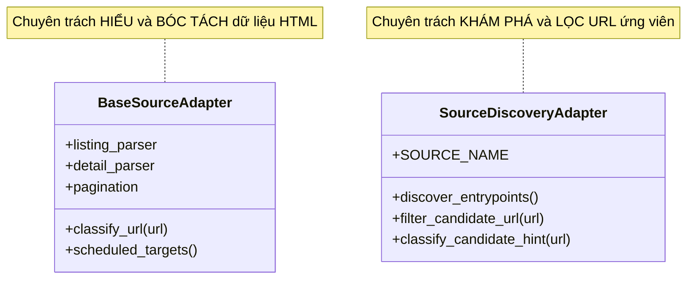
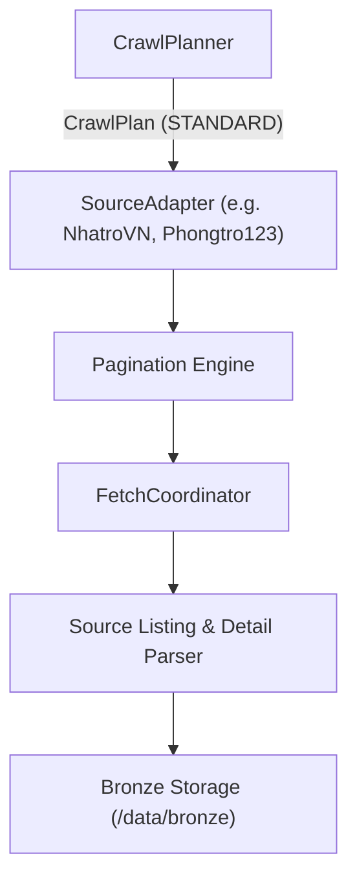
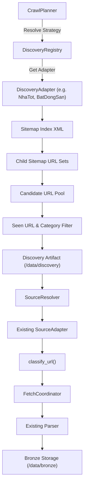
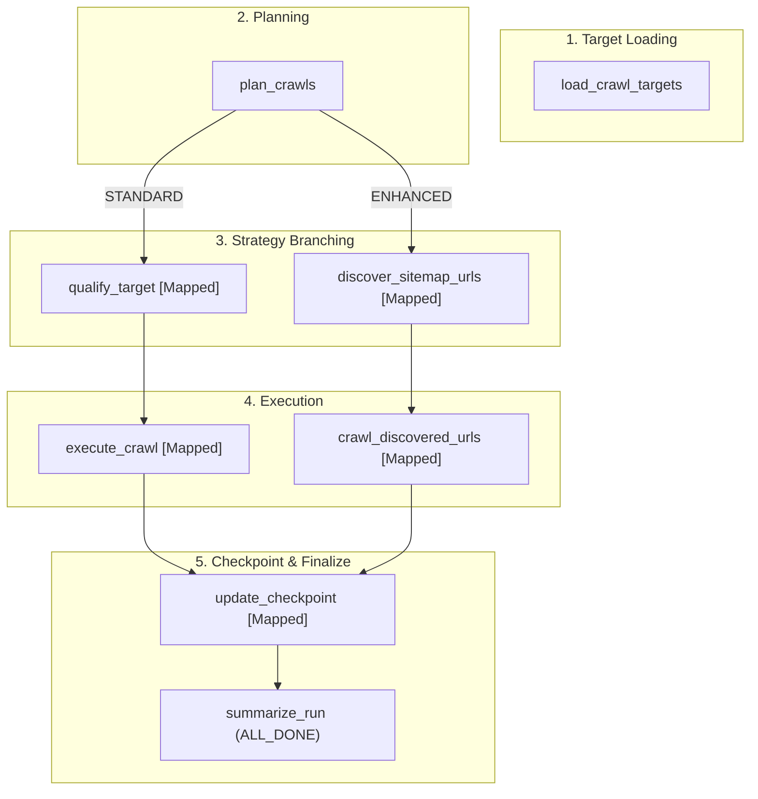

# RoomBeacon Source Discovery Strategies

Tài liệu thiết kế kiến trúc phân tầng cơ chế khám phá URL mục tiêu (Target URL Discovery) cho hệ thống thu thập dữ liệu RoomBeacon, phân định ranh giới giữa nguồn chuẩn (Standard Pagination) và nguồn quy mô lớn (Enhanced Sitemap Discovery).

---

## 1. Vấn đề

Trong hệ thống thu thập dữ liệu bất động sản cho thuê:
1. **Nguồn chuẩn (Standard/Small Sources)** như `NhatroVN`, `PhongTro123` có cấu trúc danh mục rõ ràng, số lượng trang vừa phải và phân trang theo thứ tự thời gian tin mới. Cơ chế cào danh mục tuần tự (Category Pagination) kết hợp dừng khi gặp vùng tin đã biết (Known-Region Stopping) hoạt động cực kỳ hiệu quả, nhanh chóng và tiết kiệm tài nguyên.
2. **Nguồn quy mô lớn / phân tán (Large/Protected Sources)** như `BatDongSan`, `NhaTot`, `Muaban` có hàng chục nghìn đến hàng triệu tin đăng trải rộng trên nhiều tỉnh thành và danh mục con. Việc cào tuần tự qua hàng nghìn trang danh mục qua giao thức HTTP gặp phải các hạn chế:
   - Giới hạn số trang tối đa mà website cho phép duyệt (Deep Pagination Limit).
   - Tần suất cập nhật tin đăng phân tán trên nhiều URL nhánh.
   - Nguy cơ chạm rate-limit hoặc rào cản truy cập khi gửi quá nhiều request phân trang liên tiếp.

Do đó, RoomBeacon bổ sung cơ chế khám phá nâng cao (Enhanced Discovery) dựa trên Sitemap XML/Sitemap Index chính thức mà website công bố, cho phép thu thập nhanh toàn bộ URL ứng viên mà không làm xáo trộn kiến trúc parser hiện tại.

---

## 2. Hai loại Adapter

RoomBeacon phân định ranh giới nghiêm ngặt giữa **2 khái niệm Adapter độc lập**:



* **A. `SourceAdapter` (Hiện hữu):**
  - Chịu trách nhiệm bóc tách DOM HTML, phân loại URL (`classify_url`), trích xuất tin danh sách (`ListingParser`), trích xuất tin chi tiết (`DetailParser`), và ánh xạ sang mô hình Bronze (`ListingCardRaw`, `ListingDetailRaw`).
* **B. `DiscoveryAdapter` (Mới):**
  - Chịu trách nhiệm khám phá sitemap entrypoints, duyệt sitemap index, trích xuất URL ứng viên, lọc phạm vi cho thuê phòng trọ/nhà trọ (`filter_candidate_url`), khử trùng lặp và ghi nhận mốc `lastmod`.
  - **Tuyệt đối KHÔNG:** parse trường dữ liệu tin đăng, sinh `ListingCardRaw`/`ListingDetailRaw`, hay ghi Bronze dataset.

---

## 3. Standard Flow (Luồng nguồn chuẩn)

Áp dụng cho các nguồn chuẩn (`nhatrovn`, `phongtro123`):



---

## 4. Enhanced Large-Source Flow (Luồng nguồn lớn nâng cao)

Áp dụng cho các nguồn quy mô lớn (`nhatot`, `batdongsan`, `muaban`):



---

## 5. Tại sao không thay thế SourceAdapter hiện tại?

Mỗi nguồn lớn sẽ sở hữu song song một cặp Adapter với trách nhiệm tách biệt:
* `NhatotSourceAdapter` + `NhaTotDiscoveryAdapter`
* `BatDongSanSourceAdapter` + `BatDongSanDiscoveryAdapter`
* `MuabanSourceAdapter` + `MuabanDiscoveryAdapter`

Cơ chế Discovery là **phần mở rộng bổ sung (Additive)**:
- `DiscoveryAdapter` giúp gom URL ứng viên hiệu quả hơn.
- Toàn bộ URL khám phá được sau đó vẫn quay trở lại `SourceResolver` và `SourceAdapter.classify_url()` để bóc tách dữ liệu theo đúng cấu trúc DOM của website đó.
- Không làm thay đổi hay phá vỡ các bộ parser đã được kiểm thử chặt chẽ.

---

## 6. Ma trận trách nhiệm (Responsibility Matrix)

| Thành phần | Trách nhiệm chính | Điều TUYỆT ĐỐI KHÔNG làm |
| :--- | :--- | :--- |
| **`SourceAdapter`** | Phân loại URL (`classify_url`), parse listing card, parse chi tiết tin đăng, pagination | Không duyệt sitemap, không quản lý danh bạ URL thô toàn site |
| **`DiscoveryAdapter`** | Cung cấp sitemap entrypoints, lọc URL cho thuê phòng trọ, quan sát `lastmod` | Không parse HTML, không sinh `ListingCardRaw`, không lưu Bronze |
| **`SitemapDiscoveryEngine`**| Tải sitemap, giải nén `.xml.gz`, duyệt cây sitemap index, khử trùng lặp | Không chứa logic `if source == "..."`, không can thiệp nghiệp vụ |
| **`DiscoveryRegistry`** | Tự động quét và nạp các `DiscoveryAdapter` plugin động | Không quản lý SourceAdapter HTML |
| **`DiscoveryStrategyResolver`**| Phân giải `STANDARD` vs `ENHANCED_DISCOVERY` dựa trên capability | Không hardcode danh sách nguồn trong Core Planner |
| **`CrawlPlanner`** | Lập kế hoạch theo lịch, kiểm tra tính đến hạn, điều phối mode | Không phân tích cú pháp sitemap XML |
| **`Airflow DAG`** | Điều phối task mapping, cô lập lỗi từng nguồn | Không chứa logic trích xuất hay phân giải URL |

---

## 7. Cơ chế Sitemap Discovery

`SitemapDiscoveryEngine` xử lý theo chuẩn Sitemap Protocol quốc tế:
1. **Sitemap Index (`<sitemapindex>`):** Nhận diện danh sách `<sitemap><loc>...</loc><lastmod>...</lastmod></sitemap>` và đệ quy duyệt sitemap con theo giới hạn độ sâu `max_depth` (mặc định 3 tầng).
2. **URL Set (`<urlset>`):** Trích xuất danh sách `<url><loc>...</loc><lastmod>...</lastmod></url>`.
3. **Giải nén Gzip:** Tự động giải nén file `.xml.gz` hoặc phản hồi HTTP có `Content-Encoding: gzip`.
4. **Khử trùng lặp (Deduplication):** Chuẩn hóa URL (bỏ `#fragment`, chuẩn hóa query params) và lọc URL trùng lặp trong bộ nhớ trước khi xuất kết quả.

---

## 8. Lọc URL và Thẩm quyền của SourceAdapter

Quá trình lọc URL diễn ra qua 2 lớp bảo vệ:
1. **Lớp 1 - Discovery Filter (`DiscoveryAdapter.filter_candidate_url`):** Lọc sơ bộ theo domain và tiền tố đường dẫn (ví dụ: chỉ giữ lại các URL chứa `/thue-phong-tro`, `/cho-thue-`, loại bỏ danh mục xe cộ, việc làm, đồ gia dụng).
2. **Lớp 2 - Source Classification (`SourceAdapter.classify_url`):** Thẩm quyền phân loại cuối cùng trước khi cào dữ liệu (`LISTING_PAGE`, `DETAIL_PAGE`, hoặc `UNSUPPORTED_TARGET`).

---

## 9. Chính sách Robots và Rào cản truy cập

* Quá trình nạp Sitemap XML tuân thủ nghiêm ngặt `RobotsPolicy`.
* Một URL xuất hiện trong Sitemap **không** đồng nghĩa với việc được phép bỏ qua Disallow trong `robots.txt`.
* Mọi URL khám phá được đều phải qua `URLValidator -> SourceResolver -> RobotsPolicy` trước khi tiến hành fetch.
* Tuyệt đối không áp dụng các cơ chế bypass tường lửa, vượt CAPTCHA, hay giả mạo danh tính bot tìm kiếm.

---

## 10. Checkpoint: Phân biệt State cào và State khám phá

Hệ thống duy trì 2 loại checkpoint trạng thái độc lập:

1. **`CrawlTargetState` (Lưu tại `/data/state/targets/`):**
   - Đại diện cho tiến độ cào nội dung thực tế (`last_success_at`, `last_watermark_at`, `seen_listing_ids`).
   - Chỉ được nâng watermark khi cào và bóc tách thành công nội dung trang.
2. **`DiscoveryTargetState`:**
   - Đại diện cho tiến độ quét sitemap (`last_discovery_at`, `last_discovered_count`, `last_sitemap_lastmod`).
   - Việc quét sitemap thành công **không** tự động nâng watermark thành công của cào nội dung.

---

## 11. Đồ thị điều phối Airflow DAG

Luồng thực thi trực quan trên Airflow DAG phân tách rõ ràng nhánh Standard và nhánh Enhanced Discovery:



---

## 12. Cấu trúc lưu trữ dữ liệu (/data)

```
/data/
├── discovery/                     # Operational Discovery Artifacts (JSON)
│   ├── nhatot/
│   │   └── <run_id>/discovered_urls.json
│   ├── batdongsan/
│   └── muaban/
├── manifests/                     # Run Manifests ghi vết từng phiên cào
│   └── <source>/<date>/run_<timestamp>.json
├── bronze/                        # Parsed Business Data (Listings, Details, Metadata)
│   └── <source>/<date>/run_<timestamp>/
│       ├── listings.json
│       ├── details.json
│       └── metadata.json
└── state/                         # Local Checkpoint Repository
    ├── targets/
    └── seen/
```

---

## 13. Ma trận chiến lược nguồn hiện tại (Current Source Strategy Matrix)

| Nguồn (Source) | Standard Adapter (`SourceAdapter`) | Enhanced Discovery (`DiscoveryAdapter`) | Chiến lược phân giải (`DiscoveryStrategy`) | Trạng thái kiểm thử thực tế |
| :--- | :--- | :--- | :--- | :--- |
| **`nhatrovn`** | `NhatroVNSourceAdapter` | Không áp dụng (Standard only) | `STANDARD` | SUCCESS (Cào đầy đủ 42 trang danh mục) |
| **`phongtro123`** | `Phongtro123SourceAdapter` | Không áp dụng (Standard only) | `STANDARD` | SUCCESS (Cào danh mục 20 tin/trang) |
| **`nhatot`** | `NhatotSourceAdapter` | `NhaTotDiscoveryAdapter` | `ENHANCED_DISCOVERY` | Sitemaps XML sẵn sàng |
| **`batdongsan`** | `BatDongSanSourceAdapter` | `BatDongSanDiscoveryAdapter` | `ENHANCED_DISCOVERY` | Sitemaps XML sẵn sàng |
| **`muaban`** | `MuabanSourceAdapter` | `MuabanDiscoveryAdapter` | `ENHANCED_DISCOVERY` | Sitemaps XML sẵn sàng |

---

## 14. Quy trình bổ sung một nguồn lớn mới (Adding a New Large Source)

Khi tích hợp một nguồn bất động sản quy mô lớn thứ 6:
1. **Bước 1:** Xây dựng `SourceAdapter` thông thường dưới thư mục `crawler/src/roombeacon_crawler/sources/<source_name>/` để đảm bảo năng lực bóc tách HTML DOM.
2. **Bước 2:** Xây dựng `DiscoveryAdapter` dưới thư mục `crawler/src/roombeacon_crawler/discovery/adapters/<source_name>.py` kế thừa từ `SourceDiscoveryAdapter`.
3. **Bước 3:** Cấu hình `SOURCE_NAME`, `discover_entrypoints()`, và `filter_candidate_url()`.
4. **Bước 4:** `DiscoveryRegistry` sẽ tự động quét và nạp adapter mà không cần sửa đổi bất kỳ dòng mã nào trong `CrawlPlanner`, `CrawlRunner` hay Airflow DAG.
5. **Bước 5:** Bổ sung unit test kiểm thử sitemap fixture tương ứng.

---

## 15. Kế hoạch di trú sang MySQL trong tương lai

Giao diện `DiscoveryTargetState` và cấu trúc `DiscoveredUrl` được thiết kế dưới dạng immutable dataclass độc lập với hệ thống file. Khi hệ quản trị cơ sở dữ liệu MySQL sẵn sàng, toàn bộ lịch sử khám phá URL và trạng thái checkpoint có thể được lưu vết trực tiếp vào bảng `catalog_discovered_urls` mà không làm thay đổi hợp đồng giao tiếp giữa các tầng.
