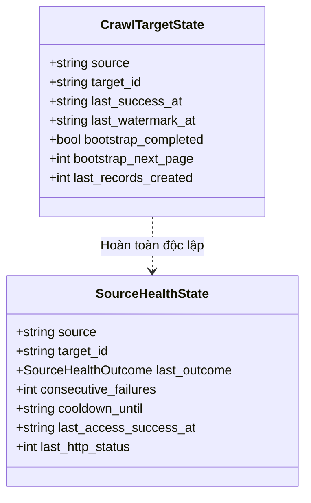
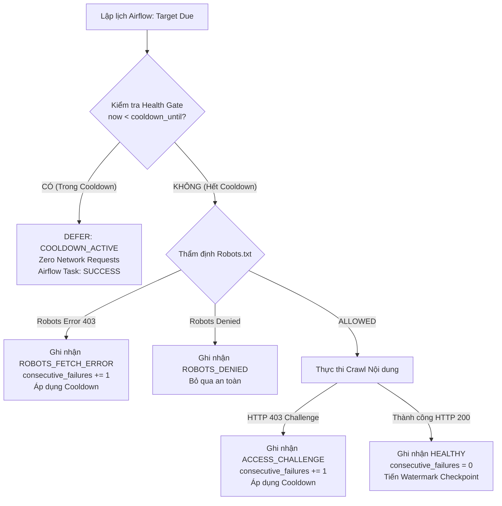

# RoomBeacon Source Health & Adaptive Backoff Architecture

Tài liệu thiết kế kỹ thuật chuyên sâu về hệ thống **Theo dõi Sức khỏe Nguồn dữ liệu (Source Health)**, **Cổng Giãn cách Thích ứng (Adaptive Cooldown Gate)** và **Bảo toàn Checkpoint Đồng bộ (Crawl Checkpoint Safety)** trong nền tảng thu thập dữ liệu bất động sản RoomBeacon.

---

## 1. Đặt vấn đề và Động lực Kỹ thuật (Problem Statement & Motivation)

Trong các hệ thống phân tán thu thập dữ liệu (Web Scraping Fleet), một Airflow DAG thường được lập lịch định kỳ (ví dụ `*/15 * * * *` - 15 phút một lần). Khi một website nguồn kích hoạt Cloudflare WAF, Captcha Challenge hoặc chặn kết nối (`HTTP 403 Forbidden` trên `robots.txt` hoặc content page), việc gửi request đều đặn mỗi 15 phút mang lại những hệ lụy nghiêm trọng:

1. **Lãng phí tài nguyên mạng và tính toán**: Khởi tạo HTTP connection pool hoặc mở headless browser Playwright cho một nguồn chắc chắn sẽ bị chặn là lãng phí CPU/RAM của worker.
2. **Nguy cơ IP Blacklisting vĩnh viễn**: Việc tiếp tục spam request với tần suất cố định sau khi đã bị WAF chặn sẽ khiến IP của crawler bị đưa vào danh sách đen cấp hạ tầng mạng.
3. **Làm sai lệch báo cáo vận hành**: Nếu không phân loại rõ ràng giữa sự cố hạ tầng và rào cản từ nguồn bên ngoài, Dashboard giám sát sẽ tràn ngập cảnh báo ảo (Alert Fatigue).

**Giải pháp của RoomBeacon**: Tách biệt hoàn toàn khái niệm **Tiến độ đồng bộ dữ liệu** (`CrawlTargetState`) và **Sức khỏe kết nối nguồn** (`SourceHealthState`), đồng thời triển khai **Cổng kiểm soát sức khỏe (Health Gate)** chặn đứng mọi request mạng không cần thiết khi nguồn đang trong thời gian nghỉ hồi phục (Cooldown).

---

## 2. Airflow Success vs Source Success: Cách ly Lỗi có Kiểm soát (Controlled Failure Isolation)

Một nguyên lý kiến trúc cốt lõi trong RoomBeacon:

```
+----------------------------------------------------------------------------------+
|                              ORCHESTRATION LAYER                                 |
|  Airflow Task State: SUCCESS (Task hoàn thành xuất sắc nhiệm vụ nhận diện & cô lập)|
+----------------------------------------------------------------------------------+
                                        │
                                        ▼
+----------------------------------------------------------------------------------+
|                                BUSINESS / SOURCE LAYER                           |
|  Source Crawl Outcome: ACCESS_CHALLENGE / ROBOTS_FETCH_ERROR (Nguồn bên ngoài chặn)|
+----------------------------------------------------------------------------------+
```

- **Airflow Task = SUCCESS**: Task đã thực thi trọn vẹn logic nghiệp vụ, phát hiện chính xác rào cản truy cập, lưu Run Manifest minh bạch và chuyển trạng thái nguồn sang Cooldown. Không có ngoại lệ hệ thống nào bị crash.
- **Source Crawl = ACCESS_CHALLENGE**: Không có dữ liệu bài đăng mới nào được tạo (Records created = 0), watermark thành công không tiến lên.
- **Không dùng Airflow Retry (`retries=...`) cho Access Challenge**: Airflow Retry chỉ dành cho lỗi kỹ thuật nội bộ (ví dụ: mất kết nối DB tạm thời, worker OOM). Với rào cản từ website bên ngoài, việc retry ngay lập tức qua Airflow là hành vi sai lầm.

---

## 3. Phân tách Domain: Crawl Synchronization State vs Source Health State



| Tiêu chí | `CrawlTargetState` (Checkpoint Đồng bộ) | `SourceHealthState` (Sức khỏe Nguồn) |
| :--- | :--- | :--- |
| **Mục đích** | Ghi nhận tiến độ đồng bộ dữ liệu (đã cào đến đâu). | Ghi nhận khả năng kết nối mạng (có nên cào lúc này không). |
| **Vị trí lưu trữ** | `/data/state/targets/{source}__{target_id}.json` | `/data/state/health/{source}__{target_id}.json` |
| **Khi nào cập nhật?** | Chỉ khi phiên cào hoàn tất chu kỳ xử lý dữ liệu. | Mỗi khi kiểm tra Robots hoặc cào nội dung (cả thành công & thất bại). |
| **Khi gặp lỗi 403?** | **BẢO TOÀN** (`bootstrap_next_page` giữ nguyên). | **TĂNG COOLDOWN** (`consecutive_failures += 1`). |
| **Khi thành công?** | Tiến watermark (`last_success_at = now`). | **RESET HEALTH** (`consecutive_failures = 0`, `cooldown = null`). |

---

## 4. Mô hình Dữ liệu SourceHealthState

Mỗi target được theo dõi qua một đối tượng `SourceHealthState` lưu trữ dưới định dạng JSON nguyên tử:

```json
{
  "source": "batdongsan",
  "target_id": "hcm_phongtro",
  "last_outcome": "ACCESS_CHALLENGE",
  "last_failure_reason": "Cloudflare challenge (HTTP 403)",
  "consecutive_failures": 3,
  "last_checked_at": "2026-08-21T14:15:00+00:00",
  "last_failure_at": "2026-08-21T14:15:00+00:00",
  "last_access_success_at": null,
  "cooldown_until": "2026-08-21T15:15:00+00:00",
  "last_http_status": 403,
  "updated_at": "2026-08-21T14:15:00+00:00"
}
```

### Bảng định nghĩa các trường:
- `source`: Tên định danh nguồn (ví dụ: `batdongsan`, `muaban`).
- `target_id`: Tên định danh cấu hình mục tiêu (ví dụ: `hcm_phongtro`).
- `last_outcome`: Kết quả thẩm định/kết nối gần nhất (`HEALTHY`, `ACCESS_CHALLENGE`, `ROBOTS_FETCH_ERROR`, v.v.).
- `last_failure_reason`: Chuỗi mô tả kỹ thuật chi tiết của nguyên nhân thất bại.
- `consecutive_failures`: Số lần thất bại liên tiếp chưa được phục hồi.
- `last_checked_at`: Mốc thời gian UTC thực hiện lần kiểm tra gần nhất.
- `last_failure_at`: Mốc thời gian UTC xảy ra sự cố gần nhất.
- `last_access_success_at`: Mốc thời gian UTC kết nối và bóc tách thành công gần nhất.
- `cooldown_until`: Mốc thời gian UTC kết thúc thời gian nghỉ giãn cách. Trước mốc này, Health Gate sẽ chặn request.
- `last_http_status`: Mã trạng thái HTTP nhận được từ máy chủ nguồn.
- `updated_at`: Mốc thời gian UTC cập nhật state file.

---

## 5. Phân loại Nguyên nhân Thất bại (Failure Classification)

Hệ thống phân loại chính xác các kết quả kỹ thuật thông qua enum `SourceHealthOutcome`:

1. **`HEALTHY`**: Nguồn hoạt động ổn định, kết nối và bóc tách nội dung thành công.
2. **`ACCESS_CHALLENGE`**: Máy chủ kích hoạt Cloudflare JS Challenge, WAF Block, hoặc HTTP 403 trên trang nội dung.
3. **`ROBOTS_FETCH_ERROR`**: Máy chủ chặn hoặc trả về lỗi HTTP 403/5xx khi tải file `robots.txt`.
4. **`ROBOTS_UNAVAILABLE`**: Không thể tải `robots.txt` do lỗi phân giải DNS hoặc timeout mạng.
5. **`ROBOTS_DENIED`**: File `robots.txt` cấm rõ ràng User-Agent (chính sách website, không phải lỗi kết nối).
6. **`BROWSER_UNAVAILABLE`**: Môi trường runtime cục bộ thiếu dependencies của Browser (Playwright/Chromium).
7. **`NETWORK_TIMEOUT`**: Request bị timeout trong ngưỡng cho phép (ví dụ: > 20s).
8. **`HTTP_SERVER_ERROR`**: Máy chủ nguồn trả về lỗi nội bộ HTTP 500, 502, 503, 504.
9. **`TECHNICAL_FAILURE`**: Lỗi logic, cú pháp hoặc ngoại lệ hệ thống không lường trước.

---

## 6. Thuật toán Giãn cách Thích ứng (Adaptive Backoff Algorithm)

Thuật toán tính toán thời gian Cooldown phụ thuộc vào phân loại lỗi và số lần thất bại liên tiếp:

### Chuỗi Giãn cách (Backoff Sequence):
- **Access Challenge & Robots Fetch Error**:
  $$\text{Backoff Sequence} = [15\text{m}, 30\text{m}, 60\text{m}, 6\text{h}, 12\text{h}, 24\text{h}]$$
  - Thất bại lần 1: Nghỉ 15 phút.
  - Thất bại lần 2: Nghỉ 30 phút.
  - Thất bại lần 3: Nghỉ 60 phút (1 giờ).
  - Thất bại lần 4: Nghỉ 360 phút (6 giờ).
  - Thất bại lần 5: Nghỉ 720 phút (12 giờ).
  - Thất bại lần 6+: Nghỉ 1440 phút (24 giờ tối đa).
- **Network Timeout & HTTP 5xx**:
  $$\text{Network Backoff} = [5\text{m}, 15\text{m}, 30\text{m}, 60\text{m}]$$
- **Robots Denied**:
  Không áp dụng exponential backoff vì đây là chính sách cố định của website.

---

## 7. Cổng Kiểm soát Sức khỏe (Health Gate Workflow)

Trước khi thực hiện bất kỳ request mạng nào (thậm chí trước cả `URLValidator` hay tải `robots.txt`), target phải đi qua **Health Gate**:



---

## 8. Phục hồi Sức khỏe (Success Reset)

Khi một nguồn vượt qua thời gian Cooldown và trong lần chạy kế tiếp **kết nối thành công** (trả về `HTTP 200 OK`, bóc tách được dữ liệu và lưu Bronze dataset):
1. `consecutive_failures` được reset về `0`.
2. `last_failure_reason` được xóa về `None`.
3. `cooldown_until` được xóa về `None`.
4. `last_access_success_at` được cập nhật thành mốc UTC hiện tại.
5. Target trở lại trạng thái `HEALTHY` hoàn toàn tự động mà không cần can thiệp thủ công.

---

## 9. An toàn Checkpoint (Checkpoint Safety on Failure)

Một sai lầm nguy hiểm trong thiết kế crawler là gán `next_page = None` hoặc xóa watermark khi gặp lỗi mạng. Trong RoomBeacon:

**Tình huống thực tế**:
- Target `phongtro123` đang thực hiện Bootstrap đến trang 51 (`bootstrap_next_page = 51`).
- Trong lần chạy này, trang 51 gặp Cloudflare challenge (`HTTP 403`).
- **Xử lý an toàn**:
  - `CrawlTargetState`: `bootstrap_next_page` giữ nguyên giá trị `51`. `last_success_at` giữ nguyên mốc cũ.
  - `SourceHealthState`: `consecutive_failures = 1`, `cooldown_until = now + 15m`.
- Khi hết 15 phút cooldown, phiên crawl tiếp theo sẽ tiếp tục chạy chính xác từ **trang 51**, không bị mất dấu hay cào lại từ đầu!

---

## 10. Số liệu Giám sát Tổng hợp Chuẩn hóa (Summary Semantics)

Báo cáo tổng kết phiên cào (`ROOMBEACON AUTOMATED CRAWL RUN SUMMARY`) phân biệt rạch ròi 3 nhóm chỉ số:

```
============================================================
ROOMBEACON AUTOMATED CRAWL RUN SUMMARY
------------------------------------------------------------
Targets due                  : 3
Targets executable           : 2
Targets deferred cooldown    : 1
Bootstrap planned            : 1
Bootstrap continue planned   : 0
Incremental planned          : 2
Qualification allowed        : 1
Robots denied                : 0
Robots unavailable           : 1
Crawl success                : 1
Access challenge             : 0
Technical failure            : 0
Records created              : 20
Details created              : 2
Target states persisted      : 2
Success checkpoints advanced : 1
Health states updated        : 2
============================================================
```

### Ý nghĩa chính xác:
- **`Target states persisted`**: Số lượng file state được ghi xuống ổ đĩa (bao gồm cả việc ghi nhận mốc thất bại hoặc kết thúc phiên).
- **`Success checkpoints advanced`**: Số lượng target có **tiến độ đồng bộ dữ liệu thực sự tiến lên** (chỉ tăng khi crawl thành công).
- **`Health states updated`**: Số lượng target có trạng thái sức khỏe được ghi nhận hoặc thay đổi.
- **`Targets deferred cooldown`**: Số lượng target được Health Gate chủ động tạm hoãn để bảo vệ hệ thống.

---

## 11. Nghiên cứu Thực tế từ Môi trường Runtime (Runtime Case Studies)

### Case 1: Muaban (`muaban.net`)
- **Hành vi**: Máy chủ Muaban trả về `HTTP 403` ngay trên URL `https://muaban.net/robots.txt`.
- **Đánh giá**: `RobotsPolicy` trả về `ERROR`, `SourceQualifier` ghi nhận `CHECK_FAILED` với root cause `ROBOTS_FETCH_ERROR` (`HTTP 403`).
- **Health Action**: `consecutive_failures` tăng lên, `cooldown_until` được kích hoạt (15m $\rightarrow$ 30m $\rightarrow$ 60m).
- **Kết quả**: Không có bất kỳ request cào bài đăng nào được gửi, Airflow task vẫn xanh, watermark không bị sai lệch.

### Case 2: BatDongSan (`batdongsan.com.vn`)
- **Hành vi**: `robots.txt` trả về `HTTP 200 ALLOWED`, nhưng trang danh mục bài đăng trả về `HTTP 403` Cloudflare Challenge.
- **Đánh giá**: `CrawlRunner` phát hiện `cloudflare_challenge`, trả về `action: ACCESS_CHALLENGE`.
- **Health Action**: `consecutive_failures` tăng lên, kích hoạt Cooldown, ghi nhận Run Manifest với `records_created = 0`.

### Case 3: Nguồn Khỏe mạnh (`nhatrovn.vn`, `phongtro123.com`)
- **Hành vi**: `robots.txt` ALLOWED, Content HTTP 200 OK.
- **Đánh giá**: Bóc tách thành công 20 bài đăng / trang, `CrawlStatus.SUCCESS`.
- **Health Action**: `health_repo.record_success()` reset failure counter về `0`, `success_checkpoints_advanced += 1`.

---

## 12. Hướng dẫn Trình bày khi Phỏng vấn Kỹ thuật (Interview Guide)

Khi được hỏi: *"Làm thế nào hệ thống của bạn xử lý khi các website nguồn liên tục chặn kết nối hoặc kích hoạt Cloudflare WAF?"*

**Các luận điểm phỏng vấn đắt giá (Key Talking Points)**:
1. **Kiến trúc Tách biệt Domain (Separation of Concerns)**:
   > *"Em không gộp chung trạng thái cào dữ liệu và trạng thái sức khỏe nguồn vào một file. Em tách thành `CrawlTargetState` (quản lý tiến độ watermark, phân trang tiếp diễn) và `SourceHealthState` (quản lý năng lực kết nối và số lần thất bại). Nhờ đó khi gặp lỗi 403, hệ thống áp dụng backoff mà không làm mất vị trí trang đang cào dở."*
2. **Cổng Giãn cách Thích ứng (Adaptive Cooldown Gate)**:
   > *"Scheduler của em chạy đều đặn mỗi 15 phút nhưng không có nghĩa mọi website đều bị spam request mỗi 15 phút. Trước khi gửi request mạng, target phải đi qua Health Gate. Nếu nguồn đang trong cooldown (ví dụ: 15m, 30m, 1h, 6h, 12h, 24h), Health Gate lập tức DEFER mà không gửi bất kỳ request HTTP/Browser nào, vừa tiết kiệm tài nguyên vừa tránh bị ban IP vĩnh viễn."*
3. **Phân biệt Lỗi Hạ tầng và Rào cản Nghiệp vụ (Failure Isolation)**:
   > *"Em không dùng cơ chế Airflow Retry (`retries=3`) cho lỗi WAF 403. Việc Airflow retry liên tiếp 3 lần ngay lập tức chỉ làm website chặn chặt hơn. Thay vào đó, task Airflow vẫn đánh dấu SUCCESS vì đã phát hiện và cô lập thành công rào cản bên ngoài, chuyển quyền kiểm soát sang Health Backoff Policy."*
4. **Tự phục hồi (Self-Healing)**:
   > *"Khi website nguồn gỡ bỏ challenge hoặc hết thời gian chặn, lần cào thành công đầu tiên sẽ tự động reset failure counter về 0 và đưa nguồn trở lại trạng thái HEALTHY mà không cần kỹ sư can thiệp thủ công."*

---

## 13. Hướng mở rộng Tương lai (Future Extensions)

1. **Prometheus Metrics & Grafana Alerting**: Xuất metric `roombeacon_source_consecutive_failures` và `roombeacon_source_cooldown_seconds` sang Prometheus để vẽ biểu đồ trực quan sức khỏe toàn bộ fleet.
2. **Distributed Redis Health Store**: Chuyển đổi từ `LocalSourceHealthRepository` sang Redis / PostgreSQL khi mở rộng hệ thống lên nhiều cụm worker phân tán (Celery / Kubernetes).
3. **Circuit Breaker Cấp độ Domain**: Tự động ngắt toàn bộ các target thuộc cùng một domain nếu tỷ lệ lỗi trên toàn domain vượt ngưỡng $80\%$.
