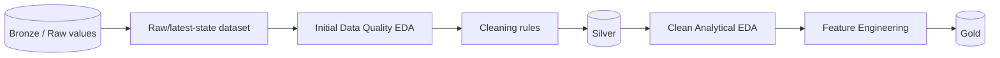
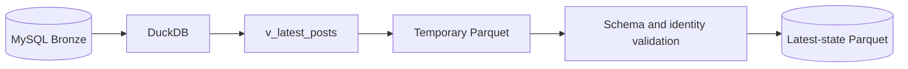

# RoomBeacon — Data Lifecycle

> Mục đích: định nghĩa authoritative semantics cho Bronze, latest-state dataset, hai loại EDA, Silver và Gold.
>
> Trạng thái: **CURRENT**, với future stages được ghi nhãn rõ.

## 1. Luồng dữ liệu



## 2. Bronze — IMPLEMENTED

Bronze bảo toàn dữ liệu gần nguồn và lịch sử observations.

- JSON artifacts nhóm theo crawl run.
- MySQL lưu listing identity, observation versions và child observations.
- Các trường `*_raw` giữ representation từ nguồn.
- Một số giá trị typed như `price_amount` và `area_value` là technical parsing để persist/query; chúng chưa đồng nghĩa với business-cleaned Silver.

Bronze dùng cho audit, reconciliation, parser-quality investigation và Initial EDA. Bronze không phải serving layer.

## 3. `v_latest_posts` — IMPLEMENTED

`v_latest_posts` là **latest-state analytical view**, không phải cleaned Silver.

```text
Nhiều observations của một rental_post_id
→ xếp theo thời điểm/version
→ chọn observation mới nhất
→ một row cho mỗi listing
```

Vai trò:

- giảm temporal history thành current/latest state;
- cung cấp dataset phẳng cho query và snapshot;
- giữ raw/technically parsed values để kiểm tra chất lượng.

View không áp dụng cleaning-rule registry, imputation, location standardization hoặc business outlier policy.

## 4. Raw EDA dataset — PARTIAL

Raw EDA dataset là representation phẳng từ Bronze/latest state nhưng vẫn giữ raw values. Notebook hiện có thể đọc `v_latest_posts`; formal versioned Raw EDA contract, query hash và cutoff metadata chưa hoàn chỉnh.

Raw EDA dùng để phát hiện:

- missing values;
- malformed price/area/location;
- parser contamination hoặc fallback sai;
- source bias;
- raw outliers cần điều tra.

## 5. Hai loại EDA

### Initial Data Quality EDA — PARTIAL

Mục tiêu là hiểu dữ liệu bẩn, không phải kết luận thị trường cuối cùng.

Output mong đợi: evidence và versioned cleaning rules.

### Clean Analytical EDA — PLANNED

Chỉ chạy sau khi cleaning rules đã tạo Silver. Mục tiêu là phân tích giá, diện tích, vị trí, price-per-m² và quan hệ thị trường trên dữ liệu có semantics ổn định.

## 6. Silver — NOT IMPLEMENTED

Silver là logical layer đã được:

- làm sạch theo ruleset có version;
- chuẩn hóa unit và kiểu dữ liệu;
- gắn data-quality flags hoặc exclusion reason;
- kiểm tra schema và semantic invariants.

File `data/silver/rental_latest.parquet` hiện do class `SilverMaterializer` tạo, nhưng implementation chỉ snapshot `v_latest_posts`, kiểm tra schema/source/uniqueness và publish atomically. Vì vậy tài liệu gọi output đó là **latest-state Parquet** cho tới khi cleaning semantics được triển khai.

## 7. Gold — FUTURE / NOT IMPLEMENTED

Gold được tạo sau Clean Analytical EDA và Feature Engineering. Nó có thể chứa aggregates, model features hoặc serving-ready products. Repository hiện không có Gold pipeline hay serving API.

## 8. Công cụ không phải data layer

| Công cụ/format | Vai trò | Không đồng nghĩa với |
|---|---|---|
| DuckDB | SQL analytical engine | Silver/Gold |
| Pandas | DataFrame và EDA tool | data layer |
| Parquet | columnar file format | cleaned Silver |
| MySQL | Bronze persistence engine | serving/Gold database |

## 9. Publication hiện tại



Atomic temp-file validation bảo vệ snapshot vật lý. Nó không thay thế semantic cleaning.
