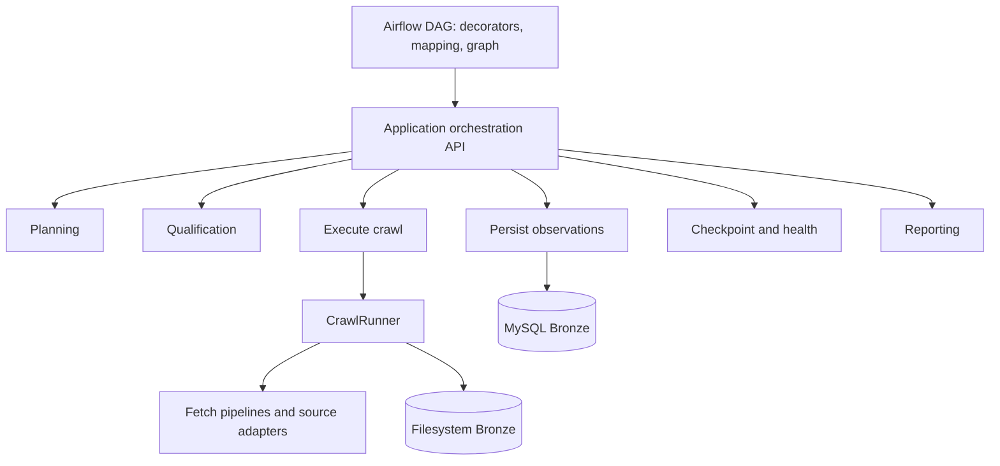

# Phase 1 — Clean Architecture Refactor

Ngày thực hiện: 2026-08-24  
Phạm vi: `CrawlRunner` và crawler Airflow DAG. Không đổi schema, Bronze model, source contracts, policies, analytics semantics hoặc asset pipeline.

## Before

`airflow/dags/crawler/roombeacon_crawler.py` có 1.127 dòng. Ngoài task graph, file trực tiếp thực hiện planning/debug-plan construction, health/robots qualification, crawl-result mapping, MySQL composition, checkpoint policy và fleet summary.

`CrawlRunner` có 1.147 dòng. `run()` vừa resolve mode/limits vừa khởi động session; `_run_async` 774 dòng quản lý acquisition, parsing coordination, detail refresh/deferred backlog, deduplication, metrics và finalization.

Responsibility map trước refactor:

| Responsibility | Layer trước Phase 1 | Nhận xét |
|---|---|---|
| Planning | Airflow DAG | Sai layer |
| Qualification | Airflow DAG | Sai layer |
| Acquisition/parsing coordination | CrawlRunner | Đúng hướng nhưng tập trung quá lớn |
| Normalization | Mapper/persistence | Giữ nguyên |
| Persistence composition | Airflow DAG | Sai layer |
| Checkpoint/health policy | Airflow DAG | Sai layer |
| Finalization/reporting | CrawlRunner và DAG | Trộn responsibility |
| Airflow graph/error translation | Airflow DAG | Đúng layer |

## After

Application orchestration modules không import Airflow. DAG bắt `CrawlerWorkflowError` tại boundary cuối và chuyển thành `AirflowException` với message đã được kiểm soát. Domain tiếp tục không import infrastructure.

`CrawlExecutionOptions` là pure value object/use-case helper để resolve forward-only, bootstrap và direct-run limits. `CrawlRunner` giữ public API cũ nhưng không còn chứa nhánh resolve cấu hình execution dài.

## Files moved/extracted

- `application/orchestration/planning.py`
- `application/orchestration/qualification.py`
- `application/orchestration/execution.py`
- `application/orchestration/persistence.py`
- `application/orchestration/checkpoint.py`
- `application/orchestration/analytics.py`
- `application/orchestration/reporting.py`
- `application/orchestration/errors.py`
- `application/crawl/execution_options.py`

`crawler_workflow.py` là façade re-export nhỏ, không chứa business implementation. Không thêm DI framework, abstract factory hoặc wrapper-forward-only cho từng infrastructure class.

## Invariants preserved

- Task IDs và dependency graph giữ nguyên.
- Schedule `*/15 * * * *`, `max_active_runs=1`, dynamic mapping và DuckDB pool giữ nguyên.
- Persistence xảy ra trước success-checkpoint advancement.
- Robots/rate-limit/retry/source registry contracts không đổi.
- Phase 0 safe logging/error boundaries và Phase 0.5 side-effect-free config imports được giữ.
- Không đọc `.env`; tests dùng explicit test configuration.

## Metrics

| Hotspot | Before | After | Status |
|---|---:|---:|---|
| `CrawlRunner` file | 1.147 LOC | 1.084 LOC | IMPROVED |
| crawler DAG | 1.127 LOC | 184 LOC | RESOLVED |
| largest DAG task wrapper | 218+ LOC | 20 LOC | RESOLVED |
| `CrawlRunner._run_async` | 774 LOC | 774 LOC | REMAINING |

## New abstractions

- `CrawlerWorkflowError`: application failure boundary translated only by scheduler adapters.
- Seven responsibility-focused orchestration modules plus a stable façade.
- `CrawlExecutionOptions`: immutable resolved execution parameters.

Không tạo outbound port mới khi chưa có second implementation. Không xóa source adapter, repository hoặc policy abstraction hiện hữu.

## Remaining debt

1. `_run_async` vẫn nên được tách incremental thành explicit session state, deferred-detail step, page acquisition step và finalizer; cần golden partial-failure tests trước khi làm.
2. Application persistence/qualification/checkpoint modules hiện compose concrete local/MySQL adapters tại use-case boundary. Một composition root riêng sẽ hữu ích khi Phase 3 xử lý transaction/config ownership, nhưng chưa được thêm ở Phase 1 để tránh factory thừa.
3. Summary logging còn dài dù aggregation đã rời DAG; có thể tách pure summary DTO khỏi renderer khi có consumer thứ hai.

## Phase 1.1 — CrawlRunner decomposition follow-up

Phase 1.1 audit mapped `_run_async` into session initialization, historical-mode setup, deferred backlog, page acquisition, per-card detail decisions, request-budget deferral, frontier stop policy, seen-state interaction and final result publication.

The deferred backlog block had a stable boundary and was extracted to `DeferredDetailProcessor`, returning an immutable `DeferredDetailResult`. It owns fair-budget allocation, deferred detail execution, terminal `404/410` classification and backlog success/failure updates. `CrawlRunner` continues to own orchestration and passes the existing repositories/pipeline explicitly; no interface or factory was introduced.

Metrics after this safe extraction:

| Metric | Phase 1 baseline | Phase 1.1 |
|---|---:|---:|
| `CrawlRunner` file | 1,084 LOC | 1,019 LOC |
| `_run_async` | 774 LOC | 702 LOC |
| largest extracted function | N/A | `DeferredDetailProcessor.execute`, 91 LOC |

Status is **IMPROVED / REMAINING**, not resolved. The page loop still combines fetch outcome translation, per-card deduplication, TTL/detail decisions, request-budget deferral and frontier stopping. A further safe extraction needs an explicit typed session state plus golden tests for every `break`/frontier transition; introducing an untyped mutable context merely to reduce LOC was rejected because it would increase semantic risk.

## Phase 1.2A — Typed crawl session state

`CrawlSessionState` now owns only the mutable data that lives across one `_run_async` invocation. It has explicit typed fields and isolated defaults; it contains no HTTP client, parser, repository, database, filesystem or Airflow dependency.

The audited state is grouped as follows:

- result accumulators: `bronze_records`, `detail_records`, `metadata`;
- listing identity state: `observed_listing_ids`, `new_listing_ids`, `seen_in_current_run`, `known_seen_meta`, `known_seen_ids`, `updated_seen_meta`;
- detail-decision counters: `records_changed`, `detail_requests_forced_by_change`, `detail_required`, `detail_requested`, `detail_succeeded`, `detail_failed`, `detail_skipped`, and the five `skipped_*` reason counters;
- mode/frontier position: `is_forward_only`, `is_incremental`, `is_bootstrap`, `current_page`, `effective_end_page`, `bootstrap_completed`, `bootstrap_next_page`, `known_page_streak`;
- acquisition/run counters: `pages_attempted`, `pages_success`, `pages_failed`, `details_success`, `details_failed`, `duplicates_skipped`, `details_crawled_count`;
- outcome state: `final_status`, `stop_reason`, `failure_reason`, `errors`;
- deferred-detail counters: `deferred_backlog_before`, `deferred_added`, `deferred_attempted`, `deferred_succeeded`, `deferred_failed`, `deferred_terminal`.

Page acquisition, card processing, detail acquisition, frontier decisions and finalization remain in `CrawlRunner` in their original order. No business logic was extracted and no state-machine, factory, interface or generic context bag was introduced.

| Metric | Phase 1.1 | Phase 1.2A |
|---|---:|---:|
| `CrawlRunner` file | 1,019 LOC | 690 LOC |
| `_run_async` | 702 LOC | 372 LOC |

The LOC reduction is primarily the result of replacing repeated local-state handling with typed attribute access and normalizing the touched method's formatting; it does not represent a page-loop complexity reduction. Page acquisition remains the next explicit boundary for Phase 1.2B.

## Phase 1.2B — Page acquisition workflow

`PageAcquisitionProcessor` now owns the boundary for one listing page: it builds the forward-only or paginated URL and `CrawlTarget`, invokes the existing `ListingCrawlPipeline`, and classifies the returned cards/metadata as `READY`, `ROBOTS_DENIED`, `ACCESS_CHALLENGE`, `FETCH_ERROR`, or `SOURCE_END`. `PageAcquisitionResult` carries typed cards, metadata, raw HTML and the unchanged page-counter effects back to the caller.

The existing pipeline remains responsible for HTTP/browser selection, retries/backoff, robots evaluation, response classification, parser invocation and card validation. Parser exceptions continue to propagate and are not swallowed or logged with raw payloads.

`CrawlRunner` still owns every frontier transition and stop decision. Per-card identity deduplication, detail TTL/budget decisions, detail acquisition, deferred backlog, observation creation and persistence were not moved.

| Metric | Phase 1.2A | Phase 1.2B |
|---|---:|---:|
| `CrawlRunner` file | 690 LOC | 700 LOC |
| `_run_async` | 372 LOC | 373 LOC |
| `PageAcquisitionProcessor.execute` | N/A | 55 LOC |

The façade LOC increased by the explicit component wiring and typed-result mapping because Phase 1.2A had compact formatting. The meaningful reduction is responsibility/branch ownership rather than physical LOC: page construction and outcome classification no longer live in `_run_async`; card and frontier branches deliberately remain for Phase 1.2C and later work.

## Phase 1.2C — Card processing workflow

`CardProcessingProcessor` now owns the complete processing boundary for one listing card: stable identity fallback, observed-ID retention, same-run deduplication, known/new classification, lightweight-content fingerprinting, change detection, detail-refresh policy evaluation, detail request accounting, immediate detail handling, request-budget deferral and observation/session updates.

The typed `CardProcessingResult` returns only the card outcome plus `is_new`, `counts_as_known` and `content_changed` flags required for page aggregation. Outcomes are explicit: `DUPLICATE`, `LIGHTWEIGHT`, `DEFERRED`, `DETAIL_SUCCEEDED` and `DETAIL_FAILED`.

`CrawlRunner` continues to own page aggregation and every frontier decision: forward completion, known-page streak, source end, maximum records/pages, bootstrap continuation and pagination advancement. The processor does not fetch listing pages, mutate frontier state, persist MySQL, update checkpoints or import Airflow.

| Metric | Phase 1.2B | Phase 1.2C |
|---|---:|---:|
| `CrawlRunner` file | 700 LOC | 627 LOC |
| `_run_async` | 373 LOC | 307 LOC |
| `CardProcessingProcessor.execute` | N/A | 179 LOC |

The remaining `_run_async` hotspot is now dominated by frontier transitions and finalization. Those boundaries were intentionally left unchanged for the following phases.

## Phase 1.2D — Frontier and stop transitions

The pre-refactor loop contained eight raw `break` statements. Its transitions were audited as robots denial, access challenge, technical fetch failure, empty-page/source end, forward-only completion, known-region completion, maximum-records stop, and pagination maximum/source end. A final fallback normalized a loop that advanced beyond its effective end page. There were no loop `continue` statements and the only `return` was final result publication.

`FrontierDecisionProcessor` now owns those mutations through typed `FrontierDecision`, `FrontierAction` and `FrontierTransition` values. `after_acquisition` handles page-level stop outcomes; `after_cards` applies forward completion, known-page streak, maximum-records, pagination/source-end and historical page advancement; `complete_exhausted_loop` preserves the final fallback.

The order of decisions is unchanged: forward-only completion precedes incremental/frontier checks, known-region precedes record limits, record limits precede pagination, and a bootstrap stopped by robots/access/fetch retains its current resume page. Technical fetch failure intentionally continues to leave `stop_reason` unset while setting failure status/reason, matching prior behavior.

| Metric | Phase 1.2C | Phase 1.2D |
|---|---:|---:|
| `CrawlRunner` file | 627 LOC | 484 LOC |
| `_run_async` | 307 LOC | 159 LOC |
| raw `break` statements in `_run_async` | 8 | 2 |
| largest frontier method | N/A | `after_cards`, 69 LOC |

Listing-page acquisition, card processing, detail/deferred semantics and final result/storage publication were not moved. The remaining `_run_async` body is orchestration plus finalization, making final cleanup the next safe boundary.

## Phase 1.2E — Final CrawlRunner cleanup and assessment

The final audit removed only demonstrated inert code: duplicate assignments that exactly repeated `CrawlSessionState` defaults, the unread `effective_start_page` assignment in the forward branch, and an instantiated `DateCutoffPolicy` that had no consumer anywhere in the project. The associated stale imports were removed. No new abstraction was introduced and finalization remains in `_run_async`.

The resulting flow reads as orchestration: initialize typed session state, process deferred details, acquire a page, process its cards, apply the frontier decision, finalize artifacts/result, and return.

| Metric | Phase 1.2D | Phase 1.2E |
|---|---:|---:|
| `CrawlRunner` file | 484 LOC | 428 LOC |
| `_run_async` | 159 LOC | 124 LOC |
| largest `CrawlRunner` function | `_run_async`, 159 LOC | `_run_async`, 124 LOC |

Dependency scans report zero Application→Airflow imports, zero Domain→Infrastructure imports, zero parser→persistence imports, zero repository HTML symbols, and zero CrawlRunner→Airflow imports. Two composition locations remain outside the CrawlRunner/DAG hotspot: `application/orchestration/persistence.py` and `application/reconciliation/reconciler.py` directly compose concrete MySQL infrastructure through 14 import edges. This was already deferred to explicit composition-root work and is not expanded in this cleanup.

Phase 1 status is therefore **PARTIAL** at the repository-wide Clean Architecture level, while both target hotspots are resolved: the crawler DAG is a thin orchestration boundary and `CrawlRunner` is no longer a god object/function. `CardProcessingProcessor.execute` at 179 LOC is cohesive and acceptable for now; it should only be split in a later phase if its behavior or dependencies grow.
