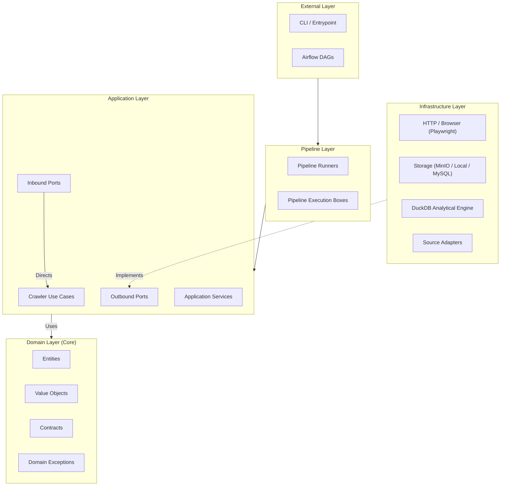
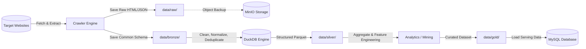

# RoomBeacon Crawler — Source Structure

Dự án **RoomBeacon Crawler** được tổ chức theo các nguyên lý kiến trúc hiện đại:
* **Clean Architecture** (phân tách ranh giới các tầng theo chiều phụ thuộc hướng vào trung tâm);
* **Hexagonal Architecture (Ports & Adapters)** (tách biệt core business khỏi protocol vào/ra và các hệ thống phụ trợ);
* **Adapter Pattern** (chuẩn hóa các nguồn dữ liệu website khác nhau về chung một giao diện);
* **Strategy Pattern** (linh hoạt thay đổi chiến lược fetch, extract, hoặc mapping tùy theo từng website nguồn).

### Tại sao kiến trúc này tối ưu cho Crawler?
* **Tách rời Business Logic khỏi công nghệ:** Core domain và use case không bị gắn chặt vào bất kỳ HTTP client, database hay thư viện scraping nào.
* **Dễ dàng thay đổi & nâng cấp Infrastructure:** Có thể chuyển đổi giữa HTTP request (httpx, requests) sang headless browser (Playwright), hoặc đổi storage engine mà không làm ảnh hưởng đến business logic.
* **Dễ dàng mở rộng website nguồn:** Mỗi website chỉ cần triển khai một Source Adapter riêng mà không làm thay đổi luồng xử lý chung của hệ thống.
* **Crawler hoạt động độc lập (Decoupled from Airflow):** Crawler có thể chạy trực tiếp từ CLI, Docker container, test runner hoặc script riêng lẻ mà không bắt buộc phải có Apache Airflow.
* **Tối ưu khả năng kiểm thử (Testability):** Dễ dàng viết Unit Test cho Domain/Application bằng Mock/Stub mà không cần kết nối mạng hay database thật.
* **Mở rộng Pipeline linh hoạt:** Pipeline được cấu thành từ các "Execution Box" riêng biệt, cho phép ghép nối và điều phối luồng crawl theo nhu cầu.

---

## Project Structure

Cây thư mục và file thực tế hiện có trong repository `RoomBeacon`:

```text
roombeacon/
├── .env
├── .env.example
├── .gitignore
├── docker-compose.yml
├── LICENSE
├── Makefile
├── README.md
│
├── .github/
│   └── workflows/
│
├── airflow/
│   ├── config/
│   ├── dags/
│   ├── logs/
│   │   └── .gitkeep
│   └── plugins/
│
├── crawler/
│   ├── .dockerignore
│   ├── Dockerfile
│   ├── pyproject.toml
│   │
│   ├── src/
│   │   └── roombeacon_crawler/
│   │       ├── __init__.py
│   │       ├── main.py
│   │       │
│   │       ├── domain/
│   │       │   ├── __init__.py
│   │       │   ├── contracts/
│   │       │   │   └── __init__.py
│   │       │   ├── entities/
│   │       │   │   └── __init__.py
│   │       │   ├── exceptions/
│   │       │   │   └── __init__.py
│   │       │   └── value_objects/
│   │       │       └── __init__.py
│   │       │
│   │       ├── application/
│   │       │   ├── __init__.py
│   │       │   ├── services/
│   │       │   │   └── __init__.py
│   │       │   ├── use_cases/
│   │       │   │   ├── __init__.py
│   │       │   │   ├── discovery/
│   │       │   │   │   └── __init__.py
│   │       │   │   ├── fetch/
│   │       │   │   │   └── __init__.py
│   │       │   │   ├── extract/
│   │       │   │   │   └── __init__.py
│   │       │   │   ├── schema_mapping/
│   │       │   │   │   └── __init__.py
│   │       │   │   └── commit/
│   │       │   │       └── __init__.py
│   │       │   └── ports/
│   │       │       ├── __init__.py
│   │       │       ├── inbound/
│   │       │       │   └── __init__.py
│   │       │       └── outbound/
│   │       │           └── __init__.py
│   │       │
│   │       ├── infrastructure/
│   │       │   ├── __init__.py
│   │       │   ├── http/
│   │       │   │   └── __init__.py
│   │       │   ├── browser/
│   │       │   │   └── __init__.py
│   │       │   ├── storage/
│   │       │   │   ├── __init__.py
│   │       │   │   ├── local/
│   │       │   │   │   └── __init__.py
│   │       │   │   ├── minio/
│   │       │   │   │   └── __init__.py
│   │       │   │   └── mysql/
│   │       │   │       └── __init__.py
│   │       │   ├── processing/
│   │       │   │   ├── __init__.py
│   │       │   │   └── duckdb/
│   │       │   │       └── __init__.py
│   │       │   └── adapters/
│   │       │       ├── __init__.py
│   │       │       └── sources/
│   │       │           └── __init__.py
│   │       │
│   │       ├── pipeline/
│   │       │   ├── __init__.py
│   │       │   ├── boxes/
│   │       │   │   ├── __init__.py
│   │       │   │   ├── discovery/
│   │       │   │   │   └── __init__.py
│   │       │   │   ├── fetch/
│   │       │   │   │   └── __init__.py
│   │       │   │   ├── extract/
│   │       │   │   │   └── __init__.py
│   │       │   │   ├── schema_mapping/
│   │       │   │   │   └── __init__.py
│   │       │   │   └── commit/
│   │       │   │       └── __init__.py
│   │       │   └── runners/
│   │       │       └── __init__.py
│   │       │
│   │       ├── config/
│   │       │   └── __init__.py
│   │       │
│   │       └── cli/
│   │           └── __init__.py
│   │
│   └── tests/
│       ├── fixtures/
│       ├── integration/
│       │   ├── duckdb/
│       │   ├── minio/
│       │   └── mysql/
│       └── unit/
│           ├── application/
│           ├── domain/
│           └── pipeline/
│
├── data/
│   ├── bronze/
│   │   └── .gitkeep
│   ├── exports/
│   │   └── .gitkeep
│   ├── gold/
│   │   └── .gitkeep
│   ├── raw/
│   │   └── .gitkeep
│   ├── silver/
│   │   └── .gitkeep
│   └── temp/
│       └── .gitkeep
│
├── docs/
│   ├── airflow/
│   ├── architecture/
│   ├── crawler/
│   ├── data-pipeline/
│   ├── database/
│   ├── storage/
│   └── source-structure.md
│
└── scripts/
    ├── database/
    ├── dev/
    └── docker/
```

---

## Root Project

Tầng gốc của repository định nghĩa cấu hình chung, orchestration môi trường, scripts tự động hóa và tài liệu dự án:

### Thư mục cấp Root
* `crawler/`: Chứa toàn bộ core engine của crawler (`Dockerfile`, Domain, Application, Infrastructure, Pipeline và Tests). Hoàn toàn độc lập với Airflow.
* `airflow/`: Chứa cấu hình, `Dockerfile`, DAGs, plugins và logs cho Apache Airflow dùng cho việc lập lịch và giám sát luồng chạy.
* `processing/`: Chứa `Dockerfile` và runtime môi trường xử lý DuckDB.
* `data/`: Nơi lưu trữ dữ liệu local theo các tầng dữ liệu (Raw, Bronze, Silver, Gold, Exports, Temp).
* `docs/`: Tài liệu kỹ thuật chi tiết của toàn bộ hệ thống (kiến trúc, crawler, airflow, storage, pipeline, database).
* `scripts/`: Chứa các script tiện ích phục vụ phát triển (dev), quản trị Docker và cơ sở dữ liệu.
* `.github/`: Chứa cấu hình CI/CD workflows cho GitHub Actions.

### File cấp Root
* `docker-compose.yml`: Cấu hình orchestration multi-container cục bộ kết nối Airflow, Crawler, MinIO, MySQL và volume lưu trữ.
* `.env`: Chứa các biến môi trường cấu hình tại máy local (không commit secret lên git).
* `.env.example`: File mẫu định nghĩa các biến môi trường cần thiết kèm mô tả.
* `.gitignore`: Quy định các file/thư mục tạm, cache, credential và build artifacts không được đưa lên Git.
* `Makefile`: Tập hợp các lệnh tắt để build, run, test và quản lý container/services.
* `README.md`: Tài liệu tổng quan và hướng dẫn khởi động nhanh dự án.
* `LICENSE`: Thông tin giấy phép bản quyền của dự án.

---

## Crawler Module

Module `crawler/` là thành phần thu thập dữ liệu độc lập. 

```text
Airflow (Orchestrator) ──[gọi qua CLI/Task]──> Crawler Engine (Độc lập)
```

**Nguyên tắc cốt lõi:** Crawler **không** phụ thuộc vào Airflow. Airflow chỉ đóng vai trò là orchestration trigger và giám sát bên ngoài.

### Cấu hình Module Crawler
* `crawler/pyproject.toml`: Khai báo metadata dự án Python, cấu hình package, dependencies và công cụ test/lint.
* `crawler/Dockerfile`: Định nghĩa container image để đóng gói và thực thi crawler trong môi trường độc lập.
* `crawler/.dockerignore`: Loại trừ các file/thư mục không cần thiết khỏi Docker build context của crawler.

---

## Domain Layer (Core)

Đường dẫn: `crawler/src/roombeacon_crawler/domain/`

Đây là tầng trung tâm và cốt lõi nhất của hệ thống, chứa các khái niệm nghiệp vụ thuần túy.

> [!IMPORTANT]
> Tầng `domain/` **tuyệt đối không phụ thuộc** vào bất kỳ framework hoặc công nghệ infrastructure nào (không import Airflow, MinIO, DuckDB, MySQL, Playwright, HTTP clients hay Docker).

### Các thư mục con
* `domain/entities/`: Định nghĩa các thực thể nghiệp vụ có danh tính (identity) và vòng đời (ví dụ theo concept kiến trúc: `CrawlTarget`, `CrawlRecord`, `SourceListing`).
* `domain/value_objects/`: Định nghĩa các đối tượng bất biến biểu diễn giá trị (ví dụ: `URL`, `Price`, `Address`, `CrawlStatus`).
* `domain/contracts/`: Định nghĩa các giao ước, abstraction hoặc interface thuần của domain.
* `domain/exceptions/`: Các ngoại lệ (exceptions) mang ý nghĩa nghiệp vụ của domain (ví dụ: `InvalidTargetException`, `ExtractionDomainException`).

---

## Application Layer

Đường dẫn: `crawler/src/roombeacon_crawler/application/`

Tầng điều phối các use case nghiệp vụ của crawler. Application layer sử dụng domain entities và gọi các ports để hiện thực hóa quy trình thu thập dữ liệu.

```text
Domain  <──  Application  <──  Infrastructure
```

### Các thành phần chính
* `application/services/`: Các application service kết hợp nhiều use case hoặc xử lý logic điều phối chung.
* `application/use_cases/`: Từng use case cụ thể trong vòng đời thu thập dữ liệu.
* `application/ports/`: Định nghĩa các giao diện kết nối theo Hexagonal Architecture.

### Chi tiết các Crawler Use Cases
Vòng đời crawl được chia thành 5 bước use case rõ ràng:

```text
Discovery  ──>  Fetch  ──>  Extract  ──>  Schema Mapping  ──>  Commit
```

1. **`use_cases/discovery/` (Discovery Use Case):**
   * Chịu trách nhiệm tìm kiếm, phân trang và xác định danh sách các URL/listing cần thu thập.
2. **`use_cases/fetch/` (Fetch Use Case):**
   * Chịu trách nhiệm gửi request và nhận phản hồi thô (response) từ website nguồn.
3. **`use_cases/extract/` (Extract Use Case):**
   * Trích xuất các trường dữ liệu cần thiết ra khỏi response (HTML/JSON) theo đặc tả của từng nguồn.
4. **`use_cases/schema_mapping/` (Schema Mapping Use Case):**
   * Chuyển đổi dữ liệu đã extract từ cấu trúc riêng của từng website về **Common Crawler Schema** chuẩn của hệ thống.
   * *Lưu ý:* Schema Mapping ở bước này chỉ chuẩn hóa cấu trúc trường dữ liệu crawler, không thay thế tầng Data Cleaning / Normalization sâu của Data Processing Layer.
5. **`use_cases/commit/` (Commit Use Case):**
   * Lưu kết quả thu thập vào storage tương ứng (Raw Object Storage hoặc Bronze Dataset).

### Ports (Hexagonal Architecture)
* `ports/inbound/`: Định nghĩa cách các tác nhân bên ngoài gọi vào Crawler Use Cases (ví dụ: CLI command handler, Runner interface).
* `ports/outbound/`: Định nghĩa các interface mà Application yêu cầu từ bên ngoài (ví dụ: `IHttpClient`, `IObjectStorage`, `IDatasetStorage`, `IDatabase`).
  * *Nguyên tắc:* Application chỉ làm việc với abstraction trong ports, không import trực tiếp thư viện/implementation cụ thể.

---

## Infrastructure Layer

Đường dẫn: `crawler/src/roombeacon_crawler/infrastructure/`

Tầng chứa toàn bộ implementation cụ thể gắn liền với công nghệ, thư viện bên thứ ba và hệ điều hành.

### Các thành phần kỹ thuật
* `infrastructure/http/`: Implementation các client thực hiện HTTP/HTTPS requests (ví dụ: httpx, requests).
* `infrastructure/browser/`: Implementation điều khiển trình duyệt tự động cho các trang yêu cầu render JavaScript (ví dụ: Playwright).
* `infrastructure/storage/`:
  * `storage/minio/`: Adapter làm việc với **MinIO Object Storage** (lưu trữ ảnh, Raw HTML snapshot, Raw JSON payload lớn).
  * `storage/local/`: Adapter thao tác file system cục bộ / Docker volume (quản lý file JSON, CSV, Parquet).
  * `storage/mysql/`: Adapter giao tiếp với **MySQL** (đóng vai trò **Serving Database** cho ứng dụng cuối, không dùng để lưu HTML/ảnh thô).
* `infrastructure/processing/`:
  * `processing/duckdb/`: Adapter tích hợp **DuckDB** như một embedded analytical processing engine phục vụ transform dữ liệu giữa các tầng Bronze -> Silver (lọc, làm sạch, deduplicate, aggregate).
* `infrastructure/adapters/`:
  * `adapters/sources/`: Chứa các adapter cụ thể cho từng website nguồn (website-specific parsing & extracting). Mỗi website sẽ có logic trích xuất riêng nhưng đều map về pipeline chuẩn.

---

## Pipeline Layer

Đường dẫn: `crawler/src/roombeacon_crawler/pipeline/`

Tầng ghép nối và thực thi chuỗi xử lý (execution composition) của crawler.

### Phân biệt `use_cases/` và `pipeline/boxes/`
* **Use Case (`application/use_cases/`):** Đại diện cho **nghiệp vụ** cần thực hiện (Logic thuần, không quan tâm tới cách thức đóng gói thực thi).
* **Box (`pipeline/boxes/`):** Đại diện cho **đơn vị thực thi (Execution Block)** trong một pipeline. Box bao bọc use case kèm theo logging, telemetry, retry, error handling và context truyền nhận giữa các bước.

### Các thư mục con
* `pipeline/boxes/`:
  * `boxes/discovery/`: Box thực thi giai đoạn Discovery.
  * `boxes/fetch/`: Box thực thi giai đoạn Fetching.
  * `boxes/extract/`: Box thực thi giai đoạn Trích xuất.
  * `boxes/schema_mapping/`: Box thực thi giai đoạn Ánh xạ Schema.
  * `boxes/commit/`: Box thực thi giai đoạn Lưu trữ kết quả.
* `pipeline/runners/`: Chứa các Runner điều phối ghép nối các Box thành một luồng chạy hoàn chỉnh (Sequential Runner, Batch Runner, v.v.).

---

## Configuration, CLI & Entry Point

* `crawler/src/roombeacon_crawler/config/`: Quản lý cấu hình toàn ứng dụng (đọc biến môi trường, cấu hình timeout, retry, storage endpoint).
* `crawler/src/roombeacon_crawler/cli/`: Cung cấp giao diện dòng lệnh (Command Line Interface) để developer hoặc cronjob có thể trigger trực tiếp các tác vụ crawl độc lập.
* `crawler/src/roombeacon_crawler/main.py`: Entry point khởi động ứng dụng. File này chịu trách nhiệm bootstrap: nạp cấu hình, cấu hình Dependency Injection và kích hoạt runner/CLI phù hợp.
  * *Nguyên tắc:* `main.py` không chứa code bóc tách HTML hay câu lệnh SQL trực tiếp.

---

## Tests

Đường dẫn: `crawler/tests/`

Cấu trúc test được chia ranh giới rõ ràng:
* `tests/unit/`: Kiểm thử đơn vị cô lập, chạy siêu tốc và không cần external service:
  * `unit/domain/`: Test entities, value objects và domain logic.
  * `unit/application/`: Test use cases với mocked ports.
  * `unit/pipeline/`: Test các execution boxes và runners.
* `tests/integration/`: Kiểm thử tích hợp với external systems thật hoặc qua container:
  * `integration/minio/`: Test upload/download object với MinIO.
  * `integration/duckdb/`: Test truy vấn SQL và xử lý Parquet với DuckDB.
  * `integration/mysql/`: Test đọc/ghi dữ liệu serving với MySQL.
* `tests/fixtures/`: Chứa các sample HTML, JSON snapshot và dữ liệu giả lập phục vụ cho việc test. Không chứa dữ liệu sản xuất thật.

---

## Airflow (Orchestration)

Đường dẫn: `airflow/`

Apache Airflow đóng vai trò là **Tầng điều phối (Orchestration Layer)**, không phải là nơi xử lý dữ liệu hay chứa code crawler.

```text
Airflow Schedule / DAG ──> Trigger Crawler CLI / Container Task ──> Monitor & Alert
```

### Các thư mục con
* `airflow/dags/`: Chứa định nghĩa các DAGs (Directed Acyclic Graphs) để lập lịch định kỳ cho các website nguồn.
* `airflow/plugins/`: Chứa các custom Airflow operators, hooks hoặc sensors (nếu có).
* `airflow/logs/`: Thư mục lưu log thực thi của Airflow tasks (chứa file `.gitkeep` để giữ thư mục trên git).
* `airflow/config/`: Chứa file cấu hình riêng cho Airflow instance.

---

## Data Directory (Medallion Architecture)

Đường dẫn: `data/`

Lưu trữ dữ liệu có cấu trúc theo mô hình phân tầng Medallion:

```text
RAW  ──>  BRONZE  ──>  SILVER  ──>  GOLD  ──>  EXPORTS / MYSQL
```

### Các thư mục con
* `data/raw/`: Dữ liệu thô gần như nguyên bản thu thập được từ web (Raw HTML, Raw API Response JSON, Images).
* `data/bronze/`: Dữ liệu đã được parse và chuẩn hóa cấu trúc cơ bản theo Common Schema nhưng chưa qua xử lý sạch hoàn toàn.
* `data/silver/`: Dữ liệu đã được làm sạch (cleaned), kiểm tra tính hợp lệ (validated), chuẩn hóa định dạng (normalized) và khử trùng lặp (deduplicated) thông qua DuckDB.
* `data/gold/`: Dữ liệu tinh gọn, tổng hợp sẵn sàng phục vụ phân tích nghiệp vụ, Machine Learning / Data Mining hoặc nạp vào Serving Database.
* `data/exports/`: Chứa các dataset trích xuất định dạng CSV/Excel/Parquet phục vụ báo cáo hoặc chia sẻ.
* `data/temp/`: Thư mục chứa các file tạm trong quá trình xử lý trung gian.

> [!NOTE]
> Tất cả các thư mục trong `data/` đều chứa file `.gitkeep` rỗng để duy trì cấu trúc thư mục trên Git mà không commit dữ liệu thực tế lên repository.

---

## Docker & Containerization

Dockerfiles được đặt trực tiếp bên cạnh từng application tương ứng:
* `crawler/Dockerfile`: Cấu hình môi trường runtime cho Crawler worker.
* `airflow/Dockerfile`: Dockerfile tùy chỉnh cho Airflow service với MySQL provider.
* `processing/Dockerfile`: Dockerfile cho Python + DuckDB analytics runtime.
* MySQL và MinIO sử dụng official Docker images trực tiếp trong `docker-compose.yml`.

---

## Scripts & Utilities

Đường dẫn: `scripts/`

* `scripts/dev/`: Các script tiện ích hỗ trợ môi trường phát triển (format code, lint, run local test).
* `scripts/docker/`: Script hỗ trợ build, run, clean các Docker containers.
* `scripts/database/`: Script hỗ trợ backup, restore, migration cho cơ sở dữ liệu.

---

## Documentation

Đường dẫn: `docs/`

Tài liệu được phân chia theo từng lĩnh vực chuyên môn:
* `docs/architecture/`: Tài liệu thiết kế kiến trúc hệ thống, ADR (Architecture Decision Records).
* `docs/crawler/`: Hướng dẫn phát triển source adapter mới, cơ chế rate-limit, bypass anti-bot.
* `docs/airflow/`: Tài liệu vận hành DAG, trigger schedule và quản lý pipeline.
* `docs/storage/`: Thiết kế lưu trữ MinIO và cấu trúc thư mục lưu trữ dữ liệu.
* `docs/data-pipeline/`: Đặc tả quy trình chuyển đổi RAW -> BRONZE -> SILVER -> GOLD.
* `docs/database/`: Thiết kế Data Model, schema MySQL và tối ưu hóa câu truy vấn.
* `docs/source-structure.md`: Tài liệu này — đặc tả chi tiết cấu trúc thư mục và file trong repository.

---

## Architectural Dependency Direction

Clean Architecture quy định hướng phụ thuộc phải **hướng từ ngoài vào trong**:



* **Domain** là trung tâm độc lập, không phụ thuộc bất kỳ tầng nào.
* **Application** chỉ phụ thuộc vào **Domain** và định nghĩa các **Ports**.
* **Infrastructure** triển khai các interface do **Application Ports** định nghĩa (Dependency Inversion).

---

## System Responsibility Summary

| Thành phần | Công nghệ / Vai trò | Trách nhiệm chính |
| :--- | :--- | :--- |
| **Airflow** | Orchestration | Lập lịch, quản lý task dependencies, retry, alert và giám sát chu kỳ crawl. |
| **Crawler Engine** | Python (Clean Architecture) | Thu thập dữ liệu từ các website nguồn độc lập với orchestrator. |
| **MinIO** | Object Storage | Lưu trữ tệp nhị phân, ảnh, Raw HTML và snapshot JSON thô kích thước lớn. |
| **Local Volume** | File Storage (SSD/NVMe) | Lưu trữ các tập tin dataset có cấu trúc theo phân tầng Medallion (JSON, Parquet). |
| **DuckDB** | Embedded Analytical Engine | Xử lý dữ liệu quy mô lớn (Clean, Normalize, Deduplicate, Aggregate) giữa Bronze và Silver. |
| **MySQL** | Serving Relational Database | Cung cấp dữ liệu đã được làm sạch và chuẩn hóa cho Backend API và người dùng cuối. |
| **CLI / Main** | Terminal Entry point | Cho phép lập trình viên chạy hoặc debug từng crawler nguồn cục bộ. |

---

## Data Flow Summary

Luồng dữ liệu di chuyển qua các tầng trong hệ thống:



---

## Current Project Status

> [!NOTE]
> Cấu trúc hiện tại đang ở trạng thái **Scaffolding Architecture**. 
> Toàn bộ các thư mục và file được tạo ra nhằm định hình ranh giới kiến trúc (Architectural Boundaries), phân tách rõ trách nhiệm giữa các module trước khi bước vào giai đoạn cài đặt logic chi tiết. Sự hiện diện của các file rỗng (như `__init__.py`, `main.py`, `.gitkeep`) là chủ đích thiết kế để chuẩn bị nền tảng vững chắc cho việc phát triển code.
