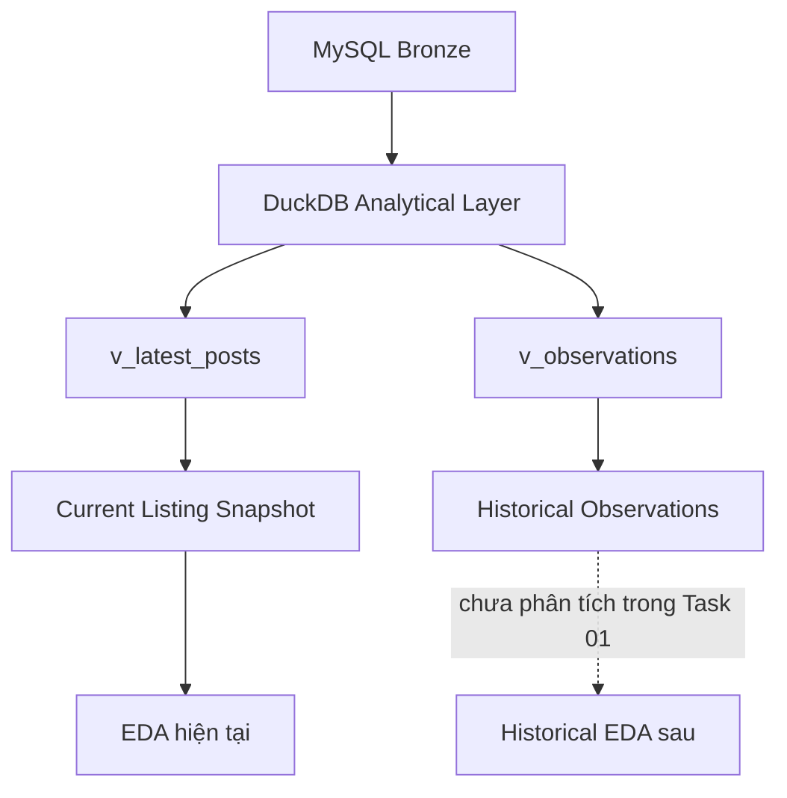

# 01 — Kiểm kê Dataset và Current Snapshot

## 1. Giới thiệu khái niệm cơ bản (Data Dictionary & Concepts)

Để hiểu và phân tích dữ liệu một cách chính xác, chúng ta cần nắm vững các khái niệm cơ bản về dữ liệu:

- **Dataset là gì?** Dataset (Tập dữ liệu) là một tập hợp các dữ liệu có cấu trúc hoặc bán cấu trúc, được tổ chức để phục vụ một mục đích phân tích hoặc lưu trữ cụ thể. Trong bài toán này, dataset là toàn bộ danh sách các tin đăng cho thuê phòng trọ từ nhiều nguồn khác nhau.
- **Record / Row là gì?** Record hoặc Row (Bản ghi / Dòng) đại diện cho một thực thể duy nhất trong dataset. Ví dụ: 1 dòng là 1 bài đăng thuê trọ tại một thời điểm.
- **Column là gì?** Column (Cột) đại diện cho một thuộc tính chung của tất cả các bản ghi. Ví dụ: cột `price_amount` chứa giá tiền của tất cả các bài đăng.
- **Variable là gì?** Variable (Biến) là thuật ngữ thống kê chỉ một đại lượng có thể thay đổi giá trị. Trong dữ liệu bảng, mỗi cột thường là một biến.
- **Field là gì?** Field (Trường) là giao điểm của một hàng và một cột, chứa một giá trị cụ thể.
- **Schema là gì?** Schema là thiết kế cấu trúc của dữ liệu, bao gồm tên các bảng, tên các cột, kiểu dữ liệu và các ràng buộc (constraints).
- **Data Type là gì?** Data Type (Kiểu dữ liệu) quy định loại giá trị mà một cột có thể chứa (ví dụ: chuỗi văn bản `VARCHAR`, số nguyên `BIGINT`, số thập phân `DECIMAL`, thời gian `TIMESTAMP`).
- **Identifier là gì?** Identifier (Định danh) là thuộc tính dùng để nhận diện một bản ghi hoặc thực thể.
- **Primary Identifier là gì?** Primary Identifier (Định danh chính) là Identifier đảm bảo tính duy nhất, dùng để phân biệt bản ghi này với bản ghi khác trong cùng một tập hợp (ví dụ: `rental_post_id`).
- **Uniqueness là gì?** Uniqueness (Tính duy nhất) là thuộc tính đảm bảo không có hai bản ghi nào trùng lặp nhau dựa trên định danh chính.
- **Cardinality là gì?** Cardinality (Lực lượng) là số lượng các giá trị phân biệt trong một cột. Ví dụ, cột `source_code` có cardinality là 9.
- **Current Snapshot là gì?** Snapshot hiện tại là trạng thái mới nhất của hệ thống tại một thời điểm cụ thể. `v_latest_posts` chứa trạng thái mới nhất của các bài đăng.
- **Historical Observation là gì?** Là các quan sát lịch sử ghi lại sự thay đổi theo thời gian. `v_observations` lưu trữ các phiên bản lịch sử.
- **Vì sao row count lớn chưa có nghĩa dataset tốt?** Một số lượng dòng lớn có thể do dữ liệu rác, bản ghi trùng lặp (duplicates), hoặc lỗi logic trong crawler.
- **Vì sao phải kiểm tra schema trước EDA?** Kiểm tra schema giúp ta biết có những biến nào, định dạng ra sao, có đúng kỳ vọng không trước khi trực quan hóa hoặc tính toán thống kê sai lầm.
- **Vì sao duplicate ID có thể phá hỏng phân tích?** Nếu ID bị lặp, các phép đếm số lượng tin đăng, tính trung bình giá, v.v. sẽ bị sai lệch (double counting), dẫn đến quyết định kinh doanh sai.

## 2. Kiến trúc Dữ liệu

## 3. Kiểm kê Runtime MySQL Bronze

Hệ thống lưu trữ raw data (Bronze layer) trong MySQL. Runtime hiện tại ghi nhận chính xác 14 bảng:
1. `map_geocode_retries`
2. `map_geocodes`
3. `platforms`
4. `post_addresses`
5. `post_amenities`
6. `post_attributes`
7. `post_contacts`
8. `post_details`
9. `post_fees`
10. `post_images`
11. `post_prices`
12. `post_status_history`
13. `rental_post_versions`
14. `rental_posts`

## 4. Kiểm kê Runtime DuckDB Analytical Views

DuckDB layer có tổng cộng 15 views (so với baseline 13, runtime thực tế đã mở rộng):
- `v_acquisition_efficiency`
- `v_content_changes`
- `v_data_quality`
- `v_fresh_health_matrix`
- `v_latest_posts`
- `v_latest_posts_enriched`
- `v_latest_posts_source`
- `v_listing_lifetime`
- `v_location_summary`
- `v_observations`
- `v_observation_provenance`
- `v_price_history`
- `v_replay_summary`
- `v_source_activity`
- `v_unknown_summary`

## 5. Phân tích `v_latest_posts` (Current Snapshot)

Đây là view chính được sử dụng cho Current State EDA.

### 5.1 Kích thước & Tính toàn vẹn (Identifier Integrity)

- **Tổng số dòng (Row count)**: 121,460
- **Số lượng ID duy nhất (`rental_post_id`)**: 121,460
- **Số lượng NULL ID**: 0
- **Số lượng Duplicate ID**: 0

**Kết luận:** Invariant `COUNT(*) = COUNT(DISTINCT rental_post_id)` (121,460 = 121,460) PASS. Không có duplicate, dataset thỏa mãn điều kiện 1 dòng = 1 bài đăng.

### 5.2 Cấu trúc Schema

Tổng cộng **15 cột**:

| Cột | Data Type | Vai trò (Semantic Role) |
| --- | --- | --- |
| `source_code` | VARCHAR | IDENTIFIER |
| `rental_post_id` | BIGINT | IDENTIFIER |
| `source_listing_id` | VARCHAR | IDENTIFIER |
| `title_raw` | VARCHAR | RAW |
| `url` | VARCHAR | METADATA |
| `price_amount` | DECIMAL(15,2) | PARSED |
| `area_value` | DECIMAL(10,2) | PARSED |
| `full_address_text` | VARCHAR | RAW |
| `location_raw` | VARCHAR | RAW |
| `latest_observed_at` | TIMESTAMP | METADATA |
| `first_observed_at` | TIMESTAMP | METADATA |
| `last_observed_at` | TIMESTAMP | METADATA |
| `active_days` | BIGINT | DERIVED |
| `best_address_text` | VARCHAR | DERIVED |
| `best_address_source` | VARCHAR | METADATA |

### 5.3 Phân bổ theo Nguồn (Source Distribution)

Có 9 nguồn hiện tại:

| source_code | listing_count | percentage |
|-------------|---------------|------------|
| phongtro123 | 70,294 | 57.87% |
| chothuephongtro | 28,588 | 23.54% |
| cafeland | 9,984 | 8.22% |
| mogi | 9,773 | 8.05% |
| nhatot | 1,710 | 1.41% |
| nhatrovn | 762 | 0.63% |
| tromoi | 241 | 0.20% |
| chothuenha | 84 | 0.07% |
| muaban | 24 | 0.02% |

## 6. Phân tích `v_observations` (Historical Inventory)

`v_observations` là view chứa quan sát theo thời gian. View này chỉ kiểm kê kích thước, chưa EDA.

- **Tổng số dòng**: 232,067
- **Tổng số cột**: 19
- **Cấu trúc cột**: `observation_id` (BIGINT), `source_code` (VARCHAR), `source_name` (VARCHAR), `rental_post_id` (BIGINT), `source_listing_id` (VARCHAR), `run_id` (VARCHAR), `observed_at` (TIMESTAMP), `url` (VARCHAR), `title_raw` (VARCHAR), `price_raw` (VARCHAR), `price_amount` (DECIMAL), `area_raw` (VARCHAR), `area_value` (DECIMAL), `location_raw` (VARCHAR), `address_raw` (VARCHAR), `posted_at_raw` (VARCHAR), `property_type_raw` (VARCHAR), `content_hash` (VARCHAR), `ingestion_origin` (VARCHAR).
