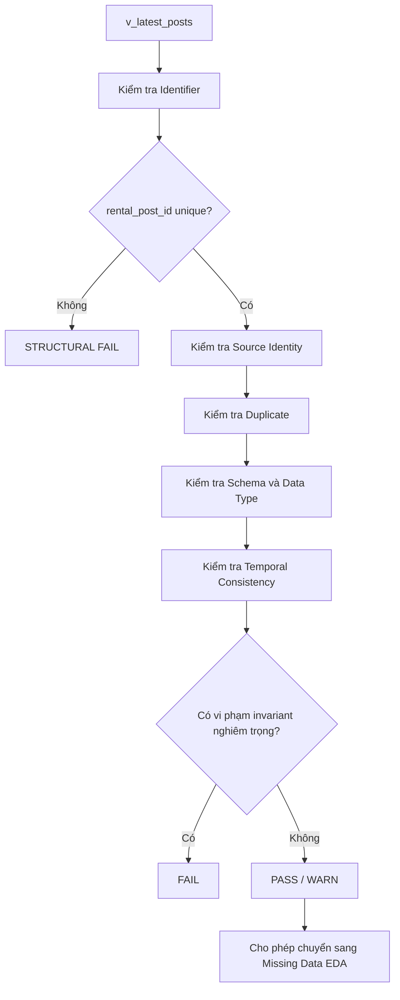
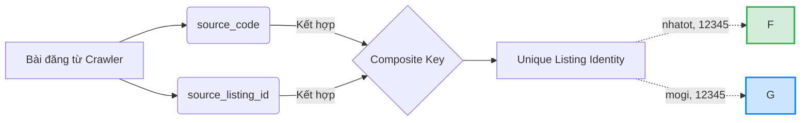

# 02 — Kiểm tra tính toàn vẹn cấu trúc

## 1. Context: Tính toàn vẹn cấu trúc (Structural Integrity)

Kiểm tra tính toàn vẹn cấu trúc (Structural Integrity) không phải là làm sạch dữ liệu (Data Cleaning). Nó trả lời câu hỏi: *Dataset có được cấu trúc đúng với logic thiết kế hay không?* 

### 1.1 Structural Integrity khác Data Quality thế nào?
- **Structural Integrity:** Định nghĩa cách mà các dòng và bảng liên kết với nhau. Ví dụ: Nếu `rental_post_id` bị trùng, đó là một lỗi cấu trúc (Structural Problem) vì dataset thiết kế để 1 `rental_post_id` đại diện cho 1 bài đăng duy nhất.
- **Data Quality:** Độ chính xác và đầy đủ của giá trị dữ liệu bên trong. Ví dụ: Cột `price_amount` bị NULL là một vấn đề chất lượng dữ liệu (Data Quality Problem). Nó không phá vỡ logic định danh của dòng.

### 1.2 Các Khái niệm Cơ Bản

- **Identifier (Định danh):** Một giá trị hoặc tập hợp giá trị dùng để nhận diện một bản ghi.
- **Unique Identifier (Định danh duy nhất):** Định danh đảm bảo mỗi bản ghi trong bảng có một ID không bao giờ trùng lặp (ví dụ: `rental_post_id`).
- **Composite Identity / Composite Key (Khóa ghép):** Một định danh được tạo thành từ nhiều cột. Ví dụ ở RoomBeacon, hai trang web khác nhau hoàn toàn có thể sử dụng cùng một ID (ví dụ source A: 123, source B: 123 không nhất thiết là conflict vì identity đầy đủ là: `(source_code, source_listing_id)`).
- **Cardinality (Lực lượng):** Số lượng các giá trị phân biệt (distinct) trong tập hợp. 
- **Các loại Duplicate Records:**
  - *Duplicate Primary Identifier:* Lặp `rental_post_id`.
  - *Duplicate Business Identifier:* Lặp `(source_code, source_listing_id)`.
  - *Exact Duplicated Row:* Hai dòng có giá trị hoàn toàn giống nhau trên TẤT CẢ các cột.
- **One-to-One / One-to-Many:** Quan hệ 1-1 (Một bài đăng chỉ có một địa chỉ chính) và 1-N (Một bài đăng có nhiều hình ảnh).
- **Join Multiplication / Row Explosion (Nhân dòng do phép nối):** Khi bạn join một bảng cha (1) với một bảng con (N), số lượng dòng kết quả sẽ bị "nhân" lên bằng số bản ghi con. *Ví dụ:* Một listing (`rental_post_id = 100`) có 3 image rows. Nếu join trực tiếp bảng bài đăng với bảng hình ảnh, kết quả sẽ trả về 3 dòng, làm "bùng nổ" (explosion) dataset. Nếu count dòng lúc này, ta sẽ bị Double Counting! (Lưu ý: Đây là ví dụ học thuật, `v_latest_posts` hiện tại đã PASS kiểm tra này và không bị row explosion).
- **Schema Drift:** Sự thay đổi không báo trước trong cấu trúc dữ liệu (đổi kiểu dữ liệu, thiếu cột).
- **Data Type Consistency:** Tính nhất quán về kiểu dữ liệu (ví dụ: cột số phải thực sự là số `DECIMAL`, không được là chữ `VARCHAR`).
- **Temporal Consistency:** Tính logic theo thời gian (ví dụ: lần đầu tiên nhìn thấy bài đăng `first_observed_at` phải xảy ra trước hoặc bằng lần cuối cùng nhìn thấy `last_observed_at`).
- **Invariant:** Một quy luật bất biến. Ví dụ: `COUNT(*) = COUNT(DISTINCT rental_post_id)` luôn phải đúng.
- **Vì sao phải structural validation trước Missing Data Analysis?** Nếu cấu trúc sai (bị duplicate hoặc nhân dòng), mọi phép đếm số lượng NULL, tính trung bình giá, hoặc phân bổ phần trăm ở bước Missing Data sẽ bị sai lệch hoàn toàn.

---

## 2. Structural Validation Flow (Sơ đồ Dòng chảy)

## 3. Composite Identity Breakdown

---

## 4. Actual RoomBeacon Findings (Kết quả Runtime Thực tế)

- **Total row count:** 121,460
- **Unique `rental_post_id`:** 121,460 (0 duplicates, 0 nulls)
- **Composite Identity `(source_code, source_listing_id)`:** 0 duplicates.
- **Source code structural findings:** Tất cả 9 source hợp lệ (không null, không rỗng).
- **Exact duplicate count:** 0 (Không phát hiện bằng chứng row multiplication trong output v_latest_posts hiện tại và grain 1 row / rental_post_id đang được giữ).
- **Temporal violations:**
  - `first_observed_at <= latest_observed_at`: PASS (0).
  - `first_observed_at <= last_observed_at`: WARN (3,285 dòng vi phạm).
  - `latest_observed_at <= last_observed_at`: WARN (4,264 dòng vi phạm).
  ROOT_CAUSE = NOT_VERIFIED. (Giả thuyết, chưa được chứng minh: Có thể do race conditions hoặc bảng cha không được cập nhật đồng bộ).
- **Schema drift findings:** Không phát hiện (khớp với hợp đồng schema mong đợi).

## 5. Structural Validation Summary Table

| check_id | check_name | category | status | affected_rows | affected_pct | evidence | notes |
|---|---|---|---|---|---|---|---|
| STRUCT-001 | rental_post_id uniqueness | IDENTITY | PASS | 0 | 0.00% | 121,460 unique / 121,460 total | |
| STRUCT-002 | source_code validity | IDENTITY | PASS | 0 | 0.00% | 0 null/empty/whitespace | |
| STRUCT-003 | source_listing_id validity | IDENTITY | PASS | 0 | 0.00% | 0 null/empty/whitespace | |
| STRUCT-004 | composite identity uniqueness | IDENTITY | PASS | 0 | 0.00% | 0 dups on (source_code, source_listing_id) | |
| STRUCT-005 | row duplication | DUPLICATE | PASS | 0 | 0.00% | 0 exact duplicate rows | |
| STRUCT-006 | schema & data types | SCHEMA | PASS | 0 | 0.00% | Khớp hoàn toàn contract | |
| STRUCT-007 | temporal consistency (first <= latest) | TEMPORAL | PASS | 0 | 0.00% | 0 violations | |
| STRUCT-008 | temporal consistency (first <= last) | TEMPORAL | WARN | 3,285 | 2.70% | 3,285 violations | ROOT_CAUSE = NOT_VERIFIED (Giả thuyết: Race condition) | 
| STRUCT-009 | temporal consistency (latest <= last) | TEMPORAL | WARN | 4,264 | 3.51% | 4,264 violations | ROOT_CAUSE = NOT_VERIFIED (Giả thuyết: Update sync lag) |
| STRUCT-010 | active_days validity | DERIVED | PASS | 0 | 0.00% | 0 negative values | |

*(Giải thích: PASS = Hoàn toàn hợp lệ. WARN = Có bất thường nhưng chưa phá vỡ cấu trúc tổng thể và invariant.)*

## 6. Kết luận Structural Readiness

**STRUCTURALLY_SAFE_FOR_EDA**

**Chi tiết:** Tập dữ liệu hoàn toàn an toàn để tiến hành bước Exploratory Data Analysis (EDA) tiếp theo vì không chứa duplicate row, đảm bảo nguyên tắc 1 `rental_post_id` = 1 listing, và composite key hoàn toàn nguyên vẹn. Các vi phạm kiểu Temporal (WARN) là các bất thường chưa rõ nguyên nhân (ROOT_CAUSE = UNKNOWN), cần lưu ý khi tính toán thời gian sau này nhưng không block quá trình EDA.
