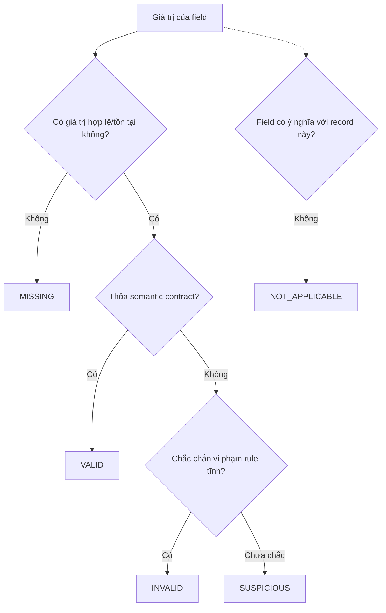
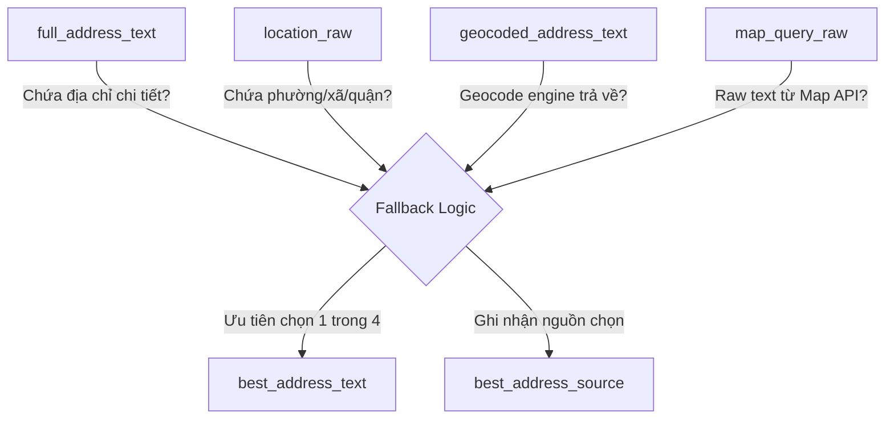

# 03 — Ngữ nghĩa dữ liệu thiếu (Missing Data Semantics)

## 1. Dữ liệu thiếu (Missing Data) là gì?

**Missing Data** là trạng thái mà một thuộc tính (field) của bản ghi không có thông tin (không có giá trị sử dụng được). Điều này có thể do dữ liệu gốc không có, lỗi trong quá trình thu thập (crawler), hoặc lỗi trong quá trình trích xuất (parser).

### 1.1 Phân biệt các khái niệm

- **Missing vs NULL:** NULL là một trạng thái vật lý của database thể hiện việc không có dữ liệu. Một giá trị Missing thường được lưu trữ dưới dạng NULL, nhưng Missing cũng có thể là chuỗi rỗng (`""`), chuỗi toàn khoảng trắng (`"   "`), hoặc chuỗi đại diện (như `"Không xác định"`).
- **NULL:** Giá trị đặc biệt trong CSDL chỉ ra sự vắng mặt của dữ liệu.
- **NaN (Not a Number):** Một giá trị dấu phẩy động đặc biệt chỉ ra rằng một phép toán trả về kết quả không xác định (thường thấy trong Python/Pandas để thay thế NULL cho các cột số).
- **Empty String (`""`):** Một chuỗi ký tự có độ dài bằng 0. Trong một số CSDL, nó khác với NULL.
- **Whitespace-only string (`"   "`):** Một chuỗi chỉ chứa dấu cách, tab hoặc ký tự ẩn. Về mặt ngữ nghĩa, nó vẫn là Missing nhưng khác về mặt vật lý.
- **Missing vs Invalid:** Missing là khi *không có giá trị*. Invalid là khi *có giá trị nhưng giá trị đó sai logic/hợp đồng*. Ví dụ: `price_amount = NULL` là Missing. `price_amount = -100` (giá thuê nhà bị âm) là Invalid.
- **Missing vs Suspicious:** Suspicious là khi giá trị tồn tại, hợp lệ về mặt rule tĩnh nhưng bất thường về mặt phân phối. Ví dụ: Giá thuê là 100 tỷ VND/tháng.
- **Missing vs Not Applicable (N/A):** N/A là khi thuộc tính đó không có ý nghĩa đối với bản ghi. Ví dụ: Mã số căn hộ chung cư sẽ không áp dụng cho phòng trọ cấp 4 độc lập.

### 1.2 Phân biệt các tầng dữ liệu (Data Stages)

- **Raw Data:** Dữ liệu gốc thu thập từ nguồn, chưa qua bất kỳ chỉnh sửa nào (ví dụ: chuỗi giá `"2 triệu 5 / tháng"`).
- **Parsed Data:** Dữ liệu đã được bóc tách và chuẩn hóa định dạng (ví dụ: trích xuất `"2 triệu 5"` thành số `2500000.00`).
- **Derived Data:** Dữ liệu được tính toán hoặc suy luận từ nhiều field khác (ví dụ: `active_days = last_observed_at - first_observed_at`).
- **Metadata:** Dữ liệu mô tả về quá trình thu thập, chất lượng hoặc nguồn gốc của dữ liệu (ví dụ: `best_address_source`).

**Lưu ý quan trọng:** Vì sao một cột Parsed bị NULL không chứng minh được Raw source bị thiếu?
Vì một giá trị parsed bị NULL có thể đến từ 2 nguyên nhân:
1. Dữ liệu gốc thực sự trống (Missing raw).
2. Dữ liệu gốc có tồn tại nhưng parser không đọc được do định dạng lạ (Parse failure).
Trong analytical view hiện tại (`v_latest_posts`), do chúng ta không phơi bày các trường `price_raw`, `area_raw`, ta không thể phân biệt chắc chắn hai nguyên nhân này.

### 1.3 Vì sao không được tự ý điền (FillNA) dữ liệu tuỳ tiện?

Việc gán giá trị (fillna bằng mean, median, hay mode) làm biến dạng phân phối gốc và có thể tạo ra những insight giả (bias). Việc điền dữ liệu phải được thực hiện sau khi hiểu rõ cơ chế missing (Missing Mechanism) và mục tiêu mô hình hóa. Do đó, phải **định nghĩa Missing Semantics trước khi tính toán Missing Rate**, nếu không các con số sẽ bị hiểu sai.

---

## 2. Các trạng thái ngữ nghĩa (Semantic States)

## 3. Data Lifecycle & Missing Origins

---

## 4. Địa chỉ ở RoomBeacon (Address Semantics)

Sự khác biệt giữa các field địa chỉ là rất lớn, được định nghĩa từ DuckDB SQL views:

- `full_address_text`: Địa chỉ chi tiết bóc tách từ thông số bài đăng (ví dụ: "Số 5 ngõ 10...").
- `location_raw`: Thông tin khu vực thường nằm ở metadata bài đăng (ví dụ: "Quận 1, TP HCM").
- `best_address_text`: Trích xuất (Derived) từ các field địa chỉ khác (chọn cái tốt nhất có thể).
- `best_address_source`: Metadata đánh dấu xem `best_address_text` được lấy từ nguồn nào (ví dụ: `source_detail`, `source_card`, `reverse_geocode`, `map_query`, hoặc `none` nếu không có gì).

**Một field `full_address_text` bị NULL KHÔNG có nghĩa là bài đăng không có địa chỉ, vì `location_raw` vẫn có thể tồn tại.**

---

## 5. Field Semantic Contract (Hợp đồng ngữ nghĩa)

| Field | Nhóm | Missing Definition | Invalid Definition | Suspicious Definition | N/A | Confidence |
| --- | --- | --- | --- | --- | --- | --- |
| `source_code` | IDENTITY | IS NULL OR TRIM() = '' | Không thuộc tập 9 nguồn | RULE_NOT_ESTABLISHED | Không | HIGH |
| `rental_post_id` | IDENTITY | IS NULL | <= 0 | RULE_NOT_ESTABLISHED | Không | HIGH |
| `source_listing_id`| IDENTITY | IS NULL OR TRIM() = '' | RULE_NOT_ESTABLISHED | RULE_NOT_ESTABLISHED | Không | HIGH |
| `title_raw` | CONTENT | IS NULL OR TRIM() = '' | RULE_NOT_ESTABLISHED | Tên quá ngắn/dài | Không | HIGH |
| `url` | CONTENT | IS NULL OR TRIM() = '' | Không đúng định dạng URL | RULE_NOT_ESTABLISHED | Không | HIGH |
| `price_amount` | PRICE | IS NULL | < 0 (giá âm) | Giá = 0 hoặc quá lớn/nhỏ | Lô đất không cho thuê | HIGH |
| `area_value` | AREA | IS NULL | <= 0 | Diện tích > 5000 | Không | HIGH |
| `full_address_text`| LOCATION | IS NULL OR TRIM() = '' | RULE_NOT_ESTABLISHED | RULE_NOT_ESTABLISHED | Không | MEDIUM |
| `location_raw` | LOCATION | IS NULL OR TRIM() = '' | RULE_NOT_ESTABLISHED | RULE_NOT_ESTABLISHED | Không | MEDIUM |
| `best_address_text`| LOCATION | IS NULL OR TRIM() = '' | RULE_NOT_ESTABLISHED | RULE_NOT_ESTABLISHED | Không | HIGH |
| `best_address_source`| LOCATION | Không thể Missing (fallback = 'none') | Không thuộc tập nguồn định sẵn | RULE_NOT_ESTABLISHED | Khi address missing | HIGH |
| `latest_observed_at`| TEMPORAL | IS NULL | RULE_NOT_ESTABLISHED | Tương lai quá xa | Không | HIGH |
| `first_observed_at`| TEMPORAL | IS NULL | > latest_observed_at | RULE_NOT_ESTABLISHED | Không | HIGH |
| `last_observed_at` | TEMPORAL | IS NULL | < first_observed_at | RULE_NOT_ESTABLISHED | Không | HIGH |
| `active_days` | TEMPORAL | IS NULL | < 0 | Quá lớn (> 10 năm) | Không | HIGH |

---

## 6. Cơ chế dữ liệu thiếu (Missing Mechanism)

Trong khoa học dữ liệu, Missing Data được phân loại thành 3 cơ chế:

- **MCAR (Missing Completely At Random):** Dữ liệu bị thiếu hoàn toàn ngẫu nhiên. Nguyên nhân thiếu không liên quan gì đến bản thân giá trị đó hay bất kỳ giá trị nào khác. Ví dụ: Server bị sập trong 5 phút ngẫu nhiên làm mất vài bài đăng.
- **MAR (Missing At Random):** Dữ liệu bị thiếu có thể giải thích được bằng các biến (fields) khác đã biết. Ví dụ: Trang web A (`source_code = chothuenha`) không bao giờ hiển thị diện tích. Ta biết nó missing vì nó đến từ trang web A.
- **MNAR (Missing Not At Random):** Dữ liệu bị thiếu do chính bản chất của giá trị cần thu thập. Ví dụ: Chủ nhà không công khai giá (`price_amount`) vì giá quá cao, muốn khách gọi trực tiếp để thương lượng.

**Liên hệ RoomBeacon:** Dựa trên phân tích thăm dò, chúng ta **có thể** sẽ tìm thấy các dấu hiệu của MAR (thiếu do source cụ thể) hoặc MNAR (chủ nhà giấu giá), nhưng ở bước Task 03 này, chúng ta chưa có đủ evidence để kết luận cơ chế cho từng trường. Việc phân tích tương quan ở các Task sau sẽ trả lời câu hỏi này.

---

## 7. Giới hạn phân tích hiện tại (Limitations)

- Vì `v_latest_posts` không chứa `price_raw` và `area_raw`, ta không thể phân biệt rạch ròi giữa việc "Bài đăng không ghi giá" (Raw Missing) và "Crawler không đọc được định dạng giá mới" (Parse Failure). Cả hai đều dẫn tới `price_amount` bị NULL.
- Để tìm hiểu root cause, sẽ cần truy xuất lại bảng `v_observations` hoặc `rental_post_versions` chứa `source_payload`.
