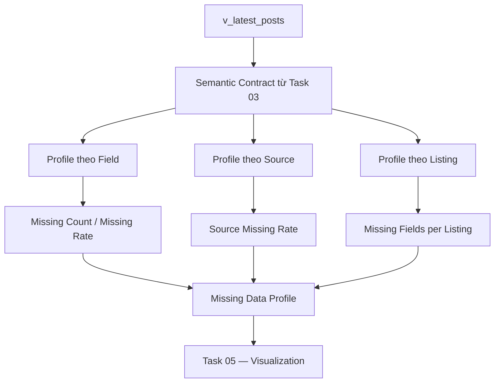
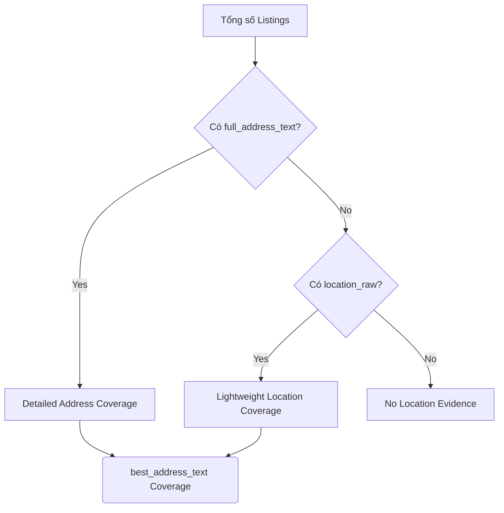
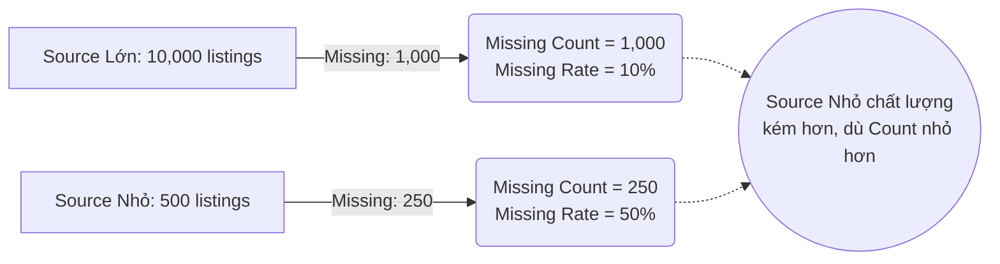

# 04 — Phân tích định lượng dữ liệu thiếu (Missing Data Profiling)

## 1. Mục tiêu và Định nghĩa

### 1.1 Khái niệm cơ bản

- **Data Profiling (Hồ sơ hóa dữ liệu):** Quá trình phân tích thống kê để hiểu rõ cấu trúc, chất lượng và trạng thái hiện tại của dữ liệu.
- **Missing Data Profiling:** Đo lường mức độ vắng mặt dữ liệu dựa trên Semantic Contract đã định nghĩa (Task 03).
- **Count (Số lượng):** Số lượng bản ghi tuyệt đối thỏa mãn một điều kiện.
- **Rate / Percentage (Tỷ lệ / Phần trăm):** Số lượng tương đối so với tổng thể.
- **Missing Rate (Tỷ lệ thiếu):** $\text{Missing Rate}_j = \frac{M_j}{N} \times 100$
  *(Trong đó $M_j$ là số bản ghi bị missing ở field $j$, $N$ là tổng số bản ghi).*
- **Completeness Rate (Tỷ lệ hoàn chỉnh):** $\text{Completeness}_j = 100 - \text{Missing Rate}_j$. Nó cho biết độ phủ (Coverage) của thuộc tính đó.
- **Field-level Missingness:** Phân tích độ thiếu theo từng cột.
- **Row-level Missingness:** Số lượng field bị missing trên cùng một bản ghi (row). Giúp trả lời "Có bao nhiêu listing bị thiếu nhiều thông tin cùng lúc?".
- **Group-wise Missingness:** Phân tích mức độ thiếu theo một chiều dữ liệu cụ thể (ví dụ: theo Source).

### 1.2 Vì sao phải phân tích theo Source?

Trong tập dữ liệu RoomBeacon, số lượng listing thu thập được từ các nguồn (sources) là rất mất cân đối (Imbalanced). 
Nếu chỉ nhìn vào `missing_count` (số lượng tuyệt đối), một source lớn sẽ luôn có số lượng missing cao hơn, dễ gây hiểu nhầm rằng source đó "tệ" hơn. Bằng cách tính `missing_pct` (Tỷ lệ thiếu nội bộ source), chúng ta có thể so sánh công bằng chất lượng trích xuất giữa các nguồn.

*Lưu ý: Distribution của source ở đây phản ánh RoomBeacon acquisition coverage, KHÔNG ĐƯỢC suy diễn thành "Thị phần bất động sản thực tế" (Market Share).*

### 1.3 Complete Case vs Incomplete Case

- **Complete Case:** Bản ghi có đầy đủ 100% các trường dữ liệu quan trọng (Analytical Core).
- **Incomplete Case:** Bản ghi bị thiếu ít nhất 1 trường dữ liệu.
- **Lưu ý:** Việc chỉ phân tích trên nhóm "Complete Case" (Complete-case analysis) và drop phần còn lại sẽ làm mất mát dữ liệu khổng lồ. Một record bị thiếu `area_value` (diện tích) vẫn hoàn toàn có thể sử dụng để phân tích xu hướng giá hoặc phân bổ địa lý. Do đó, việc định nghĩa Missing Combination (Tổ hợp thiếu) giúp tận dụng tối đa dữ liệu có sẵn.

---

## 2. Các luồng phân tích (Mermaid Diagrams)

### 2.1 Flow Missing Profiling

### 2.2 Address Coverage Logic & Overlap

RoomBeacon có hệ thống fallback địa chỉ. Do đó việc định nghĩa "Coverage của Địa chỉ" phải rất rạch ròi.

### 2.3 Count vs Rate by Source

---

## 3. Runtime Results (Cập nhật lúc chạy)

**Runtime Dataset Size:** `121,687` listings.

### 3.1 Field-level Missingness (Top Missing)

| Semantic Group | Field Name | Missing Count | Missing Pct (%) | Completeness (%) |
| --- | --- | --- | --- | --- |
| LOCATION | full_address_text | 91,732 | 75.38% | 24.62% |
| LOCATION | location_raw | 26,891 | 22.10% | 77.90% |
| LOCATION | best_address_text | 26,730 | 21.97% | 78.03% |
| PRICE | price_amount | 545 | 0.45% | 99.55% |
| AREA | area_value | 486 | 0.40% | 99.60% |
| CONTENT | title_raw | 313 | 0.26% | 99.74% |
| IDENTITY | rental_post_id | 0 | 0.00% | 100.00% |
| TEMPORAL | active_days | 0 | 0.00% | 100.00% |
| ... | ... | 0 | 0.00% | 100.00% |

### 3.2 Phân tích Price & Area (By Source)

| Field | Overall Missing | Nhận xét By Source |
| --- | --- | --- |
| `price_amount` | 0.45% (545 rows) | Hầu hết các source đều có độ phủ giá > 99%. `phongtro123` thiếu nhiều nhất về mặt Count (217 dòng) nhưng Rate chỉ là 0.31%. |
| `area_value` | 0.40% (486 rows) | Tương tự price, coverage diện tích cực kỳ cao. Đáng chú ý là `cafeland` thiếu 2 dòng (0.02%). |

*(Lưu ý Limitation: Vì không có `price_raw` và `area_raw`, ta không thể kết luận 545 dòng thiếu giá là do chủ nhà không điền, hay do Regex Parser lỗi).*

### 3.3 Phân tích Address Layers

- **Detailed Address Coverage (`full_address_text`)**: Chỉ đạt **24.62%**.
- **Lightweight Address Coverage (`location_raw`)**: Đạt **77.90%**.
- **Best Available Address Coverage (`best_address_text`)**: Đạt **78.03%**.

**Bảng Address Overlap:**

| full_address (Detailed) | location_raw (Lightweight) | best_address (Available) | Count |
| --- | --- | --- | --- |
| Missing | Missing | Missing | 26,730 |
| Missing | Present | Present | 63,911 |
| Present | Missing | Present | 161 |
| Present | Present | Present | 30,885 |

**Best Address Source Distribution:**
- `source_card` (từ `location_raw`): 52.52%
- `source_detail` (từ `full_address_text`): 25.51%
- `none` (không có gì): 21.97%

### 3.4 Listing-level Missingness (Analytical Core)

Các trường Analytical Core được định nghĩa gồm: `title_raw`, `price_amount`, `area_value`, `best_address_text`. (Đây là các field mang ý nghĩa quyết định cho việc phân tích thị trường bất động sản).

- **Complete-case Core:** `93,892` listings (đủ cả 4 trường).
- **Incomplete-case Core:** `27,795` listings (thiếu ít nhất 1 trong 4).
- **Core Completeness Rate:** ~77.16%

**Top Missing Combinations (Tổ hợp thiếu trên Core Fields):**

1. Thiếu `best_address_text`: 26,486 listings.
2. Thiếu `area_value`: 452 listings.
3. Thiếu `price_amount`: 343 listings.
4. Thiếu `title_raw`: 250 listings.
5. Thiếu cả `price_amount` & `best_address_text`: 166 listings.

---

## 4. Các phát hiện chính (Key Findings)

1. **Dataset cực kỳ hoàn chỉnh về Identity và Thời gian:** 100% dữ liệu có đầy đủ định danh và các dấu mốc thời gian crawl, cho phép tracking lifecycle hoàn hảo.
2. **Coverage Giá và Diện tích vượt trội:** Mức missing rate cho Price và Area chỉ loanh quanh ở mức 0.4%, cho thấy Parser hoặc Data Entry của thị trường ngách này rất tốt. Tuy nhiên, vẫn cần cẩn trọng outlier ở các Task sau.
3. **Bài toán Address là cốt lõi của Missing Data:** Gần 75% dataset không có `full_address_text` bóc tách chi tiết. Tuy nhiên, RoomBeacon đã xây dựng logic Fallback xuất sắc (`best_address_text`), kéo tỷ lệ Coverage của Address tổng thể lên tới hơn 78%. 
4. **Vẫn còn ~22% (26,730) listings hoàn toàn không có bất kỳ dấu hiệu vị trí nào (`best_address_source = 'none'`)**. Đây sẽ là nhóm dữ liệu không thể dùng cho các bài toán phân bổ không gian (Spatial/Geographic Analysis) nhưng vẫn có thể dùng cho Price Distribution chung.
