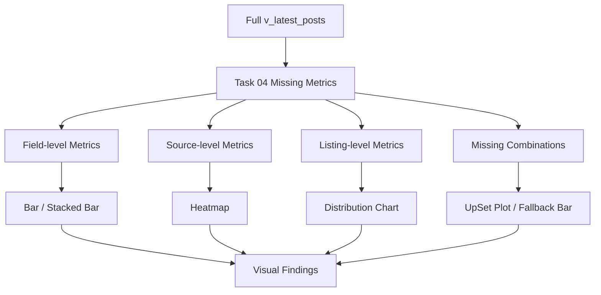
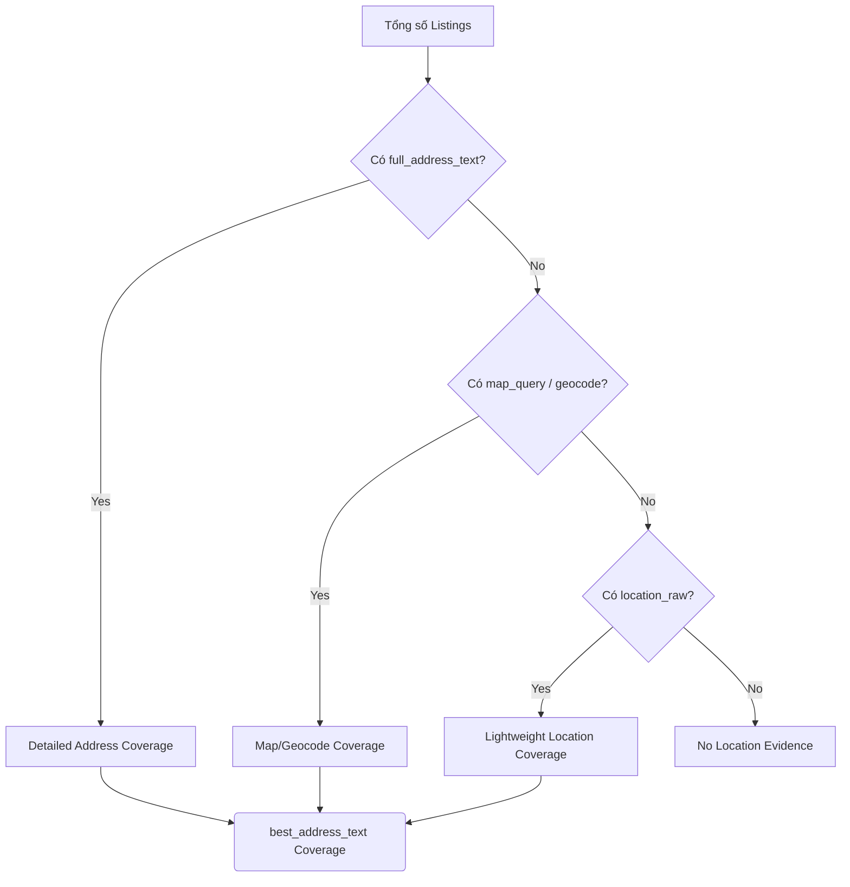
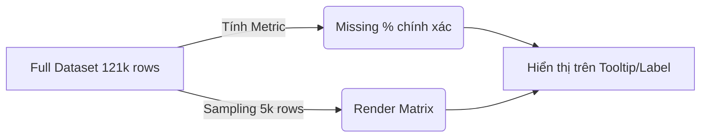

# 05 — Trực quan hóa dữ liệu thiếu (Missing Data Visualization)

## 1. Mục tiêu và Kiến thức nền tảng (Visualization Concepts)

### 1.1 Khái niệm cơ bản

- **Data Visualization (Trực quan hóa dữ liệu):** Biểu diễn dữ liệu bằng hình ảnh (biểu đồ, đồ thị, bản đồ) để dễ dàng phát hiện xu hướng, mô hình và giá trị bất thường.
- **Exploratory Visualization (Trực quan hóa khám phá):** Tạo biểu đồ để tìm hiểu dữ liệu (dành cho Data Scientist).
- **Explanatory Visualization (Trực quan hóa giải thích):** Tạo biểu đồ để kể câu chuyện và trình bày kết quả cho người khác (dành cho Stakeholders).
- **Bar chart (Biểu đồ cột):** Phù hợp để so sánh giá trị giữa các hạng mục (categorical data).
- **Horizontal Bar (Cột ngang):** Tốt hơn cột dọc khi nhãn (label) của các hạng mục quá dài (như tên các trường dữ liệu).
- **Stacked bar (Cột chồng):** Hiển thị tổng số lượng và cấu phần bên trong.
- **100% Stacked bar:** Giúp so sánh tỷ lệ tương đối giữa các cấu phần (ví dụ: Present % vs Missing %), rất phù hợp để so sánh độ phủ của các trường.
- **Heatmap (Biểu đồ nhiệt):** Dùng màu sắc để mã hóa giá trị trong một ma trận (ví dụ: Source x Field). Giúp nhận diện vùng có vấn đề một cách nhanh chóng.
- **Missingness Matrix:** Một hình ảnh đại diện cho toàn bộ dataset, mỗi dòng là 1 record, mỗi cột là 1 field. Vạch màu thể hiện giá trị có tồn tại, khoảng trắng thể hiện missing. Giúp xem missing có rải rác hay tập trung theo cụm.
- **UpSet Plot:** Một dạng biểu đồ thay thế Venn Diagram khi có nhiều hơn 3 tập hợp. Dùng để xem các trường nào thường xuyên bị thiếu *cùng lúc* (missing combinations).
- **Co-occurrence / Correlation trên biến nhị phân:** Khi biến đổi missing thành `1` và present thành `0`, ta có thể tính hệ số tương quan (như Phi coefficient $\phi$, bản chất tương đương Pearson correlation cho biến nhị phân) để xem hai trường có xu hướng mất cùng nhau hay không.
- **Histogram và Bar chart:** Histogram dùng cho phân phối biến liên tục (các khoảng bin), trong khi Bar chart dùng cho biến phân loại (categories).
- **Pareto Chart:** Kết hợp biểu đồ cột (giá trị giảm dần) và đường tích lũy (cumulative percentage). Dựa trên nguyên lý Pareto (thường là 80/20), giúp tập trung vào các trường gây ra phần lớn lỗi thiếu dữ liệu. *Lưu ý: 80/20 chỉ là nguyên lý kinh nghiệm (heuristic), không phải luật bắt buộc, dataset có thể là 90/10 hoặc 60/40.*
- **Sampling (Lấy mẫu) cho Visualization:** Khi dataset quá lớn (ví dụ 120k+ rows), việc vẽ từng dòng lên Missingness Matrix sẽ làm chậm và rối mắt (overplotting). Ta sẽ lấy mẫu (ví dụ 5000 dòng ngẫu nhiên có `random_state` cố định) chỉ để phục vụ mục đích render. Các metric tính toán % vẫn luôn dùng trên **Full Dataset**.
- **Biểu đồ đẹp $\neq$ Biểu đồ tốt:** Một biểu đồ tốt là biểu đồ trả lời chính xác một câu hỏi phân tích, không bị biến dạng thông tin (như lạm dụng 3D chart) và rõ ràng về nhãn trục.

---

## 2. Visualization Pipeline và Address Fallback (Mermaid)

### 2.1 Visualization Pipeline

### 2.2 Address Coverage Logic

RoomBeacon sử dụng hệ thống Fallback phức tạp cho Address. Biểu đồ Coverage phải thể hiện chính xác 3 lớp này.

### 2.3 Full Data vs Sample

---

## 3. Các Biểu Đồ và Diễn Giải (Visualizations Guide)

### Chart 01: Missing Rate by Field (Horizontal Bar Chart)
- **Mục đích:** Trả lời "Field nào đang thiếu nhiều nhất?".
- **Dữ liệu đầu vào:** Bảng `overall_missing_summary`.
- **Trục X:** Tỷ lệ missing (%).
- **Trục Y:** Tên 15 fields.
- **Encoding:** Độ dài cột biểu thị tỷ lệ thiếu.
- **Cách đọc:** Đọc từ trên xuống.
- **Ví dụ RoomBeacon:** `full_address_text` có cột dài nhất (75.38%), trong khi `price_amount` (0.45%) gần như tàng hình trên biểu đồ.
- **Kết luận:** Lỗ hổng lớn nhất nằm ở địa chỉ chi tiết. Không kết luận các trường 0% là "hoàn hảo" về chất lượng (Invalid), chỉ là nó tồn tại.

### Chart 02: Completeness 100% Stacked Bar
- **Mục đích:** "Mỗi field hiện usable đến mức nào?".
- **Dữ liệu:** `overall_missing_summary`.
- **Trục X:** % (từ 0 đến 100).
- **Trục Y:** Tên fields.
- **Encoding:** Thanh ngang chia thành 2 màu (Present vs Missing).
- **Cách đọc:** Thanh Present (thường màu xanh/nhạt) càng dài thì độ bao phủ càng cao.

### Chart 03: Source × Field Missingness Heatmap
- **Mục đích:** "Missing tập trung ở source nào và field nào?".
- **Dữ liệu:** `source_missing` table.
- **Trục X:** Các analytical core fields.
- **Trục Y:** 9 `source_code`.
- **Encoding:** Màu sắc (Color scale). Đậm = thiếu nhiều, Nhạt = thiếu ít.
- **Ví dụ RoomBeacon:** Nếu ô của `chothuenha` giao với `location_raw` có màu sẫm (25% missing), ta phát hiện pattern tại source này.
- **Không được kết luận:** Crawler của source bị lỗi (chỉ ghi nhận fact, chưa Root-cause).

### Chart 04: Missingness Matrix (Sampled)
- **Mục đích:** Xem missing rải rác hay theo dải (cluster).
- **Dữ liệu:** Random sample 5000 rows (có seed).
- **Trục X:** Fields.
- **Trục Y:** Row index.
- **Encoding:** Kẻ vạch đen (hoặc màu) nếu có data, trắng nếu missing.
- **Cách đọc:** Tìm các khoảng trắng kéo dài theo chiều ngang (1 row thiếu nhiều field) hoặc dọc.

### Chart 05: Missing Combinations (UpSet-style Plot)
- **Mục đích:** "Những field nào thường missing cùng nhau?".
- **Dữ liệu:** `combinations` table cho Analytical Core.
- **Trục X:** Các tổ hợp thiếu (ví dụ: chỉ thiếu best_address).
- **Trục Y:** Số lượng listing.
- **Encoding:** Cột đếm số lượng cho mỗi giao tập (intersection).
- **Ví dụ RoomBeacon:** Giao tập lớn nhất (26,486 dòng) là chỉ thiếu độc lập `best_address_text`.

### Chart 06: Listing-level Missing Distribution
- **Mục đích:** "Đa số listing hoàn chỉnh hay thiếu nhiều field?".
- **Dữ liệu:** `dist_core` (phân bố số lượng field thiếu).
- **Trục X:** Số lượng field bị missing (0, 1, 2, 3, 4).
- **Trục Y:** Số lượng listing.
- **Encoding:** Bar height.

### Chart 07: Missing Co-occurrence Heatmap
- **Mục đích:** Tìm sự tương quan mất dữ liệu (ví dụ: hễ mất field A thì thường mất field B).
- **Dữ liệu:** Phi correlation matrix trên missing indicators.
- **Trục X & Y:** Fields.
- **Encoding:** Màu sắc từ -1 đến 1.

### Chart 08: Pareto Missing Chart
- **Mục đích:** Tìm nhóm field tạo ra phần lớn tổng số missing cells.
- **Trục X:** Fields.
- **Trục Y chính:** Missing Count (Bar).
- **Trục Y phụ:** Cumulative % (Line).
- **Cách đọc:** Điểm giao cắt 80% thường chỉ trúng 1-2 field đầu tiên (như `full_address_text`).

### Chart 09: Address Coverage Layers
- **Mục đích:** Hiển thị trực quan sự khác biệt Coverage giữa các loại Address.
- **Dữ liệu:** Bảng độ phủ của 3 field địa chỉ.
- **Trục X:** Tỷ lệ Coverage %.
- **Trục Y:** 3 field (`full_address`, `location_raw`, `best_address`).
- **Lưu ý:** Ghi rõ "Detailed Address" vs "Lightweight Location".

### Chart 10: Best Address Source Distribution
- **Mục đích:** "Best address đến từ đâu?".
- **Dữ liệu:** Phân bổ `best_address_source`.
- **Trục X:** Nguồn (source_card, source_detail, none).
- **Trục Y:** Tỷ lệ %.

---

## 4. Các phát hiện trực quan chính (Key Visual Findings)

*(Dựa trên Runtime Data 121,687 rows)*

1. **Missing tập trung gần như tuyệt đối ở lớp Address:** Biểu đồ Pareto và Bar Chart cho thấy `full_address_text` (thiếu ~75.4%) và `location_raw` / `best_address_text` (thiếu ~22%) đóng góp hơn 99% tổng số ô (cells) bị missing trong dữ liệu cốt lõi.
2. **Price và Area đạt mức bao phủ cực cao:** Completeness 100% Stacked Bar cho thấy dải Present của `price_amount` và `area_value` gần như chạm mức tối đa (99.55% và 99.6%).
3. **Mạng lưới Fallback cứu vãn Address Coverage:** Address Layers Chart thể hiện rõ, mặc dù Detailed Address chỉ đạt ~24.6% coverage, nhưng nhờ Fallback (kéo từ map/geocode và location_raw), Best Address đạt ~78% coverage. Phần lớn đến từ metadata "source_card" (52.5%).
4. **Phần lớn các Incomplete Cases chỉ thiếu đúng 1 trường duy nhất:** Biểu đồ Listing-level Distribution và UpSet-style plot xác nhận rằng trong 27,795 incomplete core listings, có tới 26,486 listings (chiếm đại đa số) chỉ bị thiếu độc lập trường `best_address_text`, trong khi giá và diện tích vẫn nguyên vẹn.
5. **Pattern trên Source:** Heatmap Source x Field cho thấy tỷ lệ mất vị trí (`location_raw`) không đồng đều, một số source giữ được coverage địa chỉ tốt hơn các source khác.
